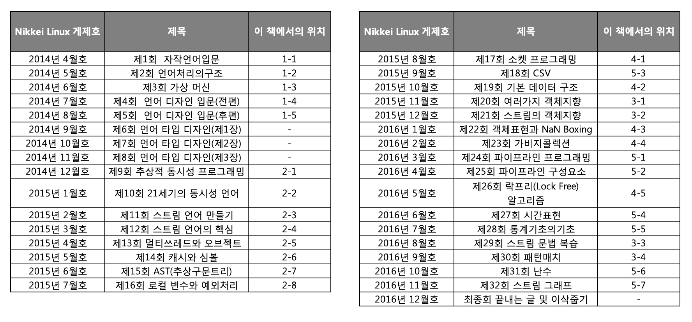

## 시작하며 

이 책은 Linux전문지인 「닛케이(日経) Linux」에서 2014년 4월호부터 2016년 12월호까에 연재한 「만들면서 배우는 프로그래밍 언어」 라는 기사를 정리한 것이다. 

「프로그래밍 언어 만들기」 관련 서적은 이미 많이 있으며 나도 집에 이런 테마의 책을 여러권 가지고 있다.

이들 「프로그래밍 언어 만들기」 부류의 서적은 대부분 **프로그래밍 언어**의 **구현**에 대하여 언급하고 있다. 예를 들어 yacc와 lex라는 도구들 어떻게 사용해 구문 해석기 및 낱말분석기를 만드는지, 인터프리터를 어떻게 설치하는지 등을 샘플로 비교적 단순한 언어를 가지고 설명한다. 

프로그래밍 언어 만들기는 실태를 모르는 사람의 입장에서는 상당히 어려운 작업이라 생각되기 쉽지만, 차근차근 계단식으로 접근한다면 그리 어려운 것은 아니다. 실제 언어 처리기 제작은 대학교의 컴퓨터 사이언스 전공 수업에서 그렇게 찾기 어렵지 않은 과제이다. 젊은 학생들을 대상으로 하는 프로그래밍 콘테스트(예를 들어 내가 오랜 시간 심사위원으로 있었단 U22프로콘[^1]) 에서는 자신이 만든 언어로 응모를 하는 고등학생도 봤다. 

선입관을 없애고 본다면, 언어의 설계와 제작은 프로그래머의 지적 도전 과제로서 재미있는 분야다. 그런 의미로 이들 「언어 만들기」 부류의 책들도 나름 가치가 있을 것이다. 

그러나 이런 기존 책들에 대해서도 나름대로 불만이 없었던 것은 아니다. 

기존의 책들의 한계는 프로그래밍 언어의 구현에 대한 해설까지이었다. 샘플로 사용된 언어들도 대부분 기존 언어의 (너무나 단순한) 서브 셋이 대부분이다. 「프로그래밍 언어 만들기」 활동 내에는, 더 지적이고 재미있는 도전과제로서의 「언어의 디자인」이라는 부분이 전혀 다뤄지고 있다. 

어쩔 수 없다는 것은 알고 있다. 한정된 페이지에 필요한 내용을 구겨 넣는 것도 한계가 있고, 될 수 있는 대로 단순한 사례를 들어야 이해하기 쉽게 전달할 수 있을 것이다. 그리고 기존 언어의 서브 셋 레벨이 아닌, 메인 레벨의 언어 설계를 경험한 사람은 그렇게 많지 않다. 거기에 직접 디자인한 언어가 전 세계적으로 사용되는 경험을 한 사람은 더더욱 없다고 해도 과언이 아닐 것이다. 

언어를 어디까지 어떻게 디자인해야 할지 경험을 통해 말할 수 있는 사람은 없다. 우선 언어처리의 구현하는 기술의 해설부터 시작하고 디자인에 대해서는 그다음에 진행하는 게 순서일 것이다. 

이 순서에 역행하는 소수의 예외가 있으니 바로 C++설계자인 Bjarne Stroustrup가 쓴 「The Design and Evolution of C++」 일 것이다. 이 책을 읽으면 C++가 왜 현재 이런 모습으로 되었을까, 지향점이 무엇일까를 알 수 있는 귀중한 책이다. 하지만, 나로서는 이 책을 통해 언어의 디자인을 하는 방법을 배울 수 있을까에 대해서는 상당히 의문이 든다. 

내가 생각하는 방법의 책이 세상에 없다면, 직접 쓰는 수밖에 없다고 생각했다. 다행히도 나는 「세계적으로 쓰이는 언어를 설계한 경험」 이 있으며 취미를 뛰어넘은 활동으로 IT 세계에서 쓰이는 여러 언어에 대한 설계에도 지식이 있다. 더욱이 「닛케이(日経) Linux」 에서의 연재를 시작으로 여러 권의 서적 집필의 경험도 가지고 있다. 이 이상 딱 맞는 인재를 어떻게 찾을 수 있겠는가^^ (자화자찬) 

이런 생각을 가지고 닛케이(日経) Linux 2014년 4월호부터 연재를 시작하였다. (표 1)

언어를 만들게 된 동기부터 언어 디자인시 느꼈던 갈등까지 다른 책에서는 다루지 않았던 영역까지 다뤘다고 나름 자부를 하고 있다. 

하지만 매월, 한번 제출하면 인쇄되어버리는(수정이 어려운) 연재 기고문의 특성은 시간이 지날수록 맞지 않은 내용이나 불비 사항이 쌓이는 것이고 이 책의 경우도 예외는 아니었다. 

연재를 시작할 때 계획 주제는 (표 1)에서와 같았지만, 결국은 다루지 못해버린 임베디드용 Ruby인 ‘mbuby’ 에 대한 내용(2014년 4월호와 6월호 일부)과 이 책의 범위에서 조금 벗어나는 내용에 대한 해설(2014년 9월호부터 11월호까지)들은 이 책에서 빠져 있다. 본문 게제순서도 자연스러움이 느껴지게 변경하였다. 

하지만 문장의 구성 등은 연재 당시와 크게 바뀌진 않았다. 해설의 일관성 유지 및 이해도를 높이기 위해 각 절이 끝날 때마다 「타임머신 칼럼」 을 적어놓았다. 「타임머신 칼럼」이란, 원고 집필 당시에 향후 일어날 미리 알았다면 ‘지금은 이렇게 쓸 것인데..’ 라는, 보충의 의미로 적은 칼럼이다. 

이 칼럼은 미래 예측에 대한 저자의 능력의 한계를 보여주는 조금은 복잡한 기분이 드는 글이지만 미래는 누구도 알 수 없는 것이라는 마음으로 넣기로 했다. 

그럼 여러분을 ‘언어의 디자인’ 의 세계로 안내하겠다. 

2016년 12월
마츠모토 유키히로

    (표 1) 연재 주제 열람

​    

[^1]: https://u22procon.com/

