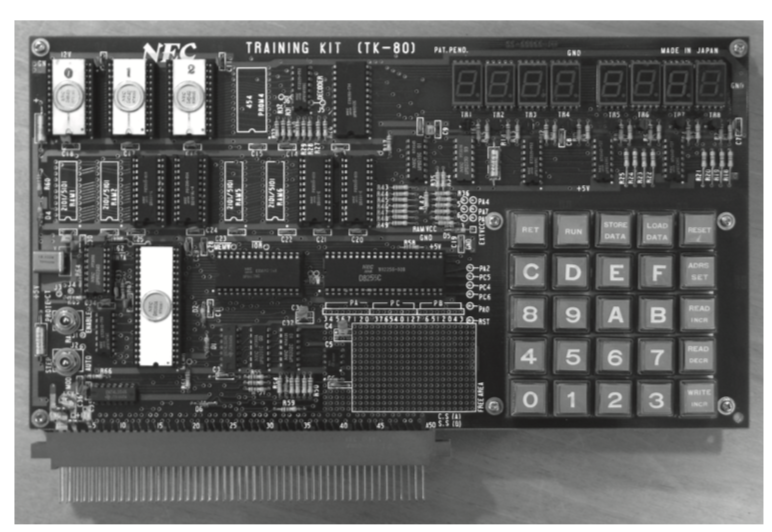

# 1 장  자, 어떤 언어를 만들까?


## 1-1 언어를 직접 만든다는 것의 가치

> 프로그래밍 언어를 실제로 만들면서 언어의 설계 및 구현 방법을 배울수 있게 된다. 오픈 소스 덕택으로 스스로 언어를 만드는 것에 대한 문턱이 많이 낮아졌다. 언어를 만들 수 있다면 엔지니어로서 자신의 가치를 높이고 더 큰 ‘즐거움’을 얻을 수 있게 된다. 


 나는 프로그래밍 언어인 ‘Ruby(루비)’ 의 제작자로서 알려진 사람이지만, 원래는 어느 부류에도 속하지 않은 무류(無類) 프로그래밍 언어 매니아이다. Ruby는 개인적인 취미로서 조사해 왔단 프로그래밍 언어에 관한 연구를 집대성한 것이어서 어떻게 보면 Ruby는 이런 연구의 부산물이라 할 수 있다. 부산물로 이만큼 퍼져 나갔다는 것은 대단하지만 이것은 내 실력 덕분이라기보다는 운이 컸을 것이다. Ruby가 탄생한 지 20년이 조금 지난 지금, 이제까지 있었던 여러 가지 사건이나 만남이 없다면 Ruby는 정말 여기까지 올 수 없었을 거라고 생각한다.

#### 언어 제작의 세계 

그런데 여러분은 프로그래밍 언어를 만들어 본 적이 있나? 프로그래밍을 해본 이에게 프로그래밍 언어는 매우 친근한 존재다.  그러나, 이들에게 프로그래밍 언어는 ‘있는 것을 가져다 쓰는 것’ 으로 여기며 스스로 만들 생각은 하지 않을지도 모른다. 어쩌면 그런 생각은 당연하다. 

그러나 인간이 쓰는 언어(자연언어)와 달리 모든 프로그래밍 언어는 어딘가의 누군가가 설계하고 구현한 것이다. 자연적으로 발생한 것이 아니라, 명확한 의도와 목적을 가지고 ‘디자인’된 것이다. 다시 말하면, 과거에 언어를 만들려고 한 사람(언어 디자이너)이 없었다면, 우리는 지금도 어셈블러에서 프로그래밍 하고 있었을지도 모른다.

프로그래밍의 역사 초기부터, 언어는 프로그래밍과 땔 수 없는 관계 였다. 프로그래밍의 역사는 언어의 역사라고 해도 과언이 아니다.
이 책의 목표는 프로그래밍 언어를 스스로 만드는 것이다. ‘지금 와서 언어를 만드는게 어떤 의미가 있어?’ 라고 생각한 분에게는, 나중에 천천히 답변할 것이니 조금 기다려 주기 바란다. 우선은 언어 제작의 역사부터 풀어가 보자. 


### ■ 자기제작 언어(自作言語)의 역사

초기의 프로그래밍 언어는 기업의 연구소(FORTRAN, PL/I), 대학(LISP), 규격 위원회(ALGOL, COBOL) 등에서 ‘일로서 진지하게’ 언어에 관련되는 사람들에 의해서 개발되었다.하지만, 이 흐름은 개인용 컴퓨터가 만들어진 1970년대 이후 변화해 간다. 개인용 컴퓨터를 구한 매니아들은 취미로 프로그래밍을 하고 심지어 취미의 일환으로 프로그래밍 언어까지 만들기 시작했다.대표적인 것이 BASIC이다. BASIC 자체는 미국 다트머스(Dartmouth) 대학에서 교육용 프로그래밍 언어로서 탄생했지만, 언어 사양이 심플하고 요구되는 구현 규모도 소규모여서 1970년대의 매니아들은 이 언어를 즐겨 사용하게 되었다.매니아들은 또한 BASIC 자체의 개발도 시작했다. 당시의 개인용 컴퓨터<sup>1)</sup>들은 기껏해야 수 K바이트 밖에 없었다.이러한 환경에서 이들이 만든 BASIC은 프로그램 사이즈가 1K바이트 이하로, 4K바이트 정도의 메모리에서도 동작했다. 현대의 언어 입장에서 보면 상당히 경이적이었다.

####마이크로컴퓨터 잡지의 시대

개인 차원에서 개발된 BASIC을 비롯한 소규모 언어(타이니 랭귀지- tiny language)는 점차 다양한 형태로 배포되게 된다. 당시의 소프트웨어는, 컴퓨터 잡지에 덤프 리스트로 게재되거나 프로그램 데이터를 음성 변환해 소노시트(Sonosheet)로 부록에 수록되는 방식으로 배포되었다. 소노시트라고 하면 지금 사람들은 잘 모를 것이다. 소노시트란 얇은 비닐이나 플라스틱으로 만든 간단한 레코드물을 말한다. 레코드도 거의 사장된 단어인데. 당시 매니아에 일반적인 외부기억장치였던 카세트레코더 대신에, 레코드 플레이어를 컴퓨터에 연결해서 읽어 넣도록 했었다.
1970년대부터 80년대에 걸쳐 컴퓨터 잡지(당시엔 마이크로컴퓨터 잡지라 불렸다)가 한창이던 때여서

* RAM(廣済堂出版)
* 마이컴퓨터(마이컴)(電波新聞社)
* I/O(工学社)
* ASCII(ASCII)

4개의 잡지가 격전을 벌이고 있었다. 이 4가지 중 지금 남아있는 잡지는 I/O 뿐이고, 그것도 이전과는 성격이 꽤 바뀌었다.

이후 ‘마이컴’ 으로부터 ‘마이컴 베이직 매가진(통칭 베매가)’이 탄생하는 등 여러 사건 있었지만, 아재의 옛날이야기가 될 것 같으므로, 이쯤에서 그만두겠다. 30대 ~ 40대 프로그래머에게 이런 주제로 이야기를 꺼내면, 대부분이 기뻐하면서 그 당시의 이야기를 하지 않을 까.

당시의 ‘마이컴’ 잡지는 방금 전 말한 것처럼 BASIC를 수록한 소노시트를 부록에 제공했고, 그 이외에도 몇 개의 소규모 언어를 소개하고 있었다. 예를 들면 GAME나 TL/1등이 있다. 이것들은 시대를 반영한 매우 재미있는 언어이기 때문에, 다른 칼럼으로 소개 예정이다. p.16~19<sup>편집 후 페이지 조정 필요</sup> 의 칼럼 ‘마이컴 잡지에서 소개된 타이니 랭귀지’를 꼭 읽어 보기 바란다.

####현대의 자기제작 언어

왜 1970년대 후반부터 1980년대 전반까지 기간에 자기제작 언어들이 태어난 것일까? 가장 큰 이유는 당시에 개발 환경을 갖추지가 쉽지 않아서 였을 것이다. 
1970년대 후반에 마이컴으로 일반화된 것이 TK-80(그림1)보드를 기반으로한 단일 보드 기반 마이컴이었다. 대부분이 반완성품으로 직접 납땜을 해야 했다. 제대로 된 개발 환경이 갖추어질 리 없었고 소프트웨어도 직접 기계어를 짜서 넣어야 했었다. 


<center>
    (그림 1) TK-80
</center>


1970년대 말에는 PC-8001이나 MZ-80과 같은 완성품 ‘컴퓨터’가 등장한다.그러나 개발 환경은 기껏해야 BASIC으로, 스스로 자유롭게 개발 언어를 선택하는 것은 어려웠다. 상용 언어 처리 시스템은 판매되고 있었지만, C컴파일러의 정가가 19만 8000엔 정도여서, 일반인들 손에 쉽게 넣기 어려웠다. 그래서 차라리 직접 언어를 개발하려고 한 것이다. 

그러나 현대에는, 개발 환경이 없어서 개발을 못하는 경우는 없다. 각종 프로그래밍 언어나 개발 환경이 오픈 소스 소프트웨어로서 공개되고 있고, 오픈소스가 아니더라도 무상의 것을 인터넷을 통해 쉽게 구할 수 있다. 

그렇다면, 이제 와서 자기제작 언어를 만들자는 것은 무의미한 것일까? 라는 질문에, 어디까지나 개인적인 의견입니다만(그리고 본서를 위해서는 당연한 답이라도 있습니다만), 대답은 ‘아니오’ 입니다. 비록 현대라도 새로운 언어를 개인 차원으로 설계하는 것에는 의미가 있습니다.그것도 꽤 중요하게...

게다가 현재 폭넓게 사용되고 있는 언어의 상당수도, 개발 환경이 쉽게 갖추어지게 되고 나서, 개인 차원에서 설계 및 개발된 것이다. 개인 차원의 언어 개발이 정말 무의미했다면, Ruby도, Perl도, Python도, Clojure도 탄생하지 않았을 것이다.
아, 그래도 Java와 JavaScript, Erlang, Haskell은 탄생했다고 생각한다.이것들은 업무나 연구의 일환으로서 탄생했기 때문이다. 

### ■ 왜 언어를 만드는가?

그럼 현재 IT환경에서 어떤 것이 자기제작 언어를 설계하고 개발하는 데 동기부여가 될까?
나의 경우를 되짚어 보거나 다른 언어 제작자로부터의 정보를 바탕으로  생각하면, 그 배경에는 다음과 같은 것이 있을 것 같다. 

* 프로그래밍 능력의 향상
* 설계 능력의 향상
* 자기 브랜드화
* 자유의 휙득

우선 프로그래밍 언어의 구현은 컴퓨터 과학의 종합 예술이라고 할 수 있다. 언어 처리시스템의 기초인 단어 해석이나 구문 해석은, 네트워크 통신의 데이터 프로토콜 구현 등에도 응용할 수 있다.
언어 기능을 실현하는 라이브러리와 거기에 포함되는 데이터 구조의 구현은, 컴퓨터 과학 그 자체다. 특히 프로그래밍 언어는 응용 범위가 넓고, 어떤 경우에 이용될지 사전에 예측하는 것이 어렵기 때문에, 보다 난이도가 높고, 그만큼 재미있다고도 할 수 있다. 

또한, 프로그래밍 언어는 컴퓨터와 인간을 연결하는 인터페이스이기도 하다. 이러한 인터페이스를 디자인하는 것은 인간이 어떻게 생각하고, 암묵적으로 무엇을 기대하고 있는지에 대한 깊은 고찰이 요구된다. 그러한 고찰을 거듭하는 것은, 언어 이외의 API의 설계나, 사용자 인터페이스(UI), 나아가 사용자 경험(UX)의 설계에 도움이 될 것이다.

####자기 브랜드를 높일 수 있다

사람에 따라서는 의외로 생각할지도 모르지만, IT업계에서 프로그래밍 언어 그 자체에 흥미를 가지는 사람은 적지 않다. 프로그래밍과 언어는 끊을 수 없는 관계이므로 당연한 것인지도 모르겠지만, 일단은 언어 관련 스터디나 컨퍼런스 등이 많은 참석자를 모으고 있다는 점에서도 알 수 있다. 때문에, 인터넷상에서 새로운 언어의 소식을 접하면 우선 시험 삼아 써보는 사람들이 많다. Ruby도 1995년 인터넷에 공개한 직후 불과 2주 만에 메일링 목록 참가자가 200명 이상 몰려들어 깜짝 놀랐었다.

그러나 언어를 써 보는 사람은 나름대로 존재해도, 프로그래밍 언어, 그것도 잡지의 부록과 같은 ‘장난감’ 레벨을 넘어, 실제 쓸 수 있는 언어를 설계 및 구현하는 사람은 거의 없다. 그래서, 실용적인 프로그래밍 언어를 만들었다는 것만으로도 존경받을 자격이 충분히 있다.
이 오픈 소스 시대에 기술자가 살아남기 위해서는, 기술자 커뮤니티에서의 존재감이 매우 중요하다.오픈 소스 소프트웨어를 공개하는 것만으로도 효과가 높지만, 프로그래밍 언어의 ‘특별감’은 그 브랜드 효과를 한층 높일 수 있다. 

####무엇보다 재미있다

그리고 무엇보다 프로그래밍 언어의 설계와 구현은 즐거운 작업이다. 정말이다. 컴퓨터 과학의 다양한 곳에 관련된 도전적인 프로젝트들이 있는 것도 이를 증명한다. 또한 프로그래밍 언어를 설계한다는 것은, 그것을 사용하는 프로그래머의 사고를 지원하거나 설계를 가능하게 하기 때문에, 그러한 점에서도 재미있다.

게다가, 보통 프로그래밍 언어는  ‘가져다 쓰는 것’, ‘함부로 바꿀 수 없는 영역’ 의 이미지이다. 자신이 만든 언어라면 그런 것은 없다. 내가 원하는 디자인을 하고, 마음에 들지 않으면, 혹은 더욱 좋은 생각이 있으면 자유롭게 변화시킬 수 있다. 어떤 의미에서 이런 것이 궁극의 자유라고 말할 수 있겠다. 프로그래밍이란  자유의 추구 활동이라고 생각한다. 스스로 프로그래밍을 하면, 다른 사람이 만든 소프트웨어를 단지 사용하고 있는 것만으로는 향유 할 수 없는 자유를 손에 넣을 수 있다. 적어도 나로서는 이것이 프로그래밍을 하는 중요한 동기 중 하나이다. 내게는 프로그래밍 언어를 설계하는 것은 한층 더 높은 자유를 얻는 수단이며 또한 즐거움과 기쁨의 원천이다.

####왜 언어를 만드는 사람은 많지 않을까

그래도, 프로그래밍 언어를 만드는 것은 누구라도 쉽게 하는 일이 아니다. 앞에서 말한 대로, 프로그래밍 언어에 관심을 가지는 사람들 중에, 만들려고 하는 사람은 거의 없다.  ‘관심을 가지는 사람은 그 나름대로 있다.’ 고 해도, 인구 비례로 보면 오차 범위 정도로 적다. 그 중에서  ‘자신만의 언어를 만들자’라고 할 정도의 동기를 가지는 사람은, 거의 없는게 당연한지도 모른다.
내 경우 프로그래밍에 관심을 가지고 나서 몇 년 후에는 이미 프로그래밍 언어에 매료되어 있었다. 그런데 ‘모든 사람이 프로그래밍 언어에 관심을 가지는 것은 아니다’라고 하는 사실을 깨달은 것은, 대학에 입학해 컴퓨터 과학을 전공하고 나서다. 다행인지 불행인지 나는 깊숙한 시골에서 자랐기 때문에, 주위에 프로그래밍에 관심있는 사람들이 없었기 때문이다. 

‘어, 나만 이상한가?’ 라고 깨달았을 때의 충격은 상당했다. 당시의 마이컴 잡지에서는 TL/1등의 언어 관련 기사도 꽤 실릴때였다.  프로그래밍에 관심을 가지는 사람은 (나처럼) 상당한 확률로 프로그래밍 언어에 빠질 것이라고 믿었는데, 사실은 그렇지 않았다.

뭐,  원래 프로그래밍 언어에 관심이 없는 사람들은 어쩔 수 없다고 하더라도, 관심이 있는 층도 스스로 설계하는 레벨까지는 아니었다.
왜 그럴까 오랫동안 생각했다. 선배 언어 디자이너로서 프로그래밍 언어 관련 이벤트에 참가했을 때에 ‘ 한 번 해 보시죠’ 라고 권유해 보기도 했다.하지만 좀처럼 좋은 반응을 얻을 수 없었다. 물론, 뭔가 새로운 일을 시작하려면 상당한 에너지가 필요하다지만 그렇다고 해도, 반응이 너무 나빴다.

####어려워할 필요가 없다

여기저기에 물어본 결과,  언어 설계을 하지 않는 가장 큰 이유는 새로운 언어를 만든다는 것에 관심은 있어도 그 앞에 뭔가 심리적 장벽을 느끼기 때문이라는 것이었다.  즉, ‘언어라는 것은 이미 존재하고 있는 것으로 원래 자신이 설계, 개발하는 것은 아니다’ 라는 장벽이다. 드물게 그런 벽을 느끼지 않는 소수의 사람이 있어도, 이 사람들은 ‘언어를 구현하는 것은 어려울 것 같다’ 라고 생각하는 것 같다. 재미있을 것 같으니까 해 보고 싶지만, 어떻게 구현해야 하는지 모르겠다는 것이다. 
생각해보면, 프로그래밍 언어의 구현에 관한 서적은 의외로 많이 출판되고 있지만, 대부분은 대학의 교과서 수준으로 꽤 난해하다. 또, ‘문법 클래스’나 ‘폴로 집합’ 등 어려운 용어도 많이 쓰인다.

그러나 생각해보면, 우리의 목적은 자신을 위해, 자신의 즐거움을 위해 자신의 언어를 설계하는 것이다. 프로그래밍 언어를 처음부터 구현하기 위해서 필요한 지식을 올바르게 전부 배울 일은 아닐 것이다. 오히려 올바른 지식을 익힐 때까지 프로그래밍 언어의 구현에 전혀 장애가 없다면 오히려 큰 문제다. 내 가슴속 정열의 불씨가 작아져 버릴 것이다.
필요한 지식 등은, 나중에 필요에 따라서 익히면 된다. 이 책에서는 언어 구현을 위한 어려운 부분은 파고들지 않고, 간단한 언어 처리 시스템을 만드는데 필요한 최저의 지식과 도구의 사용법을 다룬다 한다. 이론적 배경보다는 언어를 어떻게 설계하는가 하는 점에 주력 하였다. 


<hr>

### 마이컴 잡지에 소개된 타이니 랭귀지

**GAME**

GAME(General Algorithmic Micro Expressions)는 BASIC에서 파생된 타이니 랭귀지다. 큰 특징은, 예약어가 모두 기호라는 점과, 모든 문장이 대입문 이라는 점이다.
예를 들면 ‘?’ 에 대입하면 수치출력이 되고 반대로 ‘?’ 을 변수에 대입하면 수치입력이 된다. 문자열의 입출력에는 ‘$’를 사용한다. 게다가 ‘#’에 행번호를 입력하면 goto, ‘!’에  행번호를 대입하면 gosub(서브루틴의 호출)가 됩니다.
나머지는 ‘ABC’와 같이 문자열을 두면 문자열 출력이 됩니다.그리고 ‘/’는 개행 출력이다
꽤 흥미로운 언어이며, 그 샘플은 그림 A와 같다. BASIC와 같으면서도 그렇지 않은 느낌을 느껴보라.
GAME는 매우 단순한 언어이기에 8080 어셈블러로 기술된 인터프리터는 1K바이트 미만이었다. 게다가 나카지마 사토시( 中島聡-당시 고교생이었다)에 의해서 개발된 GAME으로 만들어진 GAME 컴파일러도 존재하며 코드는 200라인 정도였다. GAME의 기술이 놀라운 걸까, 나카지마의 기술력이 놀라운 걸까?

**TL/1**

비슷한 시기에 ‘ASCII’에서 발표되었던 타이니 랭귀지로 TL/1(Tiny Language/1)이라는 것이 있었다. 이름은 미국 IBM사에서 개발된 프로그래밍 언어 PL/I에서 따 온 것으로 생각된다. BASIC에 영향을 받으면서 기호를 구한 GAME와는 달리, TL/1은 Pascal 같은 문법을 가졌으며, 보다 ‘보통의 언어’ 같은 인상을 주었다. 또 TL/1의 처리 시스템은 컴파일러로서, 인터프리터가 메인인 GAME보다도 속도가 빨랐다. 실제로는 앞에서 말한 바와 같이 GAME에도 컴파일러는 존재했지만 말이다. 
언어로서의 TL/1의 특징은, Pascal같은 구문과 변수의 형태가 1 바이트 정수 밖에 없는 점이다.이걸로 어떻게 프로그램을 쓰는가 생각할지도 모르겠다. 그러나 당시의 주류는 8비트 CPU이므로, 어떻게 보면 자연스러운 것이었다. 무엇보다 아무리 8비트 CPU상이라고 해도, 다른 언어는 GAME을 포함해 16비트 정수를 제공하고 있었다.


그럼, 1바이트로 다 표현할 수 없는 255를 넘는 수치는 어떻게 표현할까? 1바이트씩 분할해 복수의 변수를 조합해 표현한다. 예를 들면 16비트 정수를 할당하려면 변수를 2개 사용하게 되는 것이다. 연산시에는 계산이 오버플로 했을 때의 캐리 플래그를 보면서 계산한다(그림 B(a)).
당시의 8비트 CPU에서는, 대부분의 처리는 16비트 정수로 충분했기 때문에(어드레스도 16비트만 있어도 모든 어드레스 공간에 접근이 가능했다), 타이니 랭귀지로서 이정도면 충분한 사양이었다. 마음만 먹으면 명시적으로 캐리 플래그를 보는 것으로, 복수의 변수를 사용해 24비트 연산도, 32비트 연산도 가능했다.

**포인터도, 문자열도 다룰 수 있다**

1바이트 만으로 표현할 수 없는 것이 포인터이다. 이는 mem 배열을 사용하여 접근이 가능했다. 다시 말하면 ,

```
mem(hi, lo)
```

로　hi, lo 로 표현되는 16비트 지정 어드레스의 내용을 참조하여 

```
mem(hi, lo) = v
```

로 그 값을 v 로 치환한다. 당시 개인용 컴퓨터(마이컴)은 겨우 32K바이트 정도밖에 메모리가 없었기 때문에 16비트 어드레스로 접근하는 것만으로도 충분했다. 

다음은 문자열이다 .물론 문자열을 바이트의 배열로 생각하고 1바이트씩 조작하는 것도 가능하지만, 그렇게 처리하자면 작업이 힘들어진다. 여기서 TL/1에서는 데이터 출력에 사용되는 WRITE 문을 만들었다. 

예를 들어 Hello World 프로그램을 TL/1으로 기술한 것이 그림 B(b)처럼 된다. TL/１에서 변수는 1바이트 정수밖에 없었을 것 같지만 문자열이 여기에서 등장하는데 실은, WRITE는 특별히 문자열을 취급할 수 있도록 문법에 이를 포함 시켜 놓았다. 

WRITE외에서는 문자열을 취급할 수 없기 때문에, 일반적인 문자열 처리는 할 수 없었다. 조작할 수 있는 것은 어디까지나 1바이트 정수뿐이었다. 오늘날의 시각에서 비춰 볼 때,  Pascal이나 FORTRAN에서도 입출력은 특별히 취급되었기 때문에 당시엔 그것이 당연한 것일지도 모르겠다.


```
220    ?(6)=A
230 @=(A+1)
240
300 / ‘ IF 문의 예‘ / 
310 B=1,2
320    ;=B=1 ‘ B=1 ‘ /
330    ;=B=2 ‘ B=2 ‘ / 
340 @=(B+1)
350
400 / ‘ 수치 입력과 연산 ‘ /
410 ‘A=?‘A=?
410 ‘B=?‘B=? 
420 ‘A+B=‘?=A‘+‘?=B‘=‘?=A+B/
430 ‘A*B=‘?=A‘*‘?=B‘=‘?=A*B/
440
500 / ‘ 배열과 문자열 출력 ‘ /
505--------배열 어드레스를 $1000으로 한다
510 D=$1000
520 C=0,69 
525--------2바이트 배열로 적어 둔다
530     D(C)=(C+$20)*256+C+$20
540 @=(C+1)
560 C=0,139 
570--------1바이트 배열로 읽어들여 문자 출력
580     $=D:C)
590 @=(C+1)
600
700 / ‘ GOTO 와 GOSUB ‘ /
710 I=1
720 I=I+1
730 !=1000
731* ?(8)=I*I
740 ;=I=10 #=760 
750 #=720
760
900 / ‘프로그램 종료‘ / 
910 #=-1
920
1000 / ‘ 서브 루틴‘ / 
1010 ?(8)=I*I
1020 ]
```
<center>
    (그림 A)GAME의 샘플 코드
</center>


```
% (a)
% 코멘트 앞은 「%」를 붙였다. 당시 2바이트 문자는 사용할 수 없었음.  
BEGIN
    A := 255
    B:=A+2 %overflow 
    C:=0 ADC 0 %add with carry
END

% (b) 
BEGIN
     WRITE(0: ‘hello, world‘, CRLF) 
END
 
```

<center>
    (그림 B)TL/1의 샘플 코드
</center>


<hr>


### 타임머신 칼럼

***처음에는 mruby를 개조하려 했었다***


> 2014년 4월호로부터 시작된 제1회 연재분이다. 이 때 언어의 설계에 대하여 열변을 했었던 것 같다. 
> 이 연재 제1회 당시, 어떠한 언어를 만들지에 대해서는 생각하지 못했다. 당시 구상은 만들고 있는 언어처리시스템(중 하나)인 mruby를 개조하려고 했었다. 그 결과, 연재 당시에는, mruby 소스 코드의 얻는법이나, 소스 트리의 구성 개요 등에 대해서도 해설했었지만, 실제로 mruby의 소스 코드는 전혀 사용하지 않았기 때문에, 본서에서는 할애했다. 그래도, mruby가 비교적 심플하고 언어 구현의 교재로서 유효한 것은 변함없다. 만약 mruby의 원시코드를 읽고 공부하고 싶다는 생각을 하시면 http://www.mruby.org/를 시작으로 여러가지 조사를 해보기 바란다. 또 소스코드는 ‘https://github.com/mruby/mruby’ 에서 구할 수 있다.  의문사항이 있거나, 버그를 찾거나 하면, GitHub의 이슈트 래커를 통해서 보고해 주기 바란다. 다만, mruby의 개발은 국제화가 진행되고 있기 때문에, 이슈의 기술도 영어가 권장되고 있다. 영어를 아주 꺼려하는 분들이 있다면 (가능하면 심플한 영어로라도 영어를 직접 써 보기를 권하지만..)  트위터(@yukihiro_matz)를 통해 리포트를 해주신다면 일본어로 대응할 수 있다.


