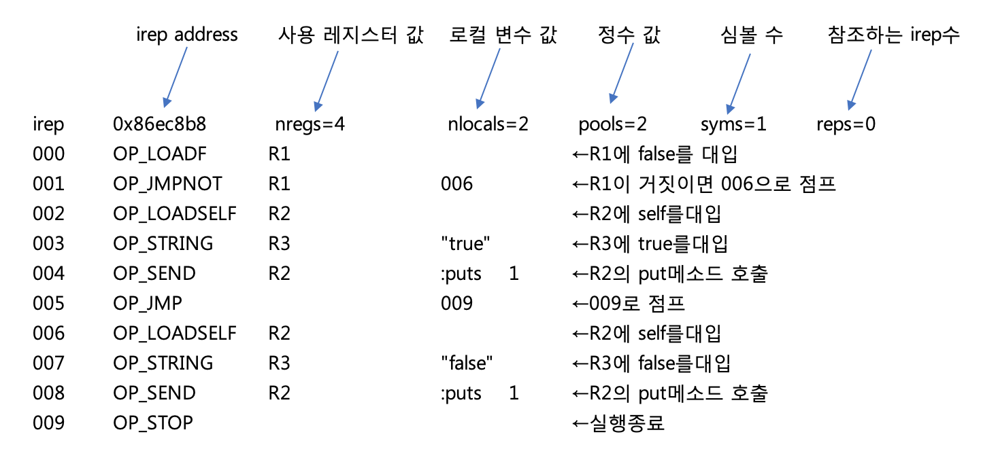

## 1-2 언어 처리 시스템의 구조

> 이번에는 언어디지인을 하기 위한 준비 단계로서 프로그래밍 언어와 그 처리시스템과의 관계, 그리고 구조에 대하여 간략히 살펴본다. 우선 전자계산기 프로그램을 만들어 볼 것이며, 실용적인 언어 처리 시스템의 예로서 mruby의 구현에 대해서도 소개할 것이다. 
> 


프로그래밍 언어를 만들려고 해도, 그것이 어떤 작업인지 구체적으로 상상할 수 있는 사람은 그다지 많지 않을 까 생각한다.대부분은 기존 언어를 배우기만 했지, 언어를 디자인하는 생각은 해본 적이 없기 때문일 것이다.

#### 언어와 언어 처리 시스템

프로그래밍 언어는 다층적인 구조를 가진다. 우선 크게 나누면, 프로그래밍 언어란, 커뮤니케이션의 룰인 '언어'와 그 언어를 처리해 컴퓨터로 실행시키는 '언어 처리 시스템'로 나눌 수 있다. 많은 사람들이 프로그래밍 언어라는 단어를 사용할 때 언어와 이에 대한 접근이 복잡하다고 생각한다.
그리고 언어는, '문법'과'어휘'로 구성된다. 문법이란, 기술(記術) 이 그 언어에서의 프로그램에서 어떻게 표현이 되는지를 정한 룰이다. 어휘는, 그 언어로 기술된 프로그램으로부터 불러낼 수 있는 기능의 집합이다. 이 어휘는 나중에 라이브러리 형태로 늘릴 수 있다. 언어를 디자인한다는 관점으로, 어휘를 정의하면, 어휘란 그 언어가 처음부터 갖추고 있는 기능들을 말한다.
알겠지만 이 문법이나 어휘를 정하는데 소프트웨어는 필요치 않다. '내가 생각한 최강의 언어'를 디자인하는데 컴퓨터는 필요없다. 사실 나도 프로그래밍 기술을 거의 갖고 있지 않았던 시골 고등학생 시절,  언젠가 프로그래밍 언어를 만들고 싶다는 생각으로 망상적인 프로그래밍 언어를 만들어 프로그램을 노트에 적곤 했다. 얼마전에 집에 갔을 때 생각이나 당시 노트를 찾아봤는데, 그 노트들은 벌써 어디론가 가버렸다. 버렸을것 같은데  아깝다는 생각이 들었다.  이제 어떤 언어였는지 기억도 나지 않는다. Pascal과 Lisp에 크게 영향을 받은 것 같긴 한데...

한편, 언어 처리시스템은 그 문법이나 어휘를 실제로 컴퓨터상에서 실행할 수 있도록 하기 위한 소프트웨어다. 프로그래밍 언어가 단순한 망상을 넘어, 실제의 '언어'가 되기 위해서는, 역시 처리시스템이 필요하다. 실행할 수 없는 프로그래밍 언어는 컴퓨터를 움직일 수 없는 이상, 엄밀하게 프로그래밍 언어라고 부를 수 없기 때문이다.

#### 언어 처리 시스템의 구조

'언어 처리시스템을 만들거야'라고 할 때, 언어와 그 처리 시스템이 도대체 어떤 구조로 되어 있는지 모르면 만들 수 없다. 일단 여기서는 기존의 언어 처리 시스템을 이용해 편하게 가자는게 기본 테마이므로, 기술적 상세에는 구애받지 말고,  개요부터 다루기로 하자.

언어 처리 시스템이란 컴퓨터 사이언스의 기술적 집합체이므로 매우 흥미로운 분야다. 컴퓨터 과학 전공의 대학생이라면, 언어 처리 시스템 제작 방법을 배운 적이 있을 것이다. 이는 컴퓨터 과학의 기초(중의 한 개)라 해도 과언이 아니다. '언어 처리 시스템을 만드는' 서적이나 교과서가 서점에 많이 나와 있는 것도 무리는 아닐 것이다. 

하지만, 많은 '프로그래밍 언어의 만드는 방법'을 다룬 서적에서는, 처리시스템을 어떻게 만드는가 하는 데 치우쳐 있다. 언어의 디자인이 어떻게 되어야 하는지, 어떻게 생각해서 언어를 디자인하는가 하는 점을 다루는 책은 거의(또는 전혀) 없다. 뭐, 그런 책에서의 '프로그래밍 언어의 만드는 방법'은 엄밀히 말하면 '프로그래밍 언어 처리 시스템을 만드는 방법' 이 될 것이다.

교과서의 목적은 언젠가 언어를 만들려고 할 때, 그 언어를 어떻게 만드는가 수단을 가르치는 것이 목적이다. 언젠가 언어를 만드는 날이 정말로 올지 어떨지는 영역 밖이다. 이 책에서는 '언어 디자인'쪽에 초점을 맞추려고 한다. 그렇다고는 해도, 나와 같이 노트 위에 '이상의 언어'를 몽상하는 것만으로는 현실성이 없다. 인트로로서 언어 처리 시스템에 관한 최소의 지식에 대해 설명하겠다. 우선은 언어 처리시스템의 구성부터이다. 

#### 언어 처리 시스템의 구성

언어 처리 시스템은, 크게 나누면 문법을 해석하는 '컴파일러', 어휘에 해당하는 '라이브러리', 그리고 소프트웨어를 실제로 동작시키는데 필요한 '런타임(시스템)'으로 나눌 수 있다.이 처리시스템의 구성 요소는, 언어나 처리 시스템의 성격에 따라 비중이 변화한다(그림 1).


<center>
    (그림 1) 언어처리 시스템의 구성요소
</center>


예전 타입의 언어, 예를 들면, TinyBASIC와 같은 심플한 시스템에서는 문법도 많지 않고, 컴파일러는 거의 일을 하지 않은 채 런타임에 맡겨버린다.이러한 처리계를 '인터프리터'라고 한다(그림2)


<center>
    (그림 2)BASIC언어 처리 시스템. 컴파일러와 런타임이 일체형인 '인터프리터' 형태이며 이런 경우 대부분 라이브러리는 분리되지 않는다. 
</center>


그러나 현재는, 이러한 순수 인터프리터 형태의 언어는 많지 않다. 근대적인 언어에서는 많은 경우, 프로그램을 처음에는 내부표현으로 컴파일 하고 나서 이 내부표현을 런타임에서 실행하는 형태의 처리 시스템을 채용하고 있다.  물론 Ruby도 그 중 하나다. 이러한 '컴파일러+런타임' 을 조합한 형태도, 밖에서 보면 소스 코드를 변환하지 않고 실행하고 있는 것처럼 보여서 '인터프리터형'이라고 부르는 경우도 있다. 

C와 같은 기계에 가까운 레벨로 효율성을 추구하는 언어에서는,  런타임의 영역은 상당히 작고, 문법을 해석하는 컴파일러의 영역을 크게 만들고 있다. 이러한 언어 처리 시스템을 '컴파일러형' 이라고 부른다(그림 3). C등에서는 변환 결과의 프로그램(실행 형식)은 직접 실행할 수 있는 소프트웨어이기 때문에, 실행을 담당하는 '런타임' 은 필요없다. 메모리 관리 등 일부 런타임은 라이브러리나 OS의 시스템 콜이 담당한다.


<center>
    (그림 3) C 언어의 처리 시스템. 실행 형식을 출력하는 '컴파일러형' 의 예이다. 실행 형식에서 바로 실행이 가능하므로 런타임의 영역이 거의 없으며, 라이브러리가 런타임의 역할을 한다(메모리 관리 등)
</center>


Ruby와 같은 '밖에서 보면 인터프리터형이지만 안에서는 컴파일러가 동작하는' 유형의 언어 처리 시스템이 있다면, 반대로 Java와 같이 '밖에서 보면 컴파일러형이지만 안에서는 인터프리터(가상머신) 가 동작하는' 것도 있다.  Java에서는 '프로그램을 가상의 컴퓨터의 기계어(JVM바이트 코드)로 변환해, 실행시에는 가상 컴퓨터(JVM)가 실행' 하는 하이브리드형으로 되어 있다(그림 4).


<center>
    (그림 4) 자바의 언어 처리 시스템. 가상 머신 컴파일러의 예이다. 컴파일러는 가싱 머신용 기계어(바이트코드)를 출력한다. 실행은 런타임(JVM)이 담당한다
</center>


게다가 Java에서는, 실행 효율을 높이기 위해, 런타임 속에서 바이트 코드를 실제의 컴퓨터의 머신어로 변환시키는 'Just In Time Compiler' 라고 하는 구조까지 있어, 점점 그 구조는 복잡해져 간다.


#### 컴파일러의 구성

그럼 언어 처리 시스템을 구성하는 각 요소에 대해서, 한층 더 깊게 보도록 하자. 먼저 컴파일러부터 보자.

컴파일러는 프로그래밍 언어의 소스코드를 실행할 수 있는 형식으로 변환하는 일을 한다.
원래 'Compile' 이란 '편집한다' 는 뜻이다.
많은 컴파일러는 이 변환 처리를 여러 단계로 나누어 실시한다. 소스 코드에 가까운 순서대로 '자구(字句) 해석' '구문(構文)해석' '코드생성' '최적화' 다. 단, 이 분류는 일반적인 경우이며,  모든 컴파일러가 이러한 단계들을 모두 실행하고 있는 것은 아니다.

**(1) 자구(字句) 해석**

자구 해석이란 간단히 말하면 '문자의 열인 소스 코드를, 의미가 있는 토큰열로 변환하는' 공정이다. 단순한 문자열인 소스 코드를, 조금 더 의미가 있는 덩어리(토큰)로 정리하는 것으로,  이후 단계의 처리를 간단하게 만들어 준다. 예를 들어, Ruby의 프로그램

```
puts 'Hello\n'
```

을 단어 해석을 해 보면 

```
식별자(puts) 문자열('Hello\n')
```

로 변환할 수 있다. 단어 열이 가지는 '의미' 등은 뒤에 나오는 구문 해석 단계에서 해석된다. 토큰은, 구문 해석 공정으로 취급하기 위한 '단어' 와 같은 것이다. 
자구 해석의 처리는 기본적으로 다음과 같다. 구문해석기가 함수를 호출하고 다음 토큰을 요구하면, 그 함수 내부에서 소스 코드에서 1문자씩 꺼낸다. 그리고 토큰 하나가 처리된 시점에서 다음 토큰을 돌려주는 형태다. 예를 들어 숫자와 간단한 사칙연산을 위한 자구 해석함수를 만드는 lex 표현은 (그림 5)와 같다.


```
%%
'+' return ADD;
'-' return SUB;
'*' return MUL;
'/' return DIV;
'\n' return NL;

([1-9][0-9]*)|0|([0-9]+\.[0-9]*) {
    double temp;
    sscanf(yytext, '%lf', &temp);
    yylval.double_value = temp;
    return NUM;
};

[ \t] ;

.{
    fprintf(stderr, 'lexical error.\n');
    exit(1);
}
%%
```

<center>
    (그림 5) 전자계산기를 위한 lex표현
</center>


수식의 규칙을 보면 알 수 있듯이 토큰을 구성하는 패턴의 기술에 정규 표현을 사용할 수 있다. 이 예에서는, 연산자, 수치, 공백 밖에 토큰이 없지만,  이 연장선상에서, 다양한 토큰을 늘려 갈 수 있다. 이  lex 표현(calc.l라고 하는 파일에 보존되고 있다고 가정하자)을 lex에 걸면 lex.yy.c라고 하는 C파일을 생성한다. 이것을 컴파일하면 자구 해석을 하는 yylex()라고 하는 함수를 사용할 수 있게 된다. 이와 같이 lex를 사용하면, 자구 해석을 간단하게 실현할 수 있지만, 실은 mruby는 lex를 이용하고 있지 않다.이것은 Ruby에서는 구문 해석으로 정해지는 상태에 따라서, 같은 문자라도 다른 토큰을 발생시키는 일이 있기 때문이다.실제로는, lex라도 상태가 포함된 문자구 해석 함수를 기술하는 것은 가능하다. 하지만 이 기능을 스스로 만들어 쓰는 것은 그렇게 어려운 것도 아니고,  '스스로 써보고 싶었다' 라고 마음먹은 것도 이유에 포함된다. 생각해 보면 Ruby를 만들었던 그 무렵 나는 젊었었다.


**(2) 구문(構文) 해석**

그리고, 자구 해석 단계에서 준비된 토큰이 문법에 맞는지를 체크해, 문법에 맞은 처리를 하는 것이 구문 해석이다. 구문해석을 하는 기법은 몇 가지 있지만 가장 유명하고 간단한 것이 구문해석함수 생성 툴인  '컴파일러 컴파일러(compiler-compiler)' 를 사용하는 방법이다. 컴파일러 컴파일러의 대표적인 것에는 yacc(yet another compiler compiler)가 있다. mruby도 yacc, 보다 정확하게는 그 GNU버젼인 bison을 이용하고 있다. 컴파일러 컴파일러에는 yacc 외에도 ANTLR 이나 bnfc등이 있지만, 여기에서는 설명하지 않겠다. yacc에서 컴파일러가 해석하는 문법은 yacc 표현식이라는 기법으로 기술한다. 예를 들면, 전자계산기 입력 구문은 그림6과 같다.
최초의 '%%'까지의 부분은 정의 부분에서 토큰의 종류나 타입을 정의한다. 또 '% {' 과 '%}'에 둘러싸인 부분은 생성되는 C프로그램에 그대로 묻히므로, 헤더 파일의 형태가 된다.

'%%'와'%%'로 둘러싸인 부분이 계산기의 문법 정의다.이것은 BNF(Backus-Naur Form)라고 불리는 문법 정의의 기법을 베이스로 한다. 뒤쪽의 '%%' 이후에도 C프로그램에 그대로 묻히므로 액션부로부터 호출하기 위한 함수들은 여기에서 정의한다.

```
%{
	#include <stdio.h>
    static void yyerror(const char *s) {
		fputs(s, stderr);
		fputs('\n', stderr); 
    }
	static int yywrap(void) {
		return 1; 
    }
%}

%union {
	double double_value;
}
%type <double_value> expr 
%token <double_value> NUM 
%token ADD SUB MUL DIV NL

%% 

program   : statement
          | program statement 
;

statement : expr NL ;
          ;
          
expr      : NUM
          | expr ADD NUM 
          | expr SUB NUM 
          | expr MUL NUM 
          | expr DIV NUM 
          ;
%%

#include 'lex.yy.c'
int 
main() {
	yyparse(); 
}
```

<center>
  <그림 6. 전자계산기 구문 해석 calc.y></center>


##### 전자계산기 문법을 살펴보자

그럼 전자계산기 문법을 살펴보자. 첫 번째 샘플이라 매우 심플한 문법으로 소개한다. 보통 전자계산기와 같이, 연산자의 우선순위도 아무것도 없다.첫 번째 규칙부터 살펴보자. 
BNF룰을 따랐고 디폴트로 첫 부분에 규칙을 명기했다. 첫 부분의 룰은 다음과 같다.

```
program   : statement
          | program statement 
;
```

이것은 올바른 전자계산기 문법은 program이며,   'program이란  statement, 또는 program과 statement의 연속된 조합' 이라는 의미다. ':'이 정의를, '|'이 '또는' 그리고 단어 나열은 각각의 정의가 연속된다는 의미이다.이 규칙에서는 'program' 이라는 단어가 우변에도 등장하는 재귀 형태이지만 상관없다. yacc에서는 반복은 이와 같이 재귀를 이용해 기술한다.

다음 규칙을 보자.

```
statement : expr NL 
;
```

이것은 'statement란 expr의 뒤에 NL가 온 것이다' 라는 의미다. NL은 여기에서는 정의되고 있지 않지만, 자구 해석이 LF(Line Feed - New Line을 의미(역주))을 만났을 때에 건네주는 토큰이 된다
이번에는 expr의 정의이다.


```       
expr      : NUM
          | expr ADD NUM 
          | expr SUB NUM 
          | expr MUL NUM 
          | expr DIV NUM 
          ;
```

이것은, expr이 'NUM(수치를 나타내는 토큰), 또는 expr에 이어 연산자 + 수치 인것' 이라는 의미이다. 여기에서도 재귀에 의한 반복이 사용되고 있다. 예를들어 '1'은 수치이므로 expr 이다. '1+1'은 expr인 1과 연산자'+' 그리고 수치의 조합이므로 expr이다. 같은 논리로 '1+2+3'등도 expr이다. 


대략 BNF의 구조가 이제 파악이 되는가?


여기까지 기술해 온 전자계산기 프로그램을 실행해 보겠다(그림 7). 그림 5의 프로그램을 lex를 통해 그림 6의 프로그램을 yacc에 태운 다음, 생성된 y.tab.c라고 하는 C소스 파일을 컴파일 하면, 계산기의 문법체크가 완성된다.

계산 기능은 아직 구현을 하지 않았기 때문에 문법 체크만 수행 가능하다. 입력 구문이 문법에 맞으면 아무것도 하지 않고 문법에 오류가 있으면 'Syntax error' 를 표시하고 종료한다.


```
% lex calc.l  ↲  ⇦ 자구해석생성 
% yacc calc.y  ↲  ⇦ 구문해석생성 
% cc y.tab.c  ↲  ⇦ 컴파일러 
% a.out  ↲  ⇦ 실행 
1 + 1  ↲  ⇦ 문법에 맞는 입력
2  ↲  ⇦ 문법에 맞는 입력
1 +  ↲ ⇦ 문법에 맞지 않는 입력
syntax error ⇦ 에러 표시후 종료

%
```

<center>
  <그림 7. 전자계산기 프로그램의 컴파일 및 실행 ></center>


#####전자계산기 프로그램을 구현한다

계산도 할 수 없는 계산기는 의미가 없기 때문에, 실제로 계산 기능을 만들어 보자. yacc에서는 규칙이 성립했을 때에 실행하는 '액션' 을 기술할 수 있다. 그림 6의 yacc 기술에 실제의 액션을 추가해 계산이나 표시를 하면 계산기가 완성된다. 구체적으로 그림 6의 프로그램의 statement와 expr의 룰 부분을 그림 8의 코드로 교체해 보자.

```
statement : expr NL 
			{
            	fprintf(stdout, '%g\n', $1);
            }
          ;
          
expr      : NUM
          | expr ADD NUM 
             {
                $$ = $1 + $3;
             }
          | expr SUB NUM 
              {
                $$ = $1 - $3;
              }
          | expr MUL NUM 
              {
                $$ = $1 * $3;
              }
          | expr DIV NUM 
              {
                $$ = $1 / $3;
              }
          ;

```

<center>  
    <그림 8. 전자계산기 프로그램의 계산(액션) 부분></center>

이 전자계산기 샘플에서는 액션부에서 직접 계산과 출력을 수행하고 있다. 이른바 '순수 인터프리터'다. 하지만 실제 컴파일러에서는 이렇게 직접 처리를 실행하는 일은 좀처럼 없다. 이 상태로는 루프에 의한 반복이나 사용자 함수 정의 등에 대응할 수 없기 때문이다. 예를 들어 mruby에서는 문법구조를 표현하는 트리구조를 만들어 다음 코드 생성 처리에 건네주고 있다. 트리 구조의 한 예로서 mruby의 if 문은 (그림 9)와 같이 세그먼트 트리(실제로는 구조체 링크)로 변환 된다. 

```
# 이 Ruby프로그램이

if cond
    put 'true'
else
	put 'false'
    
end

# 이렇게 S식으로 변환된다. 
(if (lvar cond)
    (fcall 'puts' 'trued')
    (fcall 'puts' 'false'))

```

<center>
    <그림 8. mruby의 구문 트리 구조>  </center>

**(3) 코드의 생성**

코드생성처리에서는 구문해석처리에서 생성한 트리구조를 따라가면서 가상머신의 기계어를 생성한다. JVM 탄생 이후, 이 '가상 머신의 기계어'를 '바이트 코드'라고 많이 부르는 것 같다. 확실히 JVM의 기계어는 바이트 단위이므로 바이트 코드로 틀림이 없다(그 근원이 된 Smalltalk도 바이트 단위로 된 바이트 코드다). 그러나, mruby의 경우는 기계어는 32비트 단위이므로 사실은 '워드 코드' 라고 불러야 할지도 모르겠다.  바이트 코드는 부정확하며 워드코드는 일반적으로 사용되지 않는 용어이므로, mruby 내부에서는 iseq(instruction sequence: 명령열)이라고 부르고 있다. 또 iseq에 심볼 정보등이 추가된 프로그램 정보(코드 생성의 최종 결과)들을 irep(internal representation : 내부 표현) 이라고 부르고 있다

mruby 코드 생성 처리에서는 그다지 어려운 해석은 하지 않는다. 하려고만 하면, 구문 해석 처리의 액션부에서 직접 코드를 생성하는 것도 가능하다. 그러나, 몇가지 이유때문에 상태를 분할해, 중간 표현으로 세그먼트 트리와 유사한 구조를 채용했다.

#####mruby에서는 코드 생성을 분리

첫번째 이유는 유지보수성이다. 분명 구문해석 액션부에서 코드를 생성하는 것은 가능하며, 그로 인해 프로그램 사이즈는 (약간) 축소될 것이다. 하지만, 구문 해석과 코드 생성이 일체화되면 프로그램은 더 복잡해져, 문제가 있을 때에 원인을 발견하는 것이 어려워질 것이라 생각했다.
액션부는 룰의 패턴에 매치한 순서대로 호출되므로, 절차적인 동작에 비해 실행 순서의 예측이 어려워, 디버깅이 곤란해지는 케이스가 있다. 관리를 위해서라도, 액션부에서 실행하는 것은 구문트리 생성만으로의 심플한 구성으로 놔두는 것이 현명하다고.판단했다.

그렇게 되면 임베디드 분야도 커버하는 mruby로서는 메모리 관리에 주의해야 하지만, 다행히도(구문 해석이나 코드 생성을 포함) 컴파일러부는 실행 시에 분리하는 것이 가능하다. 메모리 용량이 작은 환경에서도, 실행시 분리에 의한 메모리의 절약이 가능하기 때문에,  그렇게 메모리 소비에 대해 엄격하게 관리할 필요는 필요는 없다고 생각했다. 구문 해석 결과의 트리구조를 코드 생성 처리에 수행시키면 그림 10과 같은 irep를 만든다다. 원래 irep는 바이너리(구조체)인데,  가독성을 위해 사람이 읽을 수 있는 형식으로 변환하고 있다. 




<center>
    (그림 10) 코드생셩 결과(irep)
</center>


**(4) 최적화**

컴파일러의 구현에 따라서는, 코드 생성의 전후에 '최적화'처리를 하는 경우도 있다. mruby의 경우에는, Ruby라고 하는 언어의 성격상, 최적화를 추가하기는 어렵기 때문에, 극히 작은 최적화만 코드 생성 처리 부분에서 수행하고 있다. 이것은 '피프 홀(엿보기구멍) 최적화'라고 불리는 것으로,  명령을 생성하는 시점에서 직전의 명령을 참조하는 것만으로 가능한 최적화다. mruby 컴파일러가 실시하고 있는 최적화의 일부를 (표 1)에  나타내었다.


<center>
    (표 1) mruby의 최적화
</center>


#### 컴파일러 처리 후

mruby의 경우, 컴파일러의 처리가 끝난 후에 행하는 작업은 2가지 종류가 있다. 하나는 컴파일 결과를 그대로 실행하는 것이다. 실행시 mruby용으로 구현된 가상 CPU를 사용하며, 가상 CPU의 실행에는 객체 관리 등의 런타임이나 라이브러리도 이용한다.
또 하나는, 컴파일러의 처리 결과를 외부 파일에 써내는 것이다. 이것에 의해 컴파일 결과를 직접 링크한 프로그램을 만들 수 있고 컴파일러를 제거한 상태에서 Ruby 프로그램을 실행할 수 있다. 메모리 제한이 어려운 임베디드 시스템 등에서 효과적인 방법이다.

#### 마치며

이번에는 언어 처리 시스템의 구성에 대해 배웠다. 솔직히 이 글을 쓰는 나로서는 언어 디자인의 이야기가 없어서 불만스러웠지만, 해설을 위해서는 어쩔 수 없었으니... 


<hr>

### 타임머신 칼럼

***언어처리 시스템 헤설의 어려움***

> 이 글은 2014년 5월호 게재분이다. 일반 언어 처리 시스템 관련의 서적에서는, yacc의 사용법등을 해설하는 챕터이다. 준비를 제대로 못해, 전자계산기 프로그램이라는 진부한 샘플을 써 버려 아쉽기는 하지만...  이번 내용에서 조금 아쉽지만 그래도 보람된 점은, 전자계산기와 같은 장난감 프로그램 뿐만이 아니라, mruby라는 실용적 언어 처리 시스템의 구성에 대해서도 해설하고 있는 점이다. 전자계산기 프로그램의 해설로 코드 생성이나 최적화에 대해 언급하는 것은 무리니까... 
그래도 이번 해설은 '그런게  있다' 라고 언급하는 정도이기 때문에, 내심 불만은 남는다. 여기가 고민스러운 부분으로, mruby의 구현에 대해서 너무 상세하게 해설하면 필요이상으로 너무 어려워진다. 그렇다고 설명하지 않으면 불만이 남고, 역시 어렵군.  여기서 설명한 yacc 기술은, 나중에 Streem의 구현 해설로 여러번 등장 하기 때문에, 그 때에 자세히 보기로 하자.

<hr>


