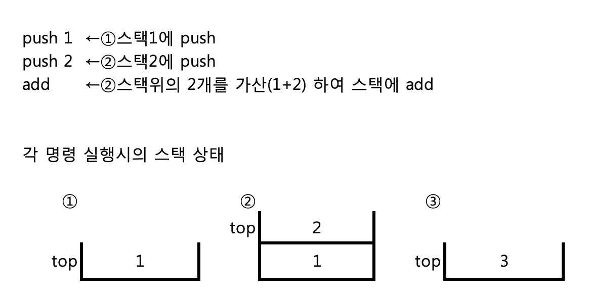
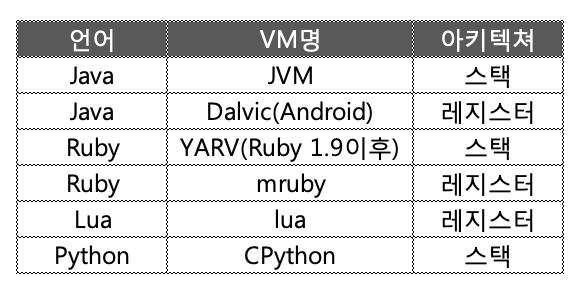

## 1-3 가상 머신

> 이번에는 언어 처리 시스템의 심장부인 가상 머신의 구현에 대해 해설한다. 가상머신을 구현하기 위한 4개의 테크닉을 소개하고 mruby의 가상머신이 가지고 있는 실제 명령을 살펴본다
> 

1-2절에서도 해설한 바와 같이 소스 코드를 컴파일의 결과를 실행하는 것이 ‘런타임’ 이다. 런타임의 구현 방법은 여러 가지가 있고 이번 테마인 ‘가상 머신(Virtual Machine, VM)’도 그 중 하나다.

####소프트적으로 구현한 CPU에서 실행시킨다.

가상 머신이라고 하는 단어는 여러 분야에서 각기 다른 의미로 사용되지만, 여기에서는 ‘소프트웨어로 구현된(실제 하드웨어를 수반하지 않는) 컴퓨터’ 의 의미이다.
이것은 가상화 소프트웨어나 클라우드 등에서 등장 하는 것과는 다르다. 가상화 소프트웨어 등에서는 ‘실제로 존재하는 하드웨어를 어떤 종류의 소프트웨어로 래핑하는 것으로 가상화하여 복수 실행이나 하드웨어간의 이동을 실현하는 기술’ 을 버추얼 머신이라고 한다. Wikipedia에서는 이를  ’시스템 버추얼 머신‘ 이라고 하며, 이번에 설명하는 가상머신을 ‘프로세스 버추얼 머신’으로 분류하고 있다.

Ruby 구현에서는 버전 1.8까지는 (프로세스) 가상 머신을 쓰지 않고, 컴파일러가 생성한 구문트리(포인터로 링크된 구조체에 의해 표현되는 Ruby 프로그램의 문법에 대응한 트리)를 따라가면서 실행했다(그림 1)
이 방법은 매우 단순해서 좋지만, 하나의 명령을 실행할 때마다 포인터를 참조하는 비용을 무시할 수 없었다. ‘Ruby1.8 이전 버전은 느리다’ 라고 불리웠던 있던 원인 중 하나가 바로 이것이다.


```
int
vm(node* node) {
    while(node) {
        switch (node->type) { 
        case NODE_ASSIGN:
            /* 대입의 처리 */ ...
            break;
        case NODE_CALL:
            /* 메소드 호출 처리 */ ...
            break;
        ...
    }
    /* 다음 노드로 이동 */
    node = node->next; /* ← 이 부분이 느린 부분 */
    } 
}
```
<center> 
    (그림 1) 구문 트리 인터프리터(개략)
</center>
   


####구버전의 Ruby가 느렸던 이유

구성은 단순한데 왜 처리 속도는 느릴까에 대한 설명이 필요할 것 같다. 하드 디스크에의 액세스가 메모리의 액세스에 비해 압도적으로 늦은 것은 많은 사람이 알고 있을 것이다. 그러나 메모리 액세스의 속도에 대해서는 얼마나 알고 있는가?  보통 프로그램을 쓰는데 있어서 메모리의 속도를 신경쓰는 일은 거의 없을 것이다. 
그러나 실제로는, CPU와 메모리 사이의 거리는 상당히 ‘멀다’. 지정한 주소에 있는 데이터를 메모리 버스 경유로 도입해 오는 시간은,  CPU의 실행 속도와 비교하면 압도적으로 느리다. 이 메모리 액세스 동안, CPU는 데이터가 도착하는 것을 기다릴 수 밖에 없고, 이 대기 시간은 실행 속도에 영향을 준다.
이러한 대기 시간을 줄이기 위해서, CPU는 ‘메모리 캐시(memory cache)’, 혹은 생략해  ‘캐시’ 라고 하는 구조를 갖추고 있다. 캐시는 CPU의 회로안에 삽입되어 있는 소량의 고속 메모리이다. 사전에 메인 메모리로부터 캐쉬에 데이터를 읽어 넣어 두어 메모리 읽기를 고속 메모리에서 수행하는 것으로 메모리 액세스의 대기 시간을 줄여, 처리를 고속화한다.
CPU 내부에 넣어야 하는 성격상, 캐시의 용량에는 엄격한 제한이 있어, 읽어 둘 수 있는 데이터는 매우 적다[^1].  캐시가 유효하게 작용하기 위해서는,  액세스 하는 메모리 영역이 이미 캐쉬에 읽혀져 있어야 한다. 하지만 미래를 예측하고 미리 프로그램이 읽고 쓰는 영역을 캐쉬에 넣어 두는 것은 상당히 어렵다. 일반적으로, 이것이 가능한 경우는, 메모리 액세스의 국소성(局所性)이 성립할 때다. 즉 프로그램이 한 번에 접속하는 메모리 영역이 충분히 작고, 또한 근접해 있어서 한번 캐쉬에 넣어 둔 영역을 반복하여 읽고 쓰는 경우이다.

여기서, 구문트리를 명령열로 변환하고, 연속한 메모리 영역에 넣어두면, 메모리 액세스의 국소성은 높아져, 캐쉬로 인해 성능이 꽤 향상된다. 이러한 방법으로 성능 향상을 실현한 것이, Ruby 버전 1.9로 도입된 ‘YARV’라고 부르는 가상 머신이다. YARV는 ‘Yet Another Ruby VM’ 의 약어이다. 이것은 개발 당시 Ruby 성능향상을 목적으로 개발된 여러 가상 머신 중 하나였다. 당초에 YARV는 실험적 프로젝트였지만, 수많은 구현 중 실제로 Ruby 언어의 풀 세트를 실행할 수 있었던 것은 YARV뿐이어서 결과적으로 YARV가 이전 Ruby의 실행 시스템을 대체하게 되었다.


####가상머신의 장점과 단점

가상 머신을 채용한 언어로 가장 유명한 것은, 뭐니뭐니 해도 Java다. 그러나 가상 머신이라는 기술은 따로 Java에서 발명된 것은 아니며, 1960년대 후반에는 이미 등장했다고 볼 수 있다. 예를 들면, 1970년대 초에 등장한 Smalltalk는 초기부터 바이트 코드를 채용하고 있는 것으로(일부에서) 유명하다. 더 오래전에는, 후에 Pascal을 설계한 NiklausWirth씨가 Algol68의 확장으로서 설계한 Eular라는 언어로 가상 머신을 구현하고 있었다고 한다. 이 Eular의 가상 머신이, Smalltalk의 버추얼 머신의 힌트가 되었다고 Smalltalk의 아버지, AlanKay씨는 말한다.

Pascal 하면 UCSD Pascal을 이 떠오른다. 캘리포니아대학교 샌디에이고에서 개발된 UCSD Pascal은 Pascal 프로그램을 P-code라는 바이트 코드로 변경 후 실행하는 것이었다. P-code를 거쳐 여러 OS나 CPU의 컴퓨터 이식이 용이해져 Pascal은 이식성이 높은 컴파일러로 널리 사용되었다. 
이것으로부터도 알 수 있듯이, 가상 머신의 메리트는 뭐니뭐니해도 이식성이다. 각각의 CPU에 맞추어 머신어를 생성하는 ‘코드 생성’처리는, 컴파일러 중에서도 가장 복잡한 부분이다. 그것을 차례차례로 등장하는 다양한 CPU에 맞추어 다시 개발하는 것은, 언어 처리 시스템 개발자에게 있어서 상당한 부담이었다. 현재는 x86계나 ARM등이 지배적이고 CPU의 바리에이션은 옛날과 비교해서 크지 않지만, 1960년대, 70년대에는 새로운 아키텍쳐가 차례차례 등장하고 있었다. 같은 회사의 같은 시리즈의 컴퓨터라도, 기종이 다르면 CPU가 완전히 다른 것은 드물지 않은 일이었다. 가상 머신은 이러한 부담경감에 도움이 되었다.
게다가 가상 머신은 타겟이 되는 언어에 맞추어 설계할 수 있다.이 때문에 준비하는 명령 세트가 그 언어의 실현에 필요한 것만큼 한정할 수 있다. 범용 CPU와 비교하면 사양을 콤팩트하게 가져갈 수 있고 그 결과 개발도 쉬워진다.

하지만 장점만 있는 것은 아니다.하드웨어에서 직접 실행하는데 비해 가상적인 CPU를 에뮬레이트해 실행하는 가상 머신은 성능상의 문제를 떠안게 된다. 가상 머신을 채용한 처리 시스템은, 최저 여러배, 경우에 따라서는 수백배의 퍼포먼스 패널티가 발생한다. 하지만, ‘JIT컴파일’ 등의 테크닉을 이용해, 이 패널티를 경감할 수 있다.

####가상 머신의 구현 테크닉


하드웨어로 구현되는 실제의 CPU와 소프트웨어로 구현되는 가상 머신에서는, 성능 특성이 다르다. 여기에서는 가상 머신의 성능 특성에 관련하는 구현 테크닉에 대해 설명한다. 대표적인 것들은 아래와 같다.

(1) RISC vs CISC
(2) 스택과 레지스터
(3) 명령 포멧
(4) 다이렉트 쓰레딩


**(1) RISC vs CISC<sub>원서에는 제목이 없어 따로 넣었음_옮긴이</sub>**

RISC란 Reduced Instruction Set Computer의 약어로 명령의 종류를 줄여 회로를 단순화함으로써 CPU의 성능 향상을 목표로 하는 아키텍처이다. 1980년대에 유행한 아키텍쳐로, 대표적인 CPU로서는 MIPS나 SPARC등이 있다. 모바일 디바이스에 널리 사용되고 있는 ARM 프로세서도 RISC이다.  CISC는 RISC와 대비되어 도입된 용어로, Complex Instruction Set Computer의 약어입니다. 간단히 말하면 ‘RISC가 아닌 CPU’ 이다. 하나 하나의 명령이 실시하는 처리가 꽤 크고 명령의 종류도 많아, 구현도 복잡하게 되어 있다.
그러나, RISC vs CISC의 대립이 있던 것은 20 세기까지였고, 현재 실제의 하드웨어 CPU에서는, RISC와 CISC의 대립이 별로 의미가 없어졌다.  왜냐하면 순수한 RISC의 CPU는 인기가 없어져, 별로 볼 수 없게 되어 버렸기 때문이다. 그래도 SPARC는 아직 남아 있어 수퍼컴퓨터 ‘KEI(京)’ 등에 사용되고 있다.
RISC계 중에서 주도적인 것은 ARM이지만, 이것도 점점 명령이 추가되어 CISC처럼 성장해 왔다. 한편, CISC의 대표격인 것처럼 생각되고 있던 인텔x86 아키텍쳐는, 표면적으로는 과거와의 호환성을 유지한 복잡한 명령 세트를[^2]를 제공하면서, 내부적으로는 그 명령을 RISC적인 내부명령(μop)으로 변환하는 것으로, 실행의 고속성을 실현하고 있다.

#####가상 머신은 CISC가 유리

그러나, 가상 머신에서는 RISC 와 CISC 비교는 다른 의미가 있다. 소프트웨어로 실현되는 가상 머신에서는, 명령을 꺼내 오는 처리(패치라고 한다)의 코스트를 무시할 수 없다. 즉, 같은 처리를 하기 위해서 필요한 명령수는 적으면 적을 수록 좋다. 뛰어난 가상 머신의 명령 세트는, 하나 하나의 명령의 밀도가 높은 CISC 아키텍쳐가 우수하다.
가상머신의 명령은 가능한 한 추상도는 높이면서, 프로그램 사이즈는 작게하는것이 유리하다. 일부 종류의 가상 머신에서는, 빈번히 연속으로 호출되는 여려개의 명령을 하나로 정리한 복합 명령을 준비해, 한층 더 컴팩트화 하는 것을 목표로 하는 것이 있는데, 이러한 테크닉을 ‘명령 융합’ 또는 ‘슈퍼 오퍼레이터’라고 한다.


**(2)스택과 레지스터**

가상 머신 아키텍쳐의 2개의 큰 흐름이 스택 머신과 레지스터 머신이다. 스택 머신은, 데이터의 조작을 원칙적으로 스택 경유를 통해 수행한다(그림 2). 한편 레지스터 머신에서는, 명령안에 레지스터 번호가 포함되어 있어, 원칙적으로 레지스터에 대해서 조작한다(그림 3).
스택 머신과 레지스터 머신을 비교하면, 스택 머신 쪽이 심플하고 프로그램 사이즈가 작아지는 경향이 있다.그러나, 모든 명령이 스택을 경유해 데이터를 주고받는 관계로, 명령간의 순서 의존이 크고, 명령의 정렬을 수반하는 최적화는 어려워진다.




<center>
    (그림 2) 스택 머신과 그 구조
</center>


한편, 레지스터 머신은 레지스터 정보를 명령안에 포함시키기 때문에 프로그램의 사이즈는 커지는 경향이 있다. 뒤에 이야기하겠지만 프로그램 사이즈와 명령 패치 비용은 항상 상관관계가 아니기 때문에 주의할 필요가 있다 .또, 레지스터를 명시적으로 지정하기 때문에 순서의존성이 낮고, 최적화의 여지가 크다. 하지만, 소규모 언어로 고도의 최적화를 하는 예는 별로 없기 때문에, 그다지 중요하지 않을지도 모르겠다.
가상 머신의 아키텍쳐로서 스택 머신과 레지스터 머신의 어느 쪽이 뛰어난가 하는 점에 대해서는 아직도 결론이 나와 있지 않다. 결과적으로,  양쪽 아키텍쳐 모두 골고루 사용되고 있다. 각종 언어 전용 가상 머신이 어떤 방식을 채용하고 있는지를 표1에 나와있다. 




<center>
    (표 1) 각종 가상머신의 아키텍쳐
</center>


**(3)명령 포멧**

Smalltalk이래, 가상 머신이 해석하는 머신어(명령열)를  때로는 ‘바이트 코드’ 라고 부른다. 이것은 Smalltalk의 명령이 바이트 단위였다는 것에서 유래한다. 또, 이 단어는 바이트 단위의 성질을 계승한 Java 에 의해서 널리 퍼졌다.
그러나, 모든 가상 머신이 바이트 단위의 명령 세트를 가지고 있지 않다. 예를 들면, YARV도 mruby도 명령 세트는 32비트 정수로 표현한다. 32비트 정수는 많은 CPU에 있어서 가장 취급하기 쉬운 사이즈의 정수로서 ‘워드’ 라고 부르고 있으므로, 이러한 명령열은  ‘바이트 코드’가 아니고, ‘워드 코드’ 라고 불러야 할 지도 모르겠다. 하지만 워드코드라고 부르기도 어렵고, 그 의미도 바로 와 닿지 않았기 때문에 전혀 보급되지 않았다. 우리도 슬슬 포기하고, 그만 ‘바이트 코드’라고 부르기 시작했다. 

#####워드 코드의 손실과 이득

바이트 코드와 워드코드에도 각각 장점과 단점이 있다. 하나의 명령 당 32 비트를 소비하는 워드 코드 보다, 바이트 코드 쪽이 프로그램 사이즈가 컴팩트 하다. 한편, 바이트 코드는 1 바이트= 8 비트 로 2<sup>8</sup>=256 상태 밖에 표현할 수 없기 때문에, 오퍼랜드(명령의 인수)는 명령 이외에 별도의 바이트에 할당 할 수 밖에 없다. 이 때문에 명령열에서 데이터를 꺼내오는 패치회수가 증가하게 된다.  이미 말했듯이 소프트웨어로 실현되는 가상 머신에서는 이 명령 패치 비용이 크기 때문에 성능적으로는 워드 코드가 약간 유리하다.
그리고 워드 코드는 ‘얼라이먼트’ 의 점에서도 유리하다.어떤 종류의 CPU에서는, 주소가 특정의 수의 배수가 되지 않은 주소로 엑서스를 하게 되면 에러가 발생한다. 그 경우는 얼라인먼트(주소가 특정 수의 배수로 갖추어진 상태)되어 있는 주소로부터 데이터를 꺼내, 어긋나는 부분을 잘라낼 필요가 있다.  에러 발생 여부를 떠나 배수로 된 주소와 그렇지 않은 주소로의 액세스 속도가 꽤 다른 CPU들은 적지 않다.

　주소를 2의 배수로 할당하는 것을 16비트 얼라인먼트, 4의 배수로 할당하는 것을 32비트 얼라인먼트라고 부른다. 워드코드는 모든 명령이 얼라인먼트에 맞지만, 바이트 코드에서는 그렇지는 않다.  CPU의 종류나 주소의 상태에 따라서는 바이트 코드 쪽이 하나의 명령 패치 당 처리 비용이 높아지게 된다.
　정리하면 바이트 코드가 명령열의 길이가 짧아지는 경향이 있어 메모리 소비에는 양적으로는 유리하지만, 성능면에서는 명령 패치의 횟수가 증가해 하나의 패치당 소요시간적으로는 워드코드가 유리하다고 할 수 있다.

#####mruby의 명령을 살펴보자

그럼 가상 머신의 명령의 실제 예를 살펴 보자. 셈플로 사용할 mruby의 명령은 그림 4와 같이 된다. 
mruby의 명령은 끝부분 7비트에 따라 명령의 종류가 결정된다. 이 7비트라는게 최대 128종류(2<sup>7</sup> = 128)의 명령이 가능하다는 얘기이다. 실제로는 예비로 남겨놓은 5개를 포함해 81종류의 명령이 셋팅되어 있다. 
명령이 32비트폭에 명령종류가 7비트인 이유는 나머지 25비트는 오퍼랜드에 사용되기 때문이다. mruby의 명령은 이 오퍼렌드의 사용법(나누는법)에 따라 4개의 타입이 있다.  


  

<center>
    (그림 4) mruby의 명령 구조
</center>


#####타입1: 오퍼랜드 3개

타입 1은 A, B, C 3개의 오퍼랜드를 가지고 있다. 이 때 A는 9비트, B도 9비트, C는 7비트를 사용하게 된다. 결국 오퍼랜드 A와 B의 최대치는 511이 되며 오퍼랜드 C의 최대치는 127이 된다. 오퍼랜드 A와 B는 레지스터를 지정하는 용도로 많이 사용된다. 예를들어 레지스터 사이의 이동명령 ‘OP_MOVE’가 이 타입이다. 

```
OP_MOVE A B
```

와 같은 형태의 명령이다. 이것은 오퍼랜드 B로 지정된 레지스터의 내용을 오퍼랜드 A로 지정된 레지스터로 복사하는 일을 한다. OP_MOVE명령에서 오퍼랜드 C는 사용되지 않는다. 
오퍼랜드 C를 사용하는 명령으로는 메소드 호출을 하는 OP_SEND가 있다. 

```
OP_SEND A B C
```

이는 오퍼랜드 A로 지정된 레지스터(레지스터A라 부른다)에 할당된 오브젝트를 오퍼랜드B로 지정된 심볼[^3] (정확히는 심볼테이블의 B번째 심볼)로 지정된 메소드를 호출한다. A+1번째의 레지스터로부터 오퍼랜드C에 지정된 값 까지가 메소드 인수가 된다. 매소드 호출의 반환값은 레지스터 A로 할당된다. 


앞에서 설명한 OP_MOVE와 같이 타입 1에서는 사용하지 않는 오퍼랜드가 있을 수 있다. 미 사용분이 발생은 하지만 억세스의 간편함과 효율 때문에 이는 허용하고 있다. 

#####타입2 : 오퍼랜드 2개

명령 타입2는 오퍼랜드 B, C대신에 하나의 (16비트) 오퍼랜드를 사용한다. 여기에는Unsinged(Bx)오퍼랜드와 Signed(sBx)오퍼랜드 2가지 종류가 있어, 명령별로 사용법이 나뉘어 있다. Bx를 사용하는 예로 OP_GETIV등이 있다. 이는

```
OP_GETIV A Bx
```

의 형식으로 심볼 테이블의 Bx번째 심볼을 지정하는 self 인스턴스 변수의 값을 레지스터 A에 할당한다. 

sBx 를 지정하는 명령은 점프 명령이 있다. 예를 들어

```
OP_JMP sBx
```
는 다음에 실행될 명령 주소를 현재 주소로부터 sBx 만큼 떨어진 위치로 이동시킨다. sBx는 Unsigned 오퍼랜드 이기 때문에, 앞 뒤 모두 점프가 가능하다. OP_JMP명령은 오퍼랜드 A를 사용하지 않는다. 한편 조건부 점프의 예는

```
OP_JMPIF A sBx
```

로 A가 참이라면 sBx만큼 이동시킨다. 


#####타입3: 오퍼랜드 1개

타입3은 오퍼랜드 부분을 전부 1개로 합쳐 25비트 오퍼랜드(Ax)로 취급하고 있다. 타입3의 명령은 OP_ENTER 하나뿐이다. 

```
OP_ENTER Ax
```

OP_ENTER는 Ax에 지정된 비트 패턴을 보고 메소드의 인수 체크를 한다. OP_ENTER는 25비트중 23비트를 5/5/1/5/5/1/1로 분할하여 인수지정과 해석을 한다. 각 비트의 의미는 표 2에 정리되어 있다. 


<center>
    (표 2)OP_ENTER의 인수지정. Ax오퍼랜드 25비트를 앞에서부터 분할한다
</center>


#####타입4 : 타입 1의 변형

마지막으로 타입4이다. BC오퍼랜드(16비트)를 14비트 Bz오퍼랜드와 2비트의 Cz오퍼랜드로 나눈 것이다. 타입4의 명령은 OP_LAMBDA뿐이다. 
mruby에서는 명령에서 오퍼랜드를 추출하는 매크로가 있어, 이를 사용함으로써 명령(워드)로부터 오퍼랜드를 얻을 수 있다. 이들 매크로에서는 명령형 체크등은 하지 않기 때문에 매크로 적용애 대해서는 개발자가 책임을 진다. 오퍼랜드를 추출하는 매크로는 표3과 같다.


<center>
(표 3) mruby 명령 오퍼랜드의 추출 매크로
</center>


#####인터프리터 루프

이제 이런 구성으로 소스 프로그램을 가상머신의 명령열로 변환 가능하다면, 가상 머신 자체의 기본적인 구현은 의외로 간단하다. 

가상 머신의 중심부분, 다시 말해 인터프리트 루프는 유사 코드로 표현하면 그림 5와 같이 된다. 

```
typedef uint32_t code;

int
vm_loop(code *pc)
{
    code i;

    for (;;) {
        switch (GET_OPCODE((i = *pc))) {
        case OP_MOVE:
            stack[GETARG_A(i)] = stack[GETARG_B(i)];
            break
        case OP_SEND:
            ...
            break;
            ...
        }
    }
}
```

<center>
(그림 5) 가상 머신의 기본 구조(switch문 이용)
</center>


너무 심플하여 놀랐는가? 명령이 늘어나도, (그림 5)의 switch문의 case가 추가될 뿐이다. 

하지만 기본 적인 구조가 심플해도 실제 언어 구현을 위해서는 고려해야 할 것들이 여러가지가 있다. 여기에서는 생략한 실행시 스택을 어떻게 구현할지, 메소드 호출의 구조와 예외처리등은 어떻게 할 지 등이다. 원리와 실천 사이에 커다란 강이 있는 것이다.

**(4)다이렉트 쓰레딩**

많은 경우, 가상 머신은 속도를 우선시하기 때문에 인터프리터 루프의 효율을 끌어올리려 한다. 

가상 머신의 인터프리터 루프의 효율화 테크닉으로 유명한것이 바로 GCC(GNU Complier Collection)의 확장기능을 사용한 다이렉트 쓰레딩 기술이다. 

GCC에서는 라벨의 주소를 취득하면 그 주소로의 점프가 가능하다. 라벨의 주소는 ‘&&라벨명’ 으로 얻을 수 있다. 라벨로의 점프는 ‘goto *주소’ 이다. 이 기능을 사용하면 switch문 대신에 점프를 사용해 가상 머신을 구축할 수 있다. 

다이렉트 쓰레딩을 이용한 인터프리터 루프의 구현 개요는 (그림 6)을 참조하길 바란다.

```
typedef uint32_t code;
#define NEXT i=*++pc; goto *optable[GET_OPCODE(i)]
#define JUMP i=*pc; goto *optable[GET_OPCODE(i)]
int
vm_loop(code *pc)
{
    code i;
    /* 명령번호 순으로 정렬한 라벨 주소 */
    static void *optable[] = {
        &&L_OP_MOVE, &&L_OP_SEND, ...
    };
    JUMP;
L_OP_MOVE:
    stack[GETARG_A(i)] = stack[GETARG_B(i)];
    NEXT;
L_OP_SEND:
    ...
    NEXT;
    ...
}
```

<center>
    (그림 6) 다이렉트 쓰레딩을 사용한 예
</center>


실제로는 mruby를 포함, 다이렉트쓰레딩을 채용한 대부분의 가상머신에서는 컴파일 옵션으로 switch문 또는 다이렉트쓰레딩을 선택할 수 있게 되어 있다. 라벨 주소 획득은 어디까지나 GCC의 확장기능이므로, 항상 사용할 수 있다고 할 수 없기 때문이다. 대체매크로를 사용한 루프는 (그림 7)과 같이 된다. 

```
typedef uint32_t code;

/* GCC확장에 있는 컴퍼일러만 대응*/
#if defined __GNUC__ || defined __clang__ || defined __INTEL_COMPILER
#define DIRECT_THREADED
#endif

#ifdef DIRECT_THREADED

#define INIT_DISPATCH JUMP;
#define CASE(op) L_ ## op:
#define NEXT i=*++pc; goto *optable[GET_OPCODE(i)]
#define JUMP i=*pc; goto *optable[GET_OPCODE(i)]
#define END_DISPATCH

#else

#define INIT_DISPATCH for (;;) { i = *pc; switch (GET_OPCODE(i)) {
#define CASE(op) case op:
#define NEXT pc++; break
#define JUMP break
#define END_DISPATCH }}

#endif

int
vm_loop(code *pc)
{
    code i;
#ifdef DIRECT_THREADED
    static void *optable[] = {
        &&L_OP_MOVE, &&L_OP_SEND, ...
    };
#endif

    INIT_DISPATCH {
        CASE(OP_MOVE) {
            stack[GETARG_A(i)] = stack[GETARG_B(i)];
        }
        NEXT;
        CASE(OP_SEND) {
            ...
        }
        NEXT;
        ...
        }
        END_DISPATCH;
    }
```
<center>(그림 7) 대체매크로를 사용한 경우</center>


이 테크닉을 사용하면, GCC확장기능이 없는 컴파일러에서도, switch문으로도 나름대로 속도를 낼 수 있다. GCC확장 기능이 있는 컴파일러라면, 다이렉트쓰레딩 테크닉을 사용하여, 보다 고속의 가상 머신을 실현할 수 있다. 


#### 마치며

이번엔 런타임의 심장부인 가상 머신의 구현에 대해 이야기 했다. 이것으로 언어처리 시스템의 기본 부분은 어느정도 설명이 되었다고 생각한다. 다음달부터는 언어 디자인의 중심에 대한 해설을 진행하도록 하겠다 

<hr>

### 타임머신 칼럼

***Streem[^4]에도 VM을 채용하고 싶지만...***

> 2014년도 6월호에 게재한 내용이다. 앞의 yacc의 해설에 이어서 VM의 구현과 해설을 하고 있다. VM의 예제로 mruby를 사용하고 있는데, 이것은 그렇게 심플한 예가 아니다. 그리고 무엇보다 최대의 이유는 그 다음에 구현할 예정인 언어의 VM으로써 mruby를 개조하려고 하기 때문이다. <br>
> 실제 Streem의 구현은 구문트리를 직접 추적하는 심플한 인터프리터를 채용하고 있어, 여기서의 해설은 Streem과는 크게 관계는 없지만, VM의 구현 해설 자체가 가치가 있지 않을 까 한다.  만든이의 마음같아서는 Streem의 심플한 인터프리터를 여기에서 설명한 VM 같은 것으로 바꿔버리고 싶지만, 역시 최대의 난관은 이 작업을 하기 위한 시간을 확보하는게 쉽지 않다는 것이다. 시간관리는 이번 뿐 아니라 항상 모든 일의 장벽이지만... 


[^1]:  현대 CPU들은 캐시를 다단으로 겹쳐서 용량을 늘리고 있다. 그러나 아직 메인 메모리에 비해서 용량이 매우 작고 앞에서 기술한  어려움이 해결된 건 아니다. 
[^2]:  얼마 전 x86의 move명령은 너무 복잡해서 그것만으로 Turing 완전성을 실현할 수 있다는 발표가 있었다.즉, 원래의 move 명령만으로 임의의 알고리즘을 기술할 수 있다고 한다.
[^3]: 심볼 : 언어처리 시스템이 내부에 메소드명등의 식별을 위해 사용하는 값으로 임의의 문자열로 항상 다른 값이 할당된다
[^4]:  저자인 마츠모토 유키히로가 별도로 제작한 스트림 기반 형태의 언어. 이 책의 2장부터 소개가 시작된다. 

