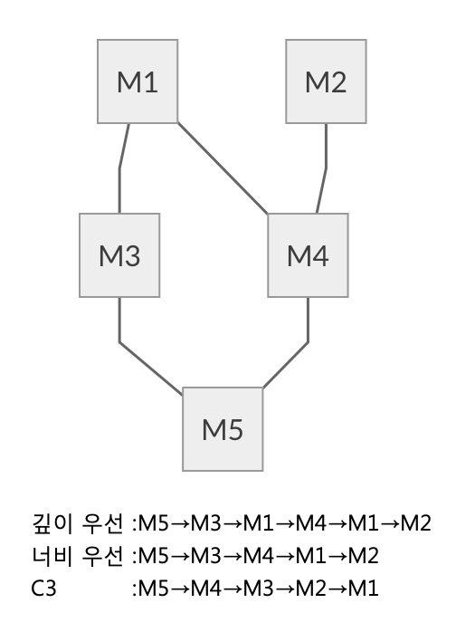

## 1-5 언어 디자인 입문(후편)

> 1-4절에서 ‘Ruby의 탄생’ 에 대하여 이야기하였다. 이번에는 이어서, Ruby언어디자인시 고려했던 것들에 대하여 이야기하겠다. 변수명을 붙이는 방법, 상속의 방법, 에러처리, 이터레이터 등등을 어떻게 정했는지 소개하고, 이로부터 설계 방법을 정리하려 한다.

1-4절에서 기본적인 문법구조는 결정된 언어로서의 첫걸음을 내딘 Ruby가 탄생했지만 이정도는 어디에나 존재하는 평범한 언어다.이제부터 세부적으로 문법이 빠진 부분을 채워야 한다.

####설계 정책

이 시점에서 내가 Ruby를 어떤 언어로 만들고 싶었는지 말해보면 ‘객체지향언어’ 라는 기능적인 면 이외에 아래와 같은 이미지가 있었다.

* 간이언어 레벨에서 벗어나기
* 쓰기 쉽고 읽기 쉽게
* 간결

‘간이언어 레벨에서 벗어나기’ 란 언어 사양에 부실함이 없다는 의미이다. 당시, 특히 스크립트 언어의 분야에서는, 업무 목적만 달성하는, 언어 사양에는 손을 뗀(것으로 보이는) 언어가 주류였다. 예를 들면, 특별히 필요도 없는데 구현의 편의성 때문에 변수명에 기호가 붙어 있거나, 사용자 정의 함수와 삽입 함수의 호출 방식이 다르거나 하는 것이다.

‘쓰기 쉽고, 읽기 쉽다’ 라고 하는 것은 추상적인 의미이지만, 프로그램이라고 하는 것은 한 번 쓰고 끝이 아니다. 디버깅 등의 과정에서 몇 번이고 읽고,다시 쓰는 것이다. 같은 일을 하는데 프로그램의 규모가 작은 쪽이 무엇을 하는지 이해하기 쉽기 때문에, 간결하게 기술할 수 있는 것이 바람직하지만, 너무 간결하게 하는 것도 곤란하다.
세상에는 비정상적으로 간결하지만, 나중에 보면 무엇을 하고 있는지 파악이 안되는 언어도 존재한다.그러한 언어는 종종 ‘Write Once Language’ 라고 불린다.
이런 언어는 나중에 프로그램을 해독하는 것보다, 다시 한번 처음부터 쓰는 것이 빠른 언어다. 적절한 ‘쓰기 쉽고, 읽기 쉬움’은 결국 밸런스에 의해서 달성되는 것이다. 디자인이란 원래 그렇지만 말이다.

또, 나 혼자만은 아니라고 생각하지만, 프로그램을 쓰고 있고, 하고 싶은 것의 본질과 관계가 없는 것을 기술하도록 강제될 때, 조금은 화가 난다. 개발중에는 그 소프트웨어가 무엇을 실시해야 하는 것인가라는 본질에 집중하게 하고 싶다는 생각이었다. 가독성을 희생하지 않는 범위에서, 가능한 한 본질 이외의 부분을 잘라낸 간결한 기술이 바람직하다고 생각했다.

####변수명

Ruby의 개발 초기에 참고했던 언어중 하나가 Perl이었다. Perl에서는 변수명의 앞에 기호를 붙인다. 그 의미는 (표 1)과 같이 된다.


<center>
    (표 1) Perl의 변수명 규칙
</center>


흥미로운 것은 배열 억세스이다. 배열(@foo)의 0번째의 요소를 추출하는데 기호로 $를 앞에 붙인다. 해쉬도 같은 형태다. 이는 결국, 앞의 기호는 그 변수(또는 식)의 형태를 보여준다. Perl은 변수명에 의해 그 형태를 명시하는 정적형태의 언어였다.

한참 뒤에 레퍼런스라는 것이 도입되어, 배열이나 해시를 포함해 모든 것이 스칼라로서 표현할 수 있게 된다. 이로 인해, 이 정적형의 원칙은 별로 중요하지 않게 되어버린다. 하지만 변수명을 봤을 때에 제일 알고 싶은 것은, 그 형태가 아니고 범위 이다. 몇 개의 언어(예를 들면 C++)의 코딩 룰에서는, 전역 변수나 멤버 변수에 특정의 프리픽스를 붙이는 것이 있다. 한편, 이전에 Microsoft사에서 많이 사용되었던 헝가리안 기법과 같이 타입정보를 변수명에 포함시키는 코딩룰은, 최근에는 완전히 볼 수 없게 되었다. 타입정보는 명시할 필요가 없다는 것의 증명이다. 
그래서 Ruby에서는 변수명에 범위를 나타내는 기호를 붙이게 되었다(표 2). 예를 들어 $는 전역변수, @는 인스턴스 변수를 나타낸다. 하지만 가장 많이 사용되는 로컬 변수와 정수(클래스 명 등)까지 기호를 붙인다면 Perl의 전철을 밟는 셈이 되어 버린다.


<center>
    (표 2) Ruby의 변수명 규칙
</center>


####로컬 변수 등은 간결하게

생각한 끝에, 로컬 변수는 알파벳 소문자를, 정수는 알파벳 대문자로 시작한다는 룰로 정했다. 이렇게 하면 추한 기호를 보는 일은 적어도 없을 것이라 생각했다. 또한 전역 변수를 많이 사용하면 프로그램 전체에 그다지 아름답지 않은 $기호가 여기저기 뿌려져 있을 것이기 때문에, 자연스럽게 보다 좋은 스타일 템플릿을 만드는 일도 해야 할 것 같았다. 

변수명에 범위정보를 포함시키는 것의 장점은 그 변수의 역할에 관한 정보가 콤팩트하게 보여지기 때문에,  일일이 선언부를 찾을 필요가 없다는 점이다. 변수 선언이라는 것은 컴파일러에게 그 변수의 범위나 형태 등의 정보를 가르치기 위해서 있는 것인데,  이것들은 처리의 본질과는 무관하다.  가능하면 이런 부분들은 채용하고 싶지 않았고, 프로그램의 가독성을 위해 선언을 별도로 두고 싶지 않다는 이유로 이렇게 만들었다. 같은 이유로 Ruby에는 변수 선언 자체가 없다. 변수는 최초로 대입된 시점에서 탄생하므로,  대입이 바로 선언이 된다. 만약을 위해 보충해 두겠지만  선언, 특히 타입선언이 가지는 장점을 부정하는 것은 아니다. 실제로 실행하지 않아도 컴파일시에 타입의 불일치로부터 많은 에러를 검출할 수 있는 정적 타입은 훌륭하다고 생각한다. 그러나, 그것과 동시에 처리의 본질에 집중하고 싶어,타입 선언등을 쓰고 싶지 않다고 하는 생각이 강했고, 당시 취향이 동적형으로 기울고 있는 것도 있었다.

####스크립트에 객체지향을..

Ruby를 설계할 때 처음부터 생각했던 또 하나는 이 언어를 ‘제대로’ 객체 지향 언어로 만들고 싶었다는 것이다. 
당시의 객체 지향 언어라고 하면, Smalltalk나 C++로, 대학의 연구실 등에서는 Lisp계의 객체 지향 언어도 사용되고 있었다. Eiffel도 해외의 금융계등에서는 사용되고 있다고 이야기를 들었지만, 실제의 처리시스템은 상용 밖에 없었고 일본에서의 입수 및 활용은 어려웠다.
이런 상황때문에, 객체 지향 프로그래밍이 그렇게 몸에 베지 않았었다. 일상적인 프로그래밍, 특히 스크립팅의 텍스트 처리와 같은 규모가 작은,  복잡함도 그다지 높지 않는 장르에서는 필요없다고 생각되었던 것 같다. 
그 결과, 당시의 스크립트 언어에서는, 객체 지향 기능을 처음부터 갖추고 있던 것은 없었다.  비록 어떤 객체 지향 프로그래밍 지원 기능을 가지고 있었다고 해도,  부수적인 지원에 그친 것들이었다.

그러나, 고등학생 때부터 Smalltalk관련 몇 안 되는 자료를 읽고, 객체 지향 프로그래밍에 대해 ‘이것은 이상적인 프로그래밍이다’ 라고 느끼고 있던 나였다. 스크립팅 분야에서도 오브젝트 지향은 반드시 유효하다고 믿고 있었다. 스스로 언어를 설계한다면 처음부터 오브젝트 지향점에 따라 디자인하고 싶다고 느끼는 것은 지극히 당연한 일이었다. 

####단일 상속 VS 다중 상속

거기서 고민한 것이 상속기능의 설계였다. 이미 알고 있을 지도 모르겠지만, 객체 지향 프로그래밍을 지원하는 언어기능 중, 상속에는 단일상속과 다중상속이 있다. 기존의 클래스의 기능을 상속하고, 거기에 새로운 기능을 덧붙여 새로운 클래스를 만드는 상속 기능에서, 기초가 되는 기존의 클래스(슈퍼 클래스라고 부른다)를 하나로 한정하는 것을 단일 상속, 복수 허용하는 것을 다중 상속 이라고 부른다.

<center>


<center>
    (그림 1) 단일상속(왼쪽)와 다중상속(오른쪽)
</center>


단일 상속은 다중 상속의 서브셋이기 때문에, 다중 상속이 있으면 단일 상속은 자연히 구현된다. 다중 상속은 Lisp계통의 객체 지향 언어로 발달해, C++에도(나중에서) 도입되었다. 1993년당시는 어땠을까?[^1]

한편, 다중 상속에는 단일 상속에는 없는 문제가 있다.  단일상속의 경우, 클래스간의 상속관계는 선형관계가 되며, 클래스계층 전체는 트리 구조가 된다(그림 1). 한편, 다중 상속으로 복수의 슈퍼 클래스의 존재를 허락하면, 클래스 관계는 네트워크 모양으로 되어, DAG(Directed Acyclic Graph, 유향비재귀(有向非再歸) 그래프)라고 부르는 구조가 된다. 다중 상속에서는, 계승한 슈퍼 클래스가 한 레벨 더 복수의 슈퍼 클래스를 가지고 있는 경우도 있다. 조심하지 않으면 클래스의 관계는 곧바로 복잡하게 꼬여 버린다.

단순상속에서는 클래스의 관계가 선형적 관계이기 때문에 상속의 우선순위에 대하여 신경을 쓸 필요는 없다. 메소드를 찾을 경우 단순이 하위(서브클래스)로부터 상위(슈퍼 클래스) 방향으로 탐색을 하면 끝나버린다. 

하지만 다중상속에서 클래스 구성이 DAG가 되어 버리는 경우에는, 탐색 순서는 하나의 방법으로만 정해지지 않는다(그림 2).
깊이 우선탐색도 있고 너비 우선탐색도 있다.많은 다중 상속을 제공하는 언어에서는 C3 탐색을 선택한 것 같다.(CLOS, 파이썬 등)

<center>



<center>
    (그림 2)DAG의 검색 순서
</center>


그러나, 어떤 탐색 방법을 선택했다고 해도, 한 눈에 파악이 어려운 케이스가 존재한다.그럼 심플한 단일 상속은 문제는 없는 걸까. 앞에서 말한 것처럼 단일 상속에서의 클래스의 관계는 심플하고 매우 이해하기 쉬워지지만 단일 상속에도 문제가 없는 건 아니다.


####단일 상속의 문제

단일 상속의 문제란, 상속의 라인을 넘어 메소드등의 클래스 속성을 공유하는 방법이 없는 것이다. 공통의 슈퍼 클래스가 존재하지 않는 경우 속성을 공유할 수 없고 복사할 수 밖에 없다. DRY 원칙[^2]에 의하면 코드의 카피를 하는 것은 권장되지 않고 있다.

실례를 보도록 하자. Smalltalk에는 입출력을 관장하는 Stream 클래스가 있어, 여기에는 읽기를 하는 ReadStream과, 쓰기를 하는 WriteStream이라는 두 개의 서브 클래스가 있다. 그리고, 읽고 쓰는 것 모두 가능한 서브 클래스 ReadWrite Stream 이라는 클래스도 존재하고 있다.다중 상속을 할 수 있는 언어라면, ReadWriteStream을 ReadStream과 WriteStream 양쪽에서 상속받은 것이다(그림 3(a)).다중 상속에 있어서 이상적이라고 할 수 있는 케이스다. 그러나, Smalltalk에는 다중 상속이 없기 때문에, ReadWriteStream을 WriteStream의 서브 클래스라고 해, ReadStream의 코드를 카피하고 있다(그림 3(b)). 만일 ReadStream에 사양 변경이 있었을 경우, 카피된 ReadWriteStream도 똑같이 변경하지 않으면 안된다. 그렇지 않으면, 버그의 원인이 된다. 그리고 무엇보다 폼이 안난다. 


<center>
    (그림 3) DAG의 검색 순서
</center>


####Mix-in

이 문제를 해결하는 힌트가 Mix-in 이다. Mix-in은 Lisp 계 오브젝트 지향 언어 Flavors 에서 탄생한 기술이다.  Flavors에서는 다중상속의 문제를 경감하기 위해서, 두 번째 이후의 슈퍼클래스에 아래와 같은 제약을 부과하고 있다.

이 규칙에 따르면, 다중 상속의 구조는, 첫번째의 슈퍼 클래스에 의한 트리구조에, 두번째 이후의 슈퍼 클래스에 의한 가지가 뻗어가는 구조가 된다. 이에 따라 (그림 3)과 같은 구성을 만들어 보면 (그림 4)와 같이 된다.스트레이트로 다중상속을 이용한 것과 비교하면 상당히 구성은 다르지만, 단일상속의 심플함을 유지한 채, 코드의 사본을 배제하고 있는 것을 알 수 있다.

<center>


<center>
    (그림 4) Mix-in
</center>


####Ruby의 모듈

이와 같이 Mix-in은 뛰어난 아이디어지만, 어디까지나 다중 상속의 사용법의 테크닉이며, 강제력은 없다.그래서, 언어 사양으로서 Mix-in의 사용을 강제하면 어떨까 생각했다. 즉, 2종류의 클래스를 준비하고, 하나는 주된 상속을 하는 통상의 클래스, 다른 하나는 Mix-in으로서만 사용할 수 있는 특별한 클래스로 지정하는 것이다. 그리고 그 특별한 클래스는, Mix-in의 룰에 따라서, 인스턴스를 만드는 것과 통상의 클래스로부터 상속하는 것을 금지한다. 이러한 발상으로 탄생한 것이 Ruby 모듈이다. 이 모듈로 정의되는 부분은, 앞에서 언급한 Mix-in의 성질을 가지고 있다.(그림 4의 Readable와 Writable이 거기에 해당한다). 이것에 의해서 다중 상속의 결점을 회피하면서, 어느 정도 복잡함을 피할 수 있게 되었다. 이러한 시스템은 다른 언어(예를 들면 구 SunMicrosystems사에서 연구되고 있던 Self)에서도 trait이나 mixin이라는 이름으로 제공되고 있었다. 이것들은 Ruby와 거의 같은 시기에, 각각 독자적으로 만들어진 것 같다.


####에러 처리

소프트웨어를 개발하고 있는데 가장 귀찮은 것은 에러 처리다. 열려던 파일이 존재하지 않는다던지,  네트워크 접속이 끊어졌다던지, 메모리가 부족하게 되었던지 등,  소프트웨어가 기대 대로 동작하지 않는 ‘예외적 상황’ 은 얼마든지 있다. C와 같은 언어에서는 예외적 상황이 발생하는 함수 호출의 후에는 그 함수 실행이 정상적으로 종료되었는지 체크할 필요가 있다(그림 5). (그림 5)를 보면, 불과 1행으로 표현할 수 있는 ‘파일 오픈하려 한다’ 에 대해서, 복잡한 에러 처리를 하는 것을 볼 수 있다. 이것은 간결하게 의도대로 표현한다고 하는 Ruby의 설계 정책에 반하는 것이다. Ruby에서는 이 점에 대해서 어떻게든 손을 대야 겠다고 생각했다.


```
FILE *f = fopen(path, “r“);
if (f == NULL) { //open이 정상적으로 종료되지 못한 경우
    switch (errno) { // 에러의 상세 정보는 변수 errno에 들어있다
        case ENOENT: // 파일이 존재하지 않는다
            ...  
            break; 
        case EACCES:  // 접근 권한 에러 
            ...
            break; 
        ...
    } 
}
```

<center>
    (그림 5) C의 에러 처리
</center>


처음에 검토한 것은 Icon이라는 언어의 에러처리 기구였다. 미 텍사스 대학에서 개발된 Icon이라고 하는 언어는, 모든 함수 호출은 성공(값를 되돌려준다)이나 실패의 어느 하나의 결과를 가진다.실패한 함수 호출은 호출한 함수의 실행도 실패시킨다.이 점은 C++나 Java등에서도 볼 수 있는 예외 처리 기구와 닮아있다.  Icon에 특징적인 것은, 이 언어에서는 이 실패가 참/거짓 값으로도 다루어진다는 점이다 즉,

```
line := read()
```

는 어떤 이유때문에 실패한 경우에는 이를 호출한 함수를 실패시키고, 실행을 중단시킨다. 그래서 

```
if line := read() then
    write(line)
```

라고 한다면 read()가 성공했을 때에는 write()로 출력을 하고 실패한 경우는 아무것도 하지 않는 구조이다. 더욱이

```
while write(read())
```

라고 한다면 read()가 성공하는 동안은 반복하여 되돌려 주는 값을 write()하고, read() 또는 write()함수가 실패하면, 반복은 중지한다는 의미이다 .


이 구조는 특별한 구문을 도입하지 않아도 예외 처리를 자연스럽게 기술할 수 있다는 점에서 매력적이었다. 그러나 반대로 예외 처리가 눈에 띄지 않게 되어 버리는 것은 아닌가 하는 점, 너무 보통의 언어로부터 멀어져 버리면 사용자 친화적이지 못하는 것이 아닌가 하는 점,  실행 효율에 대한 불안 등 때문에 Ruby에서는 채용하지 않았다. 만일 이를 채용했다면,  Ruby는 지금과 많이 다른 모습의 언어가 되었을지도 모르겠다. 

인기있는 언어를 디자인하려고 할 때, 다른 언어와 크게 다른 설계를 채용하려고 하면 그 설계가 언어의 핵심이 될지 여부를 생각할 필요가 있다. 그 부분에 대하여 양보할 생각이 없다면 전혀 문제는 없다.  그러나 그다지 구애받지 않고 ‘이상한 문법’을 채용하면 나중에 화근이 될 수 있다.


####예외 예약어에의 집착

그런데, Icon류의 예외 처리는 포기했지만, Ruby에는 그래도 예외 처리는 갖고 싶었다. 그래서, C++등에 볼 수 있는(당시 Java는 아직 세상에 나오지 않았다) ‘보통’ 의 예외 처리 기구를 채용하기로 했다. 그런데, 당시 나는 예약어에 조금 집착이 있었다. 


C++의 예외처리기구에서는, try ~ catch구문을 사용하지만, 나는 이 예약어를 그렇게 좋아하지 않았다. ‘try’ 라고 하는것은 ‘성공하는지 시험해본다’ 라는 뉘앙스가 있지만, 여러가지 메소드의 호출이 예외를 발생시키는 가능성이 있는 이상, ‘시험해 본다’ 라고 하는 것은 적절하지 않다고 생각했었다. 또한 ‘catch’도 별로 예외처리의 이미지가 없는 것 같다 .


거기서, 구문 블록 때에도 참고가 된 Eiffel로부터 rescue라는 단어를 빌려 왔다.위기 상황에 빠졌을 때 구출한다는 이미지는 예외 처리에 딱 맞다고 생각했었다. 그리고 예외가 발생하거나 하지 않더라도 확실히 뒷처리를 위한 구문 (일부 언어로는 finally라는 이름으로 지정한다)의 예약어도 Eiffel에서 ensure라는 것을 빌려왔다. 원래 Eiffel의 ensure는 예외처리 때문이 아니라, DBC(Design by Contract)에서 사용되는 메소드 실행 후에 성립되어야 할 사후조건을 위해 사용되고 있던 예약어였다. 

####블록

마지막으로 이야기 할 것은 Ruby의 최대 특징으로 자주 언급되는 ‘블록(block)’ 이다.  원래 블록은 처음부터 그렇게 중시되는 기능은 아니었는데 언어 설계자로서 의외의 방향으로 흘러가고 있다. 
MIT에서 개발된 CLU라고 하는 언어가 있다. CLU를 한마디로 설명하면, 객체 지향 언어의 전 단계 라고나 할 추상 데이터형 언어라고나 부를 수 있을 것이다. 
CLU에는 수 개의 눈에 띄는 특징이 있지만, 그 중 하나가 이터레이터다. 이터레이터는 ‘루프의 추상화를 수행하는 함수’ 이다. 
이터레이터는 예를 들어 아래와 같이 호출한다. 

```
for i:int in times(100) do
...
end
```

이것은 times라고 하는 이름의 이터리에터 함수를 호출하고 있다. 이터레이터 함수는, for문 안에서만 호출되는 특수한 함수이다. 이 times함수의 정의를 CLU로 기술하면 (그림 6)과 같이 된다. 

```
times=iter(last:int) yields(int)
    n:int := 0
    while n < last
        yield(n)
        n := n + 1
    end
end times
```

<center>
  (그림 6) CLU로 times함수의 구현
</center>


같은 형태를 C에서 구현하려고 하면 ‘for문을 사용’ 할까 ‘함수 포인터를 사용’ 할까 의 선택지가 있을 것이다. for문을 사용하면, 루프변수와 내부구조에의 접근 등의 은폐가 불가능하다. 함수 포인터를 사용한다면 은폐는 가능하지만 (C에서는 클로져가 없기 때문에), 변수 등의 전달을 해야하는 귀찮음이 있다. 
CLU의 이터레이터에는 이와 같은 문제가 없기 때문에, 루프의 추상화로서 아주 원하는 성질을 가지고 있다. 


####구문으로 시행 착오

그래서, 이를 Ruby에 도입하려고 하였다. 그런데 한동안 생각해 보니, 이를 이대로 도입하는게 좋을까 하는 의문이 들었다. CLU의 이터레이터는 확실이 루프의 추상화는 잘 해 준다. 하지만, 이 구조는 루프를 넘어서 이용가능할까? CLU의 구문에는 루프 이외의 목적으로 이용하려 할 때 다른 장해가 있지 않을 까 하는 의구심이었다. 
원래 발상으로, SmallTalk와 Lisp에는 함수(SmallTalk에는 블록)을 인수로서 전달하는 루프 등의 처리를 하는 함수와 메소드가 많이 있다. 예를 들어 Small Talk에는 

```
[1,2,3] collect : [:a! a * 2 ].
```

로 배열의 각 요소에 x2를 해 새로운 배열을 얻을 수 있다. 반면 CLU의 구문으로 기술하면 

```
for a in [1,2,3].collect() do
    a * 2
end
```

로 되는데, 이는 그렇게 직관적으로 보이지는 않는다.(이는 의사코드로서 실제 CLU에서는 이렇게 코드를 적지는 않는다)

여기에도 좀 더 좋은 기술법이 있지 않을 까 생각했다. 이때 나에게는 막 장녀가 태어났을 때라 밤늦게까지 자지 않는 갓난아기를 달래며 구문에 대하여 고민을 했다. 

최초로 생각한 것은

```
do [1,2,3].collect using a
   a * 2
end
```

였다. CLU의 영향이 확실이 커 보였다. using이라고 하는 것은 Actor라고 하는 이름의 PC용 언어에서 차용하였다. 이 Actor는 병렬행열의 액터 모델(actor model)과는 전혀 관계 없는 것이다. 하지만 SmallTalk와 Lisp의 람다함수처럼 높은 가독성은 실현하지 못하고 있다. 

시행착오 끝에 실제 구현은 아래와 같이 되었다.

```
[1,2,3].collect {a|  a*2}
```

상당히 SmallTalk스러워졌다. 변수표시명을 나타내는 ‘|’ 가 1개만 있는 것도 SmallTalk의 영향을 받아서이다. 이후 변수가 없는 경우 생략 가능하도록 ‘|’ 을 2개, 또 다른 end로 끝나는 구문과 섞인 경우 위화감을 없애가 위해 do ~ end에서도 블록을 표현하도록 진화시켰다. 


####사용 범위가 넓어졌다

이와같이 CLU를 참고하면서, 원래 루프의 추상화를 위해 탄생한 블록이지만, 도입을 했더니 다양한 사용 사례가 나타났다. 예를들어

* 루프의 추상화(물론이다)
* 조건의 지정(select등)
* 콜백 코드의 지정(GUI등)
* 쓰레드와 fork의 실행부
* 스코프의 지정(DSL등)

등 다양한 영역에서 사용이 가능했다. 놀라울 따름이다. 

원래 블록이라 하는 것은 Lisp에서도, Smalltalk에서도, 그 외의 함수형 언어에서도 널리 사용되는 고계함수(高階函數)[^3]의 특별한 기법에 지나지 않기 때문에,  이 기능이 가능한 것은 당연한 것이고, 루프 기능의 추상화에 특화되었기 때문에, 몇 개의 제한이 걸려 있음에도 불구하고,  이 제한에 전혀 방해받지 않는다는 것은 예상 외였다. 
여기에서 말하는 제한은 

* 직접함수 객체를 만드는 구문이 없다(버전 1.9에서 lambda구문이 생기기전까지)
* 블록으로 호출하는 문법에 엮여 있으므로 하나의 메소드에 한개의 블록만 전달할 수 있다

이다.  실제로는 이들 제한이 있기 때문에, 대부분의 케이스의 가독성이 좋아졌고, 설계도 쉬워졌다. 

어떤 조사에 의하면, 함수형 언어의 하나인 OCaml의 표준 라이브러리에 대량으로 등장하는 고계함수 중, 98%는 함수인수를 1개밖에 쓰지 못한다고 한다. Ruby의 블록이 하나밖에 처리할수 없는게 문제가 되지 않았던 것은 이런 이유였을지도 모르겠다. 


####언어 설계의 비결


자, 여기까지 이야기를 들었으면 언어설계의 비결같은게 어느 정도 감이 오지 않았을까 생각된다. 

첫번째로, 기존 언어에 어떤 문제가 있는지, 그리고 이를 해결하기 위한 방법으로 어떤 아이디아가 있는지를 충분히 조사하는 것이다. 세밀하게 이 문제들을 해결하는 것이 쌓여 ‘좋은 설계’ 로 연결되는 것이다.

두번째로 독자성의 추구 범위를 명확히 한정하는 것이다. Icon의 예외처리 부분도 다뤘지만, 독자적인 아이디어는 입문자에게 실수로 이어질 위험이 있다. 독자성의 범위를 명확히 한정하고 그 이외의 부분은 보수적으로 접근하는게 사랑받는 언어로 가는 빠른 길일 것이다. 하지만 너무 보수적으로 접근하면 기술적인 부분의 흥미는 떨어지기 때문에 사용자를 끌어당기지 못하는 위험도 있으니 주의하도록 하자.

세번째는 객관적인 시점이다. 설계는 원래 모두가 모여서 하면 좋은 결과가 나오지 않는다는 것은 잘 알려져 있다. 모두가 타협하면서 의견을 정리해 버리면 특징 있는 부분이 사라져 버려,  설계의 결과가 밋밋하게 되어 버리기 때문이다. 설계에 대해서는 상의는 하더라도, 어디까지나 의견 청취 수준으로 한정하고, 최종 책임은 한사람이 지지 않으면 좋은 설계는 불가능하다. 

내가 블록 설계를 할 때 했던 것처럼, 갓난아기와 테디베어를 상대로 상의를 한 것도 방법중의 하나다. ‘뭐 이런 바보같은 짓을..’ 이라고 하는 사람도 있겠지만, 상대가 답을 해 주지 않더라도 자신의 생각을 설명하고 상의를 해 보면 아이디어가 점차 단련되어 좋은 결과로 이어지는 경우도 자주 볼 수 있다. 


####마치며

자, 1-4절과 1-5절을 통하여 Ruby의 설계 초기에 생각해왔던 것을 이야기 했는데, 어땠는가? 사소한 언어사양 하나라도 설계자가 여러 가지를 조사하거나 생각하면서 정하고 있는 것을 조금은 알게 되지 않았나?

언어에 한하지 않고 설계라는 것은 모두 트레이드오프(Trade-off)다.완벽한 설계라는 것은 존재하지 않으며, 단지 어떤 조건 아래에서는 ‘더 나쁘지 않은’ 타협점이 존재할 뿐이다. 단지, 그 타협점을 보다 넓은 범위에서 도움이 되는, 가능한 한 최적으로 접근하는 것이 설계자의 솜씨라 생각한다. 하지만 언어란 긴 생명이다. 신참의 인상이 남아있는 Ruby 조차 개발을 시작한지 20년이 넘었다.그 사이에 컴퓨터의 성능은 향상되고, 환경은 변화해 왔다.그리고, 새로운 트레이드오프도 탄생했다.예를 들면 Ruby탄생 무렵에는 멀티코어 컴퓨터는 전혀 일반화되지 않았으므로 쓰레드가 멀티코어를 유효하게 활용하는 것은 요구되지 않았다. 그러나, 현대에서는 개인용 PC에서도 듀얼 코어, 쿼드 코어가 당연하게 사용되고 있다. 
그러한 환경의 변화에 따라, 언어 설계, 구현 등을 매일 재검토하고 있다.


<hr>

### 타임머신 칼럼

***언어설계의 비결은 ‘디자인’ 일반과 일맥상통***

> 이 글은 2014년8월호 게제분이다. 앞회에 이어서 언어 디자인의 내부를 이야기하고 있다. 이 글에서는 Ruby에서 ‘변수 명 규칙’ 과 ‘객체 지향 기능의 설계’ ‘예외처리’ 등의 설계 배경에 대하여 이야기 했다. 
> 
> 보통 언어라고 하는 것은 ‘이러이러한 형태로 되는 것이다’ 라는 방식이어서 ‘왜 이렇게 되는가’ 라는 점에 대해서는 해설은 대부분 없다. 이번 글에서는 Ruby의 개발자로서, 보통 잘 이야기하지 않는 (나는 비교적 이야기를 하는 편이지만) , 이유의 부분에 발을 담궈 이야기 했던 것은, 이러한 이야기를 하는게 즐겁기 때문이다. 
> 
> 이번 글의 원고를 작성한 시점에서는 별로 생각하지는 않은 것이지만, 설계 및 디자인을 모두 영어로 ‘design’이라고 한다. 하지만 일본어에서는 디자인이라는 단어와 설계를 조금은 다른 의미로 쓰고 있다. 
> 
> 디자인쪽은 ‘의장(意匠)을 결정한다’ 느낌이고, 설계쪽은 ‘구조를 고민한다’ 의 느낌이랄까? 내가 하는일, 다시말해 가장 잘 하는 일은 프로그래밍 언어에 어떤 기능을 부여하고, 어떤 문법을 채택할지를 정하는 일이다. 나는 보여지는 것도 중요하다고 생각하기 때문에 최근에는 ‘언어 디자인’ 이라는 말을 쓰게 되었다. ‘언어 디자인’ 이라는 말이 더 멋지지 않은가?
> 
> 이 글 후반부의 ‘언어 설계의 비결’ 에서 중요한 것을 말하고 있다. 이 원칙은 비단 언어 디자인뿐 아니라, 소프트웨어 설계 전반에서도 언급할 수 있지 않을 까 생각된다. 프로그래밍 이외의 분야의 경험은 별로 없지만, 나가아서는 프로그래밍 영역을 넘어서, 설계, 사양결정 등의 의사결정 전반에도 적용될수 있는 원칙이 아닐 까 생각된다. 


<hr>


[^1]: ‘C++설계와 진화’(소프트뱅크프레싱 출간)에 의하면, C++에 다중상속이 도입된것은 1989년의 Version2.0경이라고 한다. 1993년 당시는 막 등장했던 때라 다중상속이 존재는 했지만 그렇게 자주 활용되지는 못했던 것 같다. 
[^2]:  ‘Don't Repeat yourself!’의 약자로서 소프트웨어 개발에 있어서 반복, 중복을 피하는 설계의 원칙
[^3]:  함수를 인수로 취급하는 함수(옮긴이)

