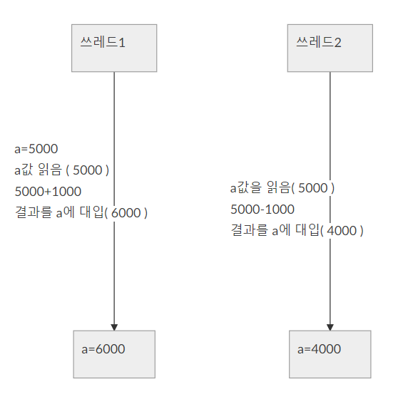

# 제 2 장 새로운 언어 ‘STREEM’의 설계와 구현

## 2-1 추상적 병행 프로그래밍 

> 멀티코어 시대가 도래하고, 통상 프로그래밍에 있어서 병렬 프로그래밍이 필요하게 되었다. 이번에는 새로운 병령 프로그래밍에 대해서 고찰하고, 이것을 지원하는 신언어(新言語)를 설계해 보자.  그 전에 병렬 프로그래밍을 지원하는 언어가 필요한 배경에 대하여 생각해 보자. 

지금은 일반 전자양판점에서 파는 ‘보통 PC’ 에서도 멀티 코어 CPU를 탑재하고 있다.  스마트폰 조차, 쿼드 코어(4 코어) 혹은 옥타 코어(8 코어)의 CPU를 탑재한 기종이 이제는 드물지 않다. 이렇게 멀티코어화가 진행된 데는 이유가 있다. 무어의 법칙 덕분에 지난 50년간 CPU를 비롯한 반도체 집적도는 지수함수적으로 향상되어 왔고, CPU의 성능도 그에 따라 향상되고 있다.그러나, 얼마 전부터 이 상황도 끝이 보이기 시작했다.  CPU(코어)의 성능 향상이 한계점이 왔기 때문이다. 독자 여러분도, 최근 CPU의 클럭이 2 GHz 언저리에서, 이전과 같이 극적으로 향상되지 않고 있는 것을 깨닫고 있을 것이라 생각한다.

#### 멀티코어화의 흐름이 이어진다

최근 LSI의 집적도가 지나치게 향상되어 배선의 폭이 원자 수개의 폭으로 되어 있어 전자가 절연체의 벽을 넘어서는 ‘터널 현상’ 등이 발생, 양자역학적인 행동이 문제가 될 정도다
또, 회로의 미세화는 열밀도의 향상도 부르고 있다.최근의 CPU 코어의 열밀도는 핫플레이트(방열판)로 커버하기에는 어렵게 되어, 적절한 냉각을 하지 않으면 전원을 켜는 순간 회로가 녹을 지도 모른다. 특히 복잡한 처리를 실시하는 CPU코어는 미세화의 점에서도 열밀도의 점에서도 한계점에 도달하여, 이미 단일 코어로의 큰 성능 향상은 바랄 수 없는 것이 현실이다. 

그러나, 모든 회로의 열밀도나 복잡함이 똑같은 것은 아니다. 메모리나 버스를 구성하는 회로는 CPU코어와 비교하면 단순하여 열밀도 등의 문제가 발생하지는 않는다
거기에 복수의 코어를 하나의 칩에 배치하는 것으로, 평균 열밀도를 내리려고 하는 것이, 멀티 코어의 동기(의 하나)이다. 

이 하드웨어 진화 경향이 가까운 장래에 뒤집힐 가능성은 거의 없다고 생각된다. 개별 CPU 코어의 극적인 성능향상을 바라지 말고, 새로운 컴퓨터의 성능을 최대한 활용하려고 한다면, 싫든 좋든 멀티코어 대응이 필요하다.

#### 병렬 과 병행 프로그래밍

멀티코어를 활용하려면, 복수의 작업을 동시에 실시할 필요가 있다.이러한 프로그래밍에 대해 ‘병렬’과 ‘병행’이라는 용어가 있습니다.
　병렬이란 ‘패러럴(Parallel)’의 번역으로, 복수의 처리를 동시에 실시하는 것을 말한다. 병행이란 ‘컨커런트(Concurrent)’ 의 번역로, 적어도 외관상은 복수의 처리를 동시에 실시하는 것이다.

즉, 만일 CPU가 하나 밖에 없었다고 해도, 복수의 처리를 잘게 분할하고, 교대로 실행해, 외관상 동시 실행하고 있는 것처럼 보이면, 그것은 병행 프로그래밍이 된다. 하지만, 실제로는 CPU가 하나밖에 없다면 한번은 하나의 처리밖에 할 수 없기 때문에 병렬 프로그래밍은 불가능하다. 멀티 코어 환경에서는 CPU가 여러 개 있기 때문에, 적절히 처리를 복수 코어로 분담시킬 수 있으면, 병렬 프로그래밍이 가능하다. 

혼동스러운가? 병렬에는 파라렐의 ‘ㄹ’가 포함되어 있고, 병행에는 그렇지 않다고 기억(나에게 있어서는)하는게 효과적이다[^1]. 그래도, 번역한 단어가 너무 혼동하기 쉽기 때문에, 이후는 패러럴과 컨커런트라고 표기하겠다.
대부분의 소프트웨어 개발자에게 중요한 것은 컨커런트 프로그래밍이다. 즉, 컨커런트한 소프트웨어를 개발해 두면, OS 실행 환경이 CPU의 수에 따라, 하나 밖에 없으면 외관상의 동시 실행에, 복수 있으면 진정한 동시 실행으로 전환해 주면 되기 때문이다. OS와 실행 환경의 개발자만   이 패러럴과 컨커런트의 차이에 주의하면 된다.
그럼, 지금까지 컨커런트 프로그래밍을 지원하기 위해 고안되었던 구조를 살펴보자.

컨커런트 프로그래밍을 지원하는 것 중에 대표적인 것은 프로세스와 스레드가 있다. 대부분 최근OS에서는 이 2가지를 다 제공한다. 

### ■ 프로세스

컨커런트 프로그래밍 지원 기구 중 가장 원시적인 구조가 프로세스다.역사적으로는 ‘태스크(task)’ 구조의 쪽이 보다 옛날 개념이긴 하지만 기능적인 차이는 크지 않고, Linux 프로그래밍에서는 등장하지 않기 때문에 여기에 설명한다.
　프로세스는 ‘실행중의 프로그램’ 을 나타내는 OS의 구조이다. 최근  OS<sup>*1</sup>들은, 복수의 프로그램을 동시에 동작시킬 수 있습니다.

#### UNIX 의 fork 는 ‘복제’ 기능

새로운 프로세스를 만들려면 , UNIX에서는 fork라고 하는 시스템 콜을 사용한다. fork 시스템 콜은 실행중인 프로그램(이것도 또한 프로세스다)의 복제물을 만든다.
fork에 의해 복제가 이루어지면 부모 프로세스 에서는 fork가 새로운 프로세스의 ID(정수)를 돌려준다. 한편, 새롭게 복제된 프로세스에서의 fork는 0를 돌려준다다. 자식 프로세스는 부모 프로세스의 복제물이므로, 여기까지의 실행 결과(의 대부분), 예를 들면 변수의 값이라든가, 메모리 할당 등은 부모 프로세스의 것을 그대로 복사한다.하지만 fork의 반환값만은 다르기 때문에, 여기서부터 실행은 분기를 하게 된다.

실제로는 대부분의 경우, 자식 프로세스에서는 (필요에 따라 약간의 사전 준비를 한 후) 다른 프로그램을 기동하게 된다. 자신의 프로세스로 프로그램을 기동하기위해서는 exec계 시스템 콜을 이용한다. exec계 시스템 콜에서는, 같은 프로세스지만 실행하는 프로그램이 바뀌게 된다.
　C의 시스템 콜 프로그래밍은 약간 복잡하므로, 여기에서는 거의 비슷한 Ruby 프로그램을 예를 들겠다 (그림 1).

```
pid = fork() # Ruby의 경우 자식 프로세스는 nil이 반환된다
if pid
    # 자식 프로세스의 종료 상테 체크
    Process.waitpid(pid)
else
    # echo를 기동한다
    exec "echo", "hello world" 
end
```

 <center>
  (그림 1) Ruby에 의한 fork와 exec
  </center>


이 복제를 하는 fork와 프로세스가 실행하는 프로그램을 바꾸는 exec의 조합은 UNIX계 OS에 독특한 특징으로, 다른 많은 OS(Windows라든가)에서는, 직접 프로그램을 기동하는 spawn이라고 하는 이름의 시스템 콜이 제공되는 경우가 많은 것 같다.


#### 프로세스는 생성 비용이 크다

이와 같이 기동된 복수의 프로세스는 OS가 적절히 실행시간을 할당하여 적어도 외관상으로는 동시에 실행된다. 컴퓨터가 여러 CPU를 가지고 있으면(그리고 OS가 멀티 CPU를 지원하면), OS는 여러 CPU에 프로세스 실행을 할당해 주고, 패러럴한  실행이 가능해진다.

프로세스의 특징은, 각각의 메모리 공간이 독립하고 있다는 것이다. fork에서 생성된 프로세스는 부모 프로세스의 복제물므로 자식 프로세스가 메모리 상태를 변경해도 부모 프로세스에 영향을 미치지 않는다, 그렇기 때문에, 자식 프로세스에서 문제가 발생해도 , 부모 프로세스는 영향을 받지 않는다.
프로세스의 단점은 비용이다. 메모리 공간 전체를 복제하므로, fork에 의한 프로세스 발생 비용은 꽤 크다. 최근 OS에서는, 부모와 자식 프로세스가 메모리를 공유해, 메모리 저장이 필요할 때에 처음으로 카피하는 CoW(Copy on Write)등의 구조를 도입하고 있지만 그래도 복사 비용은 무시할 수 없다.
이전에는 넓게 사용되고 있던 동적 Web 페이지를 위한 구조인 CGI[^2] 를 별로 사용되지 않게 된 최대의 원인이 이 프로세스 생성 비용이라 생각된다. 

#### 프로세스간의 통신의 어려움 

프로세스의 또 하나의 단점은 프로세스간 통신이 쉽지 않다는 점이다. 메모리 공간이 분리되어 있다는 것은, 안전성 관점에서는 메리트가 있지만, 여러개의 프로세스간 정보의 공유시 어려움을 발생시킨다. 
UNIX계열의 OS에서 프로세스간 정보 교환의 방법은 제한되어 있다. 부모-자식 프로세스에서 파이프의 공유를 통한 바이트스트림을 이용한 통신, 소켓을 이용한 통신, 파일을 거친 정보공유, 그리고 공유 메모리 정도다. 또한 세마포와 시그널에 의한 배타제어 등의 타이밍 조정 정도가 가능하다.

어느 정보 공유 수단이든 결국 바이트 열이다. 수치와 배열, 맵 이외의 데이터를 보내기 위해서는 문자열로 변환하여 보내고, 받은 문자열은 해석하여 원래 데이터로 복원할 필요가 있다. 통신 데이터가 증가할수록 이런 비용도 무시할 수 없다. 


### ■ 스레드

하나의 프로그램에서 메모리 공간을 공유하면서 여러 제어 흐름을 실현하기 위한 기구가 스레드이다. 스레드는 프로세스와 비교하면 메모리 공간의 복제를 수반하지 않기 때문에 상대적으로 생성 비용이 낮다는 장점이 있다.
내가 프로그래밍을 시작했을 무렵, 스레드는 어디서나 사용할 수 있는 기능이 아니었다. 그러나 현재는 널리 사용되는 대부분의 OS에서 스레드 기능을 사용할 수 있습니다. 스레드가 POSIX도 표준화되어 있으며, Windows에서도 (API는 다르지만) 사용할 수 있다.


#### 통신 비용이 낮다

스레드의 특징은 뭐니뭐니해도 메모리 공간을 공유하고 있으므로, 스레드간의 통신 코스트가 낮은 점이다. 문자열이건 정수이건 구조체이건 아무리 복잡한 데이터 구조여도 비용없이 접속할 수 있다.
하지만 메모리 공간의 공유는 좋지만은 않다. 여러개의 작업이 동시에 움직인다는 것은, 타 작업에 의해 데이터가 수정되어버릴 가능성이 있다. 작업 중인 데이터가 깨져버릴 경우도 있다는 것이다.

 데이터의 정합성을 유지할 수 없는 문제도 발생할 수 있다. 예를 들면 (그림 2)의 프로그램은, a로부터 1000을 끌어 1000을 더하고 있는 것이니까, 결과는 원래대로의 5000이 될 것 같지만, 경우에 따라서는 그 이외의 값이 되는 일도 있다. 즉 ‘a = a + 1000’의 부분에서 a의 값을 꺼내고 나서 새로운 값을 대입하기까지의 미묘한 타이밍에, 다른 스레드가 a의 값을 고쳐써 버리면, 기대한 결과와는 다른 값을 얻을 수 있다(그림 3).

```
a = 5000
th = Thread.fork{
    a = a +1000
}

a= a - 10000
th.join
puts "a=",a #결과는?
```

<center>
  (그림 2) 문제가 있는 스레드 프로그램
    </center>




<center>
    (그림 3) 스레드에 의한 정합성 파괴
</center>


#### 배타제어가 복잡하게 만든다

이 문제를 회피하기 위해서는, 정합성을 유지해야 되는 영역의 동시 실행을 피하는 배타적 제어를 실시해야 한다(그림 4).
복수의 스레드가 액세스 할 가능성이 있는 데이터(이 예의 경우는 변수 a)를 변경하기 전에 락(lock)을 걸어, 이 데이터에 액세스 하는 스레드가 하나 밖에 없음을 보증한다.

이미 말한 것처럼 스레드는 복수의 작업 흐름이 동시에 동작하기 때문에 같은 프로그램을 여러 번 실행해도 타이밍에 따라 문제가 발생하지 않을 수 있다. 이러한 재현성이 부족한 버그를 속칭 ‘하이젠버그[^3]’ 라고 한다. 나 자신도 경험이 있지만, 이 버그는 매우 발견하기 어려워, 발견하면 감격해 눈물이 날 정도다.

```
m = Mutex.new
a = 5000
th = Thread.fork{
    m.lock
    a = a + 1000
    m.unlock
}
m.lock
a = a - 1000
m.unlock
th.join
puts "a=",a #결과는 5000
```

<center>
    (그림 4) 베타적제어에 의한 정합성 유지
</center>


스레드의 결점은 이뿐만이 아니다.메모리 공간의 복제를 수반하지 않기 때문에 스레드는 프로세스보다 생성 코스트가 낮다고 했지만, 그럼에도 불구하고 스레드 생성을 위해서는 시스템 콜의 호출이 필요하다.
　시스템 콜의 호출에는 특권명령을 실행할 수 있는 커널공간으로의 전환이 필요하며 CPU명령으로 보면 방대한 수가 실행된다. 스레드 생성의 빈도가 높아지면, 이 코스트도 무시 할 수 없다. 게다가 하나의 스레드를 생성할 때마다 스택영역으로서 수 MB의 메모리를 할당한다. 1000개나 스레드를 생성하면 그것만으로 1GB의 메모리를 소비하게 되는 것이다.

### ■ 이상적인 컨커런트 프로그래밍

OS가 제공하는 컨커런트 프로그래밍의 구조인 프로세스도 비용적으로는 이상적이지 못했다. 더 말하면 이것들은 너무 직접적이고 배타적인 것들에 신경 써야 할 것도 너무 많다.
그래서, 조금 더 고도의 컨커런트 프로그래밍의 구조들이 여러가지로 모색되어 왔다.  지금까지 고안되어 온 것 중 일부를 소개하겠다.

#### 액터(Actor)

액터는 1973년경, 미 MIT(매사추세츠 공과대학)의 Carl Hewitt이 고안한 계산 모델이다. 액터모델에서 모든 객체는 액터라는 독자적인 제어 흐름을 가진다. 
액터는 비동기 메시지를 주고받을수 있다. 비동기라고 하는 것은, 메세지를 보낸 후 결과를 기다리지 않는다는 의미이다. 메시지에 대한 답변은 액터로부터 반송되는 메시지로 인식하게 된다.

원래 객체 지향은 시뮬레이션을 위한 객체를 조작하기 위해 탄생한 것으로, 액터모델은 더욱 이를 밀고 나갔던 것이라 생각된다.
그러나 실제로 모든 데이터를 액터로 표현하는 프로그래밍 언어도 설계된 적이 있지만 널리 사용되지는 않았다.  예를 들면 도쿄 대학에서 개발된 ABCL/1 있었으나, 실용화되지는 못했다.

#### Erlang의 “프로세스”

직접 엑터 모델을 채용한 언어들이 실용화 되진 못했지만, 이 영향을 받았던 언어들이 나름대로 있었다. 그 대표적인 게 Erlang이다. 

1986년에 탄생한 Erlang은 고신뢰성 분산 컨커런트 프로그래밍을 지원하기 위한 언어이다. 스웨덴의 Erlang사가 전화교환기등의 소프트웨어를 개발할 목적으로 만들어졌다고 한다. 

Erlang은 함수형 언어로 객체를 가지지 않지만 그 대신 ‘프로세스’를 갖는다.
Erlang의 설계자 Joe Armstrong에 의하면 ‘스레드와는 달리 메모리를 공유하지 않기 때문에 프로세스라고 부른다’ 라고 했지만, 솔직한 인상을 말하면, OS의 프로세스와 매우 비슷하여 개발을 안하는게 낫다 생각했었다. 
Erlang의 프로세스는 OS의 프로세스와 비교하면 매우 경량이며, 하나의 프로세스당 메모리 소비량이 수백 Byte에 그친다 .게다가 생성은 유저 레벨로 행해져 시스템 콜의 호출도 수반되지 않기 때문에, 시간적으로도 비용이 저렴하다.
이 프로세스가 액터모델의 액터에 해당한다. Erlang 처리시스템은 컴퓨터가 가지는 CPU코어수에 따라 스레드를 생성하고, 각 Erlang 프로세스의 실행은 그러한 스레드에 할당한다.그러니까, 멀티 코어 환경에서는 복수 CPU 코어를 최대한으로 활용할 수 있게 되어 있다.

#### 데이터 공유가 심플하다

Erlang의 프로세스에는 메시지를 보낼 수 있다.메시지 송신은 단방향 비동기다. 즉 보내면 그것으로 끝나며, 결과를 기다리는 일은 없다. 결과가 필요한 경우에는, 메시지 안에 송신원의 프로세스 ID를 포함시켜 두고, 결과를 별도의 메세지 만들어 되돌려 받게 된다(그림 5).
Erlang은 함수형 프로그래밍 언어로서 대부분의 데이터 구조가 변경 불가(immutable)다.또, Erlang의 프로세스간에서는 메시지 이외의 데이터 공유 수단은 거의 없다(실은, 다른 정보 공유 수단으로 데이타베이스가 있기는 하다).그 결과 스레드가 가지고 있는 문제들 Erlang에서는 발생하지 않는다.
이러한 메시지 송신 프로그램에서 자주 문제가 되는 것은, 프로그램의 버그로 메세지를 보내지지 않고, 전체가 실행 정지해 버리는 것이다.그러나 고신뢰성을 나타내는 Erlang에서는, 메시지 수신이 타임 아웃 했을 때의 처리를 비교적 간단하게 처리할 수 있고, 프로세스의 이상 종료를 검지해 재기동시키거나 하는 등의 에러 대응도 뛰어나다.

```
-module(pingpong)
-export([start/0, ping/2, pong/0])

% N이 0일때만 호출된다.
% Pong에 finished메시지를 보냄

ping(0, Pong_PID) ->
    pong_PID ! finished,
    io:format("ping finished~n",[]);

% N이 0일때만 호출된다
% ’Pong_PID ! {ping,self()}’는 메시지 송신 

% receive로 메시지 수신
% pong메시지를 받아 루프 
% Erlang에서는 명시적으로 루프가 없기 때문에 재귀처리 
ping(N, Pong_PID) ->
    Pong_PID ! {ping, self()},
    receive
        pong ->
            io:format("Ping received pong~n", [])
    end,
    ping(N - 1, Pong_PID).

% Pong의 구현
% finished로 종료
% ping으로 pong되돌려 보내고 루프
pong() ->
    receive
        finished ->
            io:format("Pong finished~n", []);
        {ping, Ping_PID} ->
            io:format("Pong received ping~n", []),
            Ping_PID ! pong,
            pong()
    end.
% 여기에서 시작
% spawn으로 두개의 프로세스를 만들고 pingpong시킨다.
start() ->
    Pong_PID = spawn(pingpong, pong, []),
    spawn(pingpong, ping, [3, Pong_PID]).
```

<center>
  (그림 5) Erlang의 메시지 송신
</center>


#### GO의 goroutine

Erlang과 비슷한 메시지 통신 베이스의 컨커런트 프로그래밍을 제공하고 있는 것이 미 Google사가 개발한 Go언어다. Go의 경우에는 프로세스를  goroutine(고루틴)이라고 부른다. 프로세스와 이름을 구분지어 부르는 것은 정말 바람직한 일이다. goroutine은 Erlang 프로세스와 마찬가지로 메모리 소비량적으로도 실행시간적으로도 생성시의 비용이 작게 들어, 하나의 프로세스 안에서 대량으로 생성이 가능하다. 또한 실행이 CPU 수에 따른 복수 스레드에 할당되어 멀티코어를 활용할 수 있다는 점도 동일하다.

Go에서는 go문에서 새로운 goroutine을 만든다. 또한 Erlang에서는 프로세스 자신이 메시지의 수신처가 되지만, Go에서는 메시지 송신의 대상은 chan(채널)이라고 하는 객체이다.

따라서 Erlang에서의 

- spawn으로 프로세스를 만든다
- 프로세스에 메시지를 보낸다
- receive로 메시지를 받는다

의 처리는 

- 새롭게 chan을 만든다
- chan을 거쳐 goroutine을 만든다.
- chan으로 메시지를 보낸다
- select로 chan으로부터 메시지를 받는다

라는 처리가 된다. Erlang과 달리 명시적으로 메시지 통신채널을 전달해야 하는 점과 반대로 goroutine의 ID를 얻을 수 없는 점이 특징이다. Erlang의 pingpong을 go로 고친것이 (그림 6)이다.나는 Go가  별로 익숙하지 않아서, (그림 6)의 프로그램은 Go의 작성 패턴에 맞지 않을지도 모르겠다.
정직하고 간결함에서는 ‘Erlang’의 점수가 더 높다. Go에서는 채널을 명시적으로 생성하거나 넘겨야 하는 점은 조금 귀찮은 부분이긴 하지만 Go에게는 정적 타입이 있기 때문에, 메시지로서 어떠한 데이터를 건네는지 명시할 필요가 있는 것이나, 복수의 채널을 분류하는 것 등을 통해 보다 유연한 설계를 목표로 한 것은 아닐까 추측해 본다.

```
package main
import "fmt"

func ping(n int, ping, pong chan int) {
  for {
    pong <- n;
    if n == 0 {
      fmt.Println("ping finished");
      return;
    }<- ping
    n = n - 1;
  }
}

func pong(ping, pong, quit chan int) {
  for {
    n := <- pong
    if n == 0 {
      fmt.Println("pong finished");
      quit <- 0;
      return;
    }
    fmt.Println("pong sending ", n);
    ping <- n;
  }
}

func main() {
  pingc := make(chan int);
  pongc := make(chan int);
  quitc := make(chan int);
  go pong(pingc, pongc, quitc);
  go ping(3, pingc, pongc);
  <- quitc;
}
```

<center>
  (그림 6) Go의 pingpong프로그램</center>

#### Clojure의 STM

스레드 이야기에서, 스레드간 데이터 공유시 적절한 배타 제어를 하지 않으면 데이터가 예상치 못하게 망기지는 현상을 소개했다.
이것과 유사한 문제는 복수의 클라이언트로부터 갱신을 포함한 액세스를 받아들이는 데이타베이스에서도 발생한다. 데이터베이스에는 ACID 원칙이라는 것이 있다. ACID란 Atomicity(원자성), Consistency(일관성), Isolation(독립성), Durability(지속성)의 머리글자를 딴 것이다.
Atomicity란, 데이타베이스에 대한 조작이, 완료인지, 아무것도 하지 않는 상태 이외에 작업중인 상태로 두지 않는다는 의미이다. 더이상 분할할 수 없다는 의미로 ‘원자’라는 말이 쓰이고 있다.
Consistency란, 데이타베이스의 상태는 항상 주어진 조건을 채우는 것을 보증한다는 의미이다. 주어진 조건을 충족시키지 않는 처리는 취소된다. 예를 들어, 예금 구좌 관리 프로그램에서, 잔고는 항상 채워져 있어야 한다는 조건이 주어졌다고 하면, 예금 잔고 이상으로 끌어내는 조작은 조건에 맞지 않기 때문에 실행할 수 없다.
Isolation이란, Atomicity가 유지되는 일련의 처리 과정에서 다른 처리가 유입될 수 없다는 것을 의미힌다.
Durability란, Atomicity가 유지되는 일련의 처리가 완료되는 시점에서 그 결과는 보존되며 유실되지 않는다는 것을 의미한다.

#### 데이터 베이스 개념 도입

데이터베이스에서는 이 Atomicity의 단위를 트랜잭션이라고 한다. 트랜잭션 중에는 데이터를 참조 및 갱신을 할 수 있지만, 그 중간 상태는 볼 수 없고, 갱신 결과는 트랜잭션이 성공했을 때에 처음으로 외부로부터 참조할 수 있게 된다. 어떠한 이유로 트랜잭션중의 처리가 실패했을 경우에는, 그때까지 실시해 온 갱신은 취소된다.
이 데이터베이스로 채용되고 있는 트랜잭션 처리를 통상의 프로그래밍에 도입한 것이 Clojure에서 채용되고 있는 STM(Software Transactional Memory)이다[^4]

Clojure에서 STM을 사용한 프로그램의 예를 (그림 7)에서 보여준다. 트랜잭션은 dosync로 둘러싸인 범위내에서,  공유 정보의 생성은 ref, 참조는 deref, 갱신은 ref-set를 각각 이용한다. Clojure의 데이터 구조는 기본적으로 수정 불가이므로, 정보의 갱신을 위해서는 원칙적으로 이 트랜잭션을 이용하게 된다.

```
(define a (ref 5000))
(define th #(Thread. (fn []
  (dosync
    (ref-set a (+ (deref a) 1000))))))
(dosync
  (ref-set a (- (deref a) 1000)))
(.join th)
(dosync
  (println (str "a=" (deref a))))
```

<center>
  (그림 7) Closure의 STM
</center>


#### 마치며

이번에는  컨커런트 프로그래밍의 필요성과 각각의 언어가 그 지원을 위해서 도입한 도구들에 대해 설명했다. 2-2절에서는 이를 근거로 하여, 이상적인 컨커런트 프로그래밍 언어에 대해 살펴보겠다.

<hr>

### 타임머신 칼럼

***멀티코어 시대에 요구되는 언어***

> 이 글은 2014년 12월호 게제분이다. 컨커런트 프로그래밍을 지원하는 언어의 디자인 설명이 시작된다. 이번에는 컨커런트 프로그래밍의 배경 설명뿐이긴 하지만....
> 컨커런트 프로그래밍을 지원하는 언어를 디자인하고 싶은 마음은 오래 전부터 있었다. 원래는, Ruby에 대해도 컨커런트 프로그래밍을 지원하려고 초기부터 스레드를 도입하고 있다. 그러나, Ruby를 만들기 시작한 1990년대의 컴퓨터는 싱글 코어가 당연하였고, 패러럴 실행의 환경에 대해 고려할 필요는 없었다. 그러한 배경에서 Ruby의 스레드는 멀티코어 대응을 고려하고 있지 않았고, 멀티코어의 컴퓨터가 상식화된 근래에는, Ruby의 스레드 구현에 대한 불만을 자주 듣게 되었다.
> 스레드를 활용하려고 생각하면, 이 글에서 말한 것 같은 어려움이 있다. 최근의 멀티코어 환경을 최대한 활용하여, 보다 간단하게 컨커런트 프로그래밍이 가능한 언어에 대한 요구가 높아지고 있는 것은 아닐까 생각했다. 여기에서 소개한 Erlang나 Go도 그러한 요구에의 대응을 생각하고 있다.그러나, 조금 더 추상도가 높은 다른 형태의 컨커런트 프로그래밍이라는 것이 있을 수 있는 것이 아닌가? 생각한 것이, 다음부터 개발하게될 ‘Streem’의 발상의 원천이 된다.


[^1]: 원서에서는『並列にはパラレルの「レ」が含まれており、並行にはコンカレントの「コ」が含まれているという覚え方が(私にとっては)効果的です』로 되어 있다.(옮긴이)
[^2]: Common Gateway Interface. 웹페이지의 요청별로 프로세스를 기동하고, 그 프로세스의 출력을 브라우저에 전송하는 방식으로 동적인 웹 페이지 제공을 하는 기술.
[^3]: 하이젠버그라는 이름은 양자역학에서의 ‘불확정성의 원리’를 제창한 물리학자 베르너 칼 하이젠베르크(Werner Karl Heisenberg, 1901 ~ 1976)의 이름에서 만들어졌다.
[^4]: 다만, STM의 결과는 어디까지나 일시 기억 저장소인 메모리에 반영되는 것이므로, 충분한 Durability는 없다. 이 부분이 데이터베이스와 다른 부분이다.

