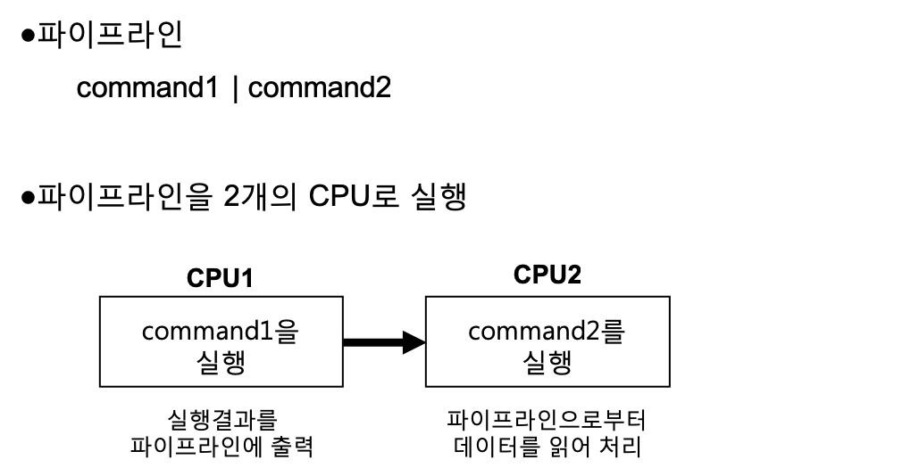
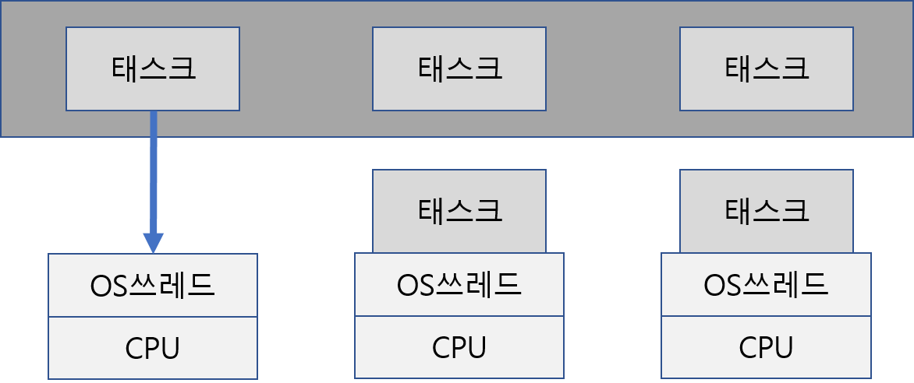
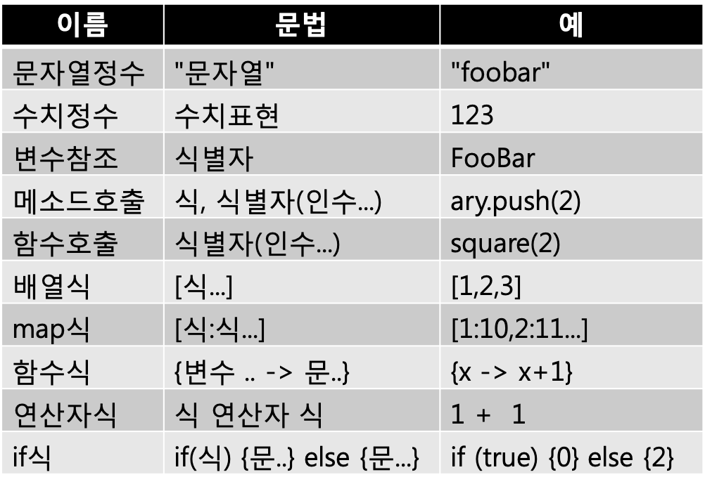

## 2-2 새로운 언어 ‘Streem’이란.. 

> 2-1절에서는 컨커런트 프로그래밍의 기초에 대하여 해설하였다. 이번에는 21세기 멀티코어 시대에 맞는 컨커런트 언어의 형태에 대하여 고찰해 본다. 그리고 이에 맞게 설계한 새로운 언어 ‘Streem’을 소개한다. 

멀티 코어 환경이 일반화되면서, 쉘 스크립트의 가치가(일부에서) 재검토되고 있다. 쉘 스크립트의 기본적인 연산 모델은 복수의 프로세스를 파이프라인으로 연결하는 것이다. 각 프로세스의 실행은 멀티 코어 대응의 OS환경 하에서는 복수 코어로 분산되기 때문에, 자동적으로 멀티 코어를 활용한 형태가 된다. 이것은 계산 모델을 적절히 선택하면 자연스러운 형태로 컨커런트 실행할 수 있는 좋은 예가 된다 (그림 1).
실제로 업무시스템의 근간부분을 쉘 스크립트를 이용해 처리하는 사례도 등장하고 있다. 보통 정보의 취사선택이나 가공 등을 쉘 스크립트로 수행하지만, 종래의 기법에 비해 변경의 비용가 낮은 등 높은 유연성이 특징으로 평가되고 있다고 한다.

####지금의 쉘 스크립트는 어렵다

그러나, 쉘 스크립트가 반드시 이상적인 것은 아니다. 우선, 이전에도 설명했듯이 OS의 프로세스 생성의 비용는 꽤 크기 때문에, 높은 밀도로 프로세스를 대량으로 생성하는 쉘 스크립트는 성능적으로 불리하다.
비용에 대해서 말하면, 프로세스 사이를 잇는 파이프 라인은 결국은 바이트 열 밖에 보낼 수 없기 때문에, 구조화된 데이터를 건네주기 위해서는, 송신측에서 바이트열로 변환해, 수신측에서 데이터에 복구할 필요가 있다. 예를 들면, 콤마로 구분한 CSV(CommaSeparatedValues)나, JavaScript 표현을 이용한 JSON(JavaScriptObject Notation)이 많이 이용되는데, 데이터를 이러한 형식의 바이트열로 변환하거나 바이트열을 해석해 원래 데이터로 되돌리는 비용도 무시할 수 없다.

멀티코어는 대량의 처리를 하고 싶을 때나, 높은 실행 성능을 얻고 싶을 때 사용하는 경우가 많다. 이를 위해 데이터 변환과 프로세스의 생성 비용은 무시할 수 없으며, 이 점이 쉘 스크립트의 결점이다. 

또, 파이프라인을 구성하는 프로세스가 되는 커멘드는,  여기저기서 제각각 개발되었기 때문에. 각각의 커맨드의 옵션의 지정 방법등의 사용법에 일관성이 없는 경우가 많아, 사용성 관점의 난이도가 올라간다.




<center>
    (그림 1) 컨커런트 쉘 스크립트
</center>


####21세기의 쉘 스크립트

그렇다면, 쉘스크립트의 장점과 이른바 범용 프로그래밍 언어의 우수성을 조합할 수 있다면, 최강의 언어를 할 수 있을 것 같은 예감이 들지 않는가?
그러기 위해 최강의 언어가 갖추어야 할 필요한 조건을 생각해 보자. 첫 번째 조건은 가벼운 컨커런트 실행이다. OS레벨의 프로세스도 쓰레드도 생성 비용이 비싸기 때문에, 가능한 한 만들고 싶지 않다. 구현으로서 하나의 OS프로세스 중에 컴퓨터 코어 수(+α)의 스레드를 미리 생성해 두고, 이들이 교대로 실행을 맡는 것 같은 것이 현실적이라고 생각된다. 이러한 구현은 컨커런트 언어로서 정평이 있는 Erlang이나 Go에서도 채용되고 있다(그림 2). Erlang의 ‘프로세스’, Go의 ‘goroutine’에 상당하는 것을 여기에서는 ‘태스크’라고 부르고 있다.



​    

 <center>
     (그림 2) 컨커런트 시스템의 아키텍쳐. 차례가 온 태스크는 OS쓰레드가 병렬실행되며, I/O대기 등의 타이밍시 교체된다
 </center>


두번째 조건은 컨커런트 실행에 있어서의 경합 조건의 배제다.구체적으로는 ‘상태’의 배제다. 즉 변수나 속성의 값이 변화하면 상태가 발생하므로 그에 따른 타이밍에 의존하는 문제가 발생할 위험성이 있다. 거기서, 모든 데이터를 이뮤터블(immutable-변경 불능)화 하여 타이밍 버그의 발생을 봉쇄한다.

세번째 조건은 계산모델이다. 2-1절에서 해설한 쓰레드와 같은 모델에서는, 표현의 폭은 넓지만, 자유도가 너무 높아서 쉽게 파악할 수 없는 프로그램이 되어 버린다. 거기서 쉘의 실행 모델을 참고로, 추상도가 높은 컨커런트 계산 모델을 도입한다.이것은 추상도가 높은 대신에 표현의 자유도는 낮기 때문에, 기술(記術)에 대한 고민이 필요하다. 하지만 그만큼 최종적인 프로그램은 디버깅하기 쉬워질 것이다.

### ■ 새로운 언어 Streem

그러면, 이런 조건을 만족하는 언어의 설계를 해 보자. 스트림을 계산 모델로 하는 언어라서 ‘Streem’이라고 이름을 붙였다. 스트림의 원래 철자는 ‘Stream’ 이지만 이것은 ‘구글러빌리티(Googlability)’가 너무 낮다. 조금 철자를 꼬아서 만든 Streem이라는 이름은 타이프미스 이외에는 거의 사용되지 않은 것 같고, 다행인 것은 streem.org의 도메인이 입수가능 했다. 

개인적인 신조로서 언어디자인은 우선 문법부터이다. 그래도 쉘 베이스 이므로 문법이 큰 문제가 될 것은 없다. 기본적인 문법은 아래와 같다. 

```
식1 | 식2 | ....
```


이것을 사용하면 표준 입력으로부터 읽어들여, 표준 출력을 보여주는 cat와 같은 기능을 하는 프로그램은 아래와 같이 된다.

```
stdin | stdout
```

정말 간단하다. stdin이나 stdout은 정수로 표준입출력을 표현하는 객체가 된다. Streem의 프로그램 중에서 stdin은 표준입력을 읽어온 행(문자열)을 차례차례로 전달하는 ‘흐름’처럼 보인다. 이러한 데이터의 흐름을 표현하는 객체를 ‘스트림’이라고 부른다. stdout는, 반대로 문자열을 받아 밖의 세계(표준출력)에 흘리는 스트림이다. 파일명을 지정해 읽는 경우에는

```
fread(path)
```

라고 하며, 이름을 지정하여 출력한다면

```
fwrite(path)
```

라고 한다. 이것들은 각각 데이터 입력용, 데이터 출력용 스트림을 반환한다. 

#####식(式)

식에는, 정수, 변수참조, 함수호출, 배열식, Map식, 함수식, 연산자식, if식이 있다. 각각의 문법은 표1에 나타나 있다. 보통의 언어 경험이 있다면, 그렇게 어려운 내용은 아니다. 

 

<center>
   (표 1) Streem의 식 <sup>map식 내용이 원서에서 틀려 수정하였음. 원저자(마츠모토 유키히로) 확인 완료_옮긴이</sup></center>


#####대입

Streem의 대입에는 2가지 종류가 있다. 하나는 통상 언어에서 의미하는 대입이다.

```
ONE = 1
```

또 하나는 ‘=>’ 기호를 사용한 역방향 대입이다. 위 식을 ‘=>’ 기호로 적어 보면

```
1 => ONE
```

이 된다. 후자의 경우는 파이프라인의 실행결과를 변수에 할당할 때 실행의 흐름에 따라 표현 가능하기 때문에 편리하다. 

어느 방식의 대입도, 상태 변화를 피하기 위해 아래의 규칙을 따를 필요가 있다. 

* 규칙 1: 동일한 변수에 여러번 대입을 하는 것은 불가능하다. 하나의 변수에의 대입은 범위 내에서 한번만.
* 규칙 2: 인터렉티브 모드에서 사용되는 변수에 대해서만 재대입이 가능. 단, 이것은 같은 이름의 다른 변수에 대입하는 것으로 간주된다.

#####복문

Streem에서는 명령문을 여러 개 나열할 수 있다. 글과글의 사이는 세미콜론 ‘;’ 또는 개행으로 구분한다.복수의 글은 기술한 순서대로 실행된다고 생각해도 무방하다.의존관계가 없는 경우, 실제 실행으로는 병렬로 실행될 수도 있다.


#### Streem프로그램의 예

그럼 Streem의 프로그램 예를 몇 가지 보도록 하자.
아까는 cat를 구현해 보았고, 이번에는 예제로서 자주 이용되는 Fizz Buzz 게임을 Streem으로 기술해 보도록 하겠다(그림3). 이것은 참가자가 1부터 순서대로 숫자를 말하며, 3으로 나누어질 때는 ‘Fizz’, 5로 나누어지면 ‘Buzz’, 양자로 모두 나누어지면  ‘FizzBuzzz’라고 대답하는 게임이다.

```
seq(100) | map{x->
    if (x%15 == 0)
        ‘FizzBuzz‘
    else if (x%3 == 0)
        ‘Fizz‘
    else if (x%5 == 0)
        ‘Buzz‘
    else
        x

} | stdout
```

<center>
    (그림 3) Streem에 의한 FizzBuzz
</center>
seq라는 함수는 1에서 지정된 수까지의 수열을 만든다.
파이프라인에 함수가 지정되면 열의 각 요소에 대해 적용되며 그 결과가 다음 파이프라인에 전달된다. stdout은 받은 값을 출력한다. 

이렇게 보면 Streem에 의한 파이프라인의 기술은, 직선적으로 표현이 가능하다고 생각되지 않는가? 

```
1대1, 1대n, n대m
```

(그림3)과 같은, 값의 열을 가공해 출력하는 프로그램은 Streem으로 간단하게 기술할 수 있다는 것을 알았다.그러나 프로그램은 이러한 1대 1 관계의 것만 있는게 아니다.예를 들면 grep(단어 검색)와 같이 ‘조건에 맞는 것을 찾는다’ 와 같은 타입도 있고, wc(단어 카운트)와 같이 집계를 하는 타입도 있다.
Streem에는 그러한 경우에 이용하는 예약어가 몇 개 있다.
emit는 한번의 실행으로 복수의 값을 돌려받을 때 사용하며, 복수의 값이 전달되면 복수의 값을 돌려받는 형태이다. 결국

```
emit 1,2
```
는
```
emit 1, emit 2
```

와 같은 의미이다. 그러므로 배열 앞의 ‘*’ 을 붙이는 것으로, 배열요소를 한번씩 돌려받는다. 결국 

```
a = [1,2,3]; emit *a
```

는

```
emit 1, emit 2, emit 3
```

의 의미이다. 

emit의 사용 예는 (그림 4)에 나타나 있다. 이 프로그램에서는, 1부터 100까지 수를 각각 2회씩 표시 한다. 

```
# 값을 2회씩 반복한다 
seq(100) | map{x->emit x, x} | stdout
```

<center>
    (그림 4) emit의 이용 예
</center>


return은 함수 실행을 종료하고 결과값을 반환한다. return는 복수의 값을 반환할 수 있고, 그 경우에는 복수의 값을 emit 하게 된다. 여기까지 설명하지는 않았지만, 함수 본체의 식이 하나밖에 없는 경우, return이 없어도 그 식의 값이 반환값이 된다.

emit나 return을 사용하면, 건네진 것보다 많은 값을 생성할 수 있다. 반대로 건네진 것보다도 적은 값을 생성하기 위해서는 skip를 사용한다. skip를 사용하면 그 함수의 실행은 종료되고, 값은 생성되지 않는다. skip를 사용한 예를 (그림 5)에 나타내었다. (그림 5) 의 프로그램에서는 1에서 100까지의 수에서 홀수를 추출하고 있다.

```
# 홀수의 추출
seq(100) | map{x->if(x%2==0){skip}; x} | stdout
```

<center>
    (그림 5) skip의 이용 예
</center>


#### 이뮤터블

이미 설명한 것처럼 Streem에서의 모든 데이터 구조는 경합을 피하기 위해 이뮤터블로 되어 있다. 배열이나 맵(Ruby의 Hash 상당)도 이뮤터블이다. 요소의 추가 등은, 기존의 데이터를 변경하는 것이 아니라, 원래의 데이터는 그대로 두고 요소를 추가한 새로운 데이터를 만들게 된다(그림 6).

```
a = [1,2,3,4]  # a는 4개 요소의 배열
b = a.push(5)  # b는 a의 마지막에 5를 추가한 배열
               # a는 변동 없음
```

<center>
    (그림 6) 이뮤터블 데이터 갱신
</center>


#### 단어 카운트

그럼, Streem의 다른 예로서, 맵 리듀스(MapReduce)의 예제로서 빈번히 이용되는 단어 카운트를 Streem으로 기술해 보자(그림 7).

```
stdin | flatmap{s-> 
    s.split(' ')
} | map{x->[x, 1]} | reduce_by_key{ 
    k,x,y -> x+y
} | stdout
```

<center>
    (그림 7) Streem에 의한 단어 카운트의 예
</center>


우선 (그림 7)의 프로그램에 처음 등장한 문법을 설명한다. flatmap 함수등 호출에 Ruby의 블록과 같은 것이 있다. Streem에서는 syntactic sugar로서 인수 리스트의 뒤에 함수가 오는 경우, 그것을 마지막 인수로서 추가한다. 즉

```
flatmap{s->s.split(' ')}
```
이라는 식이

```
flatmap({s->s.split(' ')})

```

라는 별도의 형식이 되는 것이다. 이는 Ruby의 블록과 같은 모양을 통상의 함수호출의 구조로 그대로 추가하기 위해 고민한 것이다. 

(그림 7)의 프로그램의 기능을 보면, stdin으로부터 1행씩 받아 split로 단어 마다 분할한 것을, flatmap로 전개한다. 그리고 map에서 [단어, 1]이라는 배열로 변환하여 reduce_by_key에 각 단어의 등장횟수로 맵을 만든다. reduce_by_key는 [키 , 값]의 2개 요소의 배열의 스트림을 받아 키 마다 그룹화한 스트림을 반환한다.이미 등장한 키가 다시 스트림에 나타났을 때에는, 인수로서 건네준 함수는(키, 오래된 값, 새로운 값)의 3개의 인수로 호출된다.그리고 함수의 되돌아가는 값이 키에 대응하는 새로운 값이 된다.이 예에서는 [단어, 1] 이라는 스트림에 reduce_by_key를 적용하는 것으로, 최종적으로[단어, 등장수]라고 하는 스트림을 얻고 있다.
마지막에는 그 맵을 stdin에 파이프라인으로 연결하면 키와 값의 조합이 출력되므로 단어와 그 등장회수가 표시된다. 필요하면 출력전에 단어의 표시순서를 소트 하는 파이프 라인을 추가하는 것도 가능할 것이다.

#### 소켓 프로그래밍

UNIX에서도 스트림 베이스로 설계되어 있는 소켓은, 당연히 Streem으로 취급할 수 있다.(그림 8)의 프로그램은 소켓을 이용한 네트워크 서비스로 가장 간단한 echo 서버(받은 입력을 그대로 되돌리는 서버)이다.

```
# 포트번호 8007의 서비스 오픈
tcp_server(8007) | {s->s | s}
```

<center>
    (그림 8) echo 서버
</center>

정말 간단하지 않은가. Streem에서는 스트림모델에 잘 매치하는 프로그램은 굉장히 간단하게 기술이 가능하다.
일단 설명을 하면, tcp_server 함수는 지정한 포트 번호의 서버 소켓을 오픈하고, 클라이언트로부터의 접속을 기다린다. Streem 에서는 서버 소켓이, 클라이언트 소켓의 스트림이 된다.

클라이언트 소켓은 클라이언트로부터의 입출력의 스트림이 되므로,

```
s | s
```

라고 하면, ‘입력한 것을 그대로 출력으로 반환한다’ 라는 동작을 한다. 입력에 대해 뭔가 가공을 할 경우에는, 이 파이프라인 사이에 변경하는 스트림을 끼어 넣으면 된다. 

#### 배관 업무

지금까지 봐 온 것처럼 파이프라인의 구성은

```
식1 | 식2 ... | 식n
```

처럼 구성이 되어, 식1이 값을 생성하는 스트림(생성자라고 부르기로 하자)으로, 식2 이후가 값을 변환·가공하는 스트림(필터)으로, 마지막에 오는 식n이 출력처(소비자)가 된다.
생산자에는 stdin과 같은 외부로부터의 입력을 스트림으로서 받아들이는 것도 있고, seq()과 같이 계산에 의해 값을 만들어 내는 것도 있다.생산자 자리에 함수식이 주어지면, 그 함수를 호출해 return나 emit로부터 주어지는 값을 생성하는 생산자가 된다.
필터는 많은 경우는 함수로, 주어진 값을 인수로서 불러내, emit이나 return에서 부여된 값을 뒤의 스트림에 넘겨준다.

마지막 소비자는, 받기만 하고 값을 emit하지 않는 스트림이다. Streem의 기본적인 프로그램은 이러한 스트림을 연결한 파이프라인을 준비하여, 생산자로부터의 값을 태워 값을 가공한다.말하자면 배관업무라고 해도 좋을 것이다.이 계산 모델은 뭐든지 가능한 것은 아니지만, 추상도가 높고, 알기 쉽게 컨커런트 프로그래밍을 할 수 있다고 하는 장점이 있다. 

그러나, 모든 프로그램으로 데이터의 흐름이 하나로 끝나는 것은 아니다. 그렇다고 그런 경우의 프로그램을 아예 포기한다는 것도 지나친 일인 것 같다. 좀 더 복잡한 배관도 필요하다. 구체적으로는 여러 개의 스트림을 하나로 묶는(머지)것과 하나의 스트림을 복수로 분할해서 분배(브로드캐스트)하는 두 가지가 아직 부족하다.
더 말하면 스트림과 스트림 사이를 연결할 때 얼마나 많은 버퍼를 준비할지 지정할 수 있어야 한다. 

#### 파이프라인의 머지 

지금까지의 예와 같이 데이터의 흐름이 1개 밖에 없는 경우는 매우 심플하다. 
하지만 그것이 모든 것이 해결이라고 할 수는 없다. 때로는 복수의 파이프라인을 하나로 정리하거나 혹은 파이프 라인을 분리하거나 할 필요가 있다. 파이프라인의 머지에는 ‘&’ 기호를 사용한다.

##### 파이프라인1 & 파이프라인2 

파이프라인 1으로부터의 값과 파이프라인 2로부터의 값을 배열로 정리한 새로운 파이프 라인을 만들 수 있다. 새로운 파이프라인은 머지한 파이프라인 둘 중 하나가 종료했을 때에 전체가 종료한다. 예를 들어 첫 번째 cat 예를 행 번호를 추가하는 cat -n 에 대응 하기 위해서는 그림 9와 같이 된다.
‘&’연산자는 ‘|’연산자보다 우선순위가 높기 때문에 

```
a & b | c
```

는

```
(a & b) | c
```

로 해석된다. seq()는 인수를 생략한 경우, 1부터 무한대로 반복을 한다. stdin은 표준 입력부터 1행씩 파이프라인에 출력하기 때문에, 머지 결과 

```
[행번호, 행]
```

형태의 배열이 된다. 이 배열을 stdout(표준 출력)으로 나타내면, 행번호가 나오는 cat이 구현 가능해진다. 실용화를 위해서는 행번호의 자릿수 같은 포멧이 필요하지만 그 부분은 stdout의 전에 포멧을 맞추는 파이프라인을 만들어 두면 된다. [^1]


#### 채널버퍼링 

마지막 소비자가 아닌 파이프라인은 ‘채널’이라고 하는 객체를 반환한다. 따라서

```
seq() & stdin -> sequence
```


라고 했을 때, 이 sequence는 seq()로부터의 수열과 stdin으로부터의 입력을 머지한 스트림을 표현하는 채널이 된다. 파이프라인이란 스트림 처리를 하는 ‘태스크’가 채널에 의해 연결된 것으로 생각할 수 있다.

각 스트림의 데이터 처리속도에는 당연 차이가 발생한다. 전단계의 데이터 생성속도가 너무 빠르면 채널에 병목현상이 발생하고, 메모리 소비량이 증가한다. 거꾸로 채널에서 병목현상을 생기지 않게 하려면 전단계에서의 대기시간이 길어져 비효율적이다. 

여기서, 채널은 적당한 수(너무 많지도 적지만 너무 적은 것이 바람직하다)만 버퍼링하게 된다.하지만 정말로 적절한 버퍼 사이즈는 프로그램에 의해 결정되므로, 정확한 사이즈 추측은 불가능하다. 경우에 따라서는 성능을 위해 명시적으로 버퍼 사이즈를 지정해 줄 필요가 있는데 그럴 때 도움이 되는 것이 chan() 함수이다.

```
seq() & stdin | stdout
```

<center>
    (그림 9) cat -n의 구현예
</center>


chan()함수는 명시적으로 채널 객체를 생성한다.파이프라인 연산자 ‘|’는 우변이 채널 객체였을 경우 그 채널을 그대로 출력할 것이다.또, chan() 함수에 인수로서 정수를 건네면 그것은 버퍼 사이즈가 된다.즉, (그림 9)의 프로그램의 버퍼사이즈를 명시적으로 3으로 지정하면 (그림 10)과 같이 된다.


```
seq() & stdin | chan(3) | stdout
```
<center>
    (그림 10) 버퍼 사이즈 지정 cat -n</center>


버퍼 사이즈를 0으로 하면, 하나를 생성후에 그것이 사용될 때까지 기다리는, 그래서 파이프 라인이 전후로 교대로 실행되는 형태가 된다. 싱글 코어 환경에서는 편리한 일도 있을지도 모르겠다.

#### 브로드캐스트(Broad Cast)

예를 들어, 채팅 서비스 구현을 위해 한명이 보낸 메시지를 참가자 모두에게 분배를 한다. 채널은 그 목적으로도 이용할 수 있다. chan()함수에 의해 생성한 채널을 복수의 스트림에 접속하면 입력으로 주어진 값을 접속하고 있는 모든 스트림에 브로드캐스트 한다.

```
broadcast = chan()
# 포트번호 8008의 서비스 오픈
tcp_server(8008) | {s->
    broadcast | s # 모두로부터 메시지 답신
    s | broadcast # 메시지를 모두에게 송신 
}
```

<center>
    (그림 11) Chat 서버
</center>
(그림 8)의 echo 서버를, 참가자 전원에게 메세지를 배포하는 Chat서버로 고쳐 쓴 것을 (그림11)에서 보여주고 있다.
눈치 빠른 사람은 알겠지만, 브로드캐스트 채널에는 상태가 있다. 즉, 브로드캐스트에 연결된 스트림은 송신지로서 브로드캐스트 자신에게 기록된다. 또, 출력지 스트림이 닫혀 버리거나, 혹은 명시적으로 disconnect 메소드로 제거되었을 때에는 그 스트림은 송신지에서도 삭제 된다. 이뮤터블이 기본인 Streem이지만, 알기 쉬운 프로그래밍을 위해서 이 경우는 순수함을 희생했다(^^). 물론, 브로드캐스트 상태 변화는 내부적으로 배타 제어되고 있으므로, 패러럴 실행에 문제가 발생하는 일은 없다.


#### 마치며

파이프라인을 계산모델의 중심으로 채용한 자기제작언어 Streem을 설계해 보았다. 스트림처리가 자주 발생하는 프로그램이라면 놀라울 정도로 쉽게 쓸 수 있다.
실제로는 Streem 언어는 설계가 시작된지 얼마 되지 않아서 실용수준에 도달하기 위해서는 아직 생각해 봐야 할 것들이 많이 있다. 예를 들면, 예외처리는 어떻게 하는것인가 라든지, 유저 정의의 스트림을 어떻게 준비해야 하는지, 객체는 어떻게 정의되는지 등이다. 소프트웨어 규모가 커짐에 따라 언어가 고려해야 하는 것도 늘어난다. 
‘이 언어에서는 규모가 큰 프로그램은 쓰지 않기 때문에’라고 하는 것은 언어 설계자가 자주 하는‘변명’이다. 하지만, 그 언어가 쓸모없었던 경우를 제외하면, 그 변명이 도움이 된 적은 없었다.
2-3절에서는 계속해서 Streem의 심화된 설계를 진행하고 동시에 그 구현에 대해서도 생각해 보도록 하겠다.

<hr>

### 타임머신 칼럼

***언어명도 문법도 초기 구상시와는 달랐다***

> 이 글은 2015년 1월호 게제분이다. 당당히 이 책의 중심부인 Streem언어의 개발을 시작했다. 잡지게시 당초에는 Streem이라는 언어명이였지만, 좀 혼란을 야기할 수 있을 것 같아, 서적화하는 시점에서 편집중에 있다. 
> 문법도 당초보다 바뀌고 있으므로, 이것도 정정중이다. 구체적으로는, 우대입의 기호가 ‘->’로부터 ‘=>’로 변화한 것과, 함수식의 인수 부분이 ‘{|x, y|x+y}’가 ‘{x, y->x+y}’로 바뀌었다. 또한 표준입출력을 나타내는 stdin, stdout의 이름이 대문자에서 소문자로 바뀌었다. 초기 상태대로 보여주는 것도 한가지 재미가 될까 해서 상당히 갈등하였으나 사용할 수 없는 문법의 샘플을 보여도 역사적 자료 이외에는 도움이 되지 않기 때문에 수정하기로 했다.
> 이 원고를 쓰고 있던 시점에서는 당연히 미완성 이었기 때문에, 여기서 쓰여져 있는 것은 모두 이 시점에서는 구현이 안된 구상 단계에 지나지 않는다. 다만, 모순이 있거나 구현할 수 없는 문법이 되는 것을 피하기 위해 최소한의 yacc 기술만은 준비하고 있었다. 이것을 GitHub에 업로드 한 것만으로, 해외 뉴스인 HackerNews등에서 화제가 된 것은 좋은 추억이다.
그리고, 마지막으로 하나의 주의할 점은, 이번 설명한 구상안에는, 서적 출판시에도 아직 구현되어 있지 않은 것이 있다. 예를 들어 chat 서버에 사용되고 있는 chan() 등이다. 당연히, 향후 구현할 예정은 있지만, 언제까지 구현할 수 있는지 약속은 못하겠다.


[^1]: Streem은 아직 설계중인 단계로서 포맷관련 사양은 정해지지 않았다. 


