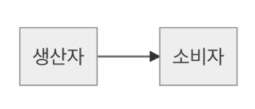
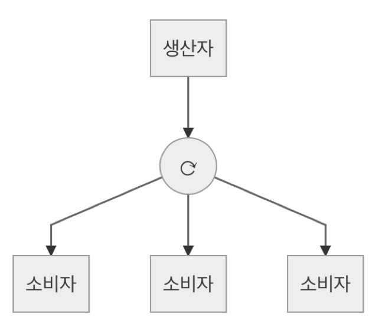
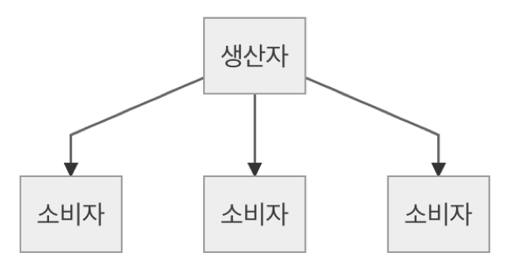
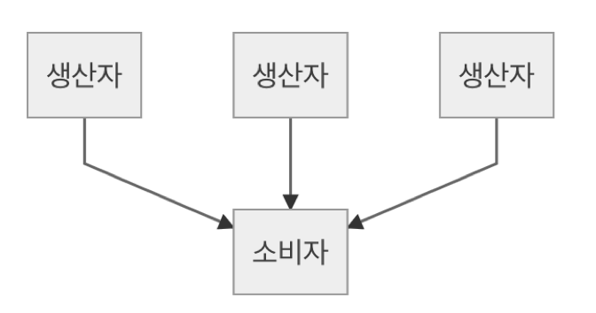
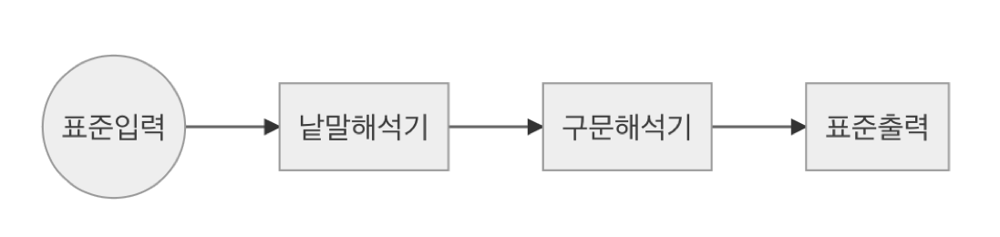

## 2-3 우선 문법 체커부터

> 이번에는 2-2절에서 설계한 스트림 베이스 언어의 구현에 대하여 이야기한다. 스트림 모델의 타당성을 검증한 후, 다음은 문법의 타당성을 확인하기 위한 ‘문법 체커’ 를 개발하게 된다. 슬슬 구현이 시작되어 흥분이 된다.

2-2절에서 스트림을 베이스로 한 계산 모델에 의한  병렬 프로그래밍의 설계에 대해 이야기했다. 통상의 컨커런트 처리에 대한 설계라면, 일단 충분한 설계능력을 갖추고 있는 것 같다. 우선은 이쯤에서 타당성에 대해 더 검토해 보자.

#### 태스크 구성 패턴

메시지를 기반으로 한 컨커런트 처리에는 태스크(또는 쓰레드나 프로세스)의 구성에 대해 몇가지 종류의 패턴이 있다.이러한 패턴을 이용하면, 작업 구성을 혼동하는 일이 없을 것이다. 전형적인 패턴은 아래와 같다.

* 생산자-소비자 패턴
* 라운드로빈(Round Robbin) 패턴
* 브로드캐스트(BroadCast)패턴
* 집약 패턴
* 요구, 응답 패턴

그러면, 각각의 패턴에 대하여 어떤 것들인지, 그리고 스트림 모델은 어떻게 표현되는지 보도록 하자.

#### 생산자, 소비자 패턴

생산자(Producer)가 데이터를 생성하고, 소비자(Consumer)에 전달하는 메시지에 의한 컨커런트 처리의 기본 패턴이다(그림 1). 전형적인 쉘의 파이프라인이지만, 이 외에도 여러 곳에서 등장한다. 



<center>
 (그림 1) 생산자-소비자 패턴
</center>


스트림모델에서는 생산자와 소비자 사이에 스트림을 잇는 모양으로 기술한다. Streem언어에서는 생산자를 P, 소비자를 C로 하는 경우

```
P | C
```

로 표현한다. 이 패턴은 자연적인 확장이며, C가, 받은 데이터를 가공하는 생산자가 되며 다음 소비자에 데이터를 보내는 케이스가 있다. 이 경우에는 중간의 C는 데이터를 가공하기 때문에 Streem에서는 ‘필터(Filter)’라고 부른다. 파이프라인에서는 

```
P | F | C
```

처럼 된다. 물론, 필터는 복수 연결이 가능하다. 

#### 라운드로빈(Round Robbin) 패턴

생산자·소비자 패턴의 변형으로서 멀티 코어를 최대한 활용하기 위해서, 복수의 소비자를 준비해 처리를 분담시키는 패턴이 있다. 이와 같이 어떤 순서를 정해 차례대로 분담시키는 것을 ‘라운드 로빈(Round Robin)’이라고 부른다(그림 2).



<center>
(그림 2) 라운드 로빈 패턴
</center>


라운드로빈의 목적은 부하분산이어서, 보통은 같은 처리를 하는 태스크를 여러개 준비하여, 데이터 처리를 순번을 정해 할당한다. 이 때 아무 고려 없이 단지 차례로만 할당하면, 이전의 데이터 처리가 좀처럼 끝나지 않아, 데이터 처리에 대기가 걸리게 되므로 주의가 필요하다.‘순서’라 해도 모든 작업에 순서대로 할당하는 것이 아니라 비어 있는 태스크에 순서대로 할당하는 등의 노력이 필요하다.
라운드 로빈 패턴의 예로서는, (멀티 스레드) Web 서버가 있다. 클라이언트로부터 받은 리퀘스트를 작업자에게 분배하는 방식은 대부분 라운드 로빈 패턴이다.
Streem의 경우 라운드 로빈에 대한 대응은 언어처리 시스템에 포함되어 있다. 즉, 통상의 생산자-소비자 패턴으로서 기술하면, 태스크를 마음대로 만들어내 처리해 준다. 구체적으로는

```
P | C
```

라고 하는 스트림을 준비하면, CPU코어 수에 맞춘 소비자 태스크를 생성하여 처리를 진행한다. 코어 수가 증가하면, 추가 작업이 없어도 성능이 향상된다는 아이디어이다.

#### 브로드캐스트(BroadCast) 패턴

같은 메시지를 복수의 태스크에 분배하는 경우를 브로드캐스트 패턴이라 부른다(그림 3)



<center>
(그림 3) 브로드캐스트 패턴
</center>

브로드캐스트의 예는 쳇(chat)서버이다. 참가자 중 한명의 메시지가 채팅방에 있는 전원에게 분배된다. 
Streem에서는 하나의 스트림에 복수의 스트림을 연결하는 것으로 브로드캐스트 패턴을 기술한다. P를 생산자, C1...Cn을 소비자라고 하면, 전원에 메시지를 전달하기 위해서는 아래와 같이 기술한다. 

```
P | C1
P | C2
:
P | Cn
```

만일, 모든 소비자가 배열 ary에 들어있는 경우, 아래와 같이 된다. 

```
ary.map{c -> P | c}
```


#### 집약 패턴

하나의 생산자가 복수의 소비자에 메시지를 전달하는 브로드캐스트 패턴과는 반대로, 복수의 생산자가 하나의 소비자에 메시지를 전달하는 것을 집약 패턴이라고 한다(그림 4). 집약 패턴의 전형으로는 로그 수집 시스템이 있다. 각각에서 발생한 로그를 하나의 장소로 모아 보존하는 케이스이다. 



<center>
(그림 4) 집약 패턴
</center>


Streem에서의 집약 패턴의 구현은, 브로드캐스트 패턴의 역이다. P1...Pn을 생산자, C를 소비자라고 하면, 아래와 같이 기술한다. 

```
P1 | C
P2 | C
:
Pn | C
```

만일 모든 생산자가 배열 ary에 들어있는 경우, 아래와 같이 된다.

```
ary.map{|p| p | C}
```

#### 요구・응답 패턴

마지막은 요구(request)-응답(response)패턴 이다. 이는 요구하는 메시지를 보냈던 태스크에서 처리완료 데이터를 다시 메시지로서 되돌려받는 패턴이다.(그림 5)


<center>
(그림 5) 요구-응답 패턴
</center>


그러나 솔직히 말하면, 컨커런트 프로그래밍에 대해 요구-응답 패턴을 자주 쓰는 것은 추천되지 않는다. 만약 메시지를 보내서 그 답을 기다리는 것이라면 동일 태스크 안에서 처리하는 것이 메시지 송신의 비용이 없는 만큼 효율적이다. 또 기다리는 것을 피하고, 요구의 송신과 회답의 수신을 비동기에게 실시하는 것은, 프로그램의 구성을 쓸데없이 복잡하게 만들어 버린다. 이 때문에 Streem는, 요구-응답 패턴을 지원하고 있지 않고 있다. 결론적으로, 동기적인 통상의 함수 호출을 사용하는 것을 추천한다.

### ■ 자기제작언어, 그 첫걸음

자, Streem의 배경이 되는 스트림 모델에는 충분한 타당성이 있는 것 같다. 그럼 드디어 구현을 시작해 보자.
여러분이 자기제작언어를 개발한다고 하면, 우선 무엇부터 시작하나? 물론, 어디에서 구현을 해야한다는 규정은 없다. 내가 20여년 전에 Ruby의 개발을 시작했을 때에는, 문법의 옳음을 체크해 주는 문법체커에서 시작한 것 같다. 한편, 2010년에 mruby의 구현을 시작했을 때는 VM(가상 머신)이었다.

#### 시행착오가 필요한 부분부터 개발한다 

여기에는 그만한 이유가 있다.Ruby 개발을 시작했을때, 어떤 문법의 언어로 할 것인지, 아직 확실히 정해지지 않았었다.언어 오타쿠인 나에게 언어 디자인에 있어 가장 중요한 것은 문법 이었다. 이 때문에 문법을 확정하기 위해서 시행 착오를 하는 것은 우선사항이었다. 실제로 초기 Ruby는 현재와는 문법적으로 상당히 달랐고 다양한 시행착오를 통해 현재의 문법으로 성장하였다. 이것이 본가(本家)격인 CRuby의 개발을 구문 해석부에서 시작한 최대의 이유다.

한편, mruby의 경우는, 기존의 Ruby와 문법적으로는 호환으로 되어, 문법에 대해서는 시행착오의 여지가 없었다. 오히려 메모리 효율을 체크하며, 어느 정도의 실행 효율이 좋은 가상 머신의 구현이 메인이었다. 거기서 가상 머신의 구성이나 명령 세트를 가지고 여러가지 시험하는 것부터 시작했다. 처음에는 바이트 코드(가상 머신의 명령열)를 손으로 쓰고, 그대로 가상 머신에게 입력을 했다. 이것이 어느 정도 동작을 하게 되고 나서, CRuby로부터 카피해 온 문법 정의를 베이스로 구문 해석부나 코드 생성부를 개발했다.

요컨대 가장 시행착오가 필요한 부분을 제일 먼저 개발하는 것이 성공의 요령인 것 같다. 시행착오를 위해서는 가급적 빨리 액션을 취할 필요가 있다. CRuby의 경우에는 먼저 Ruby 프로그램(코드)을 주면 문법의 옳음을 체크하는 문법체커를 만들고 시행착오를 거쳤다. mruby에서는 손으로 쓴 샘플 프로그램의 바이트 코드(팩토리얼을 계산하는 프로그램이었다)를 실행하는 가상 머신을 먼저 만들었다.

#### Stream도 문법 체커 부터

그러면 Streem은 어떻게 할까?

Streem의 구현으로 시행 착오가 필요할 것 같은 곳은 몇 곳이 있다. Streem은 새로운 문법을 가진 언어이기 때문에, 문법의 좋고 나쁨은 신경을 써야 할 부분이다. 또한 Streem의 핵심은 멀티코어에 대응할 수 있는 추상도가 높은 컨커런트 프로그래밍이므로 이를 담당하는 태스크 스케쥴러(Task Scheduler)의 부분도 난이도가 높고 시행착오가 필요할 것 같다.

많은 고민을 했지만, 이번에도 CRuby때와 마찬가지로 문법체커의 구현부터 시작하기로 했다. 언어오타쿠로서는 역시 문법의 좋고 나쁨을 신경써야 겠다. 하지만 CRuby때와는 달리 yacc 사용법도 익숙해져 예전보다는 막힘없이 개발할 수 있을 것 같다. 

우선은 프로젝트를 개시하겠다. 소스 관리는 GitHub에 맡겨두자. 먼저 GitHub에 로그인해서 빈 리포지터리를 만들었다. ‘matz/streem’ 이라는 리포지토리를 사용하겠다.

이 새로운 리포지토리를 로컬로 복제(cloning)를 하자(그림 6). 우선 이 프로젝트가 무엇인지 보여주는 README파일부터 준비하도록 한다. GitHub에서는 Markdown포맷을 이용하는 것을 추천하고 있어, 확장자 .md를 사용한 README.md라는 파일을 작성한다.(그림 7) 여기부터 개발은 시작된다

```
git clone git@github.com:matz/streem.git↲
```

<center>
    (그림 6) GitHub로부터 리포지토리 취득
</center>


```
# Streem - stream based concurrent scripting language

Streem is a concurrent scripting language based on programming model similar to shell, with influence from Ruby, Erlang and other functional programming languages.

In Streem, simple `cat` program is like this: 
    
    stdin | stdout
# Note

Streem is still under design stage. It's not working yet. Stay tuned. 

# License

Streem is distributed under MIT license.

Copyright (c) 2015 Yukihiro Matsumoto

```

<center>
    (그림 7) README.md
</center>


#### 소프트웨어 구성

현 시점에서의 (간단한 문법체커이다) Streem처리시스템의 구성은 (그림 8)과 같이 되어 있다. 



<center>
(그림 8) Streem처리시스템의 소프트웨어 구성
</center>


우선 낱말 해석기가 읽은 프로그램(코드)을 ‘토큰’이라고 불리는 기호의 열로 변환한다. 토큰이란 ‘예약어’ 나 ‘수치’,‘문자열’,‘연산자’ 등 ‘복수의 문자열로 이루어지지만 의미적으로는 연결되는 덩어리’에 이름을 붙인 것이다.

구문(構文) 해석기는 이 토큰을 해석해, 문법에 따른 기술이 되어 있는지를 확인하고(잘못하면 에러), 올바르면 문법의 의미에 맞는 액션을 취한다. 현시점에서는 단순한 문법 체커이지만, 장래적으로는 물론 실행을 위해서 필요한 구문트리나 바이트코드를 생성한다. 그리고, 그 정보를 실행부(가상머신등)에 보내서 실제의 실행을 하게 될 것이다.

그러면 이번 개발하는 낱말 해석기와 구문 해석기의 개발에 대해 알아보자.

#### 낱말 해석기의 개발

낱말 해석기의 만드는 방법은 몇가지가 있는데, 이번에는 yacc와 땔래야 땔 수 없는  낱말 해석기를 자동 생성해 주는 툴인 lex를 이용하자. (정확하게는 GNU 확장판인 Flex). Ruby에서는 낱말 해석기를 직접 개발했지만, 여러가지 조사를 해 보면 lex로도 충분히 제 기능을 쓸 수 있다. 사용할 수 있다면 기존 툴을 사용하는 편이 신뢰도 면에서 좋다. 이후, 기능이나 성능으로 문제가 생길 것 같으면, 그 경우에는 Ruby와 같이 직접 만든 낱말 해석기를 쓸 지도 모르겠지만, 벌써부터 그런 걱정은 하지 말자.

#### 문법 정의의 기술(記述)

우선 문법체커를 구현하자.구문 해석부의 구현 방법에는 몇가지가 있으며, Streem 정도의 사이즈의 문법이라면 손으로 쓴 ‘재귀하향(再帰下向) 구문 해석법’에서도 충분히 기술할 수 있을 것이다. 그러나 직접 만드는 것에 구애될 필요는 없기 때문에, yacc를 사용하기로 하자. 우선은, parse.y라고 하는 파일을 준비한다.

이것은 앞에서 기술한 yacc라는 툴로 처리하기 위한 소스코드다. yacc에 대해 상세히  해설하면 한 권의 책을 쓸 수 있기 때문에, 여기에서는 자세하게 설명하지 않겠지만 개요를 이해하기 위해 필요한 최소한의 지식만은 설명을 하겠다. 1-2절에서도 해설했지만, 그 복습도 겸한다.

#### lex 문법

lex의 입력에 해당하는 정의 파일은 보통 확장자로 ‘.ㅣ’을 사용한다. lex의 정의 예시는 (그림 9) 에 나와있다. 

```
/* 선언부는 비었음 */
%%
'+'      return ADD; 
'-'      return SUB; 
'*'      return MUL; 
'/'      return DIV; 
'\n'     return NL;
(([1-9][0-9]*)|0)(\.[0-9]*)? { 
    double temp;
    sscanf(yytext, '%lf', &temp); yylval.double_value = temp; 

    return NUM;
};
[ \t] ; 
.{
    fprintf(stderr, 'lexical error.\n');
    exit(1); 
}
%%
/* C부분도 비었음 */
```

<center>
    (그림 9) lex정의 파일의 예
</center>


정의 파일은 크게 아래와 같이 3부분으로 나눈다 .각 부분의 구분은 ‘%%’ 로 표시한다. 

* 선언부분
* 낱말정의 부분
* C부분

선언부분에서는 lex에서 사용하는 옵션 등의 선언을 기입한다. 여기의 ‘%{’ 부터 시작하여 ‘}%’ 로 끝나는 코드를 기술하면, 생성되는 C코드에 바로 반영된다. 헤더 include와 변수, 함수 프로토타입등의 선언을 기술할 수 있다.

2번째 낱말 정의 부분은 토큰을 표현하는 정규 표현과 그에 대응하는 액션을 기술한다. 3번째 C부분에서는 낱말 해석기로 이용하는 C의 함수 정의 등을 기술한다. 이 부분도 생성되는 C코드에 그대로 채워진다. 문법 정의 부분의 액션으로 사용되는 함수 등은, 여기서 정의할 일이 많다. (그림 9)의 파일(lex.l이라고 하자)을 lex로 수행시키면 ‘lex.yy.c’라고 하는 파일이 생성된다. 실제로는 오리지널의 lex가 아닌 GNU에서 확장된 lex인 flex를 이용한다.실행순서는 (그림 10)에서 보여주고 있다.

```
$ flex calc.l
$ head lex.yy.c ← 최초 10행만 표시

#line 3 'lex.yy.c'
#define YY_INT_ALIGNED short int
/* A lexical scanner generated by flex */

#define FLEX_SCANNER
#define YY_FLEX_MAJOR_VERSION 2 
#define YY_FLEX_MINOR_VERSION 5
```

<center>
    (그림 10) flex의 실행 순서
</center>


#### yacc 문법

낱말 해석이 끝나면, 이번에는 구문 해석이다. 구문 해석기 생성에 사용되는 툴인 yacc의 이름은 Yet Another Compiler의 약어다.
yacc는 1970년대에 개발된 컴파일러의 구문해석부를 생성하는 툴인데, 당시 이러한 툴들은 ‘컴파일러의 컴파일러’라 불리며 많이 개발되고 있었다고 한다.그 중에서도 후발이었던 yacc는 기존 것의 ‘첨가’ 라는 뉘앙스로 yet another (또 다른).
라는 이름이 붙여졌다. 그런데, 결국 이 시대에 만들어진 컴파일러로 지금까지 살아 남은 것은 yacc뿐이라는 건 아이러니컬 하다.
‘yet another를 붙이면 살아남는다’는 것은 일종의 징크스와 같은 것이다. Ruby의 가상 머신도 ‘YARV(Yet Another Ruby VM)’라고 이름 붙여진 것도 아직 생존해 있다. yacc의 입력인 정의 파일은 보통 확장자에 ‘.y’를 쓴다. lex와 마찬가지로 정의 파일은 크게 나누면 아래와 같이 세 개의 부분으로 분할되어 각각의 부분은 ‘%%’로 구분한다.

* 선언부분
* 문법정의부분
* C부분

선언 부분에서는 yacc에서 이용되는 토큰의 선언, 연산자의 우선순위, 룰의 데이터형 등을 선언한다. 또, C루틴이 이용하는 선언도 포함할 수 있다. lex와 마찬가지로, 선언 부분에서는 ‘%{’로부터 시작해 ‘%}’로 끝나는 부분까지는 생성된 C코드에 직접 반영된다. 헤더의 include나 변수, 함수 프로토타입등의 선언을 여기에 기술할 수 있다. 먼저 세 번째 C부분을 설명하면, 여기에는 구문 해석기로 이용하는 C의 함수 정의 등을 기술한다. 이 부분도 생성된 C코드에 그대로 채워진다. 문법 정의 부분의 액션으로 사용되는 함수들은, 대부분 여기서 정의한다.

#### 「BNF」 로 문법을 정의

두번째의 문법 정의 부분은 구문해석기가 이해하는 문법을 BNF에 가까운 규칙으로 작성 가능하다. BNF란 ‘Backus Naur Form’ 의 약어로서, Backus와 Naur가 Algol이라는 언어의 문법을 정의할 때 발명한 표기법이다. (그림 11)

```
expr      : NUM
          | expr '+' NUM
          | expr '-' NUM 
          | expr '*' NUM 
          | expr '/' NUM 
          ;
val       : NUM
          | '(' expr ')'
          ;
```

<center>
    (그림 11) BNF의 예
</center>


(그림 11)의 예는, 아래와 같은 의미가 있다. 「수식(expr)은 

* 값
* 수식 + 값
* 수식 - 값
* 수식 * 값
* 수식 / 값

중 하나일 것이고, 값(val)이라는 것은

* 수치
* ’(’수식‘)’ 

중의 하나가 된다」이다.

이 규칙은 기술되어있지 않지만, 실제로는 개별 규칙에 대응하는 액션의 기술이 가능하다. 

액션은 ‘{}’ 로 둘러쌓인 C코드로 구문트리를 만들기도 하고, 코드를 생성하는 등, 규칙에 적합한 경우에 실행할 처리를 기술한다. 

(그림 11)에 정의된 규칙에 따라서 

```
1 + 2 + (3 * 4)
```

이라는 프로그램을 해석한 것이 (그림 12) 이다. 

```
● 맞는 문법
1 + 2 + (3 * 4)

    1 -> 수치 -> 값 -> 수식
    2 -> 수치 -> 값
    1 + 2 -> 수식 + 값 -> 수식
    3 -> 수치 -> 값 -> 수식
    4 -> 수치 -> 값
    (3 * 4) -> (수식 * 값) -> (수식) -> 값 
    1 + 2 + (3 * 4) -> 수식 + 값 -> 수식

● 틀린 문법
1 - * 2

    1 -> 수치 -> 값 ->수식
    * 헤딩하는 규칙이 없음(에러!)

```

yacc를 실행하면 y.tab.c라는 파일을 만든다. 하지만 오리지날 yacc는 복수의 쓰레드 세이프인 구문 해석기를 만들 수 없는 등 몇가지 제한이 있기 때문에, 확장판인 GNU bison을 이용한다. 

```
bison parse.y
```

로 기동하면 끝이다. Ubuntu등 많은 Linux 배포판에서는 yacc를 기동해도 bison이 실행된다. 

#### Streem 문법

그리고, 드디어 Streem 언어의 문법 정의다. 정의의 전모는 이 책의 지면에 전부 들어갈 것 같지 않다. 안타깝네..

그래서, 실제의 코드는 GitHub를 참조하기 바란다. Streem 소스 코드는github.com/matz/streem 에서 참조 할 수 있도록 했다. 또, 이번 설명 관련은

```
201502
```

태그를 붙여 올렸으므로 참조하기 바란다. 

소스 코드 전체를 설명할 수는 없지만, Streem 설계의 기본적인 방침에 대해서는 적어볼까 한다. Streem는 mruby의 소스 코드를 참고로 개발했다. 그 결과 여기저기 mruby의 흔적을 볼 수 있을 것이다. 한편, 문법이 복잡해지고 있는 Ruby와는 달리, Streem의 문법은 비교적 단순하게 가져가려고 한다. 예를 들면, 문자열에 식을 포함시킬 수 없고, 히어닥(heredoc)와 같은 기능도 없다.
적어도 현 단계에서는 Streem 설계에 있어서 문법에 열중하는 것보다도 심플하게 유지한 채 스트림 모델의 가능성을 찾는 것이 중요하다고 생각했다. 향후 Streem이 실용수준으로 진보하는 일이 있다면 그 과정에서 문법이 강화될 수도 있지만, 계속 다음 단계로 Streem 처리 시스템의 개발에 집중하기로 하자.

#### 마치며

이번에는, 컨커런트 프로그래밍에 있어서의 스트림 모델의 타당성을 보여주기 위해, 각종 태스크 구성 패턴이 스트림 모델에서 어떻게 표현되는지에 대해 살펴 보았다. 또 자기제작언어의 첫걸음으로 문법체커의 개발에 착수했다. yacc나 lex를 사용하는 것으로 비교적 간단하게 자작 언어를 개발할 수 있다.
2-4절에서는 언어로서의 실행계에 대해 생각해 볼 것이다. 또한 문법체커에서 처음 설계한 Streem의 문법에 고치고 싶은 부분이 생겨 그에 대해서도 검토하겠다.

<hr>

### 타임머신 칼럼

***뒤집한 오픈소스의 상식***

> 2015년 2월호 게재분이다. 문법 체커만 다뤘지만 드디어 언어 처리 시스템의 개발이 시작되었다. 프로그래머 정신에 불이 붙었다.
다른 곳에서도 언급했지만, 여기서 개발한 문법체커의 소스코드(200행 정도 parse.y)를 GitHub에 올렸다가 전세계의 주목을 받게 되었다. 좋아요 별도 1000개 이상 얻었다. 음, 그 후에 느긋하게 개발했더라면, 대부분의 사람들은 질려버렸을 것 같다.
프리웨어의 개발에 관여한지 벌써 25년이 넘었지만, Streem이 공개되었을때에 일어난 일은 예상을 훨씬 뛰어넘었다. 대개, 오픈 소스 소프트웨어의 시작이라는 것은 공개된 시점의 소스 코드가 제대로 동작하는 것이 아니면, 사람의 주목을 받을 수 없기 마련이다. 또 반대로 너무 복잡해서 제삼자가 손을 댈 수 없는 것은 커뮤니티가 형성되기 어렵다는 것도 미묘한 밸런스로 작용한다.
그런데 Streem이 공개된 날에는 제대로 작동하기는 커녕, 어떤 언어인지도 상상하기 어려운 문법체커 뿐인데 주목을 끌게 된 것이다. 물론 Ruby개발자로서의 나의 지명도 때문이겠지만 지명도가 있다면 상식을 뒤집을 수 있다는 것은 놀라운 지견(知見)이었다.
GitHub의 태그에 대해서도 조금 설명하면, 잡지 게재시에 그 달에 개발한 시점에서의 태그가 붙었다.예를 들면, 이번은 잡지 게재가 2015년 2월호이기 때문에, 201502라고 하는 태그가 붙어 있다. 태그는  맞추어 고쳐 쓰거나 하지 않았기 때문에, 당시 소스 코드 그대로 되어 있다. 태그를 참조하면서 과거를 탐색하는 분이 있다면, 본서에서의 해설과 소스 코드의 상태가 약간 다른 부분도 있는 점은 감안해 주길 바란다. 


