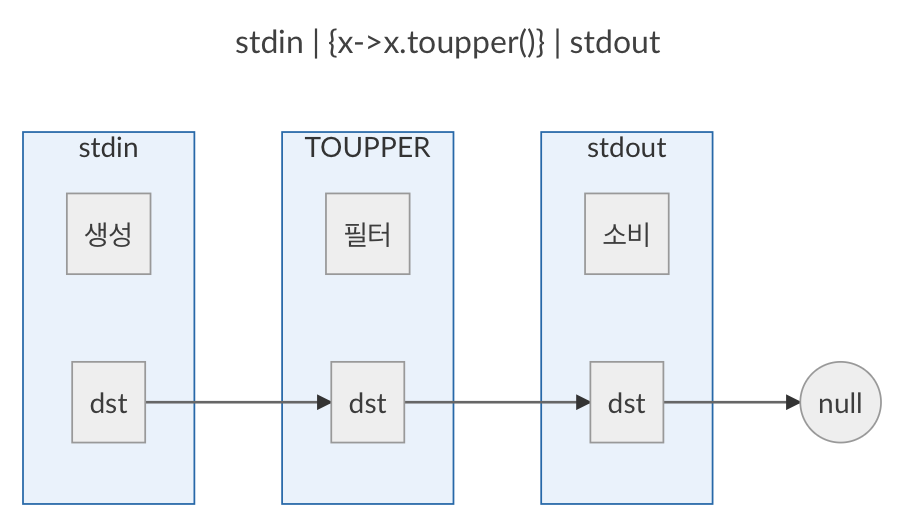
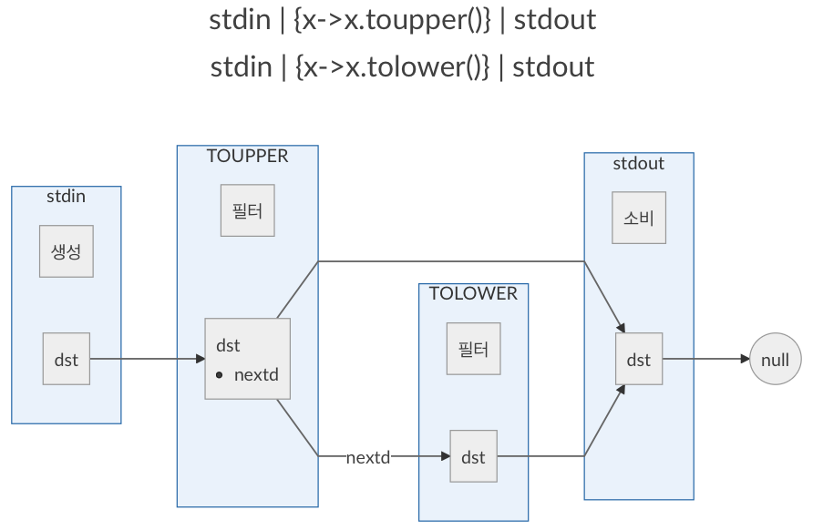
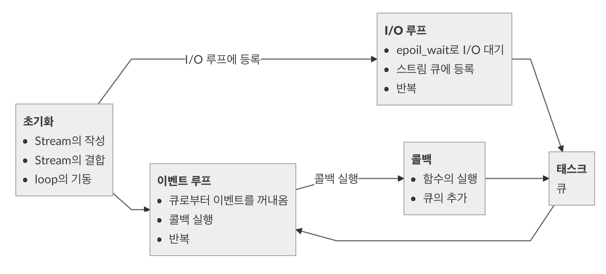

## 2-4 이벤트 루프 

> 이어서 Streem언어의 구현을 이어간다. Streem은 해외 뉴스 사이트에서도 소개되는 등, 솔직히 만든이인 나 자신도 예상외의 전개에 놀랐었다. 이번에는 Streem의 문법을 조금 개량한 후, Streem구현의 코어인 스트림의 실행 프로토타입 개발에 대하여 다뤄보겠다. 


잡지는 원고의 집필부터 편집, 교정, 인쇄 등의 공정을 거쳐 서점에 배포된다. 닛케이리눅스(Nikkei Linux)가 발매되는 것이 매월 8일경이어서, 집필은 그 전에 완료를 시킨다. 여러분들이 닛케이 리눅스를 읽을 때에,  1개월전에 집필한 원고를 읽고 있는 것이다. 

2-3절 원고를 집필하는 도중에 Streem의 문법 체커를 만들었다. 여기에 간단한 README를 붙여 ‘GitHub’에 업로드했는데, 이를 눈여겨본 사람이 찾아내, Streem관련 내용이 SNS등에서 확산되었다. 잡지가 발매되기 한 달이나 전인 2014년에 말이다.

제대로 움직이는 구현이 아닌데도, 풀 리퀘스트(pull request)를 해 주는 사람도 있어, 감동했다. 설마 문법 체크 밖에 할 수 없는 프로토 타입이, HackerNews등에서 화제가 된다고는 생각지도 못했다. 원래 1월 8일 발매된 2015년 2월호의 해설용 코드이므로 Copyright 표기를 2015로 했다면 좋았을 거라는 의견, 기타 눈여겨볼만한 지적 등, 정말로 예상외의 전개였다. 아무래도 ‘Ruby를 만든 그 Matz가 새로운 언어를 만들었다’는 건 나의 상상 이상의 화제성이 있었던 것 같다.
오랫동안 오픈 소스 활동에 관련되어 왔고, 오픈 소스가 활성화 되기 위해서는, 다이나믹한 구현과 커뮤니티가 필요하다고 생각하고 있었다. 그러나, 이 Streem의 경험에 의해서 새로운 지견을 얻을 수 있었다. 비록 프로토타입이나, 제대로 움직이는 구현물이 없어도, 개념이 잡혀있고 공유를 시작할 수 있으면, 그것만으로 오픈 소스는 움직이기 시작하는 것이었다. 

### ■ 코어 구현 착수

문법에 대해서는 어느 정도 틀이 정해졌으므로, 이번에는 다른 방면으로부터 접근을 해 보자. 구문 해석기에 이은 코드 생성과 가상 머신의 구현도 해야 되지만, 일단 Streem 구현의 코어인 스트림 실행의 프로토 타입 구현을 착수해 보자.

우선 아래와 같은 Streem 프로그램이 있다고 하자.

```
stdin | {x->x, toupper()} | stdout
```

이 프로그램의 실행은 아래 3개의 태스크로부터 만들어지는 파이프라인을 구축한다. 

* 표준 입력으로부터 1행을 읽어들인다
* 읽어들인 행에 함수를 적용한다
* 그 결과를 표준 출력에 적는다

마지막에 구축된 파이프라인의 처리를 실행하게 된다. 

우선 이 파이프라인의 구축과 실행을 하는 C프로그램을 프로토타이핑으로 개발해 보자.

#### 프로토타입 main

프로토타입의 C프로그램의 main 함수가 (그림 1)에 나와있다. 우선 파이프라인을 구성하는 요소를 표현하는 구조체가 strm_stream이 된다. main 함수의 앞부분에서 이번 프로토 타입의 파이프라인을 구성하는 세 개의 요소를 초기화하고 있다. 그리고 strm_connect()함수로 이들 세 개의 strm_stream을 연결하고 있다. Streem 프로그램을 실행하면 내부에서 이뤄지는 처리 방식이다. 그리고 마지막으로 strm_loop()함수로 파이프라인 처리를 실행한다. 처리가 완료되면 strm_loop()의 실행이 끝나고 프로그램이 종료된다

```
int
main(int argc, char **argv) 
{
    strm_stream *strm_stdin = strm_readio(0 /* stdin*/); 
    strm_stream *strm_map = strm_funcmap(str_toupper); 
    strm_stream *strm_stdout = strm_writeio(1 /* stdout */);

    /* stdin | {x->x.toupper()} | stdout */ 
    strm_connect(strm_stdin, strm_map); 
    strm_connect(strm_map, strm_stdout); 
    strm_loop();
    
    return 0; 
}
```

<center>
    (그림 1) 프로토타입 main함수
</center>


#### 파이프라인 구조

파이프라인을 표현하는 구조체 ‘strm_stream’의 정의를 (그림 2)에 나타내었다.

```
struct strm_stream { 
    strm_task_mode mode;   /* 생성/필터/소비 중의 하나 */ 
    unsigned int flags;    /* flag */
    strm_func start_func;  /* 개시함수 */
    strm_func close_func;  /* 후처리함수 */
    void *data;            /* 스트림 고유 데이터 */
    strm_stream *dst;      /* 츨력 스트림 */
    strm_stream *nextd;    /* 출력 링크*/
};
```

<center>
    (그림 2) strm_stream
</center>


strm_stream의 구조체는 dst포인터로 링크되어 파이프라인을 구성한다(그림 3).하나의 스트림이 복수의 스트림으로 연결되었을 경우, 그러한 스트림이 dst 링크의 nextd 필드로부터 참조된다(그림 4).이와 같이 복수로 분기하거나 혹은 복수의 스트림으로부터 하나의 스트림이 참조되거나 하는 방식으로, 스트림의 네트워크가 구성된다(대부분의 경우는 직렬이겠지만). 이 네트워크를 파이프라인이라고 부른다.




<center>
    (그림 3) 파이프라인(cat의 예)
</center>



<center>
(그림 4) 복수 스트림 결합
</center>


Streem의 프로그램 본질은 이 스트림의 정의와, 파이프라인 구축에 있다. 그 다음은 구축된 파이프라인에 이벤트를 흘려보내태로 처리를 진행한다. 

#### 이벤트루프는 독자적으로 구현

실제 이벤트 처리를 실행하는게 strm_loop()함수이다. 이 함수가 실행해야 할 것은 아래와 같다. 

* I/O 대응 후 이벤트 발생시킴
* 발생한 이벤트에 대응하는 처리를 수행. 입력이라면 데이터를 읽어들이고 나누는작업 등이 된다.
* 이벤트 처리의 결과를 파이프라인의 다음 스트림으로 전송하고 전송받은 쪽의 처리를 실행
* 이후 반복수행함

이러한 이벤트 처리를 실행하는 라이브러리는 이미 나와 있고 유명한 것을 예로 들면 아래와 같다. 

* libevent
* libev
* libuv

libevent는 이벤트 처리 라이브러리의 원조격이다. I/O등에 수반하는 이벤트 처리를, 콜백을 사용해 실현하는 일련의 라이브러리의 원조가 아닐까 한다.
libev는 libevent의 몇가지를 개선한 라이브러리다. API는 다르지만 하나의 파일 디스크립터에 대한 watcher의 수의 제한 철폐나 속도 개선이 주요한 변경점이다. libuv는 node.js를 위해 libev를 베이스로 개발된 이벤트 처리 라이브러리이다. 최대의 차이는 UNIX 이외의 OS(즉 Windows)에서도 동작하는 점이다. 또, 쓰레드 관련의 API가 비교적 충실하다.

처음에는 Streem도 이것을 사용해 구현하려고 했었지만, 멀티 쓰레드 부분에서 실패했다. Streem의 구현에서는 멀티 쓰레드를 활용하고 싶었지만, 이러한 이벤트 처리 라이브러리는 멀티 쓰레드를 지원하지 않는다. 보다 정확하게는 쓰레드를 넘어 이벤트 접수를 할 수 없다. 또 Streem에서는 seq()과 같은 I/O가 아닌 이벤트도 많이 이용될 것이라는 점도 생각이 났다. 그래서 적어도 당분간은 자기제작으로 이벤트 루프를 구현하기로 했다. 

하지만 이런 작업은 단순히 나의 무지에서 오는 것일 가능성은 부정할 수 없다. 어쨌든 나 자신은 이벤트 드리븐 프로그래밍은 정말 오랜만에 하는 거고 멀티슬레드 프로그래밍에 대한 경험은 전혀 없다고 해도 과언이 아니다. 그에 비하면 초기 Ruby의 쓰레드 시스템은 스스로 만들어 구현하기도 했지만... 
그러고 보니 대학 졸업 후, 입사한 회사에서 XWindow 툴 키트를 독자 개발했을 때에는, 이벤트 드리븐 프로그래밍이였구나.

어쨌든, 이벤트 처리 라이브러리에 관한 조사는 향후도 계속하려고 한다. 어떤 방법으로든 요구를 충족시킬 수 있다면, 독자적인 구현은 하지 않는 것이 훨씬 당연한 것이기 때문이다. 

#### I/O이벤트 검출

이벤트 드리븐 프로그래밍의 입출력에 있어 중요한 것은 ‘블록(block)’의 회피이다. 이 경우의 블록이라는 것은, 데이터가 도착하지 않은 타이밍에서 데이터를 읽으려고 할 때 데이터가 올 때까지 시스템에 대기가 걸리는 현상을 말한다. 거기에서 실제 읽어들이기 전에 파일디스크립션에 데이터가 도착했는지 알 필요가 있다.

이를 위한 방법은 몇가지가 있는데, 그 가장 고전적인 것은 select 시스템 콜이다(그림 5). 그러나 select에는 결점이 있어, 대기할 수 있는 파일 디스크립터의 수에 상한이 있는 것과 n개의 파일 디스크 립터의 체크에 n에 비례하는 시간이 걸려 버린다는 것이다. 이러한 제한은 최근 중요시 되고 있는 대량의 액세스를 판가름하는 경우에는 적합하지 않다. 그래서 좀 더 괜찮은 시스템 콜이 고안되었다.
‘괜찮은 시스템 콜’로서는, Linux에서는 epoll 시스템 콜이, BSD계 OS에서는 kqueue 시스템 콜이 있다. 아쉬운 것은, 이러한 시스템 콜은 아직 규격화되어 있지 않고, OS 마다 바꿔야 한다는 것이다. 실제로 가장 먼저 언급한 이벤트 처리 라이브러리 libevent, libev, libuv에서는 내부적으로 이러한 시스템 콜을 분류하고 있다.

```
include <sys/time.h> 
#include <sys/types.h> 
#include <unistd.h>
/* select 시스템 콜
    nfds - 대기 가능 최대 파일 디스크립터
    readfds - 읽기 대기 디스크립터의 집합 
    writefds - 쓰기 대기 디스크립터의 집합 
    exceptfds - 예외 대기 디스크립터의 집합
    timeout - 최대 대기 시간(또는 NULL로゙I/O゙도착까지゙대기시간) */
int select(int nfds, fd_set *readfds, fd_set *writefds, fd_set *exceptfds, struct timeval *timeout);

/* fd_set의 초기화 */
void FD_ZERO(fd_set *set);
/* fd_set에fd를 설정 */
void FD_SET(int fd, fd_set *set);
/* fd_set에fd의 설정여부를 체크 */ 
int FD_ISSET(int fd, fd_set *set);
/* fd_set의 단일fd를 클리어 */
void FD_CLR(int fd, fd_set *set);
```

<center>
    (그림 5) select 시스템 콜
</center>


#### epoll시스템 콜

이번의 프로토타이프에서는 epoll시스템 콜을 사용하는 것으로 했다. epoll은 Linux에서만 사용되지만, 이 글은 닛케이 리눅스(Nikkei Linux)에 게제되는 것이어서 그 점에 대해서는 그렇게 걱정될 것은 없을 것 같다. 단, Streem언어의 최종구현에는, epoll이외의 I/O체크가 필요하게 된다. 

epoll시스템 콜(실제는 epoll_create, epoll_create, epoll_ctl, epoll_wait 3개의 시스템 콜)은 (그림 6)과 같이 사용된다. 

select 시스템 콜과 달리, epoll에서는 받은 이벤트 정보가 구조체에 전달되기 때문에, 수신대기중인 I/O의 수를 고려해야 할 필요가 없다. 또한 epoll_ctl과 epoll_wait는 스레드가 달라도 동작하도록 보장되어 있어, 하나의 스레드가 epoll_wait 이벤트 루프를 구성하고 다른 스레드에서 대기 I/O를 한다는 구성이 가능하다. 

```
#include <sys/epoll.h>
/* epoll을 위한 파일 디스크립터를 만든다 */ 
int epoll_fd = epoll_create(10);
struct epoll_event ev;
ev.events = EPOLLIN;
ev.data.ptr = data;  /* 이 데이터가 epoll_wait에 전달된다 */ 
/* epoll에 수신대기파일디스크립터fd를 등록 */
/* EPOLLIN은 작성대기 */
epoll_ctl(epoll_fd, EPOLL_CTL_ADD, fd, &ev);

struct epoll_event events[10]; 
for (;;) {
    /* nfds - 데이터가 도달한 fd의 갯수 */
    int nfds = epoll_wait(epoll_fd, events, 10, -1); 
    for (int i=0; i<nfds; i++) {
        /* epoll_ctl에 전달된 데이터가 얻어진다*/   
        data = events[i].data.ptr;
...
    } 
}
```

<center>
    <그림 6. epoll 시스템 콜>
</center>


#### 이벤트 큐

Streem 프로토타입의 시스템 구성은 (그림 7) 과 같다. 

우선은 초기화 단계에서 스트림(strm_stream)이 생성된다. 그 후, 스트림이 결합되어 파이프 라인이 구성된다. I/O 대기 스트림은 여기에서 epoll을 사용하여 I/O 대기에 등록된다.

<center>    
     <br> (그림 7) Streem시스템 구성
</center>

그 후 I/O루프가 별도의 스레드에서 시작된다. 이 스레드는 epoll_wait를 이용하여 I/O를 기다려 데이터가 도착한 스트림을 태스크 큐에 등록한다. 태스크 큐에 등록되는 정보는 실행중인 스트림, 실행 내용의 함수 포인터, 이전 스트림에서 전달되는 데이터 (void*) 3개이다. 파이프 라인의 첫 번째 스트림에 전달되는 데이터가 없으므로 NULL이 전달된다.
그 후, 메인 스레드에서 이벤트 처리 루프가 진행된다. 메인 이벤트 루프는 작업 큐에서 하나씩 정보를 검색하고 함수를 실행한다.
함수중에서는 입력로드와 문자열화 라든지, 전달 된 데이터의 가공이라든지, 출력이나 실제 처리가 실행된다. 함수에서 다음 스트림에 데이터를 전달해야 할 때 strm_emit () 함수를 실행한다.
strm_emit() 함수는 세 개의 인수를 필요로한다. 첫번째는 현재 작업에 해당하는 strm_stream 구조,(데이터를 전달 대상 스트림이 아닌 점에 주의. 파이프 라인의 구성이 변화해도 함수를 변경할 필요가 없도록) 두 번째는 전달할 데이터 (void * 형태), 세 번째는 전달 후이 함수에 이어서 수행하는 콜백 함수다.
strm_emit()를 호출해도 다음 작업이 즉시 실행되는 것은 아니다. 전달 된 데이터는 먼저 작업 대기열에 등록된다. 함수의 실행이 끝나면 메인 루프에서 다음 작업이 차출된다.

#### 처리함수의 패턴

이러한 작업 큐의 존재에 의해 Streem 처리 함수는 루프를 사용하지 않고 구현된다. 처리 함수 구현 패턴은 크게 나누면 아래 3종류가 될 것 같다.

##### 1. 콜백에 의한 암묵적 루프

입력 처리와 같은 요소를 생성하는 타입의 스트림의 구현에 사용되는 패턴이다. 처리를 여러 C 함수로 분할하고 strm_emit()를 수행할 때 마다 콜백에 ‘이어지는’ 함수를 지정한다. 콜백에 동일한 함수를 지정하여 암시적으로 루프를 구성한다. 프로토 타입의 소스 코드는 io.c의 read_cb과 readline_cb가 이 패턴을 사용하고 있다.

##### 2. 전달받은 요소를 그대로 처리

전달받은 요소의 하나하나를 처리만 하고 자기 자신은 반복하지 않는 패턴이다. main.c의 map_recv()와io.c의 write_cb()가 이 패턴에 속한다. 이 패턴에서는 strm_emit()의 콜백에 NULL을 지정하고 있다. 

##### 3. 루프 내에서의 emit

물론 이론적으로는 루프 안에서 strm_emit() 수행이 가능하다. 이 방식은 파악하기는 쉽지만, 작업이 큐에 쌓이기만 하고, 함수가 종료 후 메인 루프로 돌아갈 때까지 처리가 전혀 진행되지 않기 때문에 권장하지 않는다.

#### 프로토타입의 소스코드

여기에서 설명하는 프로토 타입의 소스 코드는 http://github.com/matz/streem 저장소의 lib 디렉토리에 있다. 그 디렉토리에서 make 명령을 실행하면 a.out이라는 실행 파일이 생성된다. 하는 일은 표준 입력을 대문자로 출력하는 간단한 기능이다. 아마도 출판 시점과 최신 버전은 다를 수 있겠지만, 이번 기사 시점의 소스 코드에 201503 태그를 붙여 둔다. 

#### 이후의 전개

아직 프로토 타입을 만들고 실험 중에서는 있지만, 점차 앞으로의 방향이 보이기 시작했다. 먼저하고 싶은 것은, epoll의 채용을 통해 동작 환경을 Linux 한정이 아닌 다른 OS로 확장하는 것이다. libuv을 채용하도록 크게 바꾸는 방법과 epoll이 없는 환경에서는 kqueue이나 select 등을 사용하는 방법을 생각할 수 있다[^1]
또 하고 싶은 것은 다중 스레드이다. 이번 구현 범위에서 I/O 대기의 스레드가 하나, 이벤트 큐를 처리하는 스레드가 하나로 구성했다. 멀티 코어를 최대한 활용하기 위해서는 CPU 코어 수에 따른 스레드에서 처리를 분담하고 싶었다.
사실 이번 원고 집필 준비 도중 여러 스레드가 하나의 이벤트 큐에서 이벤트를 추출 실험을 했는데, 처리 시간의 관계에서 실행이 뒤바뀌는 사태가 발생하고 말았다. 이 상태로는, 예를 들어 파일을 출력하면 줄의 길이에 따라 순서가 바뀌어 버린다. 아무리 변명을 해도 그것은 잘못되었기 때문에 이번에는 이벤트 처리를 단일 스레드에서 실시하기로 했다. 아마도 스레드를 할당 단위를 개별 이벤트가 아닌 파이프 라인당 함으로써 이 문제를 해결할 수 있을 것이지만, 마감 시간이 다 되어 버려서...

#### 마치며

어디 까지나 원고의 재료이며 샘플로 탄생 한 Streem 언어이지만 의외의 관심을 끌었다. 그러나 단순한 프로토 타입으로 끝나서는 의미가 없기 때문에 앞으로도 (연재와 함께) 실용적인 수준까지 성장시켜 나가려고 한다. 잡지 연재에서 실시간으로 프로그래밍 언어의 개발 과정을 설명한다는 것은 매우 드문 시도라고 생각한다. 향후에도 기대해 주시길...


<hr>

### 타임머신 칼럼

***컨커런트 프로그래밍은 “어렵다”***

> 2015년 3월호 게재분이다. 이번에는 Streem 언어처리 시스템의 코어인 이벤트루프 부분을 개발하고 있다. 
> Streem의 경우 낱말 분석, 구문 해석 등의 언어 처리 실행부만큼 이벤트 루프의 구현도 중요하다. 이벤트 루프의 구현은 상당히 어렵기 때문에, 사실은 기존의 라이브러리를 사용하고 싶었지만, Streem에서 요구되는 것과 같은 멀티 스레드에 대응하는 것 같은 라이브러리가 존재하지 않았기 때문에 어쩔수없이 자기제작을 했다. 이번에 개발 한 것은 단일 스레드 버전이다.
> 다음 2-5절에서 멀티 스레딩을 다루게 된다. 문제는 산적해 있다. 솔직히 이 책의 컨커런트 프로그래밍에 대한 부분은 시행 착오와 실패의 기록 밖에 없다. 변명 밖에 되지 않겠지만 나같이 아둔한 이에게 컨커런트 프로그래밍은 복잡한 것이다. 그래서 추상도가 높고 동시 프로그래밍의 어려움을 은폐 해주는 Streem 같은 언어가 필요하다. 하지만 아무도 대신 만들어주지 않기 때문에 스스로 만들 수 밖에 없었다. 이번 이벤트 루프 이외에도 문법을 변경했다. 그러나 서적 판에서는 이해의 용이성을 위해 단계적인 문법 변화의 설명은 본문에서 생략되어 있다. 한편, 왜 문법을 변경했는지 이유 부분은 언어 디자인의 자료로서 유효하다고 생각하기 때문에 마지막 칼럼으로 덧붙여 둔다. 이번 변경 이전의 문법은 
>
> 『함수표현은 {|x|...}와 같이 인수를 ||로 싼다.』
>
> 였었다. 이를 {x->...} 라고 하는 형식으로 변경하고 있다. 또 원고 게제시에는 ‘if문의 조건식을 괄호로 싸지 않는다’ 라고 하는 문법이었지만, 이는 먼저 문법의 단순화를 위해 결국 조건식을 괄호로 싸는 문법으로 변경하였다. 


### ---문법을 개선한 이유---

문법 검사기도 완성하여 Streem 언어의 샘플 프로그램을 몇 가지 적어 보았지만, 조금 부족하다고 생각되는 점이 나왔다 
Streem에서는 Ruby에서 상속 블록 (익명 함수)의 인수를 기술하기 위하여 "|"를 아래와 같이 사용한다.

```
{|x| x * 2}
```

하지만, Streem에서는 ‘|’ 기호는 스트림의 결함에 빈번히 사용되는 문자이다. 2-3절의 예에서도 아라와 같은 표현이 있었다. 

```
ary.map{|c| P |c|}
```

이것은 혼란의 근원이며, 분명히 말하면 그렇게 아름다운 표현은 아니다. 여기서 익명함수를 표현하는 문법을 조금 변경했다. 새로운 문법은 이렇게 된다 

```
{x-> x * 2}
```

인수가 없을 경우, 또는 생략하는 경우에는 ‘->’ 별로 생략이 가능하다

```
{print "hello\n"}
```

이들 문법은 Groovy와 Swift를 참고했다. 조금 모던해진 느낌이 나지 않는가?

이걸로 문법이 조금 보기 좋게 되었다. 문법이 보기 좋은지의 여부는(적어도 나에게는)프로그래밍의 모티베이션에 관계되는 것이기 때문에 이렇게 하기로 했다

##### 문법충돌의 발생

그러나 이러한 변경으로 인해 문법의 충돌이 발견되었다. Streem에서는 if문 등을 정리하는데도 ‘{}’을 이용하는데 이와 익명함수가 충돌 한 것이다. 정확하게는 함수 호출 뒤에 블록을 지정하면 마지막 인수로 익명 함수가 전달된다는 문법적 구조가 있는데, 이것이 충돌의 원인이었다.
‘문법의 충돌’이 어떤 의미인지 잘 모를 분들이 있을 지도 모르겠다. 낱말해석기에 따라 토큰에 분할된 프로그램(코드)를 읽어들이면서, 문법 규칙을 비교할 경우, 어떤 문법 규칙을 적용할 것인가를 결정하지 못하는 것을 ‘충돌’이 일어났다고 부른다.

이번 경우는

```
if foo(x){
    print("hello\n")
}
```

이라는 프로그램에서, ‘foo(x)’까지 읽고나서 다음에 ‘{’라는 문자가 왔다면, 이것이 if문 본체의 시작점인지, 또는 foo라는 함수에서 호출하는 익명함수인지의 판별이 어려운 사태가 발생한 것이다. 

##### 해결방법은 세가지

이 문제의 해결 방법을 몇가지 생각해 보자. 하나는 if문의 조건식 부분을 C와 같이 반드시 괄호내에 오도록 하는 것이다.

```
if (foo(x)){
    print "hello\n"
}
```

이것으로, 함수의 호출과 if문 본체의 시작점인지는 명확히 구별이 가능하다. 하지만, 현대 언어에서는 if문의 조건식이 괄호안에 적지 않는게 주류가 되어 버렸고(Swift, Go등), 무엇보다 타이핑을 해야할 양이 늘어나기 때문에 그렇게 바람직한 방향은 아니라는 생각이 들었다. 

다른 아이디어로, 익명함수의 시작이 하나의 ‘{’ 여서 if문 본체 시작점과 구별이 안되는 것이 원인이기 때문에 별도의 기호를 도입하여, 익명함수를 명시하는 것도 생각해 봤다. 예를 들어 익명함수를 Ruby의 lambda와 같이 ‘->’로 시작하는 것은 어떨까? 그렇게 되면 익명함수는

```
-> x { x * 2}
```

와 같이 되며, 이 함수 호출 시는

```
map-> x { x * 2 }
```

와 같이 된다. 익명 함수쪽은 이렇게 하면 되지만, 함수 호출의 형식은 그렇게 제어구조답지 못하다. Ruby의 블록의 미(美)가 없어졌다는 느낌이다. 실은 Ruby에 ‘->’에 의한 익명함수를 도입한 시점에서, 이와같은 블록 문법의 도입을 검토한 적이 있지만, 썩 마음에 들지는 않아 채용하지 않았던 과거가 있다. 

결국 제3 아이디어를 채용하기로 했는데 그것은 익명함수와 함수 호출의 문법을 바꾸지 않고, if조건식 중에서는 함수호출에 익명함수를 것을 허용하지 않는 것이다. 구체적으로 (그림 A) 와 같이 된다. 

문법 규칙의 복사가 발생하는 것은 구현적으로 최선은 아니라는 생각은 들지만, 마음에 드는 문법을 위해 지불해야 하는 비용이라고 생각했다. 

하지만, 실은 2-3절에서의 해설한 문법에서도 이 충돌이 발생하는 것 같다. 왜 이것을 몰랐었을까? 그것은 내가 함수의 블록 규칙을 기술하고 이를 잊고 있었기 때문이다.. 어라라..

```
/* 문법 충돌의 회피 부분(발췌) */
/* 통상의 식 */
expr : expr op_plus expr
     | expr op_minus expr 
     | expr op_mult expr 
     | expr op_div expr
     | expr op_mod expr
     | expr op_bar expr
     | expr op_amper expr 
     | expr op_gt expr
     | expr op_ge expr
     | expr op_lt expr
     | expr op_le expr
     | expr op_eq expr
     | expr op_neq expr
     | op_plus expr         %prec '!'
     | op_minus expr        %prec '!'
     | '!' expr
     | '~' expr
     | expr op_and expr
     | expr op_or expr
     | primary
     ;

/* if등의 조건식(거의゙expr의 복사본) */

condition : condition op_plus condition 
          | condition op_minus condition 
          | condition op_mult condition 
          | condition op_div condition
          | condition op_mod condition
          | condition op_bar condition
          | condition op_amper condition 
          | condition op_gt condition
          | condition op_ge condition
          | condition op_lt condition
          | condition op_le condition
          | condition op_eq condition
          | condition op_neq condition
          | op_plus condition                %prec '!'
          | op_minus condition               %prec '!'
          | '!' condition
          | '~' condition
          | condition op_and condition
          | condition op_or condition
          | cond
          ;

/* 기본식(primary)의 공통부 */
primary0  : lit_number
        | lit_string
        | identifier
        | '(' expr ')' 
        | '[' args ']' 
        | '[' ']'
        | '[' map_args ']'
        | '[' ':' '}'
        | keyword_if condition '{' compstmt '}'
opt_else
        | keyword_nil
        | keyword_true 
        | keyword_false 
        ;

/* 블록이 없는 함수의 호출*/ 
cond : primary0
     | identifier '(' opt_args ')'
     | cond '.' identifier '(' opt_args ')'
     | cond '.' identifier 
     ;

/* 블록이 있는 함수의 호출 */
primary : primary0
        | block
        | identifier block
        | identifier '(' opt_args ')' opt_block 
        | primary '.' identifier '(' opt_args ')
' opt_block
        | primary '.' identifier opt_block
        ;

```

<center>
 (그림 A) 충돌회피문법
</center>


[^1]: 원고집필후에 select를 쓰는 풀 리퀘스트(Pull Request)가 와서, Windows와 Mac에서도 동작이 되게 되었다.  