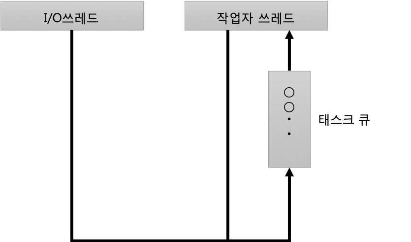
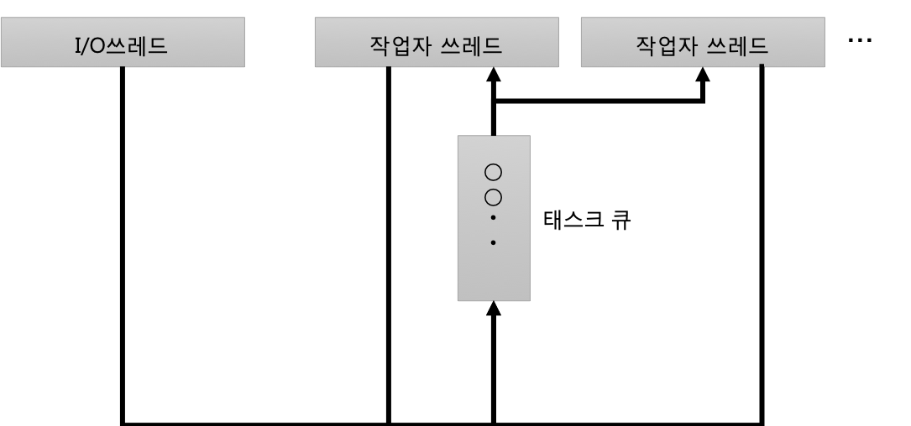
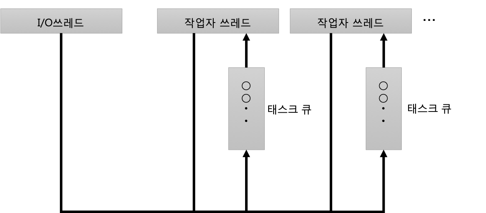
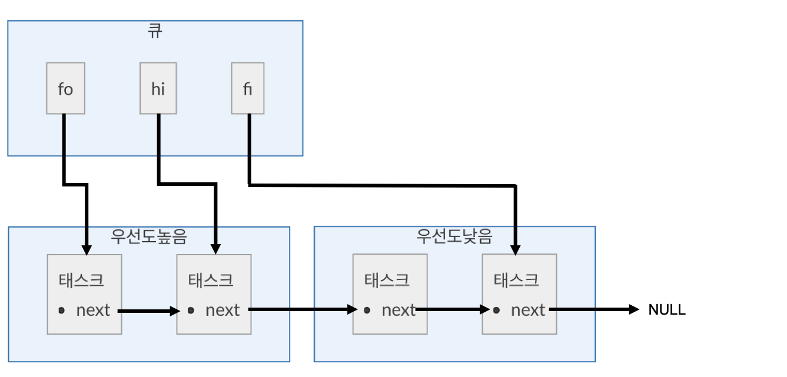
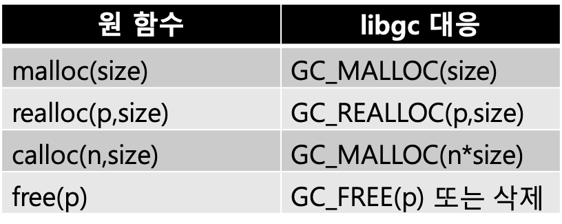

## 2-5 멀티쓰레드 객체

> 이어서 Streem언어의 코어 부분을 구현한다. 이번에는 쓰레드에 의한 멀티코어 활용에 대해 구현해 본다. 태스크를 가능한 병렬처리를 시키기 위해 테스트 처리를 하는 작업자 쓰레드를 CPU코어수만큼 동작시킨다

2-4절 마지막에 ‘멀티쓰레드화를 시키면, 실행의 순서가 바뀌는 사태가 발생했다’ 라고 적었었다.

#### 멀티쓰레드화 

어떤 일이 일어나는 것일까? 한번 생각해 보자. 먼저 복습을하면 lib 디렉토리에있는 프로토 타입 (a.out)는 표준 입력으로부터 읽어들여, 그 문자열을 모두 대문자로 변환하고 그것을 표준 출력에 기록한다.

```
% echo foo | a.out
FOO
```

2-4에서 소개 한 단일쓰레드 버전 (정확하게는 입출력 대기 I/O 쓰레드와 실제 처리하는 작업자 쓰레드가 하나씩) 프로그램 구성을 (그림 1)에 나타내었다.



<center>
(그림 1) 단일 쓰레드 버전
</center>


I/O 쓰레드가 입력 할 수있는 데이터의 존재를 감지하고, 작업자 쓰레드가 다음 작업에 데이터를 emit하거나하면 그 처리 내용이 작업 큐에 보내진다. 작업자 쓰레드는 작업 큐에서 하나씩 작업을 꺼내 처리를 계속한다.

#### 멀티코어화 시도

자, 이것을 멀티쓰레딩화 하여 생각해 보자. 멀티 코어를 최대한 활용하고자 하므로 CPU의 코어 수만큼 작업자 쓰레드를 시작하고 비어있는 작업자 쓰레드가 작업 대기열에서 작업을 제거하고 처리하는 구성을 생각해보자 (그림 2). 지금까지와 마찬가지로 작업 중에 emit가 발생하면 파이프 라인에 데이터를 전달하는 큐에 작업을 쌓는다. 또한 작업이있는 경우에는 자기자신(의 후속)도 큐에 추가한다.



<center>
(그림 2) 멀티 쓰레드화 (첫번째 버전)</center>

이 구성의 프로그램을 기동하면, 짧은 입력과 표준 입력을 키보드에서 입력하는 동안은 문제가 없다. 그러나 어느 정도 긴 파일을 입력하면 이상한 일이 일어난다. 변환 결과의 출력에서 ​행의 순서가 바뀌어 버린다. 정말 씁쓸하다. 

잠시 고민한 끝에 찾아낸 원인은 이렇다. 입력 된 데이터를 Streem 문자열로 변환하거나 문자열의 문자를 대문자로 변환 할 처리 행의 길이에 따라 시간이 걸린다. 한편, 작업자 쓰레드는 빠른 순서대로 먼저 대기열에서 작업을 제거하고 처리를 진행하게 된다. 그러자 어느 정도 긴 문자열 처리에 시간이 걸려있는 사이에, 뒤에 짧은 행 처리가 추월 해 버리는 것이다. 멀티 쓰레드 환경에서 순서와 타이밍이 보장되지 않는 것을 잊어버리는 일은 나 같은 단일 쓰레드 프로그램만 개발해온 프로그래머가 잘 빠지는 함정이다. 멀티 코어는 활용하고 싶지만 실행 순서가 보장되지 않으면 안된다.

#### 멀티코어화 재도전
그래서 순서가 보장되도록 구성을 생각했다. 순서를 보장하기 위해서는 여러 가지 방법이있을 수 있겠지만, 가장 손쉬운 것은 어떤 작업이 어떤 작업자 쓰레드에서 실행되는지를 고정하는 방법이다. 하나의 작업을 동일한 작업자 쓰레드에서 실행하면 반드시 투입 한 순서대로 처리된다. 이를 위해 첫번째 버전과 비교할 때 아래와 같은 사항이 변경된다. 

* 태스크큐를 작업자 쓰레드별로 할당.
* 처음실행시 태스크가 실행하는 작업자 쓰레드를 결정해 버린다.

작업이 실행되는 쓰레드가 정해져 있기 때문에 순서가 뒤바뀔 일은 없으며 이제 제대로 움직이게 되었다.

멀티 코어를 활용하는 것을 기대하여 다음과 같은 규칙을 정했다.

첫 번째 규칙은 파일 입력과 같은 생산자 태스크를 처음 시작할 때 대기가 가장 적은 큐에 작업을 추가한다. 이것은 작업자 쓰레드의 부하 분산을 위해서이다. 다음 작업자 쓰레드 n으로 수행되는 작업이 emit 할 때 emit하는 작업이 실행되는 작업자 쓰레드 (이미 결정되어 있지 않으면)는 작업자 쓰레드 n+1에서 실행하도록 규칙을 정한다. 이는 파이프 라인이 복수 존재하는 경우 첫 번째 작업의 종료를 기다리지 않고 다음 작업의 처리를 시작할 수 있게 한다.

이 두번째 버전의 구성도는 (그림 3)에 나타내고 있다



<center>
(그림 3) 멀티 쓰레드화 (두번째 버전)</center>


그런데, 태스크 큐이지만 기본적으로 먼저 투입 한 작업이 순차적으로 실행되는 구조로되어 있다. 작업자 쓰레드의 루프는 큐에서 작업을 하나씩 실행 파이프 라인이 모두 끝나면 루프는 종료되도록 구현되어 있다.

#### 우선 순위가 있는 큐
자, 여기까지 개조를 통해 이벤트 루프의 멀티 스레딩에 성공을 했지만, 하나 신경이 쓰이는 부분이 있다.
파이프 라인에서의 작업은 생산자 → 필터 → … → 소비자의 형태로 생산자가 파이프 라인을 시작하고 거기에서 전달 된 데이터를 뒷단의 필터가 차례로 가공하고 마지막으로 소비자가 사용하는 형태로 처리된다. 여기에서 파이프 라인의 단계 길어지면 파이프 라인 뒤로 갈수록 처리가 진행되지 않을 위험이 있다.

예를 들기 위해 간단히 2CPU에서 3단짜리 파이프라인이 있다고 가정해 보자. 이후 n번째의 작업자 쓰레드를 ‘작업자 n’, n번째 큐를 ‘큐n’, 파이프라인 n단계의 태스크를 ‘태스크n’이라고 부르도록 하겠다. 

이 케이스에서 처리는 아래와 같이 진행될 것이다. 

(1) 작업자1에 태스크1(생산자)가 emit, 큐2에 태스크2 추가
(2) 작업자2에 태스크2(필터)가 emit, 큐1에 태스크3 추가
(3) 작업자1에 태스크3(소비자)가 실행

하지만, 놓쳐서는 안될 점은, 작업자1이 emit한 후, 태스크1은 자기자신을 큐1에 추가한다. 그리고 태스크1은 아마 타이밍적으로 (2) 에 큐1에 태스크3을 추가보다 이른 단계에서 추가된다. 그렇게 되면, 파이프라인을 데이터 흐름이 종료되기 전에, 다음 데이터가 투입되게 된다. 결국, 점점 데이터가 생산되고 큐에 작업은 쌓이는데, 작업자에 의한 처리는 지연이 발생한다. 그렇게 되면 큐가 점점 길어지고 메모리 낭비로 이어진다. 생산과 소비의 균형을 유지해야 할 필요가 있다.

이에 이번에는 우선 순위가 있는 큐를 도입했다. 즉, 파이프 라인의 앞에 있는 생산자 작업보다 데이터를 가공하는 필터 작업과 소비자 작업을 우선적으로 처리하도록 한다. 이렇게 해서 큐가 함부로 쌓이는 것을 피하려는 것이다. 따라서 큐의 구현에 조금 손을 보았다. 

#### 큐의 구현

그러면, 큐의 구현을 보도록 하자. Streem의 큐를 표현하는 구조체는 (그림 4)와 같다. 

```
struct strm_queue_task { 
    strm_stream *strm;
    strm_func func;
    strm_value data;
    struct strm_queue_task *next;
};
struct strm_queue {
    pthread_mutex_t mutex;
    pthread_cond_t cond;
    struct strm_queue_task *fi, *hi, *fo;

};
```

<center>
    (그림 4) Streem의 큐 구조체
</center>


이 구조체의 본질은, strm_queue_task 구조체의 링크 리스트다. 큐의 추가와 추출의 처리를 보여주는 그림이 (그림 5)이다. 단 (그림 5)에서는 기본적인 처리만 발췌한 것이다. 

```
● 추가 

void 
strm_queue_push(strm_queue *q,
    struct strm_queue_task *t)
{
    if (q->fi) {
        q->fi->next = t; 
    }
    q->fi = t;
    if (!q->fo) {
        q->fo = t; 
    }
}

● 추출
int
strm_queue_exec(strm_queue *q) 
{
    struct strm_queue_task *t; 
    strm_stream *strm; 
    strm_func func;
    strm_value data;

    t = q->fo;
    q->fo = t->next; 
    if (!q->fo) {
        q->fi = NULL; 
    }
    strm = t->strm; 
    func = t->func; 
    data = t->data; 
    free(t);

    (*func)(strm, data);
    return 1; 
}

```

<center>
    (그림 5) 큐의 추가 및 추출(발췌)
</center>


큐의 기본구조는 strm_queue구조체의 fo(first out)멤버로부터 이어지는 링크 리스트이다(그림 6). 추출은 fo로부터 하나의 태스크를 추출하고, fo가 다음 태스크를 가리키도록 갱신한다. 추가는 링크리스트 끝의 태스크의 next가 새로운 task를 지정하도록 링크시킨다. 매번 링크리스트를 조사해 끝을 찾는 것은 비효율적이기 때문에, fi(first in)멤버로 끝을 가리키고 있다. 



<center>
(그림 6) 링크리스트에 의한 큐
</center>


#### 우선도의 구현

다음으로 우선 순위 큐를 구현한다. 이것은 fi 및 fo 사이를 가리키는 hi (high priority input)라는 포인터를 제공한다. 우선 순위가 낮은(생산자) 작업을 추가 할 때 이제까지 해 왔던 것처럼 fi에 작업을 추가한다.
그 이외의 작업의 경우에는 hi 가리키는 ‘우선 순위가 높은 작업의 끝’에 작업을 추가한다. 이렇게하면 fi에서 연결 링크 목록 전반적으로 높은 우선 순위 → 낮은 우선 순위의 순서로 작업이 정렬된다. 작업에서 큐를 꺼낼 때 우선 순위를 신경쓰지 않고 앞부분에서 추출할 수 있다. 

#### 배타(排他)제어

이 작업 큐에 작업을 추가하는 쓰레드와 작업을 꺼내 실행하는 쓰레드는 대부분의 경우 다른 쓰레드일 것이다. 다시말하면, 어느 쓰레드가 큐를 다시 작성하는 동안 다른 쓰레드도 쓰려고하면 링크 목록의 무결성이 손상 될 수 있다. 이 위험을 피하기 위해 여러 쓰레드가 동시에 업데이트를 시도 할 수있는 데이터 구조는 실제 업데이트가 독립적으로 이루어 지도록 배타 제어를 해야한다. 이를 위해 사용되는 것이 mutex다. (그림 4) strm_queue_task 구조는 pthread_mutex_t 유형 mutex라는 멤버가 존재한다. 

mutex의 사용법은 간단하다 (그림 7). 먼저 초기화다. 그리고 배타 제어를 할 필요가 있는 ‘위험 지역’을 lock과 unlock로 묶는다. 큐의 구현은 q->fi, q->hi, q-> fo를 업데이트하는 부분이 ‘위험 지역’이되기 때문에 이러한 작업을 하는 부분을 lock과 unlock로 묶을 수 있다. 이것만으로 lock과 unlock으로 둘러싸인 영역을 실행하는 하나의 쓰레드로 제한 할 수 있다.
조심해야 할 것은, mutex는 명시적인 배타 제어 밖에 하지 않는 것이다. 데이터를 업데이트하는 프로세스를 lock과 unlock로 둘러싸는 것을 잊어 버리면 매우 귀찮은 상황이 발생할 것이다. 

```
(1) 초기화
pthread_mutex_init(&mutex, NULL);

(2) Lock
pthread_mutex_lock(&mutex);

(3) Unlock
pthread_mutex_unlock(&q->mutex);
```

<center>
    (그림 7) pthread_mutex_t의 사용법
</center>


#### 큐가 비었을 경우의 처리

또 처리해야 할 부분은 큐가 비어있을 때 어떻게 대처할지이다. 수행해야하는 작업이 큐에 존재하지 않는 경우는 아무것도 할 수 없다. 큐에 작업이 추가 될 때까지 마냥 기다려야 한다.
가장 간단한 구현은 루프를 돌면서 큐를 자주 체크하며 태스크가 들어왔는지 확인하는 방법이다. 이러한 방법을 ‘비지 루프(Busy loop)’라고 한다. 그러나 비지 루프는 작업이 올 때까지 계속 루프를 돌기 때문에, 쓸데없이 CPU의 전력을 소비하게 된다. 이러한 방식은 대기 시간이 짧은 것에 확신을 가질 때에 밖에 사용할 수 없다. 이번 채용 한 것은 POSIX thread 라이브러리 ‘조건 변수’라는 기능이다. 조건 변수는 상호 배타적 잠금 mutex와 함께 사용한다. 예컨대, (그림 8)의 프로그램 (a) 부분처럼 mutex에 잠겨있는 사이에 pthread_cond_wait()를 호출하면 다른 쓰레드에서 호출 될 때까지 ‘대기’ 상태에 들어간다.

```
(a) 조건 변수 대기 방법
    pthread_mutex_lock(&mutex);
    while (!fo) { // fo가 설정되어 있지 않을지도... 
        pthread_cond_wait(&cond, &mutex); 
    }
    pthread_mutex_unlock(&mutex);

(b) 조건 변수 발생 방법
    pthread_mutex_lock(&mutex);
    // 조건이 성립하는 처리
    // 조건이 성립하면 '발생' 
    pthread_cond_signal(&cond, &mutex); pthread_mutex_unlock(&mutex);

    // 복수의 대기가 있을 때 signal은 그것들 중 하나를 발생
    // pthread_cond_broadcast는 전부 한번에 발생시킴
```

<center>
    (그림 8) 조건변수 사용법
</center>


이번에는 큐의 태스크를 수행하려고 할 때 큐가 비어 있으면 pthread_cond_wait()를 호출하고 큐에 태스크가 추가 될 때까지 기다리기로 했다. 배타 제어 및 조건 변수에 의한 ‘대기’를 추가한 버전은 (그림 9)와 같다. (그림 5)의 것과 비교해 보길 바란다 ((그림 9)는 q-> hi 대한 처리도 추가하고 있다).

```
int
strm_queue_exec(strm_queue *q) 
{
    struct strm_queue_task *t; 
    strm_stream *strm; 
    strm_func func;
    strm_value data;
    pthread_mutex_lock(&q->mutex); 
    while (!q->fo) {
        pthread_cond_wait(&q->cond, &q->mutex); 
    }
    t = q->fo;
    q->fo = t->next; 
    if (t == q->hi) {
        q->hi = NULL; 
    }

    if (!q->fo) { 
        q->fi = NULL;
    } 
    pthread_mutex_unlock(&q->mutex);

    strm = t->strm; 
    func = t->func; 
    data = t->data; 
    free(t);
    (*func)(strm, data);
    return 1; 
}
```

<center>
    (그림 9) 큐로부터 태스크 실행
</center>


중요한 점은 pthread_cond_wait()을 둘러싼 조건 부분이 if 대신 while이라는 점이다. 사실 원래의 코드는 if로 체크를 하고 있었지만, pthread_cond_wait()는 조건이 성립하지 않는 경우에도 무슨 원인인지 값이 원래대로 돌아가 버리는 경우가 있다고 해서, 이의 체크가 필요하다고 지적되었다. 역시 쓰레드 프로그래밍은 어렵다

태스크 추가에 대해서도 이와 마찬가지로, 큐의 데이터를 조작하는 부분을 mutex의 lock과 unlock로 묶고 그 끝에서 pthread_cond_signal()을 부른다.


#### 멀티쓰레드 처리의 디버그

이와같은 느낌으로 프로그램을 개발하고 있지만 매회 기사로 작성되는 내용에 맞게 Streem 처리 시스템을 어떻게 개발 할까 생각하기도 한다. 결과적으로 ‘기사를 써야한다’는 사명감 때문에 느리지만 꾸준히 개발이 진행되고 있다.
이번에 설명하는 부분도 기사를 쓰면서 디버깅하고 있다. 물론 기사 쓰는 시점에서 프로그램은 기대한대로 작동하는지 확인하고 기사를 쓰고 있다. 그러나 처음부터 완벽한 프로그램이 만들어질 리는 없고, 수차례 디버깅을 반복하게 된다. 하지만 멀티 쓰레드 프로그램의 디버깅은 힘들다. 이번 변경에 따라 Streem 처리 계의 멀티쓰레드화가 진행되었기 때문에 더욱 힘들다.

싱글 쓰레드 프로그램이면 gdb 등의 디버거를 활용하면 되지만, gdb의 쓰레드 대응은 적어도 나에게는 사용하기가 쉽지 않았다. 내가 잘 몰라서 그런 것일수도 있을 것이다.  때문에 디버거를 활용 한 쓰레드 프로그래밍의 디버깅에 정통한 분들이 계시면 꼭 가르쳐 주었으면 한다. 그럼 어떻게 디버깅을 했냐는 물음에 대답을 하면, 부끄러운 이야기입니다만, 원시적인 printf 디버깅을 활용했다. 이때 주의해야 할 점이 몇 가지 있다.

첫째, 디버깅 출력을 stderr(표준 에러 출력)로 하는 것이다. 이를 통해 프로그램의 정상적인 출력 및 디버그 출력을 분리 할 수 있다. 예를 들어,

```
% a.out | wc
```

라고 하면, 표준출력의 행수와 문자수, 단어수를 표시할 수 있지만, 디버그 출력은 콘솔로 출력이 된다. 디버그 출력을 포함하여 스크롤 시켜보면

```
% a.out |& lv
```

라고 하면 표준 출력과 표준 에러 출력이 같이 되는 것을 볼 수 있다. 

둘째, 디버거에서 확인하고 싶어지는 값을 출력하는 fprintf를 섞어서 사용할 필요가 있다. 예를 들어 구조체의 멤버가 제대로 초기화되었는지, 올바른 순서로 처리가 실행되고 있는지 등을 확인해야 할 경우가 발생한다. 이 때 유용한 것이 fprintf의 %p 지정자다. %p는 포인터의 주소를 표시 해주는 형식 지정자이다. 보통 주소는 16 진수표기로, NULL의 경우는 ‘(nil)’로 표기 해주는 것이 좋다.

셋째 커밋 때 git diff 등을 활용하여 디버그 출력을위한 fprintf이 모두 사라 있는지 확인하는 것이다. 디버그 출력을 붙인 채로 전세계에 공개하면 창피한 일이다.

#### 구조체에 객체를 표현

지금까지 Streem 데이터는 구조체나 문자열을 void*로 캐스팅하고 전달했다. 타입 관련 오류는 스스로 조심해야하며, 잘못하면 프로그램의 충돌이 발생해 버린다.

그러나 언어 처리 시스템으로서는 어떤 객체를 가리키는지에 대한 타입 정보를 관리하고 싶을 것이다. Streem에서는 (그림 10)과 같은 구조체를 사용하여 객체를 표현하기로 했다.

```
enum strm_value_type { 
    STRM_VALUE_BOOL, 
    STRM_VALUE_INT, 
    STRM_VALUE_FLT, 
    STRM_VALUE_PTR,
};

typedef struct strm_value { 
    enum strm_value_type type; 
    union {
        long i; 
        void *p; 
        double f;
    } val;
} strm_value;
```

<center>
    (그림 10) Streem의 객체 표현
</center>


Streem 개체를 표현하는 strm_value는 간단한 구조로 데이터를 표현하는 union (공용체)과 타입을 표현하는 type멤버로 되어 있다. C의 데이터와 strm_value의 상호교환에는 (그림 11)에 표현한 함수를 사용한다. 이들 함수의 사용법에 대해서는 2-6절 이후에 상세히 설명할 예정이다. 

```
strm_value strm_ptr_value(void*); 
strm_value strm_bool_value(int); 
strm_value strm_int_value(long); 
strm_value strm_flt_value(double);

#define strm_null_value() strm_ptr_value(NULL)

void *strm_value_ptr(strm_value); 
long strm_value_int(strm_value); 
int strm_value_bool(strm_value); 
double strm_value_flt(strm_value);
```
<center>
    (그림 11) strm_value변환함수
</center>


객체의 표현 방법으로서, 이번에 채용한 구조체를 사용하는 방법 이외에도, Python에서 채용하고 있는 수치도 포함, 모든 포인터로 표현하는 방식과, LuaJIT에서 채용하고 있는 부동소수점 숫자에 할당해 버리는 ‘NaN Boxing’ 방식, Ruby에서 채용하고 있는 정수만 포인터에 할당하는 ‘태그 포인터’ 방식 등이 있다. 이 부분도 상당히 흥미있는 기술들이어서 나중에 자세히 설명하도록 하겠다. 

#### 가비지 컬렉션

객체를 만들 수 있게되면, 이번에는 사용하지 않는 개체를 회수 해야 한다. 즉 가비지 컬렉션(GC)이 필요하다.

가비지 컬렉션을 실현하는 방법에는 여러 가지가 있지만, 이번에는 그 중에서도 가장 쉬운 방법인 libgc를 사용하려고 한다.

libgc는 정식 명칭을 ‘Boehm-Demers-Weiser's GC’ 라고 부르며, 라이브러리 타입의 가비지 컬렉터이다. 원칙적으로 C 나 C++ 프로그램이 라이브러리를 링크하는 것만으로 malloc으로 할당 된 메모리 영역이 사용되지 않게 되면 저절로 회수해 주는 마법 같은 라이브러리다. 쓰레드도 지원하고 있기 때문에 Streem에 딱 맞다.

libgc를 사용하려면 먼저 라이브러리를 설치해야 한다. apt-get 등의 패키지 매니저를 사용하여 libgc 패키지를 설치한다. 패키지 이름은 Debian 계열 Linux(Ubuntu)에서는 libgc-dev, RedHat 계열(Fedora)에서는 libgc-devel이다.

```
% apt-get install libgc-dev
```

설치 후에는 프로그램의 코드 앞부분에

```
GC_INTI();
```

을 호출하고 (표 1)과 같이 프로그램을 수정한다. 

<center>
     <br> (표 1) libgc 수정 방법
</center>
calloc()과 free()에 대한 보충 설명이 필요할 것 같다. calloc()은 할당 된 메모리 영역을 제로로 클리어하는 함수이지만, libgc에는 해당 기능이 없다.
그러나 GC_MALLOC ()는 할당 된 메모리 영역이 클리어되었다는 것을 보증하기 때문에 인수만 조정하면 된다. free ()에 대한 가비지 수집을 수행 libgc의 특성상 원래 불필요하기 때문에 기본적인 대응은 free ()의 호출을 제거해도 무관하다.

그러나 어떤 사정이 있어 강제 해제하려는 경우에는 GC_FREE()를 사용할 수 있다. 이 경우, 사용중인 메모리 영역을 무심코 열어 버리는 버그를 도입하지 않도록 사용자가 주의해야 한다.
프로그램 수정 후 Makefile을 다듬고 libgc을 링크하도록 하면 끝이다. 얼마나 쉬운가.
그러나 libgc도 만능은 아니다. 포인터의 값을 가공하는 기법을 사용한 경우에는 제대로 GC를 할 수 없으며 내부적으로 어셈블러 코드를 이용하고있는 관계로 모든 플랫폼에 대응도 어렵다. 하지만, Streem 개체가 이뮤터블(immutable)객체라는 특성은 레퍼런스 카운트 방식의 GC및 세대 별 GC의 구현에 유리하다. 이 점을 이용하면 범용 GC인 libgc보다 효율적인 GC가 구현 될 수 있을지도 모르겠다. 이 부분의 고찰은 향후 도전 과제로 남겨 본다.

#### ‘방치’ 해온 구문해석의 진척

이처럼 최근에는 이벤트 루프의 개발에 올인한 동안 구문해석 부분은 방치하고 있었다. 하지만 방치했다 해서 진척이 없는 것은 아니다. Streem 개발 초기에 Go에서 독자적으로 처리 시스템(Streeem)를 개발 한 Mattn(Yasuhiro Matsumoto)를 중심으로 풀 리퀘스트(pull request)를 보내 주시는 분들이있어서 다음과 같이 진행될 수 있었다.

* 구문트리의 생성
* 간단한 인터프리터

내가 주도하지도 않았는데, 긴밀한 커뮤니케이션도 없이 개발이 진행되는 것은 놀라운 일이다. Streem의 개발은 내 오픈 소스에 대한 시각을 자주 바꾸어 놓는다.


#### 마치며

Streem 코어 구현도 멀티 쓰레드에 대응하여 점차 완성도가 높아지고 있다. 그러나 아직 언어로는 완성된 게 아니다. 이제 구문 분석부와 코어부를 결합하여 언어 처리 시스템으로 작동 할 수 있도록 하려 한다. 기대해 주시길...

<hr>

### 타임머신 칼럼

***가비지 컬렉션에서의 실수***

> 2015년 4월호 게재분이다. 이벤트 루프에 의한 태스크 처리의 멀티 쓰레딩을 구현하고 있다. 이번에는 mutex를 사용한 우선 순위가 있는 큐에서 멀티 쓰레드화를 구현했다. 사실이 부분은 이후 락프리 알고리즘 등으로 완전히 대체되지만, 시행 착오의 기록으로서 그대로 기록한 것이다.
> 하지만 이제 와서 원고를 다시 읽으면 당시 디버그 때문에 고생한 기억이 난다. 푸념 이지만, 멀티 쓰레드 프로그래밍 정말 디버깅이 어렵다. 버그의 발생이 타이밍에 의존하기 때문에 어떤 상태에서 문제가 발생했는지 상태 재현이 상당히 어렵기 때문이다. 프로그램의 상태를 알기 위해 디버거를 사용하거나 또는 프로그램에 printf 삽입 등을 하면 실행의 타이밍이 맞지 않아 버그를 확인할 수 없는 경우가 태반이라, 눈물이 나올 것 같을 정도였다. 이후에도 이벤트 루프 구현에는 여러가지 손을 대고 있지만 솔직히 말을하면 지금도 Streem 이벤트 루프에 버그가 없다는 확신은 못하겠다. libgc의 이용에 대해서도 보충할 것이 있다. 잡지 게재시에는 (표 1)과 같은 프로그램의 수정이 없었다. 굉장히 오래된 버전의 libgc는 malloc() 등의 함수를 대체하여 libgc를 연결하는 것만으로 가비지 컬렉션을 했던 것 같은 기억이 있어서, 제대로 된 검증도 없이 원고를 쓰고 말았다.
> 샘플 프로그램이 정상적으로 작동하고 있었기 때문에 당시에는 눈치채지 못했지만, 이것은 가비지 컬렉션을하고 있던 것이 아니라 메모리를 할당했지만 완전히 개방하지 않았던 것이다. 샘플 프로그램에서 처리하는 데이터가 크지 않았기 때문에 문제가 발생하지 않았을 뿐이었다. 부끄러운 따름이다.

