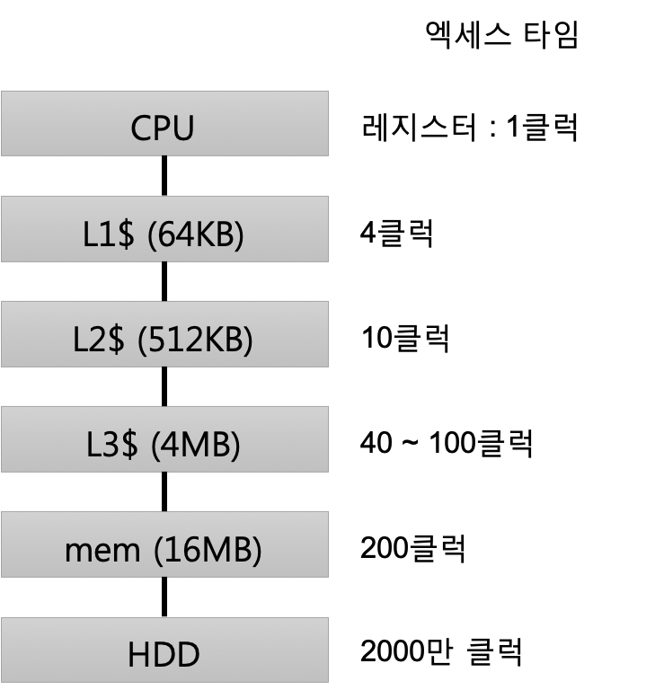
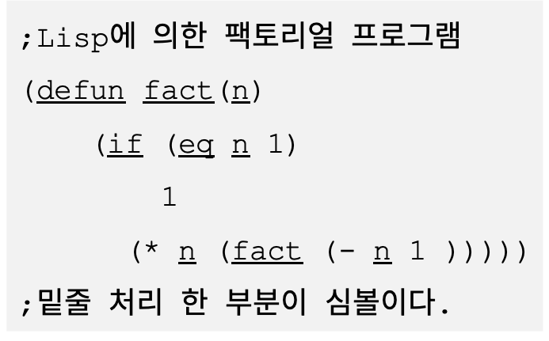

## 2-6 캐시와 심볼

> 이번에는, Streem의 구현을 통하여 메모리 액세스 상세에 대하여 배워본다. 멀티코어 환경에서는, 캐시의 효과적인 활용이 특히 중요하다. 그리고 언어설계를 통해 심볼이라고 하는 타입에 대하여 설명하겠다. 

2-5절에서 멀티 코어를 활용하기 위해 멀티 쓰레드를 지원하게 되었지만, 하나 깨달은 것이 있었다. 2-5의 구현은 파이프 라인에 태스크가 병렬로 있을 때, 여러 코어를 최대한 활용할 수 있도록 각 작업을 별도의 쓰레드에 할당했다. 그러나 냉정하게 생각하면, 이것은 별로 좋지 않은 전략이었다. 작업의 수가 적은 경우에는 그다지 영향은 없지만, 작업의 수가 많아지면 의외의 점에서 실행 성능에 영향을 줄 것 인 것을 깨달았다. 
향후 개선을 위해, 먼저 이 문제에 대해 고찰해 보겠다.

### ■ 캐시의 효과적 활용

여기에서 고려해야 할 것은 메모리 액세스 속도의 문제다. 우리는 평소 프로그램을 작성할 때, 메모리 액세스에 얼마나 시간이 걸리는지 등을 고려하는 일은 별로 없다. 원래 변수가 메모리에 할당 된 것인지, CPU 레지스터에 할당하고 있는지 조차 많은 경우에는 신경을 쓰지 않는다. 그러나 CPU에 있어서 데이터를 꺼낼 때, 어디에서 가져올 것인지는 하늘과 땅만큼 차이가 있다.
CPU는 레지스터에서 1클럭 단위로 데이터를 가져올 수 있다. 2GHz의 CPU라면 1클럭은 0.5나노초 (20억분의 1 초)이다. 그런데 동일한 데이터가 메인 메모리에 있을 경우에는 외부 버스에 액세스하여 대용량의 메모리(느리지만)에서 데이터를 찾아 전송해야 한다. 따라서 더 이상 (수백 배나) 시간이 걸린다.
그동안 CPU는 필요한 데이터가 없기 때문에 기다려야 한다. 이는 매번 메인 메모리로부터 데이터를 검색하고는 CPU가 원래 속도의 수백 분의 1의 성능 밖에 발휘하지 못하는 것이 된다.

#### 캐시의 고속화

위와 같은 문제를 해결하기 위해 오래 전부터 CPU에서는 캐시‘라는 구조에서 이 문제를 해결하고 있다.
‘캐시’의 철자는 ‘cache’다. 현금 ‘cash’와는 조금 다르다. ‘cache’라는 것은 원래는 프랑스어로 ‘시렁’,‘창고’라는 의미가 있다고 한다. 의미가 조금은 변형되어 컴퓨터의 세계에서는 ‘한 번 꺼낸 데이터 (혹은 자주 액세스하는 데이터)를 일시적으로 저장하는 기억영역’이라는 의미로 사용된다.
구체적으로는 CPU에 직결된, 작지만 고속의 저장 공간을 제공하여 메모리에서 가져온 데이터를 이 ‘캐시 영역’에 저장한다. 다시 동일한 주소에 대한 액세스가 발생한 경우에는 느린 메인 메모리에 액세스하지 않고 캐시의 데이터를 사용한다. 이를 통해 메모리 액세스 대기에 의한 성능 저하를 방지하려고 하는 것이다.

#### 다단 캐시를 만든다. 

그러나 빠른 캐시는 그만큼 용량을 크게 할 수 없다. 현재 내 수중에있는 컴퓨터(CPU : Intel Core i7 2620M)는 데이터 용과 명령용으로 각각 64K 바이트 씩 밖에 탑재되어 있지 않다. 이 용량은 2015년 시점의 최신 CPU에서도 바뀐점은 없다. 그래서 캐시에 반영이 안된 데이터에 대한 액세스를 최대한 줄이기 위해 현대의 ​CPU는 캐시를 다단으로 탑재하고 있다 (그림 1). 예를 들어, Core i7의 경우 64KB는 레벨 1(L1) 캐시이고, 여기에 L1 캐시 정도로 빠른 것은 아니지만, 그것보다 큰 용량의 L2 (Level 2) 캐시가 512KB,  이보다 더 큰 용량 레벨 3(L3) 캐시가 4MB 탑재되어 있다.
많은 프로그램은 같은 주소 데이터에 자주 액세스하는 경향이 있기 때문에, 4M 바이트 캐시가 있으면 상당한 확률로 느린 메인 메모리에 액세스하지 않아도 된다.



<center>
(그림 1) 다단 캐시. 이 클록 비율은 어디까지나 개략적으로 계산한 것이다. 엑세스타임은 CPU별로 다르고 클럭 이외의 요소들도 있어 정확한 수치를 표시하기는 힘들다. ‘L1$’의 ‘$’는 ‘캐시’의 표시로서 cache(캐시)와 cash(현금)와 발음이 비슷한데서 유래한다.
</center>


#### 데이터의 갱신 과제

멀티 코어 환경에서는, L1캐시는 각 코어별로 독립적으로 가지고 있고, L2,L3 캐시는 코어들끼리 공유를 하는 경우가 많다.

그런데 캐시라는 것은 어디 까지나 일시적인 데이터 저장 장소이기 때문에, 데이터의 갱신이 발생했을 때 나중에 그것을 참조 할 수 있도록 데이터를 메인 메모리에 다시 쓸 필요가 있다. 또 다른 코어가 메모리에 데이터를 덮어 쓸 경우 현재 가지고 있는 캐시의 데이터는 오래되어 의미없는 것이 되어 버린다. 오래된 캐시는 무효화하고 다시 데이터를 로드할 필요가 있다.
이것은 사실 매우 복잡한 문제에서 프로그래밍에 대한 속담에 ‘컴퓨터 과학의 난제가 두 개있다. 캐시 무효화 및 변수 네이밍이다’(Phil Karlton)라는 것이 있을 정도다. 여기에서는 그 난제에 발을 들이지는 않을 것이다. 보기 쉽게 보이는 메모리 액세스도 CPU 내부는 매우 복잡한 일이 벌어지고 있다는 것만 소개해 둔다.


#### 파이프라인의 재고(再考)

자, 이야기를 원점으로 돌려보자. 파이프 라인에 태스크가 병렬로 있을때, 여러 코어를 최대한 활용할 수 있도록 각각의 작업을 다른 쓰레드에 할당한다고 첫머리에서 말했다. 그러면 파이프 라인을 흐르는 데이터는 다른 쓰레드에서 액세스 할 수 있게 된다. 이렇게 되면 빠른 L1 캐시에 대한 액세스 활용할 수 있는 타이밍이 적어진다.
결국, 매우 엄격한 제한이있는 캐시 용량을 효율적으로 사용하기 위해서는 동일한 데이터는 최대한 동일한 코어에서 액세스하는 것이 바람직하다. 동일한 데이터에 여러 코어에서 액세스를 해 버리면 귀중한 L1 캐시에 중복 데이터가 반영돼, 이전 데이터는 삭제되는 현상이 발생한다. 이건 좀 아닌 것 같다.
이 현상은 여러 파이프 라인이 작동하게되면 더욱 두드러 질 것이다. 현재 Streem에서 수행 할 수있는 아주 간단한 파이프 라인에서는 그다지 문제가 되지 않는 ‘캐시의 낭비’가 파이프 라인이 복잡해 지면 표면화 될 것으로 생각되기 때문이다.


#### 동일 코어로 움직임은 빠르게

예를 들어 (그림 2)의 (1) 과 같은 파이프라인을 생각해 보자. 최초의 태스크에서는 표준입력으로부터 1줄의 문자열을 읽어 들인다. 읽어들인 문자열 데이터는 L1 -> L2 -> L3 캐시를 경유해 최종적으로 메인 메모리에 작성을 하게 된다. (그림 2의 (2))
문자열을 대문자로 바꾸는 다음 태스크는 별도의 쓰레드, 다시 말해 별도의 코어에서 실행된다면, 이 데이터는 해당 코어의 L1캐시에 태운 것이 아니기 때문에 L2캐시를 찾기가 어렵게 된다. 코어간에 공유되는 경우가 많은 L2 캐시에 데이터가 남아있는 것을 기대할 수 있다. 이 경우 L2 캐시를 읽어들이는 것은 종료되어 있을 것이다. 또는 다른 파이프 라인이 동시에 실행 된 경우에는 L2 캐시가 꽉 차 있을지도 모른다. 이 경우 L3 캐시, 거기도 꽉 차면 메인 메모리에 엑세스를 하게 된다.


<center>
(그림 2) 파이프라인상의 태스크와 캐시
</center>


한편, 동일한 파이프 라인의 작업을 가능한 한 동일한 코어에 할당하도록 한 경우 캐시에 대한 액세스는 (그림 2) (3)과 같이된다. 같은 코어에 작업이 실행되는 경우 데이터가 L1 캐시에 남아있는 것을 기대할 수 있기 때문에 캐시가 넘치고 있지 않으면 빠른 L1 캐시에 액세스만으로 작업 종료 될 수 있다.


#### 캐시를 의식한다.

이처럼 현대의 CPU에서 실행되는 소프트웨어의 실행 성능은 캐시의 활용이 큰 영향을 미친다. 소프트웨어에서 캐시에 대한 액세스는 ‘투과적’ 이며, 성능 이외의 점에서 그 존재가 느껴지지 않도록 되어 있다. 하지만 성능에서 큰 차이를 낳는다. 캐시를 활용하지 않는 경우, 몇십 배 느려질 수 있다. 21세기의 빠른 소프트웨어 개발에 캐시를 활용하는 것은 중요한 일이다.
그렇다고는 하지만, 보이지 않는 만큼 캐시의 활용은 상당히 어렵다. 또한 쓰레드가 연관되면 캐시의 상태를 이해하는 것은 인간이 가능한 영역을 넘는 것이 아닐까 생각한다. 어림짐작으로 프로그램을 개선해도 성능 향상의 결과로 잘 이어지지는 않는다. 그런 경우에는 측정이다. 올바른 측정 이야말로 성능 향상의 최선의 방법이다. Linux에서 캐시 기능을 측정하는 도구로는 oprofile과 cachegrind 같은 것이 있다. 이 도구는 단순히 함수에서 얼마나 시간을 소비하고 있는지를 측정 할뿐만 아니라 각 명령어 캐시 미스에 의한 지연 등도 리포트 해 준다. 이러한 도구의 사용 방법은 미래 Streem의 성능 개선에 대해 설명 할 때 함께 살펴 보겠다.

### ■ 심볼의 취급

자, 다음은 언어의 사양 이야기이다.

Ruby는 ‘심볼’ 이라는 데이터 유형이 있다. 이것은 변수 이름이나 식별자 등을 나타내는 타입으로 이름을 갖는다. 그러한 의미에서는 문자열과 비슷하지만 문자열은 다음과 같은 점에서 다르다.

* 같은 이름을 가진 심볼은 1개밖에 없다.
* 그 결과 일치판정이 빠르다(내용을 체크할 필요가 없다)
* Ruby의 문자열과 같이 내용을 변경할 수 없다.

Ruby에서 이 빠른 속도를 이용하여 메소드명, 변수명 지정 및 키워드 인수 맵의 키와 같은 심볼을 널리 사용하고 있다.
Ruby의 심볼은 Lisp로부터 물려받은 것이다. 원래 Ruby 개발 전부터 Lisp 강한 영향을 받고 있던 나로서는 심볼의 도입은 극히 당연한 일이라고 생각했다.


#### Lisp의 심볼

1958년생의 Lisp에서는 심볼은 리스트와 함께 Lisp기본 데이터 타입 중 하나이다. 첫 번째 버전의 Lisp에도 심볼이 존재하고 있었다고 한다. 그 시대에는 오히려 문자열이 존재하지 않았다고. 문자열 타입이 없었던 때에는 심볼을 대신 사용하고 있었다고 들었었다. 심볼은 문자열보다 오래된 데이터 타입이다.
Lisp에서 심볼은 다양한 곳에 사용되고 있다.
Lisp에서는 프로그램 자체도 리스트 구조로 표현되지만, 거기에 등장하는 변수 및 함수 이름 등 이름에 관한 모든 심볼로 표현된다 (그림 3). 심볼없는 Lisp 등 생각할 수 없다.



<center>
(그림 3) Lisp프로그램 중 심볼
</center>


#### 초심자의 당황

그래서 Ruby도 심볼을 도입했지만, Lisp을 잘 알지 못하고 Ruby를 배우는 사람들  중에는 왜 문자열과 심볼이 다른지 이해하기 어려운 사람이 있는 것 같다.
나로서는 기호와 문자열이 다른 것은 너무 당연하여 처음엔 무엇에 불만을 가지고 있는지 이해할 수 없었다. 그러나 여러 번 같은 불평을 듣고 불만의 이유와 배경이 점차 이해되게 되었다.
즉, 내부 데이터를 취하는 방법은 차치하고, 외부에서 보면 문자열 및 심볼은 같은 ‘문자의 열로 표현되는 내용’을 가진 존재로 보인다. 그런 관점에서 심볼은 단순히 변경할 수 없는 문자열인데, 왜 적용 할 수있는 작업(메소드)이 압도적으로 적은 불편 것으로 보이게 하는 것이냐 이다. ‘불편하니까 문자열과 같은 메소드를 준비하자’라든가 ‘문자열과 심볼을 통일하자’는 요청을 여러 번 받았다. 그래서 결국 ‘아, 문자열과 심볼에 대한 시각이 나와 근본적으로 다르다’라는 것을 이해할 수 있게 되었다. 이런 ‘오해’혹은 ‘인지의 차이’가 발생하는 것은 Ruby만큼 강하게 Lisp의 영향을 받지 않은 언어에는 심볼 같은 것이 등장하지 않기 때문이다. 하지만 이들 언어도 내부적으로는 심볼 의 기능을 다른 방법으로 지원하고 있다.


#### 타 언어 에서 심볼에 해당하는 것

그럼, 심볼이 없는 언어는 심볼의 기능을 어떻게 구현하고 있을까?
가장 쉬운 방법은 모든 일반 문자열로 대체하는 것이다. 내부 식별자 (이름) 관리에도 일반 텍스트를 사용하는 것은 그리 어려운 일이 아니다. 다만 그만큼 성능을 걱정해야 한다. 
일반 문자열을 식별자로 사용하는 것의 가장 큰 단점은 비교 문자열의 길이에 비례하여 처리 시간이 길어진 다는 것이다. 문자열 ‘abcd’와 ‘abce’의 차이를 판정하기 위해서는, 한문자 씩 비교하고 네번째 문자까지 체크해야 한다. 식별자처럼 자주 비교되는 것에 일반 문자열을 사용하면 성능 문제를 일으키기 쉽다.
그래서 파이썬과 같은 일부 언어는 심볼을 도입하는 대신 문자열에 특별한 연구를하여 성능 문제를 해결하고 있다. 
구체적으로 특정 조건을 충족하는 문자열에 대해서는, 동일한 내용을 가지는 것은 동일한 객체를 반환하게(interning)하여 내용을 보지 않고 일치 검사를 할 수 있도록 한다. 

일정한 조건은 파이썬의 경우 다음 두 가지 중 하나입니다.

* 일정한 길이(디폴트의 경우 20문자)이하의 문자열 리터럴
* 명시적으로 ‘intern’한 문자열

한편, Lua의 경우 원칙적으로 모든 문자열이 심볼화 된다. 즉 동일한 내용을 가지는 문자열은 모두 같은 객체로 취급한다.
이것들이 가능한 것은 파이썬과 Lua에서 문자열이 불변, 즉 내용을 변경할 수 없기 때문이다. Ruby와 같은 문자열의 내용을 변경할 수 있는 언어에서는 이러한 선택은 할 수 없다. 어려운 트레이드 오프이다.


#### Streem에서 심볼에 해당하는 것

자, 이제 Streem의 이야기로 돌아가 보자. Streem같은 언어도 심볼에 해당하는 것이 필요하다. 이것을 어떻게 할까는 언어 설계에 중요한 판단이 된다.
Ruby와 같이 독립된 심볼과 같은 데이터 타입을 도입할까. 아니면 파이썬 또는 Lua 같은 문자열을 사용한 다음,심볼적인 사용 방법을 지원하는 구조를 도입할까. 어느 쪽이 더 좋을까?

사실 Streem의 설계 정책 중 하나가 ‘그렇게 애착이 없고, 명백한 기술 우위가없는 경우, Ruby와는 다른 선택을 할 것’이라는 것이었다. Streem 객체가 원칙 변경 불가 인 점이나 블록 구조의 표현에 중괄호 ({})를 사용하고있는 것도이 정책 때문이다. 이런 입장으로, 심볼은 Ruby와는 다른 방식을 채용하고자 한다. 다행히 Streem에서 문자열을 변경할 수 없는 사양으로 정했기 때문에, 파이썬 등과 같이 문자열에 심볼로서의 역할도 부여 할 수 있다.


#### 문자열 생성 함수의 수정

구체적으로 어떻게 하는가하면, Streem문자열 생성 함수에 손을 대어 같은 내용의 문자열은 같은 문자열이 되도록 변경한다.
새로운 문자열 생성 단계는 다음과 같다.

1. 문자열 객체를 등록하는 해시 테이블을 준비한다. 해시 테이블은 포인터 (constchar *)과 길이(size_t)를 키로 문자열 객체(structstrm_string *)를 값으로한다.
2. 문자열 생성을 위해 전달 된 데이터 (포인터와 길이)에서 해시 테이블을 검색하고 이미 등록되어 있으면, 그 문자열 객체를 반환한다.
3. 등록되어 있지 않으면 문자열 객체를 생성하고 해시 테이블에 등록한다.

여기까지는 그다지 어려운 일이 아니다. 실제로 이 절차에 따라 문자열 객체를 생성하는 함수 strm_str_new()을 (그림 4)에서 보여주고 있다.

주의해야 할 점은 해시 테이블에 khash라는 라이브러리를 사용하는 것이다. 이 khash에서는 헤더 파일을 포함시키는 것만으로도 해시 테이블을 사용할 수 있게 해 준다. 매크로를 활용하여 템플릿 타입 같은 것도 실현하고 임의 타입의 키와 밸류에도 적용 가능하다.

```
#include "khash.h"

/* 해시 테이블의 정의 */ 
KHASH_INIT(sym, struct sym_key,
    struct strm_string*, 1, sym_hash, sym_eq);
/* 심볼을 등록하는 해시테이블 */ 
static khash_t(sym) *sym_table;

/* 문자열 객체의 할당 */
static struct strm_string* 
strm_str_alloc(const char *p, size_t len) 
{
    struct strm_string *str
    = malloc(sizeof(struct strm_string));
    str->ptr = p;
    str->len = len;
    str->type = STRM_OBJ_STRING;
    return str; 
}
/* 문자열 객체 생성함수*/
struct strm_string*
strm_str_new(const char *p, size_t len) 
{
    khiter_t k;
    struct sym_key key; 
    int ret;

    /* 심볼 테이블 초기화 */ 
    if (!sym_table) {
        sym_table = kh_init(sym);
    }
    /* 심볼 테이블에 들어 있는가 */
    key.ptr = p;
    key.len = len;
    k = kh_put(sym, sym_table, key, &ret); 
    /* 들어 있다: ret == 0 */
    /* 들어있지않다: k위치에 삽입가능 */
    if (ret == 0) { /* found */ 
        /* 찾으면 이를 반환한다 */
        return kh_value(sym_table, k);
    }
    else {
        /* 없으면 객체를 할당한다 */ 
        struct strm_string *str;
        /* allocate strm_string */ 
        if (readonly_data_p(p)) {
            /* ReadOnly영역이라면 복사는 필요없음 */
            str = strm_str_alloc(p, len); 
        }
        else {
            /* 문자열 데이터를 복사한다 */ 
            char *buf = malloc(len);
            if (p) {
                memcpy(buf, p, len); 
            }
            else {
                memset(buf, 0, len);
            }
            str = strm_str_alloc(buf, len); 
        }
        /* 생성한 객체를 테이블에 등록 */ 
        kh_value(sym_table, k) = str;
        return str;
    }
}

```

<center>
    (그림 4) 심볼 지원 strm_str_new()
</center>


#### 쓰레드 문제

자, 이제 Lua와 마찬가지로 문자열을 심볼처럼 처리 할 수 있게되었다. 동일한 내용을 가지는 문자열은 같은 객체가 되도록 하였다.
그러나 사실 이것은 불완전하며, 적어도 두 가지 문제가 남아 있다. 첫 번째 문제는 쓰레드이다. (그림 4)의 프로그램은 심볼 테이블에 대한 참조 및 등록을 포함하지만 여러 쓰레드가 동시에 심볼 테이블에 액세스하면 최악의 경우 데이터가 파괴되어 버린다. 이를 위해 배타제어를 도입하는 등 어떤 방법으로든 쓰레드를 지원해야 한다. 생각해낸 아이디어는 두개이다. 하나는 심볼 테이블 액세스 (구체적으로는 kh_put 호출)를 mutex로 묶는 것이다. lock/unlock에는 매번 최소 100ns은 걸리지 만 뭐, 오차 범위 내 이다. 이 방식은 몇 줄 추가하면되므로 상당히 쉽게 대응할 수 있다. 
다른 아이디어는 심볼 테이블에의 등록을 이벤트 루프가 시작되기 전 아직 멀티 쓰레드 실행에 들어가기 전에만 하는 것이다. 멀티 쓰레드 실행은 심볼 테이블에 등록되지 않는다. 이 방법은 배타 제어가 불필요한 만큼, 멀티 쓰레드 환경에서의 성능 저하가 없다는 것을(또는 적은 것을)기대할 수 있다.

실제 문제, 심볼이되는 것과같은 문자열이 만들어지는 것은 프로그램의 초기화 단계임을 예상 할 수 있으므로, 이제 잘 될 것 같은 생각이 든다. 그러나 구현이 다소 복잡 할 수 있는 것과 같은 문자열에서 심볼 테이블에 등록되지 않는 것이 존재하기 때문에 이에 대응할 필요가 있다. 

두 아이디어를 비교하면 전자의 것이 압도적으로 뛰어난 것 같다. 따라서 이번 구현에서는 mutex를 사용을 하고 있지만, 다음에 말하는 문제에 대한 대처를 감안할 때, 향후 다른 아이디어, 특히 후자에 대해서도 검토 할 필요가 있을 것 같다.


#### 심볼 가비지 문제

두 번째 문제는 내가 ‘심볼 가비지 문제’ 라고 부르는 것이다. 여기에서는 문자열을 처리 할 때마다 모든 문자열을 심볼 테이블에 등록한다. 다양한 종류의 문자열이 등장하면 그만큼 심볼 테이블에 등록 된 문자열이 늘어나고 메모리를 압박하는 위험이 있다. 문자열과 심볼이 분리되어 있고, 그런 위험이 많지 않을 것 같은 Ruby조차도 외부 입력 심볼을 생성하여 메모리를 소모하고 프로그램의 실행을 방해하는 취약성이 발견되고 있다. 따라서 Ruby는 2014년 1 월에 출시 된 Ruby2.2에서 심볼도 가비지 컬렉션(GC)의 대상이 되었다. Ruby2.2이상에서는 사용되지 않은 심볼은 자동으로 회수된다.
물론 Streem에서도 비슷한 문제가 발생할 위험이 있다. 미래를 위한 대책이 필요한 것이다. 
하지만 이 문제는, 당장 급하게 처리 할 필요가 없는 타입이다. 그래서 여기에서는 고찰만 해 놓고 앞으로의 과제로 남긴다.


#### 심볼의 GC

그러면 ‘심볼 가비지 문제’의 향후 대처로 어떤 대책을 생각할 수 있을까? 
하나는 Ruby처럼 심볼도 쓰레기 수집의 대상으로 하는 것이다. 이 경우 심볼 테이블에서 문자열에 대한 참조는 ‘약한 참조’(참조하고 있지만 가비지 컬렉션의 보호 대상이 되지 않는 참조)로서, 문자열 객체가 회수되는 타이밍에서 심볼 테이블에서 제거되는 것이다.
다른 하나는 파이썬과 같은 한정적인 것들만 심볼 테이블에 등록하여 테이블의 비대화를 피하는 것이다. 위의 심볼 테이블에 등록하는 문자열과 그렇지 않은 문자열이 등장하는 방식이다.
그러나 이 방식에는 몇 가지 단점이 있다. 먼저 심볼 테이블에 등록되지 않은 문자열이 존재한다는 것은 결국은 문자열의 내용 비교가 필요한 상황이 자주 발생할 위험이 있다. 그러면 모처럼의 심볼의 장점을 잃어 버리게 된다. 또한 이 방법만으로는 결국은 심볼 테이블의 비대화를 완전히 피할 수는 없다. 사실, 파이썬에서도 명시 적으로 등록 된 문자열은 가비지 컬렉션 대상으로 하고 있다.
이런 점을 고려하면 향후 ‘심볼 가비지 문제‘에 대한 대처는 심볼의 가비지 컬렉션(GC)으로 대응해야 한다는 것을 알 수 있다. 
그러나, 현재 Streem은 메모리 관리에 libgc (Boehm-Demers-Weiser's GC)를 사용하고 있기 때문에 동적으로 할당 (malloc 한)영역의 릴리즈에 대해 걱정할 필요가 없다. 그러나 앞에서 말한 약한 참조 등을 구현하는 것은 어렵다. 심볼의 가비지 컬렉션을 실현하기 위해서는 보다 세밀한 제어를 위해, libgc을 버리고 자기 부담의 쓰레기 수집을 구현할 필요가 있기 때문이다.

#### 마치며

이번에는 캐시 및 메모리 액세스 비용에 대해서, 그리고 프로그래밍 언어의 심볼 디자인에 대한 동시에 설명했다.
메모리 액세스와 같은 당연한 것으로 보이는 것조차 평소 보이지 않는 캐시와 같은 구조에 의해 지원되고 있는지, 또 그 캐시 행태에 따라 소프트웨어의 성능이 몇 배 또는 수십 배나 바뀔 가능성 이 있다는 것은 흥미로운 점이다.
프로그래밍 언어의 식별자(이름)의 처리를 어떻게 할지 같은 얼핏 보기 하찮게 보이는 것조차 고려해야 할 것이 많이 있다. 이것도 잘 알려지지 않은 언어 설계의 재미있는 점이다.


<hr>

### 타임머신 칼럼

***세대차이에 의한 인식의 편향***

> 2015년 5월호 게재분이다. 현대의 컴퓨터는 우리의 상상 이상으로 복잡하게 되어 있고, 때때로 의외로 동작을 한다. 캐시의 존재에 의한 실효성의 변화는 그 중 하나다. 우리들이 사용하는 프로그래밍 모델에서는, 데이터는 이차원 기억영역[^1] 에 있는 파일과, 일차원 기억영역인 힙 또는 변수밖에 보이지 않지만, 실제로는 변수는 레지스터에 할당된 것과 메모리에 할당되어 있는 것이 있어, 외견상으로는 동일하지만, 엑세스 시간은 천양지차이다. 또한 메모리에 할당 된 변수와 힙에 대한 액세스도 캐시를 타고있는 여부에 따라 액세스 시간이 달라진다. 이 부분을 조심하며 프로그래밍을 할 수 있는지가 소프트웨어 성능에 크게 영향을 준다.
하지만 현재의 Streem의 구현은 효율성을 전혀 고려하지 않은 것도 있고, 성능이라는 관점에서 캐시를 인식하는 단계까지 아직 도달하지 않았다. 이 기사는 Streem을 위한다기 보다는, 소프트웨어 성능에 대한 읽을 거리로 받아들여주면 좋겠다. 또 다른 테마인 심볼에 대해 조금 말해 두면, 본문에도 썼지만 원래 Lisp 강한 영향을 받은 나로서는 기호와 문자열을 구분한다는 것은 너무 자명한 것으로 생각하여 의문을 가져본 적이 없다. 그러나 Lisp의 것을 잘 모르는 ‘젊은’ 세대들에게는 이 구분이 무의미하게 느껴졌다라고하는 것은 매우 흥미로웠다. 내가 자명하게 생각했던 것이 배경에 의존하는 ‘인식의 편향’의 전형적인 예시였음을 보였기 때문이다. 시대와 배경이 변화하면 상식도 변화한다는 것을 실감했다.


<hr>
[^1]: 보조 기억 영역(옮긴이)