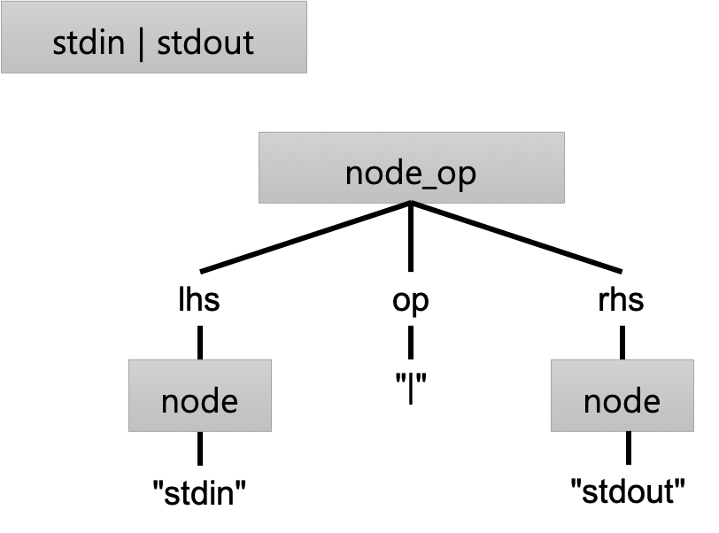
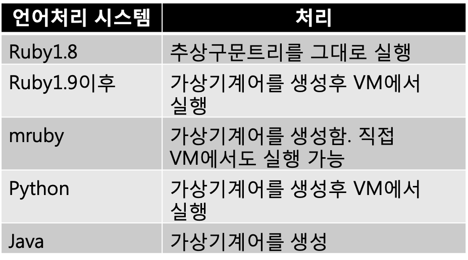

## 2-7 AST(추상구문트리)로의 변환

> 이번에는, Streem 의 구문해석기를 손을 좀 봐서, 그럭저럭 언어로서 동작을 할 때가지 끌고 가보려 한다. 먼저 구문해석을 해서, 그 결과를 추상적 구문트리로 변환한다. 이를 가상머신의 기계어로 변환하면 실행효율을 높일 수 있지만, 우선은 ‘움직이게’ 하는게 목표이다.

Streem 내부 구조는 조금씩 완성되어 왔지만, 아직 언어로 충분히 작동하지 않는다. 그래서 이번에는 구문 분석기를 손을 봐 그럭저럭 언어로서 움직이는 것으로 만들어 보려 한다.
그 전에 2-6절 팔로우업을 하자. 2-6절 에서는 ‘심볼’에 대응하기 위해 모든 문자열을 테이블에 등록하고, 같은 내용의 문자열이 같은 객체가 되도록 구현했다.
그 후 몇 가지 실험을 반복했는데, 결과가 별로 좋지 않았다. 모든 문자열 테이블에 등록하면 로드 데이터가 증가함에 따라 소비하는 메모리가 예상보다 커져 버리기 때문이다.
2-6절에서도 설명했듯이 Lua가 이런 방식을 채택하고 있기 때문에 그다지 문제가 없을 거라 생각했었다. 그러나 역시 믿음보다는 직접 측정하는 것이 중요하다.

#### 새로운 심볼 지원 기법

그래서, 새롭게 다음과 같은 지원을 하기로 했다.

먼저 이벤트 루프에 들어가기에 앞서, 단일 스레드일때에는 배타 제어에 대해 걱정할 필요가 없기 때문에 문자열 생성 시점에서는 심볼 테이블에 등록 할 수 있다. 그러나 Python의 방법을 참고하여 일정한 길이 이상 (우선 64 자 이상) 문자열은 심볼 테이블에 등록을 하지 않는다.
이벤트 루프가 시작하고, 다중 스레드 모드에 들어가면 충돌을 피하기 위해 일반 문자열 생성은 심볼 테이블에 액세스하지 않고 개별적으로 할당한다. 이 경우 동일한 내용의 문자열이지만 다른 개체다.
그러나 어떤 이유로 심볼화 된 문자열을 원할 때가 있다. 따라서 명시 적으로 심볼화 된 문자열을 얻을 수있는 새로운 함수 ‘strm_str_intern()’을  만들었다. 이 함수를 호출하면 심볼 테이블을 배타 제어하면서 이동하여 심볼화 된 문자열을 반환한다.

이 일련의 변경으로 모든 문자열이 기호 되지는 않게 되었으므로 문자열의 일치 판정 부분도 변경해야 한다. 지금까지는 객체의 주소 비교만으로 일치 판정을 할 수 있었지만, 앞으로는 심볼화되지 않은 문자열 내용을 비교하게 되었다 (그림 1). 핵심은, 심볼화 된 문자열은 STRM_STR_INTERNED 플래그가 설정되어 있다는 것이다.

```
int
strm_str_eq(strm_string *a, strm_string *b) 
{
    /* 주소가 같으면 일치 */
    if (a == b) return TRUE;
    /* 양쪽의 문자열이 심볼화 되었다면゙ */
    if (a->flags & b->flags & STRM_STR_INTERNED) {
        /* 주소가 일치하지 않으면 다른 객체 */
        return FALSE; 
    }
    /* 여기부터는 내용의 비교 */
    /* 길이가 다르면 다른 문자열 */
    if (a->len != b->len) return FALSE;
    /* 내용을 비교하여 일치하면 같은 문자열로 한다 */
    if (memcmp(a->ptr, b->ptr, a->len) == 0) return TRUE; /* 일치하지 않는다 */
    return FALSE;
}
```
<center>
(그림 1) 문자열 비교 함수
</center>


#### 구문 해석 액션

그러면 언어 처리의 구현으로 돌아가 보자. 
지금까지 ‘Yacc’를 이용하여 문법을 정의하는 방법에 대해 설명했다. Yacc의 정의를 도구에 제공하면 구문 분석을하는 함수를 생성해 준다.
문법 정의에 ‘액션’을 추가는 것으로 문법에 따라 작업을 수행 할 수 있다. ‘액션’는 규칙에 일치 할 때 실행되는 코드를 의미한다.
나중에 나오겠지만, 액션 부분에서는 ‘$$’이 규칙이 생성하는 값, ‘$1’ 등은 문법의 n 번째 요소가 생성 한 값이다. 주의하지 않으면 안되는 액션은 문법 규칙이 일치하는 순간에 실행되므로 예상과는 다른 순서로 실행될 가능성이 있다는 것이다. 이벤트 구동 프로그램이라고 생각하면 좋을지도 모른다.

#### 추상 구문 트리로 변환

다시말하면, 언어 처리의 본질은 액션 부분에 무엇을 쓸 것인가를 정하는 것이다. 어느 정도 복잡한 언어를 다루려고 생각한다면 나름의 액션을 잘 정의하여 기술해야 한다.
많은 언어 처리 시스템에서는 이 액션 부분에서 프로그램을 트리 구조로 변환한다. 원래 프로그램은 단순한 텍스트로 구성되어 있지만, 텍스트로 핸들링 하기 어렵기 때문이다.
이러한 프로그램을 트리 구조로 변환 한 것을 ‘추상 구문 트리(Abstract Syntax Tree-AST)’ 라고 한다. 예를 들어, Streem으로 ‘Hello World’에 해당하는 ‘표준 입력으로부터 읽어 들인 문자열을 표준 출력으로 보낸다’ 라는 간단한 프로그램에 대한 추상 구문 트리는 (그림 2)와 같이 표현된다. 연산자를 가지는 식(op)은 ‘node_op’라는 노드(절)로 표현되며, 여기에는 세 가지가 있다. 하나는 연산자명으로 op라는 지점에 저장된다. 이번에는 ‘|’이 연산자명이다. 인수는 두 번째 (lhs)와 세 번째 (rhs) 지점에 저장된다. lhs와 rhs는 각각 ‘left hand side (왼쪽)’ ‘right hand side (오른쪽)’의 약자이다. 연산자 이외의 표현과 문장에 대해서도 해당하는 노드가 준비되어 있다. 예를 들어 함수 호출은 ‘node_call’, if 문은 ‘node_if’와 같은 형태이다.



<center>
(그림 2) 추상 구문 트리의 예. <br>
    lhs와 rhs는 각각 ‘left handside(좌변)’과 ‘right hand side(우변)’ 의 약어.
  </center>


#### 구문 트리를 구조체로 표현

이 추상 구문 트리를 표현하는 구조체의 설명은 (그림 3)에 나와 있다. 
추상 구문 트리의 노드를 구성하는 구조체는 헤더에 ‘node_typetype(NODE_HEADER)’라는 공통의 멤버를 가지고 있다. 프로그램 중에서는 node 구조체에 대한 포인터로 취급하고 필요에 따라 type 값을 보고 캐스트하고 있다. 타입 안전성이라는 의미는 오작동을 하는 프로그램이지만, 동적 타입을 가지는 언어에서는 일반적으로 사용되는 기술이다. 
뒤에서는, 구문에 따라 노드를 만드는 함수를 정의하고 (그림 4) 그것을 액션에서 호출한다 (그림 5). 실제 소스 코드는 streem 저장소 (https://github.com/matz/streem)의 src 디렉토리에있는 parse.y (구문 해석 부 yacc 소스 코드)와 node.c (노드 생성 부)를 참조하길 바란다.
이제 Yacc가 생성 한 yyparse 함수를 실행하면 추상 구문 트리를 얻을 수 있게 되었다.

```
typedef enum { 
    NODE_ARGS, 
    NODE_PAIR, 
    NODE_VALUE, 
    NODE_CFUNC, 
    NODE_BLOCK, 
    NODE_IDENT, 
    NODE_LET, 
    NODE_IF, 
    NODE_EMIT, 
    NODE_RETURN, 
    NODE_BREAK, 
    NODE_VAR, 
    NODE_CONST, 
    NODE_OP, 
    NODE_CALL, 
    NODE_ARRAY, 
    NODE_MAP,
} node_type;

#define NODE_HEADER node_type type

typedef struct { 
    NODE_HEADER; 
    node_value value;
} node;

typedef struct { 
    NODE_HEADER; 
    node* recv; 
    node* ident; 
    node* args; 
    node* blk;
} node_call;

// 이하, 구조체정의가 이어진다.

```

<center>
  (그림 3) 추상 구문 트리의 구조체</center>
​    


```
extern node* node_array_new();
extern node* node_pair_new(node*, node*);
extern node* node_map_new();
extern node* node_let_new(node*, node*);
extern node* node_op_new(const char*, node*, node*); 
extern node* node_block_new(node*, node*);
extern node* node_call_new(node*, node*, node*, node*); extern node* node_int_new(long);
extern node* node_double_new(double);
extern node* node_string_new(const char*, size_t); 
extern node* node_if_new(node*, node*, node*);
extern node* node_emit_new(node*);
extern node* node_return_new(node*);
extern node* node_break_new();
extern node* node_ident_new(node_id);
extern node* node_ident_str(node_id);
extern node* node_nil();
extern node* node_true();
extern node* node_false();

//if에 해당하는 노드

node*
node_if_new(node* cond, node* then, node* opt_else)

{
    node_if* nif = malloc(sizeof(node_if)); 
    nif->type = NODE_IF;
    nif->cond = cond;
    nif->then = then;
    nif->opt_else = opt_else;
    return (node*)nif;
}

// 정수 리터럴에 해당하는 노드
node*
node_int_new(long i)
{
    node* np = malloc(sizeof(node));
    np->type = NODE_VALUE; np->value.t = NODE_VALUE_INT;
    np->value.v.i = i;
    return np;
}
// 같은 모양의 노드를 생성하는 함수정의가 이어진다

```
<center>
  (그림 4) 노드 생성 함수
    </center>


```
program   : compstmt
            { /* 생성된 노드 */
              /* parser_state p에 할당한다 */
              p->lval = $1; 
            }
        ;

/* 중략 */

primary0  : lit_number /* lex.l안에서 노드가 생성된다 */ 
          | lit_string /* 상동 */
          | identifier
             {
                   $$ = node_ident_new($1);
             } 
          | '(' expr ')'
             {
                   $$ = $2; 
             }
          | '[' args ']' /* 리스트 */
              {
                   $$ = node_array_of($2); 
              }
          | '[' ']' /* 빈 리스트 */ 
              {
                   $$ = node_array_of(NULL); 
              }
          | '[' map_args ']' /* 맵゚ */
              {
                   $$ = node_map_of($2);
              }
          | '['':' ']' /* 빈 맵゚ */
              {
                   $$ = node_map_of(NULL);
              }
          | keyword_if condition '{' compstmt '}' opt_else
              {
                   $$ = node_if_new($2, $4, $6);
              }
          | keyword_nil
              {
                   $$ = node_nil();
              }
          | keyword_true
              {
                   $$ = node_true();
              }
          | keyword_false
              {
                   $$ = node_false();
              }
          ;
```

<center>
(그림 5) 추상구문 트리를 만드는 액션(발췌)
</center>


#### 구문 트리 자체를 실행

문법을 분석 한 결과 추상 구문 트리가 되면 이를 나중에 처리 할 수 있다. 처리 절차는 여러 가지가 있고, 언어 처리 시스템마다 다르다 (표 1). 표에 보면, 추상 구문 트리에서 가상 머신 (VM)의 기계어 (관습 적으로 바이트 코드라고 부르는 경우가 많다)를 생성하는 처리 시스템이 압도적으로 많은 것을 알 수 있다.
여기에는 이유가 있다. 메모리 액세스의 효율성 등의 측면에서 추상 구문 트리 링크를 따라 실행하는 것보다 한 번 바이트 코드를 생성하여 VM에서 실행하는 것이 실행 효율이 높기 때문이다. Ruby 버전 1.9 이후로 성능이 획기적으로 개선 한 것도이 가상 머신의 도입이 큰 역할을 했다.

그래서 Streem에서는, 물론 결국에는 VM을 도입 할 생각이지만, VM을 구현하기 위해서는 그만한 노력과 시간이 걸린다. 최대한 빨리 ‘작동하는’ 상태를 달성하기 위해 우선 Ruby1.8과 같은 추상 구문 트리의 직접 실행 함수를 만들기로 했다.
쓸데없는 일이라고 생각 될지도 모르지만 실제로 움직여 보지 않으면 어떤 이미지인지 잡히지 않을 경우가 많다. 언어 사양 시행 착오를 위해서라도 최대한 빨리 움직이는 상태로 가져가는 것이 중요하다. 또한 무엇보다도 자신이 쓴 프로그램을 실제로 움직여 테스트 하는 것이 프로그래머에게 동기 부여의 원천이 된다. 생각하면 20 년이 넘는 Ruby 개발에서도 가장 힘들었던 것은 먼저 작동하게까지 만들었던 반년간 이었던 것 같다. 



<center> 
(표 1) 언어처리 시스템별 추상구문트리 처리 지원</center>


#### 추상 구문 트리의 트래버스

트래버스(traverse)는 여기에서 ‘순회하다’ 라는 의미이다. 구문해석기는 프로그램의 텍스트를 변환하여 추상구문트리로 표현하는 구조체의 링크구조를 하고 있다. 프로그램을 해석을 위해서는 이 링크 구조를 순회할 필요가 있다. 

Streem의 추상 구문 트리를 순회하면서 실행하는 함수는 exec.c의 exec_expr ()함수다. 이 함수는 하나의 거대한 switch 문에서 노드의 종류마다 그에 맞는 처리를 한다. exec_expr함수는 상당히 크기 때문에(133 행) (그림 6)에 발췌를 실어 둔다.

```
/* 추상구문트리를 실행하는 함수*/ 
/* ctx: 컨텍스트 */
/* np: 추상구문트리 */
/* val: 실행결과 */
/* 리턴값: 0 - 성공、 1 - 실패 */
static int
exec_expr(node_ctx* ctx, node* np, strm_value* val) 
{
    int n;
    /* 추상구문트리가゙NULL이면 실패 */ 
    if (np == NULL) {
        return 1; 
    }

/* 추상구문트리의 타입별로 분기 */ 
switch (np->type) {
/* 변수 액서스 */
case NODE_IDENT:
    /* 변수명에서 값을 추출한다 */
    *val = strm_var_get(np->value.v.id); 
    return 0;
/* if문 */ 
case NODE_IF:
{
    strm_value v;
    /* np를 node_if에 캐스트 한다 */
    node_if* nif = (node_if*)np;
    /* 조건부를 평가(exec_expr를 재귀호출) */ 
    n = exec_expr(ctx, nif->cond, &v);
    /* 조건부평가가 실패하면 실패 */
    if (n) return n;
    /* 조건부가 참이라면゙ */
    if (strm_value_bool(v)) {
        /* then부분 평가 */
        return exec_expr(ctx, nif->then, val); 
    }
    else if (nif->opt_else != NULL) {
        /* else부분 평가 */
        return exec_expr(ctx, nif->opt_else, val);
    }
    else {
        /* else부분이 없다면 null */ 
        *val = strm_nil_value(); 
        return 0;
    }   
}
break;
/* 연산자식 */ 
case NODE_OP:
{
    /* node_op에 캐스트*/ 
    node_op* nop = (node_op*)np; 
    strm_value args[2];
    int i=0;
    /* 좌변을 평가 */ 
    if (nop->lhs) {
        n = exec_expr(ctx, nop->lhs, &args[i++]);
        if (n) return n; 
    }
    /* 우변을 평가 */ 
    if (nop->rhs) {
        n = exec_expr(ctx, nop->rhs, &args[i++]);
        if (n) return n; 
    }
    /* 함수호출('|' 이라는 이름의 함수 호출) */
    return exec_call(ctx, nop->op, i, args, val); 
}
break;

/* 함수 호출 */ 
case NODE_CALL:
    .... 
    }
}

```

<center>
(그림 6) exec_expr 함수(발췌)</center>

#### 재귀 호출의 활용

이러한 트리 구조를 순회하는 함수의 구현에는 재귀 호출을 사용하는 것이 일반적이다. 예를 들어, 연산자 식은 다음과 같이 평가한다.

1. 좌변을 재귀 호출로 평가
2. 우변을 재귀 호출로 평가
3. 양쪽의 평가 결과를 인수로서 연산자에 해당하는 절차를 호출

다른 수식이나 문장에 대해서도 마찬가지다. 노드 유형마다 처리를 기술할 필요가 있으므로 어떻게 해도 행수가 길어져 버리지만, 패턴의 반복 이므로 그다지 복잡한 것은 아니다. 

마찬가지로 트리 구조를 재귀 순회하고있는 것이, main.c의 dump_node() 함수다. 이곳은 디버그 용으로 들여 쓰기를 사용하여 트리 구조를 표시한다. 구성은 exec_expr()와 비슷하다. dump_node() 함수의 발췌를 (그림 7)에 나타냈다. p.138<sup>편집후에 페이지 변경 필요</sup> (그림 2) 트리 구조를 dump_node ()에 의해 덤프 한 것이 (그림 8)이다.

```
/* 추상 구문 트리를 덤프하는 함수 */  
/* np: 추상 구문 트리 */
/* indent: 인덴트 레벨 */ 
static void
dump_node(node* np, int indent) { 
  int i;
  /* 지정된 레벨만큼 인덴트를 한다 */ 
  for (i = 0; i < indent; i++)
    putchar(' ');
  /* NULL이면 NIL을 출력 */ 
  if (!np) {
    printf('NIL\n');
    return; 
  }
/* 추상구문트리의 타입으로 분기 */ 
switch (np->type) {
/* if문 */
case NODE_IF:
  {
    /* 타입을 출력 */
    printf('IF:\n');
    /* 조건부의 출력 */ 
    dump_node(((node_if*)np)->cond, indent+1); 
    for (i = 0; i < indent; i++)
      putchar(' ');
    printf('THEN:\n');
    /* then부분의 출력 */ 
    dump_node(((node_if*)np)->then, indent+1); 
    node* opt_else = ((node_if*)np)->opt_else; 
    /* (있다면)else부분을 출력 */
    if (opt_else != NULL) {
      for (i = 0; i < indent; i++) 
        putchar(' ');
      printf('ELSE:\n');
      dump_node(opt_else, indent+1); }
  }
  break;
case NODE_OP:
  /* 타입을 출력 */ 
  printf('OP:\n');
  for (i = 0; i < indent+1; i++)
    putchar(' ');
  /* 연산자명 출력 */
  print_id('op: ', ((node_op*) np)->op);
  /* 좌변을 출력 */
  dump_node(((node_op*) np)->lhs, indent+1); 
  /* 우변을 출력 */
  dump_node(((node_op*) np)->rhs, indent+1); 
  break;
  /* 중략 */
....
default:
  /* 모르는 타입(에러) */ 
  printf('UNKNWON(%d)\n', np->type); 
  break;
  } 
}
```
<center>
  (그림 7) dump_node()함수 (발췌)
  </center>


#### 오픈소스 류의 개발

이번에 소개 한 추상 구문 트리의 생성 및 실행을하는 부분은 mattn(Yasuhiro Matsumoto)이 보내 주신 풀 리퀘스트를 기반으로하고 있다. 내가 2-6절까지 설명했던 이벤트 루프 부분에 집중하는 동안 기본적인 부분을 구현해 주었다. 이 또한 오픈 소스의 힘이다.
그러나 보내 준 것을 그대로 채용 한 것은 아니다. 함수와 구조체의 이름 변경을 비롯해 대규모로 변경을 하였다. 일반(오픈 소스가 아닌) 소프트웨어 개발 경험을 가지고 계신 분들은 기이하게 생각 될지도 모르겠다. 종종 하나의 부분을 여러 사람이 변경하는 것은 ‘피해야 할 것’이라고도 하며, 사람에 따라서는 ‘실례’라고 느낄 수도 있을 것 같다. 물론 직접 작성한 코드에 애착을 느끼거나 다른 사람에게 무시당하고 싶지 않다고 생각하는 것은 당연한 것일지도 모른다. 그러나 많은 오픈 소스 프로젝트에서 그러한 감정은 그다지 중요시되지 않는다.
오픈 소스 프로젝트는 수정을 한 번 보낸 후 사라져 버리는 사람도 많고, ‘소유 의식 ’과 ‘담당자 의식’을 너무 존중하면, 진행이 멈춰 버리는 경우가 많다. 원래 오픈 소스의 특징인 제삼자가 자유롭게 수정을 보내 저자가 그것을 받아들이는 행위 자체가 원래 저자의 소유 의식이 강하면 불가능한 것이다. 그런 의식을 가진 사람들의 모임인 오픈 소스 프로젝트는 소유 의식과 같은 ‘자의식’은 중요시되지 않는 것이 더 자연스러운 것일지도 모른다.

#### 이상적인 실행 시스템

Ruby1.8을 보면 알 수 있듯이, 이번에 설명한 추상 구문 트리를 순회 처리 시스템은 쉽게 구현할 수 있지만, 성능이 나오지 않는 것이 단점이다. 그 가장 큰 이유는 2-6절에서 설명한 메모리 캐시이다.
구조체의 링크를 따라하면 메모리 공간에 여기 저기 존재하는 구조체를 쫓아가며 액세스 하게 된다. 따라서 캐시 효율면에서는 거의 최악이라고해도 좋을 것이다.
메모리 캐시를 활용하기 위해서는 일단 접근은 좁은 공간에서 가능한 한 연속적으로 실시하는 것이 이상적이다. 그래서 많은 처리 시스템에서는 추상 구문 트리를 가상 머신의 명령어 라인으로 변환하고 실제 실행이 명령 열을 해석하는 방법을 선택한다.
미래에는 Streem에서도 이같은 방식을 채택 할 것이다. Streem의 적용 분야를 생각하면 성능은 무시할 수 없는 요소가 될 것으로 예상 할 수 있기 때문이다. 또한 먼저 실행시에 기계어를 생성하고 거기를 실행하는 JIT (Just-in-time) 컴파일러도 꼭 검토하고 싶다.
그러나 현재는 언어 설계에 집중하는 것이 더 중요하다. 프로그래머의 격언에도 있듯이 ‘너무빠른 최적화는 모든 악의 근원’ 이기 때문이다.

#### 이후의 계획

이제 겨우 Streem 프로그램을 실행한다는 기분이 든다. 
그렇지만, 아직 함수 정의를 할 수 없으면, 파이프 라인 작업도 할 수 없기 때문에 느껴지는 기분뿐이다.
그래서 다음 절에서는 함수 실행 부를 구현하여 ‘제대로 된’ Streem 프로그램의 실행을 가능하게 하려고 한다. 또한 실행 중에 발생하는 오류 처리 예외 처리에 대해서도 검토 할 것이다.

#### 마치며

자, 여기까지 parse.y, node.c, exec.c에서 정의된 바와 같은 함수를 조합하면 ‘우선 작동하는’ 수준의 언어를 쉽게 만들 수 있다. 이번에 설명한 소스 코드는 201506이라는 태그를 붙여 두겠다. 여러분도이 소스 코드를 참고로 ‘자신의 언어’를 만들어 보는 것은 어떨까?
또한 언어의 디자인에 대해 여러가지 생각 해보니 지금 자신이 사용하는 언어가 왜 그렇게되어 있는지, 언어 설계자가 무엇을 생각하고 있었는지, 그 이유를 생각할 수 있게 되어 즐겁다.

<hr>

### 타임머신 칼럼

***구문트리의 구현방법은 하나만이 아니다***

> 2015년 6월 게재분이다. 이번에는 구문해석기(프론트엔드)와 코드 생성부(백엔드)를 연결하는 구문트리의 구현에 대해 설명하고 있다. 
> 구문 트리의 구현, 다시말해 프론트 엔드와 백엔드의 연계 방법은 하나만 있는게 아니다 (그리고 트리 구조를 써야 하는 것도 아니다). 그 중에는 프론트 엔드와 백엔드를 분리하지 않고 구문 분석기에서 직접 코드를 생성하는 컴파일러도 존재하고 있다. 그러나 구문 분석기에서 직접 생성은 최적화가 어려울 수 있으므로 그다지 추천하지는 않는다.
여기서 많은 컴파일러는 구문 분석을 한 프로그램의 구조를 반영한 ​​어떤 데이터 구조를 코드 생성 부에 전달하게 된다. 그리고 프로그램을 표현하는 구조로는 트리 구조가 일반적이므로 구문을 반영한 트리 구조, 즉 구문 트리가 자주 사용된다. 구문 트리의 구현방법은 다양하다. 나와 연관된 언어 처리 시스템에서도, 이번 해설 한 Streem에서도 노드의 종류마다 다른 구조를 이용하고 있으며, mruby는 Lisp 비슷한 cons 셀의 링크를 통해 트리 구조를 만들고 있다. 또한 CRuby에서는 노드를 표현하는 구조체 union을 사용하여 노드 유형을 표현하고 있다. 어느 하나가 정답이라는 것은 없다.
덧붙여서 본격적인 컴파일러인 gcc 나 clang는 gcc에서는 RTL (Register Transfer Language) clang에서는 LLVMIR (Intermediate Representation)는 중간 표현을 사용하여 프론트 엔드 및 백 엔드를 연결하고 있다. 이들은 각각 구문 트리 데이터가 아닌 것은 흥미로운 부분이다.


