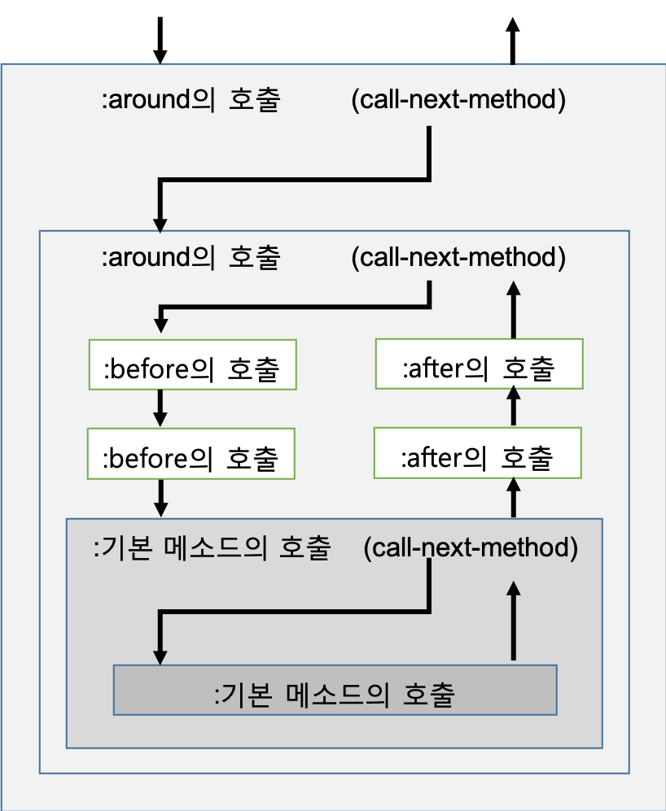

##3-1 여러가지 객체지향 

> ‘객체 지향 프로그래밍이란 무엇인가?’에 대해서는 다양한 의견이 있고 현재까지 명확한 정의가 있지는 않다.  이 때문에 20 세기 말까지 의견 대립이 많았었다. 이번에는 역사를 바탕으로 한 객체 지향 이야기를 해 보겠다.

1993 년경, Ruby를 만들기 직전의 일이었다. 나는 회사 동료인 이시츠카 케이쥬(石塚圭樹)  (나중에 Ruby라는 이름을 만든 사람)와 함께 책을 내는 기획을 했었다. 이시츠카는 이미 ‘객체 지향 프로그래밍’이라는 책을 아스키 출판사를 통해 냈었고, 그 속편에 대해 구상하고 있었던 중이었다.
그 기획을 한마디로 표현한다면 ‘(객체 지향 언어를) 만들면서 배우는 객체 지향 프로그래밍’이라는 것이었다. 객체 지향 프로그래밍의 개념을 언어 처리 시스템을 설계 및 구현하는 과정을 통해 배우면 좀 더 본질적인 이해가 가능하지 않을까 하는 시도였었다.
불행히도, 이 기획은 ‘매우 팔리지 않을 것 같다’ 는 이유로 거절되어, 햇빛을 볼 수는 없었다. 단, 이 때 예제로 만들려고했던 언어가 나중에 Ruby로 이어진 것은 잘 알려지지 않은 사실이다. 
원래 각종 객체 지향 언어는 각각 설계자의 의도와 사상을 반영하여 개발되고 있다. 그래서 언어를 통해 객체 지향 프로그래밍을 배우겠다는 구상 자체는 그렇게 나빴던 것은 아니었다고 생각된다.
모처럼의 기회이기 때문에 다소 페이지 수는 있지만, 20여 년의 시간을 거쳐 ‘언어를 통해 배우는 객체 지향’ 이라는 주제에 다시 도전 해 본다. 우선 ‘최초의 객체 지향 언어’ 부터다. 

### Simula의 객체 지향

세계 최초의 객체 지향 언어는 1967년에 발표한 Simula라는 언어이다. Simula은 이름에서 연상되는 것처럼 시뮬레이션 된 언어로 Ole-Johan Dahl과 Kristen Nygaard가 개발했다. 당시 대학 등에서 널리 이용되고 있었던 Algol를 기반으로 시뮬레이션에 등장하는 엔티티를 표현하는 클래스나 개체를 도입했다. 여기에서 말하는 엔티티라는 것은, 예를 들어 교통 시뮬레이션이면 신호 라든지 자동차 라든지 시뮬레이션 대상이되는 것을 말한다.
Simula는 세계 최초의 객체 지향 언어라고는 불리지만, 알려진 것은 현대에 와서다. ‘객체 지향 프로그래밍’이라는 용어는 나중에 소개 할 Smalltalk 개발자 Alan Kay 씨가 ‘발명’했다고 되어 있다. 사실 Simula가 발표된 시점에서는 엄밀히 말하면 객체 지향 프로그래밍이라는 호칭은 아직 존재하지 않았던 것이다. 

그러나 Simula는 클래스, 상속, 객체, 동적 결합, 코루틴, 가비지 컬렉션 등 현대의 객체 지향 언어에서 제공하는 기능을 처음부터 가지고 있었다. 다시말하면, 아직 이름이 붙여지지는 않았지만, 그 이름이 존재하기 전부터 ‘객체 지향 프로그래밍’의 개념은 확실히 존재하고 있었다. 우리가 객체 지향 언어를 사용할 때, 직접 또는 간접적으로 Simula의 영향을 전혀받지 않는 것은 존재하지 않는다고 단언해도 좋다. 지금부터 50여년 전, 객체 지향이라는 용어 이전에 이미 완성되었던 객체 지향 언어인 Simula는 어떤 의미에서 프로그래밍 언어 계의 오파츠[^1]라고해도 좋을 것이다.


#### Simula 개발자는 털털한 사람 

Dahl과 Nygaard는 2001 년에 ‘프로그래밍 언어 Simula I 과 Simula67 설계를 통해 객체 지향 프로그래밍의 기본적인 아이디어를 만들어 낸 것에 대해’ 컴퓨터 과학에서 최고의 상인 튜링 상을 수상했다 . 두 사람 모두 2002 년에 사망하였다.
나는 2001년 튜링 상 수상 2개월 전에 덴마크에서 개최 된 JAOO는 컨퍼런스에서 Kristen Nygaard 교수를 뵌 적이 있다. 매우 털털한 분으로, 뒷풀이에서 여러가지 이야기를 해 주었다.
나를 향해 ‘뭐라구요? 언어를 설계하고 있다구요? 혹시 객체 지향 언어입니까? 놀랍네요. 모든 객체 지향 언어는 내 손자 같아요. 와하하’ 라고 웃고 계셨다.

#### Smalltalk의 객체 지향 
그런데, Simula가 세계 최초의 객체 지향 언어라면, 가장 유명하고 영향력있는 객체 지향 언어는 아마도 Smalltalk일 것이다. 요새 프로그래머들에게는 객체 지향 언어라고하면 Java로 생각하고 있을지도 모르지만...
Smalltalk는 1970 년대 초반부터 Xerox Palo Alto Research Center (PARC)에서 개발 한 객체 지향 언어다. 객체 지향 프로그래밍이라는 단어 자체가 이 Smalltalk 개발 프로젝트에서 태어났다.

Smalltalk는 Simula의 영향을 받아 탄생했지만 가장 중시했던 점은 ‘다이나북(Dynabook), 즉 아이들도 사용할 수 있는 미래의 컴퓨터의 언어’ 에 있었다.
그래서 아이들도 이해하기 쉽고, 직접적으로 조작 할 수 있는 ‘객체’에 주목하며 교육용 언어로 당시 대두되었던 LOGO의 영향을 받으면서 ‘객체에 메시지를 보내 조작한다’는 모델을 중심으로 설계 한 것이다. ‘펜을 올린다’, ‘100 걸음 앞으로’
‘오른쪽으로 120도’등의 명령으로 구축되는 LOGO의 터틀 그래픽(Turtle Graphics)이 ‘터틀’ 라는 개체와 그에 대한 명령이라는 모델로 재구성 된 것이었다. 

#### Logo를 Smalltalk로 표현 

터틀 그래픽스를 수행하는 LOGO의 프로그램을 (그림 1)에, 이를 Smalltalk로 표현한것을 (그림 2)에 나타내었다. 

```
FORWARD 100
RIGHT 120
FORWARD 100
RIGHT 120
FORWARD 100
RIGHT 120
FORWARD 100
```

<center>
    (그림 1) LOGO로 작성한 터틀 그래픽스
</center>


```
Turtle go: 100.
Turtle turn: 120.
Turtle go: 100.
Turtle turn: 120.
Turtle go: 100.
Turtle turn: 120.
Turtle go: 100.
```
<center>
    (그림 2) Smalltalk로 작성한 터틀 그래픽스
</center>
Smalltalk 문법에 대해서는 약간의 설명이 필요할 것 같다. ‘Turtle home’부분은 ‘Turtle 개체에 home이라는 메시지 보내기’라는 뜻이다. Turtle 개체는 메시지에 따라 커서의 위치를 홈 위치로 이동시킨다.
인수가 있는 메시지는 뒤에 ‘:’가 붙는다. 특이한 것은 여러 인수가 있는 경우에는 각각 인수 전에 메시지가 붙는 곳이다. 예를 들어, 만일 go와 동시에 색상을 지정할 수있는 메시지가 있다고 하면 거리와 동시에 색상을 지정해야 할 필요가 있고 그 메시지는 ‘go : color :’같이 될 것이다. 실제로의 호출은 

```
obj go : 100 color : #red
```

의 느낌이 된다. ‘#red’는 Smalltalk의 심볼기호이다. 이것은 다른 언어의 키워드 인수와 비슷하지만, 생략할 수 없고, 순서를 바꿀 수 없다. ‘go : color :’라는 하나의 메시지가 분할되어 표기되어 있다고 생각해야 한다. Smalltalk는 제어 구조를 포함한 거의 모든 메시지 전송에 의해 실현되는 것이 특징이다.

#### Ruby는 Smalltalk의 유사어?

Smalltalk는 발표 된 연도에 따라 Smalltalk-72, Smalltalk-76, Smalltalk-80라는 세 가지 버전이 있다. 현재 Smalltalk는, 마지막 버전 인 Smalltalk-80 (및 파생 버전)을 의미하지만, 버전이 지날 때마다 성인이 쓸 만한 프로그래밍 언어와 환경으로 거듭나고 있다. ‘어린이를 위한’ 이라는 그림자는 그 자취를 감추고 있다. 
몇 년 전에 Smalltalk 개발 리더였던 Alan Kay 씨와 점심을 함께 할 때 ‘Smalltalk는 Lisp의 영향이 강해져 당초의 구상과는 다르게 발전하고 있어’ 라고 했다. 또 ‘Ruby는 Smalltalk-76 시절에 좀 비슷한 것 같어’라는 말도 했다. Smalltalk-76는 Xerox PARC외에는 공개되지 않아서, 자료가 별로 없는 편이다. 어느 부분이 Ruby와 비슷한 있는지, 정확히는 파악이 되지 않지만, 흥미로운 발언이었다.

#### Actor의 객체 지향

Simula 시뮬레이션 지향, Smalltalk의 객체 지향의 영향을 받아 미국 매사추세츠 공대 (MIT)의 Carl Hewitt 가 1973 년에 고안한 것이 Actor 모델이다.
Actor 모델은 개별 개체가 주체적으로 계산하여 객체 간의 통신은 메시지에 의해 이루어지는 모델이다. Smalltalk의 메시지 송신은, 전송 결과의 회신을 반드시 체크 하기 때문에 ‘동기’ 방식이다. 한편 Actor의 경우 비동기 방식으로 메시지를 일방적으로 보내고 (필요시) 결과는 다른 메시지로 보내게 된다.
Actor 모델은 ‘수백, 수천의 마이크로 프로세서로 구성된, 각각 로컬 메모리와 고성능 통신 네트워크에서 통신하는 병렬 컴퓨터가 조만간 등장 할 것으로 예측’ 에서 탄생했다. 실제로 1973년부터 보면 ‘가까운 장래’에 그런 컴퓨터가 탄생한 적이 없어 Actor 모델은 당시에 널리 보급이 되지 못했다. 하지만 40 년 이상 지난 현재는 멀티 코어 및 클라우드 등의 환경으로 Hewitt의 예측이 마침내 현실로 다가오고 있다.

#### Erlang도 Actor 모델 

Actor 모델을 제공하는 언어도 많아졌다. 한 예로 Erlang은 Actor 모델을 따르는 설계 중심의 언어라해도 좋을 것이다. Actor 모델 자신은 객체 지향의 영향을 강하게 받고 탄생한 것임에도 불구하고, Erlang의 개발자 인 Joe Armstrong은 이전 ‘객체 지향 따위 안된다’ 고 발언했다. 그러나 최근 들어 ‘Erlang의 프로세스는 객체이며, Erlang 이야말로 진정한 객체 지향임을 깨달았다’고 40 년 만에 Hewitt 씨의 Actor 모델을 재발견하는듯한 발언을 하고 있다. 흥미롭다. 


#### CLOS의 객체 지향

LISP는 유연성이 상당히 높은 언어로서, 프로그래밍에 있어서 새로운 기능을 실험하는데 최적의 언어이다. 객체 지향 프로그래밍에 대해서도 예외없이 Simula와 Smalltalk에 의해 객체 지향 프로그래밍 개념이 발명 된 직후부터 다양한 객체 시스템이 각종 Lisp 처리 시스템에서 실험되었다. 그 개체 시스템의 집대성이 바로 Common Lisp Object System (CLOS)이다. 

다른 객체 지향언어와 비교했을때 CLOS의 특징은

* 다중 상속
* 특이 메소드
* 멀티 메소드
* 메소드 결함

이다. 

객체 지향 프로그래밍의 상속은 기존의 클래스에서 기능을 이어 받아 기능을 추가,변경하여 새로운 클래스를 만드는 것이다.
Ruby 나 Java 등 많은 언어에서 상속 기능을 계승하는 클래스를 하나 밖에 지정할 수 없다. 이것을 단일 상속 (또는 단순 상속)이라고 한다.
‘다중 상속’은 하나가 아니라 여러 클래스에서 상속하는 것이며, CLOS와 C++에서 가능하다.
상속 받을 곳을 하나에서 두 개 이상으로 확장하는 것은 자연스러운 것이다. 그러나 실제로는 그렇게 간단한 것이 아니어서, 두 개 이상의 클래스에서 상속 할 때 메소드의 이름이 충돌하거나 클래스 계층 구조가 간단한 트리 구조에서 네트워크처럼 얽히기도 한다. Java 나 Ruby는 그런 것을 피하기 위해 단일 상속을 채용하고 있다.

한편 CLOS에서는 다중 상속을 채용하면서 위와 같은 문제를 해결하기 위해 ‘Mix-in’을 고안하거나 다른 모순을 해소하는 방법을 도입하고 있다. CLOS의 Mix-in은 다중 상속의 사용에 있어서의 ‘신사 협정’과 같은 것이었지만, Ruby에서는 모듈의 include 형태로 언어 기능으로서 특별 취급되고 있다.

‘특이 메소드’라는 것은 클래스단위가 아닌 어느 특정 오브젝트에 대한 정의가 되어 있는 메소드를 말한다. CLOS에서는 인수의 클래스명 대신에 

```
(eql 값)
```

으로 지정하는 것으로 이 객체(값)에 고유의 메소드(여기서는 eql이라고 하는 이름)을 정의할 수 있다. 


#### 클래스 라는 것은 독립된 메소드

‘멀티 메소드’는 여러 클래스에 속하는 메소드를 의미한다. 많은 객체 지향 언어에서는 메소드는 클래스에 소속되어 그 클래스의 객체에 대해 메소드를 호출하는 형태로되어 있다. 그러나 CLOS에서는 메소드는 함수에 소속하여 그 모든 인수의 클래스에 따라 적절한 메소드가 선택된다.
이것은 실례를 보지 않으면 이해하기 어려운 개념이다. 우선, CLOS의 메소드 호출은 일반 함수 호출과 외견상으로는 동일하다. 

```
(length obj)
```

이는 length라는 함수(여러 메소드를 정리한 함수이므로 총칭 함수라고 한다)에 소속 된 여러 방법 중 obj의 클래스에 맞는 것이 실행된다. 다른 객체 지향 언어로 적어 보면

```
obj.length()
```

와 같은 의미이고 순서만 달라진다. 하지만 여러 인수들을 취하는 경우에는 좀 달라진다. 예를 들어 

```
(plus obj1 obj2)
```

라고 하는 덧셈(plus)의 기능을 가진 범용 함수 호출이 있었다고 가정하자. 이때, 어떤 메소드가 호출되는가 하는 것은 모든 인수의 클래스에 의해 결정된다. obj1과 obj2가 정수, 부동 소수점등 각각의 모든 조합 별로 각각 메서드 정의를 가질 것이다. 이에 의한 인수의 형태에 따라 분기 할 필요가 없어 더 적절한 절차를 선택할 수 있다. C++ 및 Java의 메소드 오버로드와 조금 비슷하지만 멀티 메소드에 의한 선택은 어디 까지나 통상의(첫번째 인수에 의한) 메소드 선택과 마찬가지로 동적으로 이루어진다.

이것은 코페르니쿠스적 전환[^2]으로, 객체 지향 언어에 종종 나타나는, 클래스가 있고 거기에 속하는 메소드가 있다는 구조가 완전히 무너지는 것이다. 대신, 클래스와 그것과는 완전히 독립적으로 메소드가 있는 구조이다. 이를 객체 지향이라고 부를 수 있는가 하는 논의도 있었지만, 다중 메소드는 인수에 따른 분기를 자동화 할 수 있으며, 기존의 Lisp과의 정합성도 높아서, Lisp 계열에서 받아 들여진 것 같다. 그러나 Lisp 이외의 언어로 다중 메소드를 채용 한 것은 거의 없다. 예외적으로 채용하고있는 것은 2015년 12월에야 정식 출시 된 Perl6 정도다.

#### 대규모 메소드 결합 

CLOS의 특징중 마지막은 ‘메소드결합’이다. 이는 같은 이름으로 적용가능한 메소드가 여러개 있을 경우, 이들을 어떻게 조합하여 호출할지에 대한 구조 이다. 

많은 객체 지향 언어에서는 메소드 중에 super 같은 이름을 사용하여 슈퍼 클래스(상속원) 메소드를 호출 할 수 있다. 그러나 CLOS에서는 다중 상속의 문제도 있어, 그렇게 간단히 해결될 문제는 아니다. 그래서 CLOS는 메서드 조합 방법도 자유롭게 정의 할 수 있도록 했다. 유연성이 있다고 할까...

예를 들어, 표준 메소드 결합 방식에서 메소드 호출은 다음과 같은 순서로 이루어진다.

먼저 호출된 제네릭 함수에 소속 된 메소드 중 인수에 적용 가능한 것을 우선 순위에 따라 정렬한다. 이 경우 우선 순위는 ‘정수’이며 ‘정수’는 ‘수’의 하위 클래스로 본다면 정수를 취하는 메소드 쪽이 수를 취하는 메소드보다 우선 순위가 높은 (Lisp 사양으로는 ‘보다 구체적인’)것으로 간주하여 계산한다.

그리고, 우선 ‘:around’ 라고 하는 태그가 붙은 메소드를(존재한다면) 구체적인 것으로부터 순서대로 호출한다. 그림으로 나타낸다면 (그럼 3)과 같은 순서가 된다. 



<center>
(그림 3) CLOS의 표준 메소드 결합
</center>


around메소드의 내부는 
```
(call-next-method)
```

의 형식으로 우선순위가 다음인 메소드를 호출시킨다. 더 이상 around 메소드가 없다면, 다음 스텝으로 진행된다. 

다음으로 ‘: before’라는 태그가 붙어있는 메소드를 구체적인 것부터 순서대로 호출한다 (반환 값은 버린다). 그 후 태그가 붙어 있지 않는 메소드 중 가장 구체적인 것을 호출한다. call-next-method로 그 다음  구체적인 메소드를 호출 하는 것은 around 방법과 동일하다.
마지막으로 ‘: after’라는 태그를 가진 메소드를 구체적이지 않은 것부터 순서대로 실행한다 (반환 값은 버린다). 
after 메소드의 실행이 끝나면 around 메소드의 실행으로 되돌아가 끝까지 실행된다. 최종 반환 값은 가장 구체적인인 around 메소드의 값이다.

이 메소드의 결합은 관점 지향 프로그래밍(aspect-oriented programming, AOP)의 기초가 되었다. 실제 Java에 대한 관점 지향 프로그래밍 처리 시스템인 AspectJ의 개발자는, CLOS의 설계자(중 한명)인 Gregor Kiczale이다. 

#### Ruby에도 기능을 집어 넣다.

CLOS의 객체 지향 기능은 솔직히 말하면 대부분의 경우에는 오버 스펙으로 모든 기능을 사용할 기회는 거의 없을 것이다. 그러나 객체 지향 프로그래밍의 역사 속에서도 이렇게 깊게 고려되고 대담하게 설계된 언어는 거의 없다. 또한 CLOS가 제공하는 다른 객체 지향 언어에는 도입되지 않았던 ‘색다른’ 객체 지향 기능은 어떤 의미로는 사장된 기술이지만  향후의 객체 지향 언어의 설계에 도움이 될 것도 매우 많이 있다. 사실, Ruby가 제공하는 Mix-in과 특이 메소드, 또 Module#prepend 등의 기능은 CLOS를 참고로 설계한 것이다.
현대에서는 CLOS는 그다지 널리 사용되지 않지만 이후 인기가 상승 할 가능성이 없는 것은 아니다. 가능성이 없다고 하더라도, 거기서 자라난 기능들은 새로운 언어에 반영되어 영향을 줄 지도 모르는 일이다.


#### C++의 객체 지향

같은 객체 지향 언어라고 자칭하고 있어도 상당히 다른 배경을 가지고있는 것이 C++이다. C ++는 C 언어에 객체 지향 기능을 추가 한 언어로서 객체 지향 언어의 대부분이 영향을 받았던 Smalltalk의 영향을 놀라울 정도로 받지 않았다. 예를 들어 용어 하나를 봐도 C++에서는 슈퍼 클래스라고 부르지 않고 기본 클래스(base class)라고 부르며, 서브 클래스가 아닌 파생 클래스(derived class)라는 용어를 쓴다. 뭔가 문화의 차이가 느껴진다.
2004년에 C++ 설계자 인 Bjarne Stroustrup 씨와 직접 이야기 할 기회가 있었다.
2003년 덴마크에서 개최 된 JAOO 컨퍼런스[^3]에서 “내가 가르치는 학생들은 C++밖에 몰라 Ruby의 존재조차 모르니 와서 강의를 좀 해 달라” 고 부탁을 했다. 그래서 그가 교수로 근무 미국 텍사스A&M 대학에서 강의하게 된 것이다.
그 때 C++의 기원에 대해 들을 기회가 있었다. 말하길 “영국 케임브리지대 대학원 때 논문에 대한 시뮬레이션을 쓰는데, 학부 시절에 사용한 Simula가 사용 싶었지만, 당시는 너무 느려 쓸만하지는 못했고 BCPL(C의 전신)를 사용 했습니다. 후에 영국 AT&T 벨 연구소에 취직하고 쓸만해진 Simula을 목표로 C with Class라는 언어를 만들었고 이것이 나중에 C++이 됐어요.” 라고 했다.

결국, C++은 Smalltalk의 영향을 별로 받지않는 Simula의 직계 후손이며, 그것 때문에 Smalltalk의 영향을 받은 용어를 일부러 피하는 경향이 있었던 것 같다. 또한 유연성을 위해 성능을 희생한 객체 지향 언어가 많은 가운데, 성능에 철저하게 고집하고 있는 것도 Stroustrup의 ‘Simula는 느리다’라는 경험에 기인하고 있다는 생각이 들었다.
원래의 C++에서는 예외도 없고, 다중 상속도 없고, 템플릿도 없는 매우 간단한 정적 타입의 객체 지향 언어로서 다소 실용성이 부족했었다. 그러나 그 이후의 발전은 눈 부셨고, 지금은 단순한 객체 지향 언어를 넘어 템플릿을 활용 한 범용 지향 프로그래밍 언어라고 불러도 좋을 존재가 되어버렸다. 더불어 많은 기능을 가진 복잡한 언어가 되어 버렸다.
C++는 베이스가 된 C가 목표로 한 구조적 프로그래밍의 연장 선상에 객체 지향을 정의하는 언어이다. 객체라는 실체와 메시지 전송이라는 모델로 프로그래밍을 표현하려고 한 Smalltalk와 쌍벽을 이루는 존재다. 일단 객체 지향 논쟁은, 두 시각이 서로를 충분히 이해하지 않았다 때문에 발생한 것이 아닐까 생각한다.


#### Java의 객체 지향

Simula, Smalltalk, CLOS, C ++에 대해 설명했기 때문에, 다른 유명한 객체 지향 언어에 대해서는 간단히 설명만 해 두겠다.
Java는 C++적인 객체 지향에 조금은 Smalltalk에 가까운 포지션의 프로그래밍 언어이다. C++처럼 적극적으로 Smalltalk 용어를 피하는 것이 아니라, 슈퍼 클래스 라든지 서브 클래스 등의 용어를 채용하고 있다.
객체 지향 프로그래밍 언어로서 보았을 경우의 특징은 C++과 비슷하면서 Lisp에서 볼 수있는 (그리고 C ++ 성능상의 이유로 피하고 있었던) 가비지 컬렉션을 적극적으로 도입 한 것을들 수 있다. 또한 인터페이스를 통해 ‘사양의 다중 상속’을 허락하면서 ‘구현 다중 상속’은 불허한 금욕적인 자세도 인상적이다.


#### Ruby의 객체 지향

Ruby에 대해서도 약간만 언급하겠다. 사상적으로는 Ruby도 Java 마찬가지로 C++과 Smalltalk의 중간에 위치하는 언어이다. 하지만 Java보다 훨씬 Smalltalk 에 가깝다. Ruby는 C++보다 메시지 지향 색채가 짙어, Ruby가 가지고있는 method_missing같은 기능은 Smalltalk의 DoesNotUnderstand 메시지의 기능을 그대로 가져온 것이다.
Ruby는 Smalltalk뿐만 아니라 CLOS의 영향도 받고 있어, 특이 메소드와 Mix-in 등의 기능을 차용하고 있다. 그러나 CLOS가 가지는 기능도 멀티 메소드와 메소드 결합과 같은 대담하고 큰 기능은 가져오지 않았다. 왜냐하면 Ruby는 실험적인 언어가 아니라 실제적인 객체 지향 언어를 목표로했기 때문에 사용자에게 혼란을 주는 기능을 최대한 피하려는 보수적인 설계를 했기 때문이다.


<hr>

### 타임머신 칼럼

***객체지향도 이제 당연시 되어 버렸다***

> 2015년11월 게재분이다. 이번회는 전혀 다른 주제로, 객체 지향의 역사와 다양한 관점에 대하여 이야기 하고 있다. 그리고 Streem 언어는 등장하지 않는다.
객체 지향은 그 개념에 대해 꽤 혼란이 있어, 많은 사람들이 엄격한 정의의 합의없이 논의하는 것이므로 논의가 수렴되지 못하거나 거친 경향이 있다. 뭐, 개별 언어와 달리, 객체 지향이라는 것은 단순한 생각의 지침일뿐이고그것도 각각의 언어에 따라 조금씩 달라지기  때문에 배경이 다른 사람과는 좀처럼 이야기가 맞지 않은 것도 당연할 것일지도 모른다.
그래도, 논의가 진전되지 않으면 성과도 없기 때문에, 가끔씩은 이렇게 내려다 보는 것도 나쁘지 않다고 생각된다. 이번 해설도 가능한 어느 하나의 생각을 고집하지 않고 평등하게 취급하도록 노력했다. 무엇보다, 다루고있는 언어 중 하나를 나 자신이 설계하고 있다는 점에서 완전한 평등은 불가능 하겠지만, 그래도 언어 설계자보다 언어 오타쿠로서의 입장을 취하고 집필한 것이다.
최근 몇년은 객체 지향에 대한 논의가 일어나지 않은 것도 사실이다. 최근에는 오히려 함수형 프로그래밍과 객체 지향 프로그래밍과의 비교 등의 논의가 더 많아졌다.
이것도 객체 지향 프로그래밍이 ‘당연시’되어 왔기 때문이 아닌가 생각한다.
수십 년 전에 ‘구조적 프로그래밍’이 매우 화제가 된 시기도 있었지만, 이제는 상식이 되어버렸고 화제거리도 아니다. 그런 현상이 객체 지향 프로그래밍에도 일어나고 있는 것이다. 오랜 객체 지향 프로그래밍 팬으로서는 서글픈 마음도 있다.


[^1]: 오파츠(Out-of-place artifact, OOPArt) 당시의 기술로 가공이 불가능한, 상식적으로 있을 수 없는 출토품 등을 일컫는 말.
[^2]: 코페르니쿠스적 전환 : 사고방식이나 견해가 종래와는 달리 크게 변하는 경우를 비유적으로 일컫는 말.(네이버 국어사전 참조)(옮긴이)
[^3]: JAOO 컨퍼런스는 2001 년과 2003 년 두 번 참석했지만 2001년은 본문에서 소개 한 Nygaard 교수와의 만남도 있었고,  컨퍼런스 기간 중에 9.11 테러 사건이 있어서 기억에 남는 컨퍼런스 였다. 또한 Ruby 보급의 주역인 Dave Thomas 씨를 처음 만난 것도 이때이다. 2003 년의 경우에는 Stroustrup을 만나 대학에 초대 된 것과 MVC 모델의 창조자인 Trygve Reenskaug 를 만난 것이 하이라이트였다