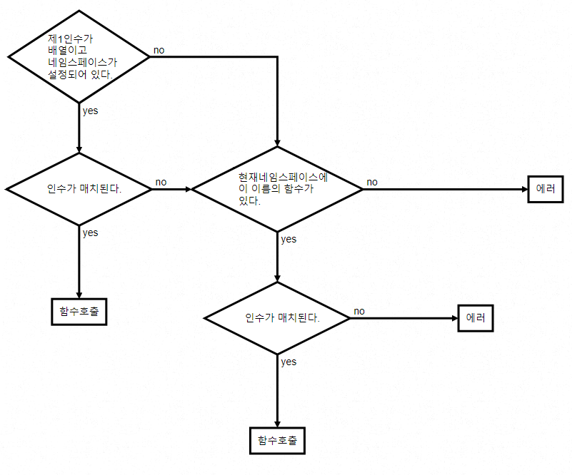
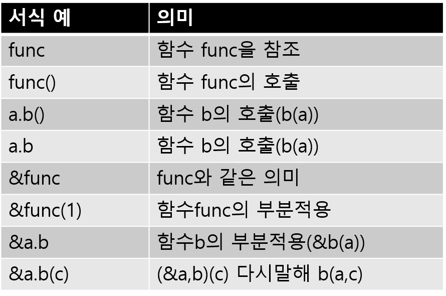

## 3-2 Streem의 객체 지향

> 3-1절에서는 각종 프로그래밍 언어의 객체 지향 기능의 역사 및 시각을 살펴 보았다. 이번에는 드디어 Streem의 객체지향기능을 설계해 본다. 적용하는 데이터의 종류에 따라 적절한 처리를 선택하는 ‘동적결합’을 구현한다. 

자. 드디어 Streem의 객체지향기능을 설계한다. 그런데, 함수형 언어의 영향이 강한 Streem은 그대로 다른 언어의 객체 지향 기능을 가져와도 쉽게 사용할 것 같지는 않다. 우선 Streem의 특징을 검토하고 그에 맞는 객체 지향 기능에 대해 생각해 보자.


#### Streem에서 동적 결합의 가치

Streem의 가장 중요한 특징은 대부분의 ‘객체’가 이뮤터블(immutable)객체, 즉 업데이트 불가하다는 것이다. 대부분의 객체 지향 프로그래밍에서는, 객체의 속성 (인스턴스 변수 등)을 다시 작성하여 계산을 수행한다. 즉, 상태를 개체에 할당하여 다루기 쉽게하려는 의도이다. 3-1절에서 해설한 최초의 객체 지향 언어 ‘Simula’에서도 시뮬레이션의 상태를 관리하기 위해 객체를 도입하고 여러 동종 객체의 동작을 함께 정의하는 클래스를 도입했다 . 
그런데 함수형 언어의 영향을 받은 Streem에서는 값을 나중에 변경할 수 없다. 이는 구조적으로 ‘상태의 관리’를 해야 할 일이 발생하지 않기 때문이다. ‘상태 관리’관련 기능이 없고 또 기능 부재로 인한 부작용만 없다면, 전통적인 객체 지향의 필요성은 높지 않을 것이다.
그러면, Streem 같은 언어에서는 객체 지향 프로그래밍은 전혀 필요 없는 것인가? 
그렇지 않다. 객체 지향 프로그래밍의 몇 가지 특징 중 ‘동적 결합’은 부작용에 상관없이 반길만한 기능이다.
동적 결합은 적용하는 데이터의 종류에 따라 적절한 처리가 선택되는 것이다. 예를 들어 a라는 변수에 저장되어있는 데이터가 문자열일 경우도, 배열일 경우도 ‘length’라는 메소드를 호출하면 그 길이를 구할 수 있다. 문자열의 길이를 구하는 처리와 배열의 길이를 구하는 처리는 내부 구현이 완전히 다를 것이다. 그러나 프로그래머는 내부 로직에 신경쓰지 않고 ‘길이를 구하고 싶다’ 라고하는 추상적인 수준에서 사용할 수 있는 것이다. Streem에 객체지향을 도입한다면, 무엇보다 이 동적결합이야말로 필요한 부분이다.


#### 제네릭 함수(Generic Function)

여기서 함수형 언어적 성질과 궁합이 좋은 형태로 동적 결합을 도입하기 위해 제네릭 함수(Generic fucntion)를 도입하기로 한다. 제네릭 함수는 (3-1절에서도 설명했지만) CommonLisp 등에서 채용되고있는 인수의 데이터 유형에 따라 내부 처리를 선택하는 함수다. 즉, 데이터의 길이를 구하고 싶은 경우에는

```
length(a)
```

라고 하면, a의 데이터 타입에 맞추어 적절한 길이를 구하는 처리(메소드)가 선택된다.
CommonLisp에서는 최초 인수 뿐만 아니라, 모든 인수의 타입에 대하여 메소드가 선택되게 되지만, Streem에서는(대충) 최초의 인수의 타입만으로 메소드를 확정시키려고 생각하고 있다. 

제네릭 함수는 함수호출이라는 형식을 유지하면서, 동적결합의 실현을 가능하도록 하는 놀라운 아이디어 이다. 

메소드의 정의 방법은 

```
def length(a:array) {...}
```

와 같은 형태로 인수의 타입을 지정한다. 이에 의해 만일 length라고 하는 제네릭 함수가 없으면, 이를 작성하고, 그 제네릭 함수에 array타입에 대응하는 메시드를 등록하게 된다. 
타입을 생략한경우는 어떤 타입이라도 대응 가능 하다는 의미이다. 

메소드 정의 자신도 부작용이 있을 수 있어, Streem에서는 최상위레벨만 메소드(와 뒤에 나올 네임스페이스)의 정의가 가능토록 했다. Ruby에서 가능한 조건부 메소드 정의와 같은 것은 허락하지 않는다. 

#### 클래스기능 추가의 부작용을 한정(限定)
Ruby에서는 클래스 이후에 기능을 추가하는 것이 가능하다. 이것을 이용하여 기존의 클래스의 기능을 확장하는 ‘몽키 패치’라 불리우는 테크닉이 널리 쓰이고 있다. ‘Ruby on RAILs’ 를 사용하고 있는 사람들이 잘 쓰고 있는 ‘Active Suport’라고 라이브러리는 이 몽키 패치를 이용하여 기존 클래스에 여러가지 편리기능을 추가 하였다. 이에 의해 

```
2.days.ago
```

라고하는 요소의 Ruby와는 상당히 다른 프로그래밍이 가능해진다. 

하지만 몽키 패치는 편리한 반면 부작용도 있다.  클래스에 나중에 무제한으로 메소드를 추가해 가면 같은 이름으로 각기 다른 동작을 하는 여러 라이브러리가 추가 될 수 있다. 그렇게되면 두 라이브러리를 사용하려고 한 순간에 예상치 못한 문제가 발생한다.
그런 사태를 피하기위한 구조가 Ruby2.0에서 도입 한 Refinement라는 기능이다. Refinement은 요컨대 어떤 특정 범위에서만 클래스에 메소드를 추가하는 기능이다.

(그림 1)은 Refinement의 사용법을 보여주고 있다.
알겠는가? using로 지정된 범위 밖에서 클래스는 변경되지 않고 원래 동작을 유지하고 있다. 그러나 using로 지정된 범위 (using이 등장하고 나서 그 파일의 끝까지)는 Refinement가 활성화되고 추가 된 기능이 보이게된다. 이 전환은 정적이며 동일한 객체에서도 범위 안팎에서는 다르게 동작 할 수 있다. 이제 이름의 충돌이나 메소드 추가 부작용 등에 대해 고민하지 않아도 된다.

```
# 원 클래스 foo라는 메소드만 가지고 있음 
class Foo
    def foo
        p :foo
    end
end


# Refinement의 단위가 되는 모듈 
module FooRefine
    # Foo클래스를refine（확장）
    refine Foo do
        # foo메소드를 확장한다.
        def foo
            p :foo_refine
            # super를 통해 원 메소드를 부를 수 있다.
            super
        end
        # 새로운 메소드 추가
        def bar
            p :bar
        end
    end
end

# Foo클래스 오브젝트를 만든다.
f = Foo.new

# Foo클래스의 foo메소드를 호출 
f.foo # => :foo
# Foo클래스에서는 bar메소드는 정의안되어 있음 
# foo.bar # Error! 메소드 없음

# using으로 Refinement가 추가된다
using FooRefine
# 여기부터는 확장된 foo와 bar가 유효함.
f.foo # => :foo_refine\n:foo
f.bar # => :bar
```

<center>
    (그림 1) Ruby의 Refinement
</center>


#### 구현이 어려웠던 Refinement

하지만 아직 조악한 수준이라 향후 기능확장이 예상되는 Refinement이지만 앞으로 몽키 패치를 대체 해 나가게 될 것이다.
Refinement라는 기능은 아직 마이너 기능이어서 유사한 기능을 제공하는 언어는 거의 없다. Java에 Classbox라는 이름으로 비슷한 기능을 확장 한 처리 시스템과 Smalltalk 의 방언격인 어떤 언어에서 Selector Namespace라는 이름으로 유사한 기능을 제공하고있을뿐이다. 또한, Objective-C의 ‘카테고리 기능’ 이나 C#과 Swift의 ‘클래스 확장’ 은 Refinement와 비슷하다고 할 수 있겠다.
만일 이 Refinement를 구현하려고 하면 상당히 어려운 작업이 된다. 정적 타입의 정보를 사용하여 실현할 수있는 C#이나 Swift와 달리, Ruby에서는 모든 것을 실행시 해결해야 하기 때문이다. 하지만 Refinement를 도입하는 것을 이유로 성능이 저하되는 것은 막고 싶다. 실제로 Refinement를 Ruby에 넣고 싶다고 선언하고 실제로 도입 될 때까지 10년 가까이 걸린 것은 효율적인 구현이 떠오르지 않았기 때문이다. 마에다 슈고(前田修吾)가 효율성 있는 구현을 해 주기까지 그만큼의 시간이 필요했다.

#### 제네릭 함수와 Refinement

그런데 제네릭 함수를 사용하면 Refinement와 동일한 것이 의외로 간단하게 구현될 수 있다.
제네릭 함수는 외부에서 보면 단순한 함수로 처리한다. 그렇다면 Refinement에 해당하는 부분은, 범위에 따라 같은 이름으로
다른 함수를 호출하는 것에 해당한다. 이것은 함수 호출기능이 있는 많은 언어에서 ‘범위’ 또는 ‘네임스페이스’ 라고 하는 이름에서 보통은 실현가능한 것이다.
그래서 Streem에서도 네임스페이스라는 개념을 도입해 Refinement에 해당하는 구현을 한다. Streem의 네임스페이스 문법은 (그림 2)와 같이 된다.
문법 정의만 봐서는 어떤 동작을 하는지 알기 여려울 것이다. 이에 실제의 프로그램 예를 (그림 3)에 나타냈다. 예상되는 동작을 주석으로 기록했다.

```
namespace문 = namespace <이름> {
               구문...
            }
import문 = import <이름>
def문 = def <이름>(<이름>[:<이름>],...) {
        <구문>...
        }
이름 = [A-Za-z_][A-Za-z0-9_]*
```

<center>
    (그림 2) Streem의 네임스페이스 문법
</center>


```
# namespace문으로 test_ns이라고 하는 namespace를 정의
namespace test_ns {
    # import로 다른 네임스페이스를 불러옴 
    import development_ns
    # development_ns로 제공되는 함수, 변수가 보임 
    
    # 함수정의
    def print(message) {
        puts(stderr, message)
    }
}
```

<center>
    (그림 3) Streem의 네임스페이스 예
</center>


네임스페이스를 사용하면 특정 범위에서만 보이는 함수를 만드는 것은 간단하다. 즉, Refinement 같은 구현이 어려운 기능을 도입하지 않고 그 범위에서만 유효한 메소드의 정의 (Swift 나 C#의 클래스 확장으로 가능한 것)과 그 범위에 한정된 메소드 동작의 임시 변경 (Refinement라면 가능한 것) 모두 가능하다는 의미이기도 하다 (그림 4).

```
# 글로벌 함수 foo 정의 
def foo(a) {
    # 인수를 문자열화하여 출력
    puts(to_s(a))
}
# ‘클래스 확장‘용 네임스페이스
namespace extend {
    # 기존 함수를 오버라이드 
    def foo(a:string) {
        puts("foo\n")
        # 오버라이드한 함수를 호출
        super(a)
    }
    # 이 네임스페이스에서마 유효한 함수
    def bar(a) {
        puts("bar\n")
    }
}
import extend
foo("a") # extend의 foo가 호출된다
bar("b") # extend의 bar가 호출된다
```

<center>
    (그림 4) 제네릭 함수와 네임스페이스에 의한 클래스 확장
</center>


#### 이름의 충돌
import 문을 사용하면 하나의 네임스페이스에 다른 네임스페이스에서 기능을 통합 할 수 있다. 그러나 여러 네임스페이스를 import했을 때, 각각의 네임스페이스가 동일한 이름을 가지고 있다면 이름의 충돌이 발생한다. 충돌이 발생하면 어느 쪽을 참조할지 모르기 때문에 모순이 생기는 것이다.
이 모순을 해소하는 방법에는 여러 가지가 있다. 가장 간단한 방법은 오류를 내는 것이다. 즉 충돌이 일어난다는 것은 기능적으로 이를 가져다 쓰고 있는 것들이  같이 위험하게 되므로 원래 함께 사용하지 말아야한다는 입장이다.
그리고, import시 중복된 이름을 변경하여 충돌을 피하는 방법이 있다. 제일 쉬운 방법이지만 명칭 변경된 함수를 원래의 네임스페이스에서 호출 한 경우에 어떻게 처리할지 등 생각 할 점도 많아져 구현이 복잡해진다.
이 외에도 충돌 한 경우에는 네임스페이스를 명시적으로 지정해 호출하는 방법도 있다.
이름 변경을 할 정도로 복잡한 구현되지 않을 것 같지만, 간단하다고도 말할 수도 없을 것 같다. 
이 점을 어떻게 할 것인가에 대해서는 상당히 고민했지만 당장은 단순하고 알기 쉬움을 우선시해 충돌이 발생하면 오류를 내기로 했다. Ruby의 경험에서 생각해봐도 여러 네임스페이스 (Ruby의 경우 모듈)에서 이어진 이름이 충돌하여 이를 해소해야 할 상황은 그리 자주 발생하지 않을거라 생각되었기 때문이었다. 향후 오류 이외의 명칭 충돌 해소 방법이 절대적으로 필요없다고 생각하는 것은 아니다. 충돌 해소를 어떨게든 해야 하는 구체적인 상황이 발생하면 고민해 보도록 하겠다.


#### Streem의 객체

그런데, 객체 지향 프로그래밍라면 클래스를 정의하거나 개체를 만들거나, 그에 대한 메소드를 호출하거나하고 싶은 것이다.
메소드 호출은 제네릭 함수에서 실현하기로 했지만, 클래스와 객체에 대해 어떻게 해야 할 까. 지금까지의 설명에서 언급 한 바와 같이, 유사한 데이터 구조를 반복하여 도입하고 싶지는 않기 때문에 가능하면 새로운 ‘객체 타입’ 같은 것을 도입은 피하려 한다.
여기에서 다른 언어를 참고해 보자. Lua라는 언어는 테이블이라는 데이터 구조가 있어, 객체를 대신한다. Perl도 해시를 객체로 활용하고 있다. 또한 JavaScript는 객체라는 데이터 형이 있지만, 그 실체는 단순한 해시 테이블이다.
이는 곧, 기존의 데이터 구조에 조금 수정을 하는 것으로도, 객체(에 해당하는 것)를 표현할 수 있다는 의미이다. Streem에는 배열이 있고, 이것이 일반 언어의 해시 테이블의 역할도 지원하고 있다. 이 배열을 객체로 취급 할 것이다.
Lua에서 테이블을 객체로서 처리하기 위해 메타 테이블이라는 것을 설정한다. 메타 테이블 객체에 대한 다양한 작업을 저장한 테이블에서 이른바 클래스의 역할을 하고 있다.
Perl에서는 스칼라 데이터 패키지를 bless하여 객체로 취급한다. 즉, 그 객체에 대한 작업은 패키지에 포함 된 함수가 맡는다는 것이다.
그런데, Streem은 어떻게 할까.. 하고 고민 한 끝에, Perl의 방법에 힌트를 얻어 배열을 객체 대용으로 활용하기로 했다. 즉, 이렇게 된다.

```
new <이름>[값]
```

이렇게 호출을 하면, <이름>으로 지정된 네임스페이스를 ‘클래스’로서 관련된 배열이 할당된다. 결국

```
new Foo [1,2,3]
```

은 3요소 배열에 Foo라고 하는 이름의 네임스페이스를 연결한 것을 돌려주는 것이다. 이 배열을 제1인자로 하는 함수 호출을 특별 대우하는 것으로 객체지향 기능을 제공 한다.

네임 스페이스를 클래스로 활용함으로써 객체 지향 기능을 실현하고자 하기 위해, 함수 호출 처리를 확장하겠다. 확장 된 함수 호출의 처리를 (그림 5)의 흐름도에서 보여주고 있다. 이렇게 하면 함수의 첫 번째 인자가 new로 만들어진 배열 인 경우 해당 네임 스페이스의 함수가 호출된다.

이걸로 제네릭함수와 네임스페이스를 사용한 비교적 심플한 객체지향 시스템을 만들수 있게 되었다. 



<center>
(그림 5) 함수 호출 플로우 챠트. ‘인수 매치’란 인수의 값과 타입이 함수 정의와 일치하는지 체크하는것
</center>


#### 메소드 체인

그렇다고 해도, 함수 스타일이 항상 최적이다라고는 할 수는 없다. 여러 함수 호출을 이어서 하는 스타일은 함수 호출 순서와 프로그램상에 등장하는 순서가 역순으로 되는 경우가 발생한다.
예를 들어, 배열 요소 조건 (짝수)에 의해 선별하고 그것을 정렬하고 중복 요소를 제거하는 처리를 함수 호출 스타일로 작성하면 (그림 6) (a)와 같이된다.
수행 할 작업의 순서 (선별 → 정렬 → 중복 제거)에 대해 함수의 등장 순서가 반대로되어 있다.

```
(a) 함수 스타일
uniq(sort(filter(ary, {x -> x % 2 == 0})))

(b) 메소드 스타일
ary.filter{x -> x % 2 == 0}.sort.uniq
```

<center>
    (그림 6) 함수 스타일과 메소드 스타일
</center>


이것이 Ruby 같은 메소드 호출 스타일이고 그림 6 (b)와 같이된다. 메소드가 등장하는 순서가 실제 순서와 일치하고 알기 쉽게되어 있다. 또한, 일본어[^1] 스러운 ‘선별하고, 정렬하여 중복 제거’ 와 같은 동작의 일련 표현에도 부합한다.

다른 언어도 이를 공감했는지, 어떤 언어에서는 함수 호출을 연쇄 할 수있는 기법을 제공한다. 예를 들어, Haskell에서는 ‘$’ Elixir는 ‘|>’를 사용한다. 이는 (그림 7) (b)와 같이된다.

자, 어떤가? 메소드 호출 스타일과 거의 같은 느낌으로 프로그래밍 할 수있게 되지 않았는가?. 이는 표기법으로 매우 유용하기 때문에 Streem도 도입을 하겠다. Streem에서는 ‘$’대신에 ‘.’을 사용할 것이다. 그렇게 되면 외관상 보통의 객체 지향 언어의 코드처럼 보이게된다 (그림 7) (c)

```
(a) 함수 스타일
uniq(sort(filter(ary, {x -> x % 2 == 0})))

(b) $표기법
ary $ filter{x-> x % 2 == 0} $ sort $ uniq

(c) .표기법(Streem에 채용)
ary.filter{x-> x % 2 == 0}.sort.uniq
```

<center>
    (그림 7) 함수 스타일과 함수호출의 연쇄 표기법
</center>


#### Lisp-1 과 Lisp-2

함수형 언어의 조상이라고해도 좋은 Lisp에는 함수 취급에 있어서 두 가지 방식이있다. 이를 각각 Lisp-1과 Lisp-2라고 한다.
Lisp-1은 Scheme라는 Lisp의 방언에서 채용된 아이디어로, 함수의 네임스페이스와 변수의 이름 공간에 구분없이 네임스페이스가 하나 밖에 없다(그래서 Lisp-1). Lisp-1에서는

```
(print "hello")
```

는 ‘print라고 하는 이름의 변수에 할당된 함수를 "hello" 를 인수로서 호출’ 라고 하는 의미로 해석되어

```
print
```

는 함수로 참조가 된다.

한편, Lisp-2는 CommonLisp등에서 채용된 아이디어로, 함수와 네임스페이스가 분리되어 있어, 2개(이상)의 네임스페이스가 존재한다. Lisp-2에서는 

```
(print "hello")
```

는 ‘print라고 하는 이름의 함수를 "hello"를 인수로 호출’ 라는 의미여서, 표면상의 동작은 Lisp-1과 같다. 하지만, print의 처리 함수는 

```
print
```

라고 하는 변수를 참조해도 추출할 수 없게 되어, 특별한 형식을 사용할 필요가 있다. CommonLisp의 경우

```
(function print)
```

또는 이의 줄임형태인

```
#`print
```

같은 표기법을 사용한다. 

Lisp-1과 Lisp-2의 차이는 사소한 것처럼 보일지 모르지만 사실 일장일단이 있다.
Lisp-1의 장점은 함수를 값으로 꺼내기 쉽고 함수형 프로그래밍을 실천하기 쉽다는 점이다. Lisp-1이라면, 

```
((func args) arg)
```

같은 함수를 반환하는 함수의 반환 값에 인수를 전달하여 호출도 간단하고,이를 사용하여 객체 지향 시스템을 만드는 것도 용이해진다. Lisp-2에서는 이렇게 안된다.
한편 Lisp-1에서는 함수 호출 반드시 함수에 대한 참조를 수반하므로 최적화하기 어렵다는 것은 단점이다. Lisp-2는 이의 정 반대 이다. 

이 개념은 Lisp 이외에도 적용시킬 수 있는데, 실제로 JavaScript 나 파이썬은 Lisp-1방식이며, Ruby와 Smalltalk는 Lisp-2 방식이다.
Lisp-2를 채용하는 이유는 메서드 호출의 최적화를 위한 것이고 그만큼 메소드를 객체로 취할때에는 시간이 약간 더 걸린다 (그림 8).

```
# Python (Lisp-1)
obj.foo(1)           # 메소드 호출
f = obj.foo          # 메소드 취득
f(1)                 # 메소드 간접 호출


# Ruby (Lisp-2)      
obj.foo(1)           # 메소드 호출
obj.foo              # 메소드 호출（인수 없음）
f = obj.method(:foo) # 메소드 취득
f.call(1)            # 메소드 간접 호출
```

<center>
    (그림 8) 파이썬과 Ruby의 메소드 취득
</center>
주의해야 할 점은, Lisp-2 인 Ruby에서 메소드를취득하기 위하여 method 메소드를 사용하는 점과, 꺼낸 메소드 객체를 호출 할 때 call 메소드를 사용한다는 것이다.
(그림 8)의 프로그램 만 보면 Python과 Lisp-1으로 방법이 더 간단하고 좋은 것 같다. 그러나 Ruby에게도 메서드 호출 최적화의 여지가 크고, 실제 메소드 캐시 등이 구현되어있는 점과 인수가 없는 특성 참조에 보이는 형태의 메소드 호출이 가능하다는 점에 장점이 있다.

그래서 Streem에서는 Lisp-1과 Lisp-2의 중간인, 이른바 Lisp-1.5[^2] 의 방법으로 생각하고 있다. 즉, 함수 이름을 직접 지정했을 때는 함수에 대한 참조를 얻을 수 있고, ‘.’을 사용한 메소드 체인 형식에서는 인수가 없는 메소드 호출로 간주 한다. (표 1).
또한 ‘&’기호를 이용하여 함수의 부분 적용을 할 수 있다. 부분 적용이라 함은 함수 인수의 일부를 메꾼 함수다. 조금 이해하기 어려울지도 모르니, 실례를 보도록 하자.



<center>
(표 1) Streem의 함수 호출
</center>


예를 들어, 두개의 수를 합하는 plus라고 하는 함수가 있다고 하자.

```
plus(1,2) # => 3
```

은 1과 2를 더하여 3을 돌려준다. 자, 여기에서

```
plus5 = &plus(5)
```

라고 하면, plus5에 대입되는 것은 ‘plus의 최초의 인수를 5로 고정한 함수’ 이다. 이 plus5에 인수를 전달하면, 무조건 5가 더해지는 값을 반환한다. 

```
plus5(1) # => 6
plus5(9) # => 14
```

이 예에서는 인수를 1개만 고정했지만, 2개 이상 고정도 가능하다. 

```
plus12 = &plus(1,2)
plus12() # => 3
plus12(3) # => ERROR !  인수가 많음
plus123 = &plus(1,2,3)
# ERROR ! 인수가 많음
```


이 형식은 도트 표기법에도 유효하다. ‘f = &a.b’ 는 ‘f = &b(a)’의 생략 표기이고, ‘f(c)’로 호출하면 ‘a.b(c)’, 다시말하면 ‘b(a,c)’ 라고 하는 함수가 호출된다.


#### 마치며

이번에는 Streem의 객체 지향 기능을 설계했다. CommonLisp의 제네릭 함수나 Haskell의 $ 표기법 등 기존 언어의 아이디어를 차용하면서도, 그것을 잘 결합하여 독특한 무언가를 설계 할 수있지 않을까?. 또한 ‘언어 설계라고 이렇게 하는 것이야.’ 라는 점에서도 (어쩌면) 참고가 될지도 모르겠다.
이번 부분의 소스 코드는 ‘https://github.com/matz/streem’에서 ‘201512’라는 태그를 붙여 둔다. 참고로 구현의 난이도 때문에 ‘&’ 함수의 부분 적용은 아직 작업을 하지 않았다. 다른 부분도 아직 미완성이다.


<hr>

### 타임머신 칼럼

***더 나은 설계가 있을 것 같다***

> 2015 년 12 월호 게재분이다. 3-1절에서 설명하는 객체 지향의 개념과 역사를 본 다음, Streem라는 함수의 영향을 받은 언어의 객체 지향 기능은 어떤 것이어야 하는지 생각해 봤다. 객체 지향 프로그래밍은 이미 당연한 것이 되어버렸지만, Streem 같은 언어에 가장 적합한 객체 지향 기능의 디자인에 딱 맞는 것은 없는 것 같다. 이번에는 제네릭 함수와 네임스페이스를 결합한 객체 지향 기능을 디자인하여 보았다. 우선 유용하다. 하지만 완전히 만족스럽지는 못한 것 같다. ‘&’에 의한 부분 적용의 구현도 불완전하고....  이번 설계는 함수형 프로그래밍과 객체 지향 프로그래밍이라는 두마리 토끼를 다 잡았다고 생각된다. 하지만 CLOS의 제네릭 함수처럼 네임스페이스 제어에 의해 Refinement와 같은 기능이 구현되는 것은 아니며, 완전한 융합이라고 부를 정도는 아니다. 여전히 불만이 남아 있기 때문에 앞으로 더 좋은 디자인이 실현되면 좋겠다.


[^1]:  일본어와 한국어의 어순은 동일하기 때문에 이 내용은 그대로 적용 가능하다(옮긴이)
[^2]:  정말 이를 Lisp-1.5라고 부르면, 초기의 Lisp 처리 시스템과 이름에 영향을 줘 버린다. 