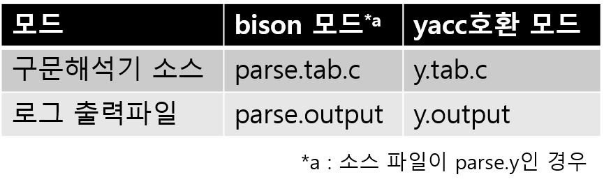

## 3-3 Streem 문법 재검토

> 여러가지 검토를 하면서 설계한 Streem문법도 시간을 가지고 들여다 보면, ‘일단’ 이라고 생각하여 설계했던 문법들에 개선 사항들이 나오기 시작했다. 문법을 정비하려면, 아직 아무도 Streem을 사용하지 않은 지금이 찬스인것 같다. Streem문법의 재검토를 해 보도록 하자.

이 문서에 대한 샘플 프로그램을 작성해야 하기때문에 아마도 나는 세계에서 처음으로 Streem으로 프로그램을 작성하고 있다고 생각한다. 적어도 현시점에서는 Streem 프로그램을 쓰고있는 사람은 나 뿐일 테니... 그리고 아직 쓸만한 수준은 아니기 때문이다.
그렇게 Streem에서 프로그램을 작성했는데 개선해야 할 점들이 나왔다. 최초로 문법을 설계 할 때 별로 고민하지 않았다는 것을 깨닫는 것은 자주 있는 일이다.

#### shift/reduce conflict

우선 첫번째 개선점은 문법의 모호성이다. Streem의 문법은 YACC라는 도구를 위한 표기법 (YACC 표기법이라 부르겠다)로 쓰여져 있고, GNU의 YACC 호환 도구 인 bison에서 C로 컴파일된다.
본 원고 집필 직전의 Streem의 문법 정의를 bison으로 체크하면

```
8 shift/reduce conflicts
```

라는 경고가 표시된다. 이것은 ‘문법이 모호한 규칙이 8개있다’ 는 의미이다. ‘conflict(충돌)’는 구문 분석시있는 상황에서 어떤 기호가 왔을 때, 전환 할 상태가 여러 개있는 상태를 말한다. 그 규칙이 종료(reduce)된 것인지, 아직 계속 (shift) 적용하는  것인지  모르는 경우

```
shift/reduce conflicts
```

라고 부른다. 여하간 규칙은 종료되었지만, 전환해야 할 상태가 여러개 있는 경우에는 

```
reduce/reduce conflic
```

라는 에러가 발생한다. 예를 들어,

```
expr + expr * expr
```

가 있다고 하면, 이 식을 

```
(expr + expr) * expr
```

라고 해석할 지, 아니면, 

```
expr + (expr * expr)
```

라고 해석할 지 분명하지 않다. 여기서 yacc는 ‘어떻게 할지 모르겠다’의 의미로 shift/reduce conflict 라는 경고를 발생시킨다. 하지만, 실제 식에서 산술 이항 연산자는 좌결합이어서 

```
1 + 1 + 1
```
은 

```
(1 + 1) + 1
```

로 해석된다. 또한 연산자는 우선순위가 있어, ‘곱셈연산자(*)는 덧셈연산자(+)보다 우선순위가 높다’ 라는 규칙이 있어, 모호성은 전혀 없다. 여기서 YACC 표기법에 이 규칙을 반영시키면 conflict는 없어질 것이다.

그래서 이번에 conflict가 어디에서 기인하고, 문법의 어디에서 모호함이 있는지 알아보기로 하자. yacc에 -v 옵션을 선택하면 문법을 어떻게 해석 했는가하는 로그를 ‘y.output’ 라는 파일에 출력 해 준다.

```
$ LANG=C yacc -v parse.y ↵
```

여기에서 yacc라고 하는 것은 bison의 별명 이지만, bison은 yacc라는 이름으로 기동되면 ‘yacc호환 모드’로 동작한다.

bison 모드에서 구문 분석기 소스와 출력 파일의 이름이 (표 1)과 같이 된다.
하나의 프로그램에서 여러 구문 분석기를 쓸 일이 없으면, yacc 모드가 유용하다고 생각하기 때문에 이를 계속 쓰고 있다.
‘LANG = C’는 출력되는 로그의 일본어 표기를 종료하기 위하여 지정한다. 로그를 볼 때에는 일본어가 유용하지만,로그의 내용을 검색 할 때 일일이 ‘状態(じょうたい)’라고 입력하는 것보다 ‘State’가 더 손에 익었기 때문에 일본어가 없는 편이 낫다. 물론 이는 개인차가 있다. 



<center>
(표 1) bison모드와 yacc호환모드
</center>


```
State  0 conflicts: 2 shift/reduce
State 11 conflicts: 2 shift/reduce
State 14 conflicts: 2 shift/reduce
State 51 conflicts: 2 shift/reduce
```

<center>
    (그림 1) y.output의 경고
</center>


```
State 11

    4 decls: decl_list . opt_terms
    6 decl_list: decl_list . terms decl

    ';' shift, and go to state 6
    '\n' shift, and go to state 7

    ';' [reduce using rule 106(opt_terms)]
    '\n' [reduce using rule 106(opt_terms)]
    $default reduce using rule 106(opt_terms)

    opt_terms go to state 50
    terms go to state 51
    term go to state 15
```

<center>
    (그림 2) conflict가 있는 state
</center>


이렇게 생성 된 y.output 파일을 살펴보면, 첫 번째로 (그림 1)과 같은 경고가 표시된다. 그래서 예를 들어 State 11을 살펴보면 (그림 2)와 같이되어 있다. 참고로 상태를 검색하기 위해서는 정규식 ‘^ state 11’을 쓰면 편리하다.

(그림 2)를 보면 ‘\n’또는 ‘;’에서 conflict가 일어나고있는 것을 알 수 있다. 사실 프로그램의 구조로서 선언이 먼저 오고  명령문은 다음에 와야하지만, 그 사이의 구분자가 되는 ‘\n’이나 ‘;’이 어떤 규칙을 적용할 까에 대한 모호성이 발생하고 있다. 글쎄, 결국 이것들은 구분 기호에 지나지 않기 때문에 뭘로 해도 상관없을 것이라 생각된다.
그러나 역시 찜찜한 기분이 들기 때문에 규칙을 변경토록 하겠다. 


#### 선언과 실행문

지금까지의 문법은 선언문 다음에 실행 문이 온다는 옛 C와 같은 규칙이었다. 그러나 그러한 룰에 집착할 이유는 없다. 그래서 지금까지 선언되었던

● 메소드 정의
● 네임 스페이스 정의 

를 포함하는 것을 톱레벨 문으로,  톱레벨이면 어디든지 위치할 수 있도록 할 것이다. 이것은 메소드 정의 등을 조건문 안이나 다른 메소드 정의 내에 두지 않게되는 것을 의미하며, 바람직한 방향이다.
새로 도입 한 톱레벨 문에 대한 규칙은 (그림 3)에 나와 있다 (액션 제외).
함수를 정의하는 def 문은 결국 함수 객체를 변수에 대입하고 있을 뿐이므로 톱레벨 문장이 아니라 일반 문장에 위치하고 있다.
이로부터 def문도 method문도 정의 부분이 하나의 식으로 표현할 수있는 때 ‘= 식’의 형태로 쓸 수 있게 했다. 간결하게 쓰고 싶어서였다. 사실 ‘=’ 없이 정하고 싶었지만, 의문의 충돌이 발생하여 고민 끝에 정한 고육지책이다.

```
topstmts : topstmt
         | topstmts terms topstmt
         ;
topstmt  : keyword_namespace identifier '{' topstmts '}'
         | keyword_class identifier '{' topstmts '}'
         | keyword_import identifier
         | keyword_method identifier '(' opt_f_args ')' '{' stmts '}'
         | keyword_method identifier '(' opt_f_args ')' '=' expr
         | stmt
         ;
```

<center>
    <그림 3. 톱레벨 문의 규칙>
</center>

#### break문의 삭제

문법도 정리를 해 보자. 현재의 문법은 함수의 실행을 중단시키는 break와 skip이라는 두 예약어가 있지만 기능의 중복이기 때문에 하나를 삭제한다. break는 원래 C의 루프를 중단 문장이지만, Streem는 원래 루프가 없다. 그래서 break 쪽을 삭제한다.
이는 낱말 분석기인 lex.l과 구문 분석기의 parse.y에서 break 관한 부분을 삭제하는 것이다. 원래 break 문에 대한 처리는 제대로 동작하지 않았었기 때문에 삭제해도 별 문제는 없을 것이다.
하는 김에 skip은  제대로 동작하도록 하자. skip이 호출되면 예외가 발생하여 실행을 중단하도록 하겠다.

#### if 문의 변경

이 기회에 문법에서 고쳐야 할 부분은 점은 정리하겠다.
신경이 쓰였던 것들 중 하나는 if 문이다. Streem중 몇 안되는 제어 구조의 하나 인 if 문이지만, 수식을 많이 사용하는 프로그램에서는 약간 볼품이 없어 보인다. 예를 들어, 유명한 FizzBuzz 프로그램을 이전 문법으로 기술하면 (그림 4)와 같이된다.

```
seq(100) | map{x ->
    if x % 15 == 0 {'FizzBuzz'}
    else if x % 3 == 0 {'Fizz'}
    else if x % 5 == 0 {'Buzz'}
    else {x}
} | stdout
```


<center>
    <그림 4. 이전 문법에서의 FizzBuzz>
</center>

고치고 싶은 부분은 두 부분으로, 하나는 중괄호 ({})가 필수적이라는 것, 또 하나는 조건문을 둘러싸는 괄호가 없는 것이다.

이전 문법에서는 중괄호가 필수인데는 이유가 있었다. 제어 구조에 중괄호를 사용하는 언어 언어, 예를 들어 C에서 발생하는 문제 중에 ‘dangling else’라는 것이 있다. 이것은,

```
if (cond1)
    if (cond2)
        statement2
    else
        statement3
```

와 같은 코드가 있다고 하면 이를

```
if (cond1) {
    if (cond2)
        statement2
    else
        statement3
}
```

로 해석할지, 또는 

```
if (cond1) {
    if (cond2)
        statement2
}
else
    statement3
```

로 해석할지 분명하지 못하여, 충돌이 발생하는 것을 말한다. yacc는 충돌이 발생해도 shift를 우선순하는 것으로 ‘else는 가까운 쪽의 if에 연결된다’ 라는 룰을 가지고 있지만, 모호성이 있는 것은 부인할 수 없다. 

Ruby에서는 이것이 싫어 ‘빗 모양 구문’ 을 도입하고 있다. 즉, 원래 하나 밖에 문이없는 경우와 여러 문장이있을 때 스타일이 다른 것이 문제이므로 중괄호 등은 사용하지 않고 if 문은 해당 end까지 결정 해 버리게 한다. 그러면 if 문 전체가

```
if cond1
    statement1
elsif cond2
    statement2
else
    statement3
end
```

와같은 스타일이 되고, if와 else 등이 빗살처럼 튀어나와 있어 빗 모양 구문이라고 부르고 있다.
한편, Perl에서는 괄호 생략을 허용하지 않음으로써 이 문제를 해결한다. 처음에는 Streem도이 방식을 흉내내어  중괄호의 생략을 허용하지 않았다.
그런데 Streem이 많이 사용하는 함수형 프로그램에서는 if 문이 식으로서 값을 반환 할 경우가 종종 있다. 그 때는 오히려 중괄호는 없는 방식이 더 자연스럽게 보인다. 

거기서  C스타일로 돌아와 다시 단문(또는 단일 식)에서는 괄호없이 여러 문장을 정리할 때에는 중괄호로 둘러싸는 문법으로 변경했다.

이에 따라 조건식 주위를 괄호 안에 있게 했다. 이전 문법에서 조건식 주위의 괄호를 필요 없게 한 것은 Go를 흉내 낸 것이지만, 함수 호출 뒤에 블록이 붙은 Streem는 그래서 문법이 복잡하게 되어 버렸다(조건식 에서의 함수 호출은 블록을 붙일 수 없도록 식을 위해 두 종류의 독립적인 규칙을 가지고 있었다). 그 때 열심히 규칙을 작성했지만, 작성 후 냉정하게 보면 지금까지 노력해 규칙을 복잡하게 만들고도 얻을 수 있는 것은 많지 않은 것 같았다. 이번 기회에 간단하게 하려 한다.

그레서 if 문을 변경 한 후 문법에 FizzBuzz을 나타는 것이 (그림 5)이다. (그림 4)와 비교하면 크진 않지만 더 깔끔한 인상을 준다.

```
seq(100) | map{x->
    if (x % 15 == 0) 'FizzBuzz'
    else if (x % 3 == 0) 'Fizz'
    else if (x % 5 == 0) 'Buzz'
    else x
} | stdout
```

<center>
    (그림 5) 새로운 문법의 FizzBuzz
</center>


#### 약간의 모호성

이번 변경에 따라 기계에 있어서는 모호하지 않아도 인간은 실수하기 쉬운 조합이 발생했다. 예를 들어

```
if (cond) {print(x)}
```

라고 하는 if 문이 있는 경우, 이

```
{print(x)}
```

는 print(x)라고 하는 함수호출을 중괄호로 묶어 보여주며, 정의부분으로서 print(x)를 갖는 함수 객체, 결국 

```
{->print(x)}
```

의 인수 부분이 생략 된 것처럼 보인다. 이러한 경우에서는 Streem은 if 문 본체 부분의 중괄호를 묶은 것으로 해석한다.

사실 이는 상당히 귀찮은 부분이다.  보통은 이런 경우, 문법을 작성하면 사람과 마찬가지로 구문 해석기도 혼란에 빠져 충돌을 일으켜 버린다. 그래서 Streem의 구현은 우선 한 번 함수 객체로 간주하여 구문 분석을 한 후, if의 본체 부분이라면 그것을 괄호로 구문 트리를 재구성 한다.

#### 오른쪽 대입의 추가.

수정해야 할 부분이 또 있다.

Streem 프로그램을 쓸 때, 때때로 짜증나는 경우는 파이프 라인을 대입 할 때다. 다시말하면, Streem 파이프 라인은 ‘|’로 연결하여 왼쪽에서 오른쪽으로 흐른다. 이것을 분기 등을 위해 대입하면 왼쪽에서 오른쪽으로 파이프 라인을 만들어 놓고 그것을 대체 할 때 왼쪽으로 돌아 대입하게 되어 있어 시선과 의식의 흐름에 역행하는 것이다.
실제 예를 보면서 생각해 보자. (그림 6)에있는 것은 (p.314<sup>편집 후 페이지 변경 필요</sup> ~의 5-5절에서 설명하는) 편차 계산 프로그램이다.
여기서 주목 해 주었으면 하는 것은 그림 6에서 (a) 표시가있는 부분이다. input로부터 average() 함수를 통해 계산하는 평균값(의 스트림)을 avs라는 변수에 대입하고 있다. 의식은 input으로 부터  average(), 변수avs 의 순서로 흐르고 있는데, 프로그램의 등장 순서는 avs, input, average ()가 되어 버린다. (b) 표시가있는 부분도 마찬가지다. 이 의식의 흐름과 기술 순서의 불일치는 미묘한 스트레스를 주게되고 생산성 저하로 이어지게 된다. 

여기에서 ‘=>’ 라는 기호를 사용하여 왼쪽부터 오른쪽에 대입을 하는 것으로 했다. 이를 사용하면, (그림 6)의 (a)는 

```
input | average() => avs
```

가 되고, 의식의 흐름과 기술 순서가 같아지게 된다. 

프로그래밍 언어에서 할당이 오른쪽에서 왼쪽 것은 당연하고, 의식의 흐름과 기술  순서 불일치를 그렇게 걱정하는 것이 ‘무슨 큰일’이냐고 느끼는 사람도 많을 것이다. 그러나 이런 작은 것들의 축적이 언어의 간편한 장점으로 이어질 것이다.

```
input = fread('result.csv')|map{x->number(x)} # (c)
avs = input | average() # 평균 (a)
sts = input | stdev()   # 표준편차 (b)
zip(avs, sts) | each{x->
  avg = x(0); std = x(1)
  fread('result.csv') | map{x->number(x)}| each {score->
    ss = (score-avg)*10 / std + 50
    print('득점: ', score, '편차값:', ss)
  }
}
```

<center>
    (그림 6) 편차값의 게산
</center>


#### 함수 호출의 변경
마지막에 손을 볼 부분은 함수 호출 부분이다.
앞서 언급 한 바와 같이, Streem은 가능한 Ruby와는 다른 설계를 하려고 한다.
또한 처음부터 객체 지향 언어로 설계 한 Ruby와 달리 Streem에서는 오히려 함수형 프로그래밍을 중시하려고 생각했다. 따라서 메서드 호출을 중심에 두는 Ruby에 반해 Streem는 어디 까지나 함수 호출을 중심으로 하려고 생각했다.
그러나 객체 지향의 편리함, 특히 폴리모피즘은 유지하고 싶었기 때문에 함수 호출의 제1 인자가 소속된 네임 스페이스에 의해 호출되는 함수가 결정되는 구조도 도입했다.
각각 이유있는 판단이지었만, 이 때문에 언어에서 함수의 위치가 약간 흔들려 버린 것도 사실이다.

예를 들어 통상 함수형 언어라면

```
number(x)
```

라고 하는 식은 ‘number라고 하는 이름이 붙여진 함수(객체)를 인수 x로 호출’ 이라고 하는 동작을 의미한다. 
한편, 현재 Streem에서는 

```
number(x)
```

의 동작은 ‘x가 어떤 네임스페이스를 가지고, 이 네임스페이스에 number라고 하는 함수가 등록되어 있다면 이것을, 그렇지 않다면 현재의 범위에서 number라고 하는 이름으로 참조가능한 객체를 함수로서 호출’ 이라고 하는 동작을 의미한다. 

뭐 약간 호출 규칙이 복잡하지만, 익숙해지면 문제는 없을 것이다. 
곤란한 부분은, 이 동작의 경우, 호출된 함수의 제네릭한 취급이 불가능하다는 점이다. 

(그림 6)(c) 부분을 보자. 여기서는 map을 사용하여 스트림의 엘리먼트를 수치로 변환하고 있다. map은 함수를 인수로서 취급하기 때문에, 원래라면 이 부분은

```
map(number)
```

와 같이 호출이 된다. 하지만, 현재의 Streem에서는 number(x)라고 하는 함수호출(처럼 보이는 것)에서, 데이터 변환이 가능한 것들은, 각각 네임스페이스에 등록된 함수가 실행하고 있다. number라고 하는 이름에서 얻을 수 있는 값(함수)의 제한은 없다. 그 결과 위와 같이 number라고 하는 이름으로부터 ‘각종 데이터으로부터 수치로 변환을 수행하는 함수’를 불러온는 것은 불가능하며 

```
map(number)
```

와 같은 호출 방식도 불가능하게 된다. 

이는 별로 반길 일은 아니다. 여기에서는 ‘이 컨텍스트에서의 '함수호출'과 동일한 동작을 하는 객체’를 도입하는 것으로 한다. 네임스페이스에 산재된 함수를 제네릭하게 불러 쓰는 게 가능하기 때문에, 이 객체를 ‘제네릭 함수 객체’ 로 부르기로 하겠다. 
제네릭 함수 객체를 식별자 앞에 ‘&’를 붙여 불러오는 것으로 한다. 따라서,

```
map(&number)
```

는 

```
map{x->number(x)}
```

와 동일한 기능을 가지게 된다. 

#### 함수 의 직접 호출

또 하나, 함수명과 변수명이 우연히 일치하여 충돌하는 경우의 대처를 위해, 폴리모피즘을 무시하고, 제1인수의 네임스페이스에 관계없이, 함수 객체를 그대로 부르는 방법을 만들었다. 

```
func.(x)
```

와 같이 인수를 괄호의 앞에 ‘.’를 붙이면, 확실히 함수 객체의 호출이 된다. 반드시 식별자로 지정해야 하는 함수 호출과는 달리, 이 형식에서는 func의 부분은 호출가능한 객체를 돌려주는 임의의 식으로 표기가 가능하다.

#### Lisp-1과 Lisp-2

이와 같은 함수호출의 방법에 대한 논의는, Lisp 커뮤니티에서 오래전부터 논의가 되었던 것이어서, (3-2절에서도 언급한 것처럼) 크게 나누면 ‘Lisp-1’ 과 ‘Lisp-2’로 불리운다.

Lisp-1은 함수와 변수의 네임스페이스가 분리되어 있지 않는 방식이다. 네임스페이스가 1개밖에 없기 때문에 Lisp-1으로 불린다.

Lisp-1을 채용하고 있는 언어는 Scheme, JavaScript, Python이 있다. Lisp이외에 다른 언어에도 적용가능한 설계 방침의 이름이지만, 이제와서 Lisp라는 이름을 붙여 부르는 것은 좀 이상하다. 

이들 언어 에서는 

```
print(x)
```

라는 함수 호출은 print라는 식을 체크하고, 그 결과로 어떤 함수(또는 호출 가능한 객체)를 인수 x로 호출 한다는 의미를 가진다. 함수명에 해당하는 것은 단지 변수의 참조여서 임의의 식을 두는게 가능하다. 즉,

```
((complex_expr)(args1))(args2)
```

와 같은 식이 있다면, 

* complex_expr을 체크한다
* 그 결과의 함수를 args1을 인수로 호출한다
* 그 결과의 함수를 args2을 인수로 호출한다

로 동작을 할 것이다. 단순한 규칙으로 복잡한 표현도 구현 가능하다는 것을 알 수 있다. 

Lisp-1은 구조가 간단하며, 여러가지 구조를 조합하여 응용가능하기 때문에 편리하다. 단순함을 추구한 Lisp의 방언인 Scheme에서 채용한 것도 납득이 간다. 

Lisp-1은 함수 객체를 호출하는게 기본 동작이어서, 함수를 빈번히 호출하게 되는 함수형 프로그래밍과 궁합이 잘 맞고, 최근 언어 에서도 자주 채용되고 있다. 


#### Lisp-2의 장점과 단점

반면, 함수와 변수의 네임스페이스가 분리되어 있는 방식을 Lisp-2라고 부른다. Lisp-2방식을 채용한 언어는 CommonLisp, Ruby, Smalltalk가 있다.

Lisp-2를 채용한 언어에서는

```
print(x)
```

라는 함수호출은, 어떤 함수 테이블로부터 print라고 하는 이름의 함수를 찾아, 그 함수를 인수x로 호출하는 것을 의미한다. 현재 범위로 print라고 하는 이름의 변수가 있어도 함수와의 네임스페이스는 독립적이기 때문에 관계가 없다. 

Lisp-2는 ‘함수를 이름으로 부른다’ 라는 생각이 객체지향의 ‘메시지에 의해 기능(메소드)를 호출한다’라는 생각과 딱 맞는다. 원래는 객체 지향언어로서 설계된 Smalltalk와 Ruby가 Lisp-2방식인 것도 납득이 간다. 함수의 탐색이 런타임 중에 완전히 은폐되기 때문에 메소드 캐시와 같은 함수호출의 고속화를 위한 구조의 내장이 비교적 간단하다는게 장점이다. 

단점으로서는 ‘이 호출로 불려질 수 있는 함수’를 제네릭하게 취급하는것을 잘 못한다는 점이다. 이를 위해 함수형 프로그래밍을 할 때에는 약간의 작업이 추가되게 된다. 

Lisp-1이라면 

```
map(number)
```

로 끝나는 것을

```
map({x->number(x)})
```

라고 작성해야 한다. 원래, 앞에서 소개한 것과 같은 ‘제네릭 함수 객체’의 도입에 따라, 

```
map(&number)
```

정도로 간략화가 가능하다. 이렇게 되면 그렇게 큰 단점은 안될 것 같다.

#### Streem과 Lisp-2

이미 기술한 바와 같이, Streem는 처음에는, 함수형 프로그래밍으로의 핸들링을 쉽게 하기 위한 기대 때문에 Lisp-1을 채용하려고 했다. 하지만, 원래 객체지향 프로그래밍을 좋아하는 나였기 때문에, 이런 저런 폴리모피즘을 여러가지로 고민한 사이에 Lisp-2를 도입해 버렸다. 
이번의 개선으로 도입한 제네릭 함수는, 이 Lisp-2방식이면서 Lisp-1처럼 동작시키기 위한 것이엇다. 말하자면 Lisp-1.5정도로 불릴 수 있을까?[^1]


#### 마치며

이번에는 Streem의 문법을 고쳐 보았다. 의외로 여러가지 고쳐야 할 점들이 있었던 것 같다. 
하지만, 실제 사용 유저가 없다면, 여러가지 시행착오가 가능하다. Ruby와 같은 수만명의 유저를 보유한 경우면, 아무리 사소한 변경이라도 호환성이 맞지가 않으면 큰 문제가 발생하기 때문이다. 

이후 문법확장에서는, 함수형언어에서 자주 볼 수 있는 ‘패턴 매치’라고 하는 기능에 대하여 검토 할 예정이다. 

<hr>

### 타임머신 칼럼

***언어 설계자는 어떻게 문법을 개선할 까?***

> 2016년 8월호 게재분이다. 연재가 슬슬 끝에 다가왔기 때문에 문법에 크게 손을 대었지만, 서적 판에서는 최종 버전의 문법에 맞게 샘플 프로그램 등을 다시 작성했다.
> 이 때문에 이번 문법 개선 내용은 ‘이와 같이 변경 한 배경’라는 정도의 의미 밖에 없다. 비슷한 설명은 2-4절에서도 있었다. 연재가 진행되면서 조금씩 문법이 진화 해 갔던 것을 알 수 있다.
> 여기 까지가 잡지 연재의 한계인 것 같다. 원래 연재 기사를 크게 다시 쓰고 싶지 않았기 때문에, 이번에는 그대로 게재한다. 언어 설계자가 문법을 설계하거나 개선 할 때 어떤 것을 생각하고 있는가하는 것을 참고하며 보면 좋지 않을 까 생각한다.
> 이번 기사는 잡지 연재의 한계를 느낄 수 있는 것이 또 하나 있다. 3-2, 3-3절 ‘Lisp-1과 Lisp-2’의 주제가 완전히 동일하다는  것이다. 원래 이 주제는 내가 가장 좋아하는 것이지만 3-2절은 2015 년 12월호에서, 이 3-3절은 2016년 8월호 게재분으로 반년 이상의 차이가 있다. 따라서 주제의 중복에 대해 전혀 의식하지 않았다. 당시에는 서적화 등을 조금도 생각하지 않았기 때문이다. 이렇게 서적화를 해 버려 같은 주제가 이어서 나올 줄은 몰랐다. 자업자득이다.


[^1]: 초기의 Lisp처리시스템에 Lisp1.5라고 하는 것이 있었다는 이야기는 있었으나, 설명이 필요한 농담은 재미없다.


