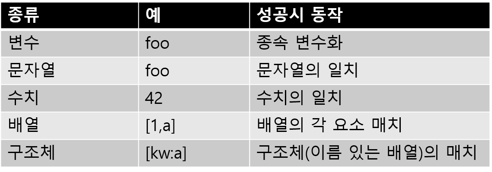

## 3-4 패턴 매치

> 이번에는 함수형 언어에 자주 보여지는 기능인 ‘패턴 매치’에 대하여 설명한다. 패턴 매치가 있으면, 어떤 종류의 데이터구조도 간단하게 처리할 수 있다. 시행착오의 끝에 Streem에 구현가능하게 되었다. Ruby에도 이 기능이 있었으면... 

패턴 매치라고 하면 우선 정규식을 떠 올리지만, 함수형 언어의 패턴 매치도 하는 일은 비슷하다. 즉, 값과 패턴이 일치하는지 여부를 확인하는 것과 일치하는 값에서 일부를 추출하는 것이다. 

#### Erlang의 패턴 매치

그러나 함수형 언어에서는 매치의 대상이되는 문자열이 아닌 데이터 구조다. 예를 들어 패턴 매치를 준비하는 함수형 언어인 Erlang의 예를 살펴 보자 (그림 1). 정수의 합계를 차례로 더해나가는 ‘피보나치 수열’을 구하는 프로그램이다.
Erlang에서는 case 문을 사용하여 패턴 매치를 한다. (사실은 함수 정의 부분에도 패턴 매치가 가능하지만, 그쪽은 Erlang교과서에 맡긴다)
case문은 N에서 주어진 수식과 패턴과의 매치를 체크하여 매치가 성공하면 ‘->’뒤의 명령을 실행한다. 패턴에 변수가 있으면 그 변수에 대입도 할 수 있다.

```
fib(N) ->
  case N of
    1 -> 1;
    2 -> 2;
    _ -> fib(N-1) + fib(N-2)
  end.
```
<center>
    (그림 1) Erlang의 패턴 매치(1)
</center>


```
len(L) ->
  case L of
    [] -> 0;
    [_|T] -> 1 + len(T)
  end.
```
<center>
    (그림 2) Erlang의 패턴 매치(2)
</center>

단, (그림 1)의 예는 너무 단순하기 때문에 일반 조건 분기의 차이점이 잘 안보일 것이다. 조금만 더 복잡한 패턴을 생각해 보자. 목록의 길이를 구하는 len() 함수를 Erlang에서 패턴 일치를 사용하여 정의하면 (그림 2)와 같이된다.
(그림 2)의 case 문을 보면, 첫 번째 패턴은 [], 즉 빈 목록이다. 이것은 L이 빈리스트와 매치 할 때, 리스트의 길이는 0이라는 것을 의미한다.

그 다음 패턴이 좀 이상하다.

```
[_|T]
```
는 리스트의 첫번째 항목이 _ 이며, 나머지가 T일 경우 라는 의미이다. 리스트가 비어있지 않을 때, 이 패턴에 매치 여부를 체크한다. Erlang의 패턴 매치에 있어서 ‘_’ 는 무엇이든 매치되는 있는 변수이며, 내용에는 상관이 없다. 이것으로 리스트의 첫번째 항목과 마지막 항목을 따로따로 추출한다. 첫번째 항목을 제외한 리스트 T의 길이를 len()으로 구하고, 1을 더하면, 리스트의 길이를 구할 수 있다. 이를 실행하면 (그림 3)과 같이 계산이 진행된다.

```
len([1,2,3,4]) = len([1|[2,3,4]])
               = 1 + len([2|[3,4]])
               = 1 + 1 + len([3|[4]])
               = 1 + 1 + 1 + len([4|[]])
               = 1 + 1 + 1 + 1 + len([])
               = 1 + 1 + 1 + 1 + 0
               = 4
```
<center>
    (그림 3) len의 계산
</center>


#### 재귀적 정의와의 세트가 편리

길이는 첫번째 항목의 길이(1)에 남은 목록의 길이를 더한 것이라는 재귀적 정의에 당황 했을지도 모르겠지만, 익숙해지면 이런 당황스러움은 없어진다. 그리고 패턴 매칭(과 함수의 재귀 호출의 조합)은 이와같은 재귀 구조를 가진 데이터 구조의 처리에 매우 유용하다.  이것이 많은 함수형 언어가 패턴 매치를 갖추고 있는 이유이다.

패턴 매치를 갖춘 함수형언어로서는, 이번에 소개했던 Erlang이외에도

* Haskell
* OCaml
* Scala

등 많은 언어들이 지원한다. 실제문제, 명시적인 함수형 언어라고 이름을 올리는 언어는 대부분 패턴 매치를 지원한다고 보면 된다. 예외로서는 옛날부터 존재했던(최근에는 함수형언어로 취급되지 않은) Lisp와 그 직계 자손인 Clojure정도이다.

#### ‘꼬리재귀’ 최적화

여담이지만, (그림 2)의 재귀호출함수는 리스트가 길면 호출 스택을 다 써버리게 된다. 이 문제를 해결하기 위해 함수를 꼬리재귀화 하는 테크닉을 쓸 수 있다. 

꼬리재귀는 함수실행 마지막에 자기 자신으로의 함수호출을 의미한다. 이 형태의 재귀함수 호출은 간단하게 루프로 가능하다고 알려져 있어, 루프를 사용한다면, 호출스택을 낭비할 일이 없고, 함수호출도 생략이 가능하다. 재귀호출을 하더라도 (그림 2)와 같이

```
1 + Len(T)
```

와 같은 구조를 한다면, 마지막 실행은 ‘+’ 함수여서 꼬리재귀가 되지 않는다.

여기서 (그림 4) 와 같이 바꿔 작성하면, 꼬리재귀가 된다. (그림 4)의 프로그램은, Erlang에서는 인수의 수가 다르면, 다른 함수로서 취급하는 것을 이용하고 있다. 하지만, 다른 언어에서도 두번째 인수를 함수 이름으로 바꾸기만 하면 된다. 이것은 재귀함수를 꼬리재귀로 바꾸기 위한 간단한 테크닉이 된다.

```
len(L) -> Len(L, 0).
Len(L, Acc) ->
  case L of
    [] -> Acc;
    [_|T] -> len(T, Acc+1)
  end.
```

<center>
  (그림 4) Erlang의 패턴 매치(꼬리재귀 버전)
    </center>


### ■ Streem의 패턴 매치

그러면 Streem의 패턴 매치는 어떻게 구현을 해야 할지 생각해 봐야 한다. 

도중에 여러가지 시행착오를 했던 점을 이야기하면 좀 지겨울 지 모르겠으나, 2016년5월경에 잠깐 함수의 인수가 

```
{x -> print(x)}
```

에서 

```
{|x| print(x)}
```

로 된 것은 이 시행착오의 영향이다. 잠깐 내가 고친것을 무심코 체크인을 해 버려 전 세계에 공개를 해 버렸다. 나중에 도쿄 Ruby회의의 발표에서도 이 문법을 사용하여 설명을 하였다. 

자. 이와 같은 시행착오를 거쳐 결정한 Streem의 패턴 매치의 문법은 아래와 같다. 

#### case, if에 의핸 패턴

먼저 함수 객체 인수 부분에 패턴을 쓸 수 있도록 했다. 패턴을 넣기 위해 예약어 ‘case’를 앞에 둔다. 

```
case 패턴 -> 실행문
```

또 (그림 5)와 같이, case를 여러개 사용하여, 복수 패턴을 지정하는 것도 가능하다. 그리고 어디에도 매치가 되지 않을 때의 처리를 위한 else도 가능하다. 

```
foo = {
  case 1,x -> print(x+1)
  case 2,x -> print(x*2)
  else -> print('else')
}
```
<center>
  (그림 5) 복수의 case와 else
    </center>


패턴 매치를 포함한 함수호출은 보통의 함수와 동일하다. (그림 6)과 같이 호출된 뒤 패턴 매치를 하여 매치가 되면 ‘->’ 다음 문장을 실행한다. 

```
foo(1,2) # => 3（2+1이기 때문）
foo(2,1) # => 2（1*2이기 때문）
foo(1) # => else(매치 안됨)
```
<center>
  (그림 6) 패턴 매치의 실행 예
    </center>


정렬 된 패턴이 여러 일치하는 경우도 먼저 매치하는 것만이 선택된다. 매치하는 패턴이 존재하지 않으면 예외가 발생한다. 

case에서는 if에 의한 조건식을 붙일 수 있다. (그림 7). 이 조건식을 ‘가드’ 라고 부른다. 패턴이 매치가 되었더라도 이 가드를 통과하지 못한다면 매치 성공이라고 할 수 없다. 

```
sign = {
  case 0 -> print('0')
  case x if x > 0 -> print('+')
  case x if x < 0 -> print('-')
}
sign(0)  # => '0'
sign(10) # => '+'
sign(-1) # => '-'
```
<center>
  (그림 7) if로 ‘가드‘를 만들수 있다
    </center>


#### match에 의한 패턴 매치

함수 호출을 하지 않고 직접 패턴매치를 하는 경우는 match함수를 사용할 수 있다. match함수를 사용한 패턴 매치는 (그림 8)과 같이 된다. match함수의 실체는 인수로서 주어지는 함수 객체를 호출만 하지만, Streem의 문법과는 제법 잘 맞는다. 다른 언어의 패턴 매치 구문과도 매우 비슷하며, 실제로 거의 동일한 동작을 한다. 

```
match(1,2) {
  case 1,x -> print(x+1)
  case 2,x -> print(x*2)
  else -> print(‘else‘)
}
```
<center>
  (그림 8) match함수
</center>


Streem의 패턴 매치 구문을 사용하여 (그림 1)의 프로그램을 다시 작성하면 (그림 9)와 같이 된다. 

```
fib = {
  case 1 -> 1
  case 2 -> 2
  case n -> fib(n-1) + fib(n-2)
}
```

<center>
(그림 9) (그림 1)의 패턴 매치를 Streem으로 기술한 것</center>


### ■ 패턴 매치 구문

패턴 매치의 개략적인 내용을 설명했으니  이제 상세에 대하여 생각을 해 보자. 

패턴 매치는 값과 패턴을 비교하여 매치하는지 여부를 판단하는 것이다. 그래서 패턴에는 (표 1)과 같은 종류가 있다. 



<center>
(표 1)패턴의 종류
</center>


#### 변수 패턴

우선 ‘변수’ 패턴이다. 변수는 Streem의 식별자로, 영문자(알파벳)으로 시작하여, 영숫자가 이어지는 것이다. 단, Streem의 예약어는 변수가 될 수 없다. 변수는 임의의 식에 매치한다.

변수는 ‘종속변수(bounded valiable)’ 와 ‘자유변수(free variable)’가 있다. 대입 및 패턴매치에 의해 값이 결정된 변수를 ‘종속변수’ 라고 하며 아직 결정이 되지 않은 변수를 ‘자유변수’ 라고 한다. 자유 변수에 대한 패턴 매치는 매치할 값과의 종속이 발생해버려 항상 성공이 된다. 종속 변수에 대한 매치는 매치할 값과 종속되어 있는 값과 일치하는 경우 성공이다. 

실제 사용 예를 보도록 하자. (그림 10)은 패턴 매치를 사용하여 일치 판정을 하는 함수이다. 

```
same = {
  case x,x -> true # comparison in match
  case _,_ -> false # fallback
}
print(same(1,1)) # => true
print(same(1,2)) # => false
print(same([1],[1])) # => true
print(same([1],[2])) # => false
```
<center> (그림 10) 패턴 매치에 의한 일치 판정</center>

same 함수 중의 패턴 매치로 변수 x가 2회 등장하기 때무에, 이 2개의 값이 일치할 경우에 매치된다. 


#### 와일드카드 패턴

변수 매치에는 예외가 있는데, ```_```라는 변수는 결코 종속변수화 되지 않는다는 것이다. 이는 동일한 변수를 여러 번 매치시킬 수 있다는 의미이기도 하다. 그러면 뭔가 값이 있을 것 같아, 매치를 시키고 싶지만, 그 내용에는 관심이 없을 때 우선 두는 변수로 ```_```을 사용할 수 있다. 이 동작에서 ```_```를 ‘플레이스 홀더(Place holder변수)’ 또는, 무엇이든 다 매치하기 때문에 ‘와일드 카드 변수’라고 부르기도 한다.

(그림 10)의 same 함수의 정의도

```
_,_
```

라고 하는 패턴이 등장하지만, 구체적인 변수와는 달리, ```_```는 무엇이든 매치가 되기 때문에, 첫번째와 두번째에 대한 값이 다르더라도 매치가 된다. 

종속상태가 아니라는 것은 값을 추출할 수 없다는 의미이다. 예를들어 매치하더라도, ```_```변수의 값은 참조할 수 없다. 미정의변수와 동일한 취급을 하며, 에러를 발생시킨다.  

#### 리터럴 패턴

변수가 정렬만 되어 있다면, 패턴 매치는 일반 함수 인수와 거의 차이가 없다. 차이는 변수뿐만 아니라 ‘리터럴’을 직접 정렬을 했다는 점이다.
리터럴은 구체적인 값이다. 패턴 안에 문자열이나 숫자가 등장하면 그 값 자체와 일치하면 성공이다. Streem 패턴 매치에 등장하는 리터럴은 문자열, 숫자, true, false, nil이다.
배열은 요소로 패턴을 포함하기 때문에 리터럴과는 다르게 취급된다.

#### 배열 패턴

배열 패턴은 배열에 대해 매치하는 패턴이다. 기본 배열 패턴은

```
[패턴, 패턴...]
```

와 같이 브라킷([])사이에 컴마를 구분자로 하여 정렬한 것이다. 배열의 매치는 아래의 조건이 성립하면 매치가 성공이다. 

1. 매치에 대응하는 값이 배열
2. 패턴의 수와 배열요소가 매치
3. 모든 패턴의 매치 성공


배열 패턴 매치의 예는 (그림 11)과 같다.

```
match([1,2,3]) {               # 배열[1,2,3]에 대한 매치
  case [a] -> print(1)         # 1 array 배열에 매치
  case [a,b] -> print(2)       # 2 array 배열에 매치
  case [1.5,b,c] -> print(1.5) # 첫항목이 1.5의 인 3 array 배열에 매치
  case [a,'b',c] -> print('b') # 2번째 요소가 'b'인 3 array배열에 매치
  case [a,b,c] -> print(3)     # 임의의 3 array 배열에 매치
  case _ -> print('any')       # 배열이 아닌 경우를 포함한 매치
}
```

<center>
  (그림 11) 배열 패턴 매치
</center>


배열의 매치는 재귀적인 구조여서, 배열의 배열 등의 패턴도 작성 가능하다. 예를 들어

```
[[a,b],[c,d]]
```

은 2개의 요소가 각각 2 array배열에 매치 하는 패턴이다. 이 매치가 성공하면, 각각의 요소들의 값이 a,b,c,d라고 하는 변수에 종속된다. 

이 패턴을

```
[[a,b],[a,b]]
```

라고 고치면, 2개의 배열의 각 요소가 동일한 배열, 예를 들어 


```
[[1,2],[1,2]]
```

와 같은 배열만 매치하게 된다. 

#### 길이를 알 수 없는 가변 배열 패턴

패턴을 요소로 지닌 패열 매치 외에 길이를 알 수 없는 배열로부터 그 일부를 추출하는 방법도 제공하고 있다.

배열요소의 패턴으로 ‘* 변수’ 라고 하는 것을 추가하면, 매치의 나머지 요소를 배열로서 변수에 종속시켜, 결국 (그림 12)와 같이 된다. 

```
match([1,2,3]) {
  case [a,*b] ->
    print(a) # => 1 （최초의 요소）
  print(b) # => [2,3] （나머지）
}
```

<center>
(그림 12) 길이를 알 수 없는 가변 배열 패턴
</center>


길이를 알 수 없는 배열 ‘* 변수’는, 배열 패턴 중 임의의 장소에 한번만 나온다. 결국 앞에서의 예와 동일하게, 끝에 와도 된다. 

```
[*a,b]
```
와 같이 앞에와도

```
[a, *b, c]
```

와 같이 가운데에 와도 된다. 하지만

```
[a, *b, c, *d]
```

처럼 같은 레벨에 여러번 나와 버리면 매치 범위를 파악할 수 없기 때문에 문법 에러를 발생해 버린다. 

앞에 나왔던 Erlang의 
```
[H|T]
```

라는 패턴은 Streem에서는

```
[H, *T]
```
가 된다. 실제로는 Streem에서 구현이 배열이고, Erlang에서는 링크 리스트이기 때문에, 내부처리는 다르지만, 앞 요소와 나머지의 요소에 패턴 매치를 하는 동작은 동일하다.

#### 구조체 패턴

Streem에서는 배열의 요소에 각각 이름을 붙인다. 소위 ‘라벨부 배열’ 이지만, 여기서는 이를 ‘구조체’ 라고 부른다.

구조체도 패턴 매치의 대상이 된다. 구조체 패턴은 아래와 같은 문법을 따른다.

```
[라벨:패턴, ...]
```

구조체 패턴은 지정한 라벨의 패턴이 모두 해당하는 값에 매치할 때 전체 매치가 된다.

기본 룰은 간단하지만, 구현을 위해서는 코너 케이스[^1]에 대하여 고려할 필요가 있다. 
처음 고려해야 할 사항은, 구조체의 구현은 배열요소에 라벨을 붙인 것이기 때문에 명확한 순서가 있다. 패턴에 지정된 라벨과 배열의 라벨의 순서가 틀리면, 매치로 봐야 할 것인지 결정할 필요가 있다. 

사용하는 느낌을 고려한다면, 순서는 고려 하지 않는게 좋아 보인다. 구조체로서 사용하는 데이터의 구조에 각 요소의 순번까지 고려할 일이 드물기도 하고, 순번 고려를 하지 않으려고 라벨을 붙였기 때문이다. 
다음에 고려할 점은, 구조체를 매치시키기 위해, 모든 라벨이 일치할 필요가 있을까, 일부만 일치해도 매치 성공으로 볼 것인가를 정하는 것이다. 
이것도 사용하는 느낌을 생각해 보자.
완전 매치를 강제하면, 구조체에 요소가 추가되었을 때 모든 패턴을 다시 작성해야 한다. 그러나 불완전 매치를 허용하면, 구조체로부터 일부의 요소만 추출하기 위해 패턴 매치를 사용하는게 가능하다. 여기는 불완전 매치를 허용하는 쪽이 좋겠다. 
마지막으로, 구조체의 라벨은 실은 중복을 허용하고 있다. 같은 구조체에 여러개의 같은 라벨이 부여된 경우, 패턴 매치는 어떻게 해야 좋을까? 예를 들어 

```
[a:1,b:2,a:3]
```

라고 하는 구조체가 있다고 하고, a라는 라벨에 대응하는 패턴은 1과 매치되는 것으로 하는게 좋을까 아니면 3과 매치되는 것으로 하는게 좋을까.

내가 생각한 것은 아래 2개의 안이다.

1. 항상 최초 라벨에만 매치한다.
2. 라벨 등장순으로 매치한다.

1안은 상당히 심플해서, 구현도 간단하고 동작도 쉽게 예상가능한게 이점이다. 하지만, 여러개의 값 중 첫번째만 패턴 매치로 취할 수 있다. 

2안은

```
[a:x, a:y]
```

와 같은 패턴이 있다면, a라고 하는 라벨이 붙어있는 첫 패턴은 처음의 a의 값(1)에 매치하고, 또 a라벨이 붙어있는 패턴이 온다면 두번째 a의 값(3)과 매치된다. 

2안의 ‘더 할 나위 없는’ 느낌은 환대할만 하지만, 이번에는 간단한 1안을 채택하겠다. 과거의 경험에서 보면, 2안은 바람직하지 않은 결과를 가져올 가능성이 많을 것 같기 때문이다. 하나의 구조체에 같은 이름의 레이블이 여러개 사용되는 것과 같은 예외적인 사건에 비용을 들여도 그만큼 메리트가 없을뿐더러, 거동 예측의 어려움에 사용자들이 혼란에 빠지는 경우가 있다. 이러한 사양을 바탕으로 구조 패턴 매치의 예를 (그림 13)에 나타냈다. 이 구조체 패턴 일치를 사용하면 CSV로부터 읽어 온 데이터에서 일부를 추출하여 표시 하는 것을 (그림 14)와 같이 쉽게 할 수 있다.

```
match([a:1,b:2,c:3,a:4]) {  # 구조체(라벨이 붙은 배열)와 매치
  case [a:a, c:c, a:x] ->   # b는 사용되지 않아도 매치
                            # a는 처음 것만 사용되기 떄문에 x도 1이 된다
                            # 라벨의 순서는 고려하지 않는다
    print([a,c,x])          # => [1,3,1]
}
```

<center>
  (그림 13) 구조체 패턴 매치
</center>


```
# 아래와 같은 csv파일(voters.csv)이 있다.
# name,address,age
# 마츠모토유키히로,시마네현마츠에시,51
# 마츠모토타쿠토,시마네현마츠에시,19
# 마츠모토보치,시마네현마츠에시,4 
# 마츠모토타마,시마네현마츠에시,1

# voters.csv에서 선거권이 있는 사람들을 선택 표시
fread('voters.csv')|csv()|each{
  # 2016년부터18세이상이゙선거권 있음
  case name:name, age:age if age>=18 ->
    print(name) # 유권자명 표시
  else -> # 선거권이 없다면 아무것도 하지 않는다
}
```
<center>
  (그림 14) csv파일 읽기와 데이터 추출
</center>


구조체 패턴에도 길이를 알수 없는 배열이 적용 가능하다. 

단, 구조 패턴은 요소의 순서를 고려하지 않기 때문에 ‘* 변수’가 등장 할 수 있는 부분은 끝부분에 한한다. 이 경우 ‘* 변수’에는, 이미 라벨에 지정된 이외의 값을 모은 구조체(라벨 배열)가 할당된다.

그러면 예제를 보면서 생각해 보자.

```
match([a:1,b:2,c:3]) {
  case [a:x,*z] -> print(x,z)
}
```

위 코드의 출력 결과는 어떻게 될까?

정답은

```
1 [b:2, c:3]
```

이다.

결국, a:x라고하는 패턴에 의해, 변수 x에 라벨a에 대응했던 값인 1이, 그리고 라벨a이외 요소를 모은 구조체가 z로 대입이 되어 버린다. 

이제 다음 문제이다. 구조체로부터 길이를 알 수 없는 배열을 추출할 때, 같은 이름의 라벨이 여러개 존재한다면 어떻게 동작을 해야 할 까? 중복된 라벨이 지정 될 때와 지정이 안될 때 각각을 생각해 보자.

구체적인 프로그램은 

```
중복된 라벨이 지정되어 있는 케이스
match([a:1,b:2,a:3]) {
  case [a:x,*z] -> print(z) 
}
중복된 라벨이 지정 안되어 있는 케이스
match([a:1,b:2,a:3]) {
  case [b:x,*z] -> print(z) 
}
```

이와 같으며 각각 무엇이 출력되는가에 대한 문제이다. 

모처럼의 기회이므로, 메모에 패턴을 열거하면서 어떻게 동작을 하면 좋을까에 대해 생각해 보자. 사용하는 느낌이나 구현의 복잡성등 고려해야 요소는 얼마든지 있다. 자기 나름대로의 생각이 정리되면, 최신 Streem을 다운로드 및 컴파일하고 위의 프로그램이 어떤 일이 발생하는지 살펴보자. 여러분의 결론과 같은 동작을 했는가?
만약 기이하게도, 단순히 이 기사를 읽기뿐만 아니라 생각할 시간을 가져 주신 독자 분들이 계신다면, 지금 여러분이 한 활동 이야말로 언어 디자이너가 일상하고있는 언어 디자인 활동이다. 
언젠가 언어의 디자인을 해보고 싶다고 생각하는 독자가 한명이라도 있다면 좋겠다고 생각한다.

#### 네임스페이스 패턴

Streem의 객체 지향 기능 파트(3-2절)에서 설명했듯이, Streem의 모든 값은 그 값에 적용 할 수있는 기능을 유지하는 ‘네임스페이스’를 보유하고 있다. Streem 네임 스페이스는 다른 언어의 클래스와 같은 것으로, 그 값의 ‘타입’을 표현하고 있다고 생각된다.
그 타입을 확인하기 위해 사용할 수있는 것이 네임스페이스 패턴이다. 네임 스페이스 패턴은 다른 패턴 뒤에 ‘@ 네임 스페이스 명’ 형태로 표기한다.
예를 들어

```
str@string
```

라고 하는 패턴은 대응하는 값이 string 네임스페이스를 가질(결국 문자열의) 때에 매치가 성공해서, 변수 str에 그 문자열을 대입한다. 

네임스페이스 패턴에는 또 하나의 표기법이 있다. 그것은

```
[@네임스페이스명 값,...]
```

이다. 배열(나아가서는 구조체)표기의 최초에 ‘@네임스페이스명’을 두었다. 의미는

```
[값,...]@네임스페이스명
```
와 바뀌지 않았다. 

아래는 그 배열이 네임스페이스가 적용된 특별한 배열이라는 것을 명시하기 위한 표기이다. 

```
new namespace [배열]
```

로 만들어진 객체는

```
[@namespace 배열 패턴]
```

으로 매치한다고 기억해주기 바란다. 


#### 마치며

이번에는 Streem에 새롭게 도입한 패턴 매치에 대해 설명했다. 또한 패턴 매치의 동작을 디자인하는 과정에서 언어 디자이너의 생각의 일부를 소개 할 수 있었던 것 같다.

<hr>

### 타임머신 칼럼

***Streem에 최적의 패턴 매치 기능***


>2016 년 9월호 게재분이다. 이번에는 함수형 언어의 대부분이 탑재하고있는 패턴 매치 기능을 설계 및 구현을 했다. 패턴 매치는 정말로 원했던 기능이었다. 특히 파이프 라인을 통해 온 데이터를 패턴에 따라 분리해서 처리하는 것은 Streem이 추구하는 스트리밍 프로그램에 대한 최적의 처리라 생각한다. Streem의 패턴 매치 활약이 매우 기대된다. 사실 Ruby에도 패턴 매치 기능을 도입하고 싶지만, 기존의 문법과의 충돌이나 기능적인 제한이 있어, 지금까지 실현을 못했다. Ruby는 과거에도 좋겠다고 생각했던 기능이 오랜 시행 착오를 거쳐 겨우 도입 된 예들이 많이 있기 때문에 (예 : Refinement) 패턴 매치도 향후 도입은 가능할 것 같다. 연재와 서적 판의 게재 순서의 차이로 이번 당연하게 등장하고 있는 CSV 읽기 기능은 서적 판에서는 아직 싣지 않았다. 이것이 등장하는 것은 5-3절 에서다.


[^1]: 코너 케이스는 여러 가지 변수와 환경의 복합적인 상호작용으로 발생하는 문제다. 예를 들어 fixnum이라는 변수의 값으로 128이 입력되었을 때, A 기계에서 테스트했을 때는 정상작동하지만 B 기계에서는 오류가 발생한다면 코너 케이스라고 할 수 있다. 같은 장치에서라도 시간이나 다른 환경에 따라 오류가 발생하기도 하고 정상작동 하기도 한다면 이것도 코너 케이스다. 특히 멀티코어 프로그래밍에서 만나기 쉬운 오류일 것이다. 코너 케이스는 오류가 발생하는 상황을 재현하기가 쉽지 않아 디버그와 테스트가 어렵다.(출처 https://bakyeono.net/post/2015-05-02-edge-case-corner-case.html) (옮긴이)


