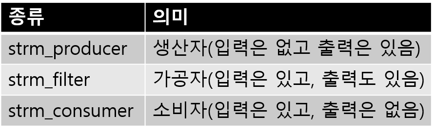

# 4장 Streem 객체를 구현


## 4-1 소켓 프로그래밍


> 지금까지 개발에 의해, Streem은 언어로서 ‘우선 동작하는’ 정도까지 성장시켰다. 이번에는 언어처리 시스템은 잠시 놔두고 네트워크 프로그래밍에 대하여 살펴보도록 하자. 소켓을 사용한 네트워크 통신 기능을 Streem에 추가하겠다.


지금 네트워크는 공기와 같은 존재이다. 최근은 컴퓨터를 단일로 사용하는 경우는 거의 없다. 많은 어플리케이션이 네트워크 접속을 전제로 서비스를 제공하고 있다. 출장 등에서 비행기를 탈 때 비행기 모드로 네트워크와 격리되면, 일상적으로 이용하고 있었던 애플리케이션중 얼마나 많은 것들이 네트워크 연결을 필요로 했을지를 실감하게 된다. 

위와 같은 이유는 아니지만, Streem에서도 네트워크를 경유해 통신이 가능하도록 기능을 부여해 보자. 이는 Streem의 확장기능에 대한 좋은 예제도 될 것이다.


#### Streem의 소켓 API

우선 Streem으로 소켓을 사용하는 프로그램을 보도록 하자. (그림 1)이 Streem에서의 네트워크 서버의 구현예로, (그림 2) 는 클라이언트 부분을 구현한 것이다. 

```
01 # Simple echo server port 8007
02 tcp_server(8007) | {s -> s | s}
```

<center>
    (그림 1) Streem에서의 네트워크서버 구현 예
</center>


```
01 s = tcp_socket('localhost', 8007)
02 stdin | s
03 s | stdout
```

<center>
    (그림 2) Streem에서의 네트워크 클라이언트 구현 예
</center>


#### Streem네트워크 서버

그러면, 우선 (그림 1)의 프로그램을 보도록 하자. 첫번째 행은 단순 코멘트이다. ‘포트 8007에서 대기하는 echo 서버’ 라고 적혀 있다. 프로그램 전체가 2줄밖에 없기 때문에, 네트워크 서버는 실질적으로 한줄로 기술가능하게 된다. 

네트워크 접속은 ‘호스트명’ 과 ‘포트(번호, 또는 서비스)’에 의해 지정된다. 이 서버를 기동하면, 지정된 호스트명과 포트 번호(8007)로 이 서버에 접속이 가능하다.

‘tcp_server(8007)’ 라고 하는 것이 서버를 생성하는 함수이다. 이 함수는 서버 소켓을 만들고, 대기하고 있다가 클라이언트의 접속이 들어오면 이에 대한 소켓을 만들어 파이프라인에 흘려보내는 동작을 한다. 

다음의 ‘{s -> s | s}’ 라고 하는 것은 함수 리터럴이다. Streem에서는 함수를 파이프라인에 연결하면, 파이프라인을 탈 수 있는 각 요서를 인수로 해서, 그 함수를 호출한다. 이번의 함수는, 클라이언트에 접속하고 있는 소켓을 인수로 해서 이를 파이프라인에 연결하고 있다. ‘ s | s ’ 라고 하는 것은 얼핏 보면 무슨 역할을 하는지 잘 모르겠지만, ‘클라이언트 소켓으로부터의 입력을 그대로 돌려주는’ 동작을 한다. 소켓은 입력과 출력 모두가 가능한 이중 접속인 것에 주목하기 바란다. 

일반적인 서버는 입력한 정보를 가공해 이를 돌려주는, 좀 복잡한 처리를 하기 마련이다.

#### Streem네트워크 클라이언트

(그림 2)의 클라이언트 프로그램도 간다하다. 첫번째 행의 ‘tcp_socket('localhost'. 8007)’ 로 호스트 localhost의 포트 8007에 접속하는 localhost를 접속하는 소켓을 생성하여 변수 s에 대입하고 있다. 

두번째 행에서는 표준입력(stdin)로부터 받은 입력 데이터를 소켓에 흘려보낸다. 이후에 네트워크 서버에 데이터는 전송된다. 

세번째 행에서는 네트워크 서버로부터 받은 데이터를 표준출력(stdout)을 한다. 이 프로그램을 (그림 1) 의 echo서버에 연결하면, 네트워크 통신을 하면서, 키보드로부터 입력한 문자열 그대로 돌려주는(네트워크가 없는 상태의 cat과 동일한) 동작을 한다.

소켓을 연결한 네트워크 프로그래밍도, Streem을 사용하면 상당히 간단하게 구현 가능하다는 것을 알 수 있다.

#### Streem의 기능 학장

그러면,  이번에는 소켓 기능이 Streem에서 어떻게 구현되고 있는지 살펴 보자. 우선 Streem에 함수를 추가하는 것부터 시작한다.

(그림 1)과 (그림 2)의 프로그램에서 보았듯이 소켓 기능은 두 함수를 Streem에 추가하여 구현하게 된다. Streem 함수 정의를 추가하려면 (그림 3)과 같이한다 (설명의 사정상 실제 소스를 약간 가공하였다). 이번 설명하는 실제 C 코드는 Streem 소스 코드의 socket.c 파일에서 볼 수 있다.
Streem는 C로 구현하는 (글로벌) 함수를 다음과 같은 순서로 정의한다.

우선 C 함수 포인터에서 함수 객체를 만든다. 거기에는 strm_cfunc_value () 함수를 사용한다. strm_cfunc_value ()로 등록하는 함수는 반환 값이 int타입이며 네 개의 인수가 필요하다. 첫 번째 인수 (strm_state *)가 메소드 호출 컨텍스트, 두 번째 (int)가 Streem 함수에 주어진 인수의 수, 세 번째 인수를 포함하는 배열, 네 번째가 Streem 함수의 반환 값을 저장하는 장소이다. 이 함수 자신의 반환 값은 함수 실행의 성공 또는 실패를 나타내는 것으로, 함수가 성공했을 때는 STRM_OK (= 0), 실패했을 때는 STRM_NG (= 1)를 반환한다.
다음으로는 함수 객체를 전역 변수에 대입한다. 글로벌 변수의 정의는 strm_var_def () 함수를 사용한다. 초기화를위한 함수 strm_socket_init ()는 인터프리터 초기화 함수 node_init ()에서 호출된다. 새로운 기능을 추가 한 후에는 초기화를 위한 함수를 node_init ()에서 호출 해야 한다.

```
int tcp_server(strm_state*, int, strm_value*, strm_value*);
int tcp_socket(strm_state*, int, strm_value*, strm_value*);

void
strm_socket_init(strm_state* state)
{
  strm_var_def('tcp_server', strm_cfunc_value(tcp_server));
  strm_var_def('tcp_socket', strm_cfunc_value(tcp_socket));
}
```

<center>
    (그림 3) Streem으로의 함수정의 추가
</center>


#### 소켓이란

원래 UNIX계 OS의 소켓은 어떤 것인고 하니...

소켓은 네트워크 접속 통로를 위한 ‘OS객체’ 이다. 소켓이 발명된 것은 4.2BSD로부터라고 한다. 

소켓은 파일 디스크립터라고 부르는 정수로 식별한다. 이것은 open 시스템 콜로 오픈 한 파일과 동일한 식별자다. 그리고 파일 디스크립터는 일반적인 작업으로 read (읽기) , write (쓰기), select (대기), close (종료) 등의 처리를 할 수 있다.
그러나 생각해 보면 디스크의 파일에 연결되어있는 파일 디스크립터와 네트워크 연결된 소켓에 연결되어있는 파일 디스크립터에서 읽고 쓰기 등의 처리가 동일할 리가 없다. 즉, 함수는 내부적으로 파일 디스크립터의 종류에 따라 적절한 처리를 자동으로 선택한다는 얘기이다.
이러한 대상의 종류에 따라 자동 분기는 일종의 객체 지향이며, 그런 의미에서 사실 UNIX는 객체 지향 OS였던 것이다. 놀라운 일이다.


#### 클라이언트 소켓

소켓의 사용법은 그리 어렵지 않다. 하지만 C에서 소켓 프로그래밍은 (세부적으로 지정한 만큼) 단계가 많아진다. 우선 대략적인 순서를 설명하겠다. 
먼저 클라이언트에서 소켓 통신 절차는 다음과 같다.

1. 접속 대상 정보 취득
2. 소켓 생성
3. 접속
4. 입출력

우선 접속할 대상(서버)을 지정한다. 네트워크 연결은 호스트와 포트의 조합으로 지정한다. TCP/IP 연결에서 호스트는 IP 주소로 표현된다. 때때로 보이는 ‘192.168.0.1’또는 ‘127.0.0.1’과 같은 네 가지 (255 다음) 수의 조합으로 표현되는 것이 IP 주소다. 원래의 TCP/IP 주소는 32 비트 (4 바이트)로 표현 된 IP 주소는 각 바이트를 10 진수로 표현한 것이었다.
그러나 IPv4 주소가 고갈되고있는 현재 주소 128 비트 사용 IPv6가 등장하고 있다.
IPv4 시절은 호스트 이름을 IP 주소를 얻으려면 gethostbyname () 함수를 사용했지만, 최근에는 IPv4와 IPv6의 구분을 할 수 getaddrinfo () 함수를 사용하는 것을 권장하고 있다. 
getaddrinfo () 함수를 이용하면 주소, 포트, 소켓 유형의 정보를 얻을 수 있습니다. 그리고는 그것을 이용하여 socket() 시스템 호출로 소켓을 생성하고 connect() 시스템 콜 서버에 연결하기만 하면 된다.
연결 후에는 일반 파일 기술자로 동작하기 때문에 read ()와 write ()를 사용하여 데이터를 읽고 쓸 수 있다. 소켓의 데이터 읽기 및 쓰기는 recv (읽기), send (쓰기)라는 시스템 호출도 있지만, 이번에는 사용하지 않고 다음에 기회가 있으면 설명을 하도록 하겠다.

#### 소켓의 사용법(클라이언트)

그러면, Streem의 소켓 기능 구현을 보면서, C에 있어서 소켓프로그래밍의 실제를 보도록 하자.

(그림 4)는 Streem의 tcp_socket함수의 구현이다. 설명을 위해 Win32대응 코드는 삭제했다.

```
static int
tcp_socket(strm_state* state, int argc, strm_value* args, strm_value *ret)
{
   struct addrinfo hints;
   struct addrinfo *result, *rp;
   int sock, s;
   const char *service;
   char buf[12];
   strm_string* host;
   if (argc != 2) {
     return STRM_NG;
   }
   host = strm_value_str(args[0]);
   if (strm_int_p(args[1])) {
     /* 문자열화한 포트번호 지정 */
     sprintf(buf, '%d', (int)strm_value_int(args[1]));
     service = buf;
   }
   else {
     strm_string* str = strm_value_str(args[1]);
     service = str->ptr;
   }
   memset(&hints, 0, sizeof(struct addrinfo));
   hints.ai_family = AF_UNSPEC; /* Allow IPv4 or IPv6 */ ← hints 지정
   hints.ai_socktype = SOCK_STREAM;
   s = getaddrinfo(host->ptr, service, &hints, &result); ← getaddrinfo()함수
   if (s != 0) { /* getaddrinfo 실패시 */
     /* 에러 사유를gai_strerror()로 찾음 */
     node_raise(state, gai_strerror(s));
     return STRM_NG;
   }
   /* addrinfo를 가져와 접속한다 */
   for (rp = result; rp != NULL; rp = rp->ai_next) {    ↓ socket()함수
     sock = socket(rp->ai_family, rp->ai_socktype, rp->ai_protocol);
     if (sock == -1) continue; /* 실패시 다음 시도 */
     /* connect해 본다 */
     if (connect(sock, rp->ai_addr, rp->ai_addrlen) != -1) ← connect()함수
       break; /* 성공시 루프 탈출 */
     close(sock); /* 소켓 종료후 다시 시도 */
   }
   /* 결과의 addrinfo를 free시킴 */
   freeaddrinfo(result);
   if (rp == NULL) { /* 링크가 전부 실패시 */
     node_raise(state, 'socket error: connect');
     return STRM_NG;
   }
   /* socket을 strm_io객체로 래핑하여 반환 */
   *ret = strm_ptr_value(strm_io_new(sock, STRM_IO_READ|STRM_IO_WRITE|STRM_IO_
FLUSH));
   return STRM_OK;
}
```

<center>
    (그림 4) tcp_socket함수
</center>


우선 1단계로 연결된 정보를 가져온다. 정보 취득에는 getaddrinfo () 함수를 사용한다. getaddrinfo()는 호스트, 서비스, 힌트(hints), 결과의 네 가지 인수를 취한다.
첫 번째 인수 인 ‘호스트’는 호스트 이름을 전달합니다. 이 때, ‘127.0.0.1’(IPv4) 또는 ‘:: 1’(IPv6)이나 IP 주소의 문자열 표현을 전달할 수 있다.
‘서비스’는 서비스 이름을 전달하지만 이름이 주어진 경우에는 ‘/etc/services’에 등록 된 서비스 이름에서 포트 번호를 검색한다. ‘8007’과 같은 숫자로 이루어진 문자열이 전달 된 경우에는 해당 번호의 포트를 사용한다. 호스트와 서비스 중 하나가 NULL 이어도 상관 없지만, 모두 NULL이면 정보를 얻을 수 없기 때문에 오류가 발생한다.
‘힌트’는 정보를 얻을 수있는 힌트가되는 addrinfo 구조를 전달한다. 특히 지정이 없으면 NULL을 넘겨도 상관 없지만, 이번에는 IPv4에서도 IPv6에서도 상관 없다라는 의미에서 ai_family에 AF_UNSPEC를,  UDP 연결이 아닌 TCP 연결을 검색한다는 의미에서 ai_socktype에 SOCK_STREAM을 지정하고 있다.

sockaddinfo()는 데이터 취득에 성공하면 0이 아닌 값을 반환한다. 어떤 이유로 오류가 발생한 경우, gai_strerror() 함수에서 오류의 이유를 나타내는 문자열을 얻을 수 있다.
getaddrinfo ()가 성공하면 ‘결과’에 포인터를 건네 준 변수에 addrinfo 구조체가 할당되어 되돌아온다. 
검색 결과가 여러 개인 경우에는 addrinfo 구조가 링크 목록에되어 있기 때문에 처음부터 순서대로 시도 할 수 있다.
결과적으로 돌아온 addrinfo 구조는 freeaddrinfo() 함수를 사용해 free를 해 줄 필요가 있다.
정보를 취득했다면 이후 소켓 연결은 간단하다. socket() 시스템 호출에서 소켓을 만들고 connect() 시스템 콜 서버에 연결한다.  socket ()도 connect ()도 호출에 필요한 모든 정보 addrinfo구조체에 포함되어 있다.

connect시스템 콜이 성공하면 서버와의 연결이 설정된 것이다. 나머지는 일반 파일 디스크립터의 read와 write를 사용하여 읽고 쓸 수 있다. 주의해야 할 점은, 소켓은 같은 파일 디스크립터에서 읽기도 쓰기도 있다는 것이다. 이러한 양방향 통신이 가능한 특성을 ‘전이중(Full Duplex)’라고 한다.
전이중 통신을하는 경우에는 통신 종료시에 섣불리 close를 해 버리면 읽기와 쓰기의 통신 경로가 동시에 닫혀 버리게 된다. 이러한 이중의 파일 디스크립터를 한쪽 통신 경로만 닫기 위해 shutdown 시스템 콜이 있다.
Streem도 소켓에 대응하기 위해 I/O 처리를 조금 변경하여 양방향 통신의 경우 먼저 shutdown 시스템 콜을 부르게하고 있다. 물론 전이중하지 않은 파일 디스크립터 shutdown 시스템 콜을 호출하면 오류가 발생한다. 그러나 특별히 해가 없기 때문에 무시해도 될 정도다.


#### 서버 소켓

이번에는 서버측  소켓 사용법을 보도록 하자. 서버측의 소켓 통신의 순서는 아래와 같다.

1. 접속할 곳의 정보 취득
2. 소켓 생성
3. listen/bind
4. accept
5. 입출력

‘접속 대상 정보 취득’ 부분은 클라이언트 소켓과 마찬가지로 getaddrinfo()를 사용한다. 다만, IPv6 및 IPv4 모두 지원 등을 고려하지 않으면 getaddrinfo()를 쓰지 않게 되기 때문에, 직접 socket() 시스템 호출과 bind() 시스템 호출을 불러도 상관은 없다.
서버로 대기를하기 위해서는,  listen시스템 호출에서 대기 큐의 길이를 지정하고 bind시스템 호출에서 서버로 등록한다. 

등록 된 서버 소켓에 accept시스템 콜을 호출하면 클라이언트와 연결된 새로운 소켓 (파일 디스크립터)를 반환한다. 주의해야 할 점은 클라이언트와 달리 서버 소켓 입출력의 대상이 아니라 클라이언트의 연결 대기 소켓이라는 점입니다.
클라이언트와 연결된 소켓은 일반적으로 읽고 쓸 수있는 소켓이기 때문에, 일반적으로 read / write로 통신 할 수 있다.

#### 소켓의 사용법(서버)

서버 소켓은 연결 순서가 클라이언트 소켓과 조금 달라 서버를 제공하는 Streem함수 tcp_server의 구현도 tcp_client는 상당히 다르다.
그러고 보니 Streem 태스크를 만드는 방법도 아직 제대로 설명하지 못했기 때문에, 이것에 대해서도 설명하겠다.
(그림 5)는 tcp_server 함수의 구현을 보여준다. 이 함수는 소켓을 생성하고 그 소켓에 연결을 기다리는 작업을 생성 할 때까지를 나타낸다.
tcp_server 함수의 구현은 (그림 4)의 tcp_socket 함수의 구현과 그다지 다르지 않다. 차이점은 다음과 같다.

```
struct socket_data {
  int sock;
  strm_state *state;
};
static int
tcp_server(strm_state* state, int argc, strm_value* args, strm_value *ret)
{
  struct addrinfo hints;
  struct addrinfo *result, *rp;
  int sock, s;
  const char *service;
  char buf[12];
  struct socket_data *sd;
  strm_task *task;
  if (argc != 1) {
    return STRM_NG;
  }
  if (strm_int_p(args[0])) {
    sprintf(buf, ‘%d‘, (int)strm_value_int(args[0]));
    service = buf;
  }
  else {
    volatile strm_string* str = strm_value_str(args[0]);
    service = str->ptr;
  }
  memset(&hints, 0, sizeof(struct addrinfo));
  hints.ai_family = AF_UNSPEC; /* Allow IPv4 or IPv6 */
  hints.ai_socktype = SOCK_STREAM;/* Datagram socket */
  hints.ai_flags = AI_PASSIVE; /* For wildcard IP address */
  hints.ai_protocol = 0; /* Any protocol */
  s = getaddrinfo(NULL, service, &hints, &result); ← getaddrinfo()함수
  if (s != 0) {
    node_raise(state, gai_strerror(s));
    return STRM_NG;
  }
  
  for (rp = result; rp != NULL; rp = rp->ai_next) {
    sock = socket(rp->ai_family, rp->ai_socktype, rp->ai_protocol);
    if (sock == -1) continue;
    
    if (bind(sock, rp->ai_addr, rp->ai_addrlen) == 0) ← bind()함수
      break; /* Success */
    close(sock);
  }
  
  if (rp == NULL) {
    node_raise(state, ‘socket error: bind‘);
    return STRM_NG;
  }
  freeaddrinfo(result);

  if (listen(sock, 5) < 0) { ← listen()함수
    close(sock);
    node_raise(state, ‘socket error: listen‘);
    return STRM_NG;
  }

  /* 태스크 생성 */
  /* 태스크 데이터 할당과 초기화 */
  sd = malloc(sizeof(struct socket_data));
  sd->sock = sock;
  sd->state = state;
  /* strm_task_new로 태스크 생성 */
  /* strm_task_new(태스크 타입, 태스크 함수, 종료함수、데이터) */
  task = strm_task_new(strm_producer, server_accept, server_close, (void*)sd);
  /* 반환값으로 태스크 객체를 만들어 대입 */
  *ret = strm_task_value(task);
  return STRM_OK;
}
```

<center>
    (그림 5) tcp_server함수
</center>
먼저 대상 호스트를 지정하는 클라이언트 측과 비교해 보면, 서버 측은 모든 호스트로부터의 접속을 받아들이기 때문에 호스트 지정 부분이 없다. 또한 힌트로 AI_PASSIVE을 지정하여 어떤 주소의 연결도 허용하는지 명시적으로 지정한다.
서버 소켓에서 connect시스템 콜 대신에 bind시스템 콜을 사용한다.
connect가 ‘연결해라’라는 명령이었던 반면, bind는 ‘연결을 기다려라’ 라는 명령이다.
또한 bind 후에는 listen시스템 콜을 호출한다. listen인자는 대기 큐의 길이이다, 옛날 부터 ‘우선 listen에는 5를 지정 해라’ 라는 가르침에 따라 이번에는 5를 지정하고 있다. 하지만 20 년 전의 이야기라서 별로 근거가있는 것도 아닌것 같고, 현대와 같은 높은 트래픽이 예상되는 환경에서 더 큰 수를 지정하는 것이 좋을지도 모르겠다.

#### 태스크 생성

tcp_server의 마지막 부분에서 태스크를 생성한다. 먼저 태스크에 사용할 데이터를 할당해 이를 초기화한다.
그리고 strm_task_new함수를 호출하여 새 태스크를 만든다. strm_task_new함수의 인수는 네개이며. 태스크 종류, 작업 함수, 종료 함수, 그리고 작업 데이터 이다. 작업 종류는 (표 1)의 3 종류 중 하나를 지정한다. 이번에는 accept한 클라이언트 소켓을 ‘생성’ 하는 작업이기 때문에, 생산자로 취급되며, strm_producer을 지정한다.

<center>
    <br>(표 1) 태스크의 종류
</center>


태스크 함수는 실제 태스크를 수행하는 함수로서, 종료함수는 태스크 종료 시 호출되는 함수이다. 이번에는 server_accept과 server_close를 지정하고 있지만, 이들 내용에 대해서는 나중에 설명하겠다. 

서버 소켓의 accept부터 그 뒷부분을 담당하는 것이 server_accept 함수(그리고 거기에서 불리는 accept_cb 함수)다 (그림 6). 서버 소켓 클라이언트에서 연결이 오면 서버 소켓 ‘읽기 대기’ 상태가 된다. 그래서 read() 대신에 accept()를 부르면 클라이언트와 연결된 소켓을 얻을 수 있다.
server_accept 함수는 작업 데이터를 꺼내 trm_io_start_read 함수를 호출하여 소켓 파일 디스크립터를 읽기로 오픈한 상태로 대기한다.  클라이언트 소켓의 연결 요청이 오면 콜백으로 지정한 accept_cb 함수가 호출된다.

accept_cb 함수는 accept 시스템 호출을 부르고 얻은 소켓을 strm_io로 래핑하여 emit하고 있습니다. 이제 파이프 라인의 다음 작업에 소켓을 전달합니다. strm_io_emit 함수는 제 3 인수로 지정된 파일 디스크립터 입력이 있으면, 제 4 인수로 지정한 콜백을 호출한다. 여기에서는 콜백에 accept_cb 자신을 지정하고 있기 때문에 전체적으로 ‘서버 소켓에 입력 할 때마다 accept_cb가 불리는 루프’가 구성되게 된다.

```c
static void
accept_cb(strm_task* task, strm_value data)
{
  struct socket_data *sd = task->data;
  struct sockaddr_in writer_addr;socklen_t writer_len;
  int sock;

  writer_len = sizeof(writer_addr);
  sock = accept(sd->sock, (struct sockaddr *)&writer_addr, &writer_len);
  if (sock < 0) {
    close(sock);
    if (sd->state->task)
      strm_task_close(sd->state->task);
    node_raise(sd->state, "socket error: listen");
    return;
  }
  
#ifdef _WIN32
  sock = _open_osfhandle(sock, 0);
#endif
  strm_io_emit(task, strm_ptr_value(strm_io_new(sock, STRM_IO_READ|STRM_IO_
WRITE|STRM_IO_FLUSH)),
        sd->sock, accept_cb);
}
static void
server_accept(strm_task* task, strm_value data)
{
  struct socket_data *sd = task->data;
  strm_io_start_read(task, sd->sock, accept_cb);
}
```

<center>
    (그림 6) server_accept함수
</center>


#### 마치며

이번에는 Streem 소켓 통신 기능을 추가했다. 네트워크를 통해 통신 할 수있는 것으로 Streem의 응용 범위가 넓어질 것이다. 
이번 소켓 대응도 mattn(Yasuhiro Matsumoto)이 보내 주신 풀 리퀘스트를 기반으로하고 한다. 항상 고마움을 느낀다.


<hr>

### 타임머신 칼럼

***Streem개발 커뮤니티에 꼭 참가를…***

> 2015 년 8월 게재분이다. Streem에서도 소켓 통신을 할 수있게 되었다.
> 뭐, 네트워크 통신이 가능하게 된 것은 나쁜 것은 아니지만 이번 해설은 소켓의 사용에 초점을 둔 것이 아니라 소켓을 Streem에 어떻게 구현했는지는 설명하고 있다. 이는 소켓 프로그래밍 학습에 별로 도움이되지 않는 것 같기도 하다. 작성할 때는 ‘좋은 해설서를 써야지’ 라는 의지로 작성했는데.. 
> 그러나 다시 생각해 보면, 앞으로 누군가가 Streem에 기능을 추가하려고 할 때, Streem C API를 사용하는 것에 대해서는 도움이 될 것 같은 생각이 든다. 앞으로 Streem의 개발에 적극적으로 참여하는 사람이 나와 주면 좋겠지만. 커뮤니티에서 협력하여 개발하는 것이야말로 오픈 소스 소프트웨어 개발의 묘미이며, 큰 즐거움이기 때문에... 


