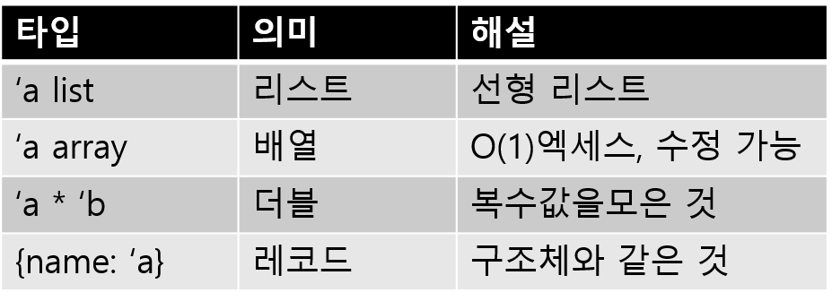
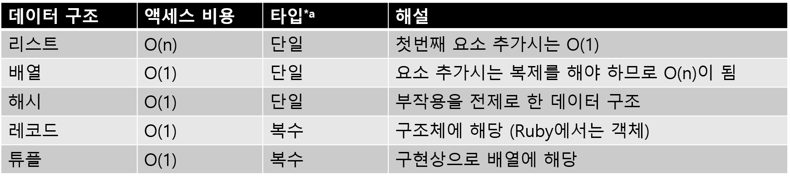

## 4-2 기본 데이터 구조

> 프로그래밍에서 데이터 구조는 중요하다. 프로그래밍 언어는 처음부터 여러개의 데이터 구조 제공을 통해 프로그래밍을 지원한다. 이번에는 각종 프로그래밍 언어의 데이터 구조를 조사하여 Streem 설계에 반영한다.


대부분의 프로그래밍 언어는 기본 데이터 구조를 가지고 있다. 여기서 말하는 기본은 언어 (처리 시스템)에 처음부터 포함되어 라이브러리 등을 로드하지 않고 사용할 수 있다는 의미이다.
어떤 데이터 구조를 내장할까는, 언어 설계자와 처리 시스템 작성자의 판단에 따라가겠지만, 그 판단은 언어의 성격을 좌우한다. 이번에는 몇몇 언어의 기본 데이터 구조와 거기에서 엿볼 디자인 결정에 대해 살펴 보겠다. 그리고, 이번 설계 언어 Streem 내장 데이터 구조를 어떻게 할 것인가에 대해 고찰한다.


### ■ C의 기본 데이터 구조

우선 C의 기본 데이터 구조에 대해 살펴 보겠다. C를 선택한 이유는 두 가지가 있다.
하나는 현대에서 널리 사용되고있는 프로그래밍 언어에서 C (및 C ++)는 기본 데이터 구조가 다른 언어들과 상당히 차이가 있어 매우 특징적이다는 것이다.
다른 하나는 해설하고 있는 나 자신이 가장 오래 사용하는 언어가 C이기 때문이다.
C의 기본 데이터 구조를 (표 1)에 나타냈다.


<center>
(표 1) C의 기본 데이터 구조
</center>


C의 기본 데이터 구조는 크게 네 그룹으로 나눌 수 있다.

처음 그룹은 정수 그룹이다. C의 정수는 그 사이즈별 종류가 나뉘어 있다. C의 정수는 사양상 사이즈가 고정되지 않고 

```
char ≤ short ≤ int ≤ long ≤ long long
```

의 형태로만 결정되어 있다. 특수한 컴퓨터에서는 모든 정수형이 64비트 고정형인 것도 있다고는 하지만, 현대의 컴퓨터(와 OS)에서 자주 쓰이는 조합은 (표 2)에 나타내었다. CPU의 아키텍쳐가 32비트와 64비트로 나뉘어 있고, 64비는 또 2종류로 나뉘어 진다. 


<center>
   (표 2) C의 정수형 사이즈
</center>


정수형 ‘보너스’ 격인 것으로 enum이 있다. 이것은 ‘이름’을 표현하는 데이터 타입이지만, 이 실체도 단순 정수이다. 


#### 포인터로 연산이 가능

다음 그룹은 부동소수점 그룹이다. C의 규격에서는 정해지지 않은 것이지만, 현재 실용화된 거의 모든 컴퓨터에서는 IEEE754라고 하는 부동소수점 포맷이 사용되고 있으며, 단정도는 32비트, 배정도는 64비트 사이즈로 되어 있다. 

제3그룹은 주소이다. 메모리상에서 어느 지점을 표현하는 것이 주소이며, 데이터의 열을 표현한 것이 배열이다. 배열은 메모리 할당용이며, 포인터는 메모리 조작용이라고 생각하면 거의 틀림이 없다. 포인터가 필요한 부분에 배열을 넘기면 자동적으로 포인터로 변환이 된다. 

C의 포인터의 특이점은, 정수와 비슷한 연산이 가능하다는 점이다. C프로그래머는 당연하다고 생각하겠지만, 포인터에 정수를 더하거나, 포인터의 차를 구하거나 하는 것이 가능한 부분은 다른 언어에서는 거의 없는 특징이다. 

C의 기본데이터 구조로 마지막 그룹은 구조체그룹이다. 구조체는 struct로 정의되는 ‘데이터 덩어리’ 이다. 배열은 같은 종류의 데이터의 모음이지만, 구조체는 임의의 데이터의 모음이 되겠다. 구조체에 포함되는 각 데이터(멤버)에는 이름이 붙어 있다. 프로그램 상에서는 보이지 않지만, 메모리 액세스의 상황에 따라, 데이터와 데이터 사이에는 패딩(padding)이 들어갈 가능성이 있다. 

#### 변화무쌍 ‘유니온’

이번 분류에서는 유니온도 구조체 그룹에 포함시켰다. union의 정의는 구조체에 비슷하지만 구조체가 데이터 정렬을 정의하는 것이다 반면 유니온은 같은 메모리 영역에 대한 복수 타입의 해석을 정의하는 것이다.

유니온은 그렇게 자주 쓰이지는 않기 때문에 대체 이런 것을 어디에 쓰는지 의문을 가지는 사람들이 많을 것이다. 유니온이 사용되는 방법은 여러개가 있으나, 전형적인 것은 아래 3종류이다.

* 최대 사이즈 확보
* 조건부 구조체 정의
* 메모리해석의 조건

‘최대 사이즈 확보’ 는, 복수의 데이터 타입이 존재할 때, 어떤 타입이 와도 할당이 가능한 충분한 크기를 확보하는 것을 의미한다. 

예를들어 CRuby에서는 각종 객체를 할당 가능한 메모리 관리를 위한 배열에, ‘객체를 표현하는 구조체의 유니온 배열’ 이라는 것을 사용하고 있다. 실제로 이용할 때에는 객체의 타입에 맞춰 배열요소에의 포인터를 그 객체를 표현하는 구조체로의 포인터 캐스트(형변환)한다. 

‘조건부 구조체 정의’ 는 조건에 따라 구조체의 정의가 변화하는 것을 의미한다.  이는 구체적인 예를 보지 않으면 잘 와닿지 않을 것 같다. 또 CRuby의 이야기를 하자면, CRuby의 문자열(String)은 메모리 소비량 절감을 위해, 문자열 사이즈가 일정 값 이하인 경우, 구조체 내부에 문자열정보를 할당하고, 그 이상의 경우에는 별도로 할당한 메모리 영역에 문자열 정보를 포함시키도록 하고 있다. 

결국, 문자열을 표현하는 구조체(struct RSting) 의 정의가, 문자열의 길이라고 하는 조건의 변화를 의미한다. 이를 구현하기 위해 struct RString의 정의는, (그림 1)과 같이 된다(좀 단순화 시킨 버전이다).

```
#define RSTRING_EMBED_LEN_MAX ((int)((sizeof(VALUE)*3)/sizeof(char)-1))
struct RString {
  struct RBasic basic;
  union {
    struct {
      long len;
      char *ptr;
      long capa;
    } heap;
    char ary[RSTRING_EMBED_LEN_MAX + 1];
  } as;
};
```

<center>
    (그림 1) struct RString
</center>
문자열 정보가 포함되어 있는지 여부는 basic.flags 부분을 보면 확인할 수 있도록되어 있다. 포함된 경우에는 as.ary에 액세스, 그 이외의 경우에는 as.heap에 액세스하여 조건부 정의를 구현하고 있다. 
마지막 ‘메모리 해석 작업’은 타입 정보를 회피하고 실제 메모리의 데이터에 직접 액세스하는 것을 의미한다. CPU가 멀티 바이트로 이루어진 정수를 저장하는 바이트 순서를 ‘바이트 오더(Byte Order)’또는 ‘엔디언(Endianness)’ 이라고 한다. 예를 들어, 32비트 정수를 구성하는 4바이트를 처음부터 a, b, c, d로 명명하는 경우
‘a, b, c, d ’의 순서로 저장하는 방식을 ‘빅 엔디언’, ‘d, c, b, a’ 순서의 방식을 ‘리틀 엔디언’ 이라고 한다.
일반적으로는 빅 엔디안이 자연스럽게 보이지만, 실제 CPU가 채용하고있는 바이트 순서는 리틀 엔디안이 압도적으로 많다. 리틀 엔디안을 채용하고있는 대표적인 CPU는 인텔 x86이고 빅 엔디안을 사용하는 대표적인 CPU는 SPARC이다. (그림 2)의 프로그램은 유니온을 사용하여, 실행중인 CPU 바이트 순서를 판별한다[^1].

#### 데이터 구조로 보는 C의 성격

자, C의 기본 데이터를 훑어 봤는데,  뭔가 이상한 점이 없었는가? 

C의 기본데이터 구조의 특징중 하나는, 정수를 표현하는 타입이 1바이트(8비트)부터 8바이트(64바이트)까지, 각종 사이즈의 정수 타입이 구비되어 있다는 점이다.  그리고 같은 사이즈에도, 부호가 붙은것 과 붙지 않는것이 있다. 또 하나의 특징은 이미 서술한 바와 같이, 포인터(주소)에 대한 정수와 동일한 연산이 허용된다는 점이다. 

이와 같은 특징을 포함하여, C의 기본 데이터 구조는,  원시 CPU의 기능을 반영하고 있다. 대부분의 CPU는 각종 사이즈의 정수연산을 하는 명령을 구비하고 있고, 부동소수점을 다루는 기능을 가지고 있다. 

(대부분)CPU에서는, 데이터의 타입이아닌, 어떤 명령을 사용하는지에 따라, 데이터(바이트, 또는 바이트 열)이 어떤 의미를 가지는지 결정된다.  포인터도 CPU레벨에서는 주소를 표현하는 정수에 지나지 않아, 정수형이라면 정수연산이 가능한 것도 그렇게 이상한 것은 아니다. 

유니온에 대해서도, 메모리 영역에 대한 해석을 변경하는 것 뿐이어서, 얼핏 복잡해 보이는 처리도, 결국은 원시 CPU 동작의 입장에서 생각한다면 자연스러운 것이다. 

이로부터 알 수 있는 것은 프로그래밍 언어로서 C는, 어느정도 이식성과, 타입체크를 기반으로 CPU는 동작을 직접 조작할 수 있는 언어라는 것이다.

C는 본래, 당시에 하드웨어별 어셈블러로 개발되고 있던 OS를, 이식가능한 고급언어로 기술하기 위한 언어이다. 이 성질이 기본 데이터구조에도 반영된 것이다. 

### ■ Ruby의 기본 데이터 구조

다음은 Ruby의 기본 데이터 구조에 대하여 알아보도록 하자. C와 비교하면, Ruby에서의 데이터 구조는 상당히 많아서, 대표적인 것만 발췌한 것을 (표 3)에 정리하였다. 


<center>
    (표 3) Ruby의 기본 데이터 구조(발췌)
</center>


C와 비교하면, 원시 CPU가 취급하는 데이터 구조는 자취를 감추고, 보다 높은 추상도의 데이터 구조가 눈에 띈다. 이 부분이 언어 성격의 차이라고 볼 수 있겠다.

정규표현식이 기본 데이터에 포함된 점은, Ruby가 원래 텍스트처리에 주안점을 둔 스크립트 언어로서 탄생한 것을 반영하고 있다. 최근 Ruby는 웹 애플리케이션 개발 언어로서 인지되는 경우가 많고, 정규표현식을 필두로 텍스트 처리 관련 요구는 점점 줄어들고 있다. 탄생이래 20여년 사이에 언어의 사용패턴에 변화가 일어난 것은 흥미로운 점이다. 

#### 정수형은 하나만 있었어야 했다.

Ruby의 기본 데이터 구조는, 개인적으로 반성하고 있는 점은, Fixnum과 Bignum의 구별이다. 

이들 데이터 구조는 양쪽모두 정수를 표현하고 있다. 구현에 있어서는 Fixnum은 레퍼런스(포인터)에 직접 포함되는 정수이며, 객체할당을 위한 메모리를 소비하지 않는 메리트가 있다. 한편 Bignum은 힙에 할당된 객체이며, 메모리를 소비하지만, 표현가능한 정수의 범위가 제한이 없다(그림 3)


<center>
(그림 3) Fixnum과 Bignum. Ruby의 값은 C의 포인터로 구현된다. 거의 모든 OS에서의 포인터 값은 4 또는 8의 배수이기 때문에, 끝의 2, 3비트는 0이된다. 끝의 비트는 플래그로서 사용되며, 0의 경우에는 포인터를 의미한다. 
</center>


CRuby에서는 Ruby 값의 표현을 태그 포인터라는 방법으로 구현하고 있다. 일반 객체는 힙에 할당 된 구조체로 표현 된 값은 구조체에 대한 포인터로 구현된다. 그러나 CRuby를 구현하는 C에서 포인터로 사용되는 주소와 정수가 상호 변환 할 수 있는지를 이용하여 작은 정수를 포인터 값에 직접 포함된다.
구체적으로는 CPU의 메모리 액세스의 관계에서 포인터 값이 4 또는 8의 배수이며, 정수로 변환 할 때 끝에 2-3 비트가 항상 0임을 이용한다. 그 끝에 1 비트 플래그로 사용하고, 나머지 비트 정수 값을 저장한다. 결과적으로 포인터와 같은 크기의 정수보다 1 비트 작은 크기의 정수 (32 비트 아키텍처라면 31 비트, 64 비트 아키텍처라면 63 비트)는 Fixnum로 값에 직접 포함된다. Fixnum의 범위를 초과 정수는 힙에 Bignum 객체를 할당하고 거기에 저장한다.
엄밀히 말하면 Bignum는 모든 크기의 정수를 표현할 수 있지만, 연산 결과가 Fixnum로 표현할 수있는 범위 내에 있으면 자동으로 Fixnum로 변환하도록 되어 있기 때문에, 결과적으로 값의 범위에서 분담하고 있는 것이다.

이는 의미의 관점에서 보면 Fixnum도 Bignum도 표현하고있는 것은 정수라고하는 존재다. 단지 구현의 사정으로 일정 범위 이내의 것을 Fixnum에서 그 이상은 Bignum으로 표현한다는 것이다.
이 정수의 분담 기능은 원래 Lisp에서 실현되고 있던 것으로, 클래스 이름을 포함하여 Lisp에서 상속한다. 그러나 구현의 사정에 의한 분류가, 구현하는 이들에게는 매우 의미있는 일이지만, 언어의 사용자에 있어서는 별로 중요하지 않다. 중요하지 않은 이 구별이 언어 사양에 ‘누락된’ 모습은 별로 좋은 모습이 아니다.

#### 부동소수점은 하나로 되어 있다.

예를 들어, Ruby2.0의 64 비트 아키텍처에서는 Float중 일정 범위가 Fixnum 마찬가지로 레퍼런스 삽입 최적화가 되어 있다. 즉, 같은 Float 클래스도 어떤 것은 레퍼런스 포함 값이고 어떤 것은 힙에 할당 된 객체가 될 것이다. 그러나 이 차이는 내부적으로만 진행되므로 사용자가 신경 쓸 것은 없다. 지금 생각하면, Fixnum과 Bignum의 구별도 마찬가지로 정수를 표현하는 클래스만을 준비하고, 구현의 전환은 사용자에게 보이지 않는 형태로 처리 했어야했다고 생각한다.
보다 추상도가 높다는 점에서, Lua 등 일부 언어에서는 정수와 부동 소수점 수의 구별조차 중단하고, Number라는 하나의 형태로 대응하고 있다. 부동 소수점수란 오차가 발생할 수 있다는 점을 감안할 때, 약간 주저하는 바는 있지만 하나의 방향성은 있다고 생각한다.
또 하나, Lisp에서 계승한 심볼에 대해 반성해야 할 점이 있다. 2-6절에서 이미 언급 한 바와 같이 기호와 문자열의 구분은 지금에 와서는 오래된 방식이다.  효율성과 구현을 이유로 비슷하지만 다른 데이터 구조를 도입하는 것은 ‘트렌디’가 아니라고 생각한다.
이러한 ‘제대로 동작한다면 구분은 필요 없다’ 는 , Ruby의 설계 사상의 하나로 ‘빅 클래스 주의[^2]’라고 불리기도 한다.

#### OCaml의 기본 데이터 구조

이러한 ‘구분’을 이 필요한 언어 설계의 예로 OCaml을 살펴 보자. OCaml이 함수형으로 유명한 언어로서 최근에는 효율과 성능면에서(해외) 금융 분야에서 이용되고 있다. 같은 함수형 언어로 분류되는 Haskell과 비교하면 정적 타입과 강력한 타입 추론의 점에서 비슷하지만, 암묵적 지연 평가가 없고, 하려고 한다면 부작용이있는 조작도 가능하다는 점 에서 더 캐주얼하다고 할 수 있겠다.

개인적으로는 Haskell보다 OCaml의 선호하기도 하지만, 이것은 OCaml이 더 뛰어나다는 것이 아니라,  어디 까지나 개인 취향이다.
OCaml은, Ruby와는 반대로 적극적으로 구분을 장려하기 위해 비슷하지만 조금 다른 데이터 구조를 여럿 제공한다 (표 4).



<center>
(표 4) OCaml의 유사 데이터구조
</center>


OCaml의 리스트는

```
[값; 값]
```

으로 표현된다. 리스트의 앞에 값을 추가할 때는 ::연산자가 사용된다.

```
0 :: [1; 2]
=> [0; 1; 2]
```


리스트는 선형리스트라는 데이터 구조로 구현되어 있다. 요소에 액세스하는 시간은 길이에 비례 하여 소요되며,  앞단에 요소를 붙이는 것은 비교적 낮은 비용으로 할 수 있다 (그림 4).
한편, 배열은 값들의 목록이다. 배열 n 번째 요소에 대한 액세스는 n의 크기에 관계없이 가능하다. 그러나 요소를 추가하려면 배열 전체를 복사해야 한다.
명시적 타입 선언이 없는 Ruby 등과는 달리 정적형 언어인 OCaml에서는 배열이나 리스트의 모든 요소는 컴파일시에 결정하는 공통 타입이 필요하다. 튜플(또는 레코드)은 여러 타입의 값을 모아 구성하기 위해 존재한다. 간단하게 말하면, 각각 다른 형태를 가지는 복수의 형태를 모은 것이 튜플이며, 각각의 값에 이름을 붙인 것이 레코드가 된다.


<center>
(그림 4)OCalm의 리스트
</center>


액세스 비용이나 형태에 따라서 여러 데이터 구조를 구분하는 것이 OCaml의 특징이다. Ruby의 큰 클래스주의와는 다르지만, 정적 타입의 혜택을 누리고, 효율적인 프로그램을 작성하는 효과적인 방법이라고 생각했던 것이다. 또한 OCaml의 탄생시기 (1996년, 부모뻘인 Caml은 1985 년)을 감안할 때, 이런 사상은 자연스러운 것 같다. 


### ■ Streem의 기초 데이터

자, 그럼 이를 바탕으로 Streem의 기본 데이터 구조에 대해 생각해 보자.
우선 숫자에 대해 생각해 보자. Streem 시스템 프로그래밍 언어로 설계되어 있지 않기 때문에, C처럼 CPU가 취급하는 각종 크기의 정수를 직접 취급 할 필요는 없다. 오히려 구분에 대해 생각하지 않아도 문제없도록 정리하는 것이 좋다. 그래서 숫자는 모두 Number라는 형태로 표현하고 효율성을 위해 내부적으로 정수와 부동 소수점 숫자를 구분하게 하도록 하자.

C에서 문자열은 문자타입 (8 비트 정수)의 배열로 취급되었지만 문자열이 중요한 데이터 형식이 될 것으로 예상되는 Streem에서는 Ruby와 마찬가지로 전용의 문자열 타입을 도입하려 한다. Ruby와 동일한 문자열 조작 메소드 (향후 단계적으로)도 정비 예정이다. 그러나 무엇보다 함수형 언어의 영향을 받은 Streem에서는 문자열은 불변 객체 (갱신 불가)이므로 문자열 재작성 같은 기능은 제공하지 않는다. 기호 및 문자열에 대해서도 이미 언급했듯이 구분하지 않는다. 내부적으로는 전용 테이블에 등록 된 (인턴(intern)화된) 문자열을 기호로 사용할 수 있다.
고민되는 것은 배열이다. 여러 값을 모아 정리한 데이터 구조는 Ruby에서도 배열, 해시, 객체 등 몇 개를 제공하고 있다. OCaml은 더 많은 데이터 구조를 가지고 있다. 물론 사용하는 경우에 따라 구분하는 것이지만,  지금까지의 흐름에서 보면 사용자가 명시으로 ‘구분’을 해야 하는 사태는 피하고 싶다. 


#### Streem의 리스트는 ‘불필요’

여러 값을 모아 정리하는 데이터 구조에는 액세스 패턴에 의한 구분 (정수 인덱스에 의한 배열과 이름을 키로 하는 해시), 액세스 비용 의한 구분 (O (n)의 목록과 O (1)의 배열 해시), 타입에 따른 구분 (단일형의 리스트 배열과 여러 타입을 가지는 튜플)이 있다 (표 5).

<center>
     <br> (표 5) 여려 타입을 모아 정리하는 데이터 구조 <br> <sup>(*a : 정적 타입언어인 경우)</sup>
</center>
‘구분’을 줄이고 싶은 Streem으로서, 이 중 어느 것을 선택하고, 어떤 것을 버려야 할 까?
우선 해시부터 생각해 보면,  해시라는 데이터 구조는 업데이트가 없으면 의미가 없다.  따라서 원칙적으로 업데이트 부작용이 없는 Streem에 해시는 필요가 없을 것이다. 해시 해당 요소에 라벨를 붙이는 기능으로 대체가능하다. 라벨이 붙은 레코드 (Ruby에서는 객체)의 대체도 될 수 있다.

배열과 목록의 차이를 살펴보자. 배열과 목록은 여러 값을 모아 정리하는 동작은 동일하지만 내부 구현이 다르기 때문에 액세스 비용이 다르다. 그러나 구현 문제 때문에 구분을 요구하지는 않는다는 설계 방침에 따라, 여기에서 그 구별을 남기고 싶지는 않다.

설계 방침은 두가지가 있다. 하나는 어느 하나를 포기하고, 데이터 구조도 통일 해 버리는 것이고, 다른 하나는 내부적으로 데이터 구조를 구분하고, 사용자에게 가능한 한 그것을 보이지 않는 방법이다.

여기에서는 Ruby를 예로 들어 보자. Ruby는 공개전의 최초 시기를 제외하고는 데이터 구조가 배열밖에 없어서, 기본 데이터 구조로서 리스트를 제공 하지 않고 있다. 하지만,  Ruby에 리스트가 없다고 해서 실행 비용이 늘어났다는 이야기는 들어본 적이 없다. 물론 이전에 액세스 비용의 문제가 발행한 적이 있긴 했지만, 이것이 중대한 문제로 발전된 적은 없었다고 생각해도 좋을 것이다. 

실은, 앞으로 필요할 지 몰라, Streem에 리스트를 구현해 놓았지만, 이번에 고민을 한 결과, 리스트가 그렇게 필요치 않을 것이라는 결론에 도달했다. 소스코드의 단순화를 위해, 이 부분의 코드를 정리하는 것으로 하자. 

#### Streem 의 기타 데이타 구조 

수치, 문자열, 배열에 대하여는 이미 설명을 하였다. Streem에는 그 외의 데이터 구조로서 부울값, 클로져, I/O, 태스크가 있다. 아마 앞으로 필요에 따라 추가하겠지만, 그 경우에서도 가능한 ‘구분’ 은 필요없도록, ‘하나의 동작에는 하나의 데이터 구조(타입)’ 이라는 방침을 철저히 지키려고 한다. 


#### 이번 변경사항

이번에는 데이터 구조에 대하여 해설과 고찰을 주안점으로 삼았기 때문에, Streem처리 시스템에 손을 댄 부분은 그렇게 많지 않다. 

변경한 것은, 정수와 부동소수점수의 통일화, 개발 도중에 방치했던 리스트의 구현과 정리, 배열의 문자열화 루틴의 개선정도이다. 이 시점에서의 변경사항에 대한 소스코드는 ‘201510’ 이라는 태그를 붙여 두었다. 


#### 마치며

이번에는 처음부터 내장되었던 기본 데이터 구조부터, 그 언어의 성질을 읽어풀어내는 것을 해 봤다. C와 Ruby에서는 기본 데이터 구조가 놀라울 정도로 당초의 설계목적을 반영하고 있어 흥미로웠다. 또한, 언어의 기본 데이터 구조에 있어서 ‘구분’이 적으면 적을 수록 더 뛰어나다는 것을 알게 되었다. 

또한, 위 고찰에 기초하여 Streem의 기본 데이터 구조에 대해 살펴보았다. 이를 통해 구분이 적고 사용하기 쉬운 언어에 어느정도 접근했다고 생각한다. 이후에는 이어서,  Streem의 개선에 매진할 생각이다.

<hr>

### 타임머신 칼럼

***Ruby에서도 실수가 있었다***

> 2015년 10월호 게재분이다. 설명의 정황상, 서적에서는 2015년 9월호 게재분보다 이번 분을 먼저 해설하는게 좋겠다고 생각했다.
>
> 이번에는 각종언어(C, Ruby, OCaml)가 제공하는 기본적인 데이터 타입에 대해 훑어본 후, 이들을 참고하여 Streem의 기본 데이터 타입을 설계하는 흐름으로 해설하였다. 
>
> 프로그래밍언어를 구성하는 요소로서, 가장 눈에 띄는 것은 문법이지만, 실제 언어의 성질은 데이터 타입과 라이브러리에 의해 좌우된다. 아무리 훌륭한 문법을 가지고 있는 언어라도, 데이터 타입과 라이브러리가 받쳐주지 않으면 살아남을 수 없다. 
>
> 이번 해설에서는 각기 다른 포커스를 가진 언어(시스템 프로그래밍언어로서의 C, 스크립트 언어로서의 Ruby, 함수형 프로그래밍 언어로서의 OCaml)들 각각의 기본 데이터 타입이 어떻게 사상을 반영하고 있나를 맛보기로 설명하고 있다. 언어디자인을 하는데 참고가 될 지도 모르겠다. 
>
> 이번에는 또한 Ruby의 Fixnum과 Bignum의 구별에 대해 기술하였다. 원고집필시부터 1년이상이 경과한 2016년 12월에 릴리즈된(이 칼럼을 쓸 때에는 아직 릴리즈 전임) Ruby2.4에서는, 드디오 Fixnum과 Bignum이 Integer로 통일되게 되었다. Ruby정도로 널리 쓰이는 언어가 되면, 이전 버전과의 호환성 때문에 과거 디자인의 ‘실수’가 있더라도 고치는 것이 여의치가 않다. 하지만, 이 ‘Integer통합’은 비교적 순탄하게 진행되지 않았나 생각된다. 


[^1]:  이 프로그램은 리틀 엔디언이 아닌 것은 빅 엔디언으로 판정하고 있지만, 굉장히 오래된 CPU에는 ‘b a, d, c‘와 같은 ‘미들 엔디안‘ 형식도 있기 때문에 엄밀하게 말하면 틀린 판정을 한다고 할 수 있다. 그러나 빅 엔디언조차 멸종 위기여서 그렇게 신경쓸 것은 없을 것 같다.

[^2]: 원문은 「大クラス主義」로서 저자(마츠모토)도 영어 번역을 어떻게 할 것 인지 고민하는 트윗을 남겼다(https://twitter.com/yukihiro_matz/status/745173456187072512). (옮긴이)


