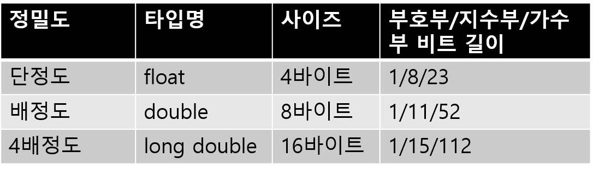
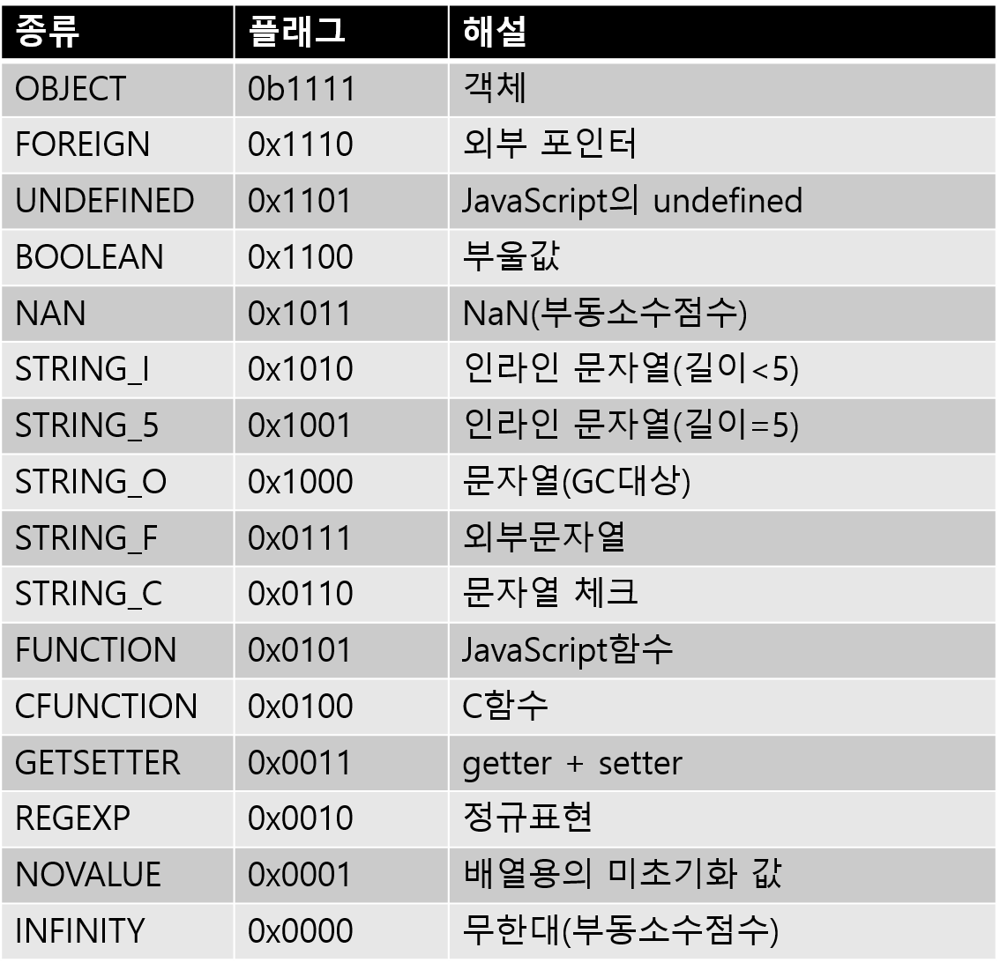

## 4-3 객체 표현과 NaN Boxing

>4-2절의 객체지향기능의 설계에 이어서, 이번에는 언어처리 시스템의 데이터 핸들링 방법을 개선하는 테크닉에 대해 배워보자. V7이라고 하는 JavaScript처리시스템을 참고하여 ‘NaN Boxing’이라 불리우는 테크닉을 구현하겠다.


어느날, V7이라고 하는 JavaScript의 처리 시스템을 만나게 되었다. V8은, Google Chrome에 내장된(그리고 node.js의 코어가 되는) JavaScript 처리 시스템이지만, V7은 처음 들었다. 조사해보니, 임베디드를 위한 컴팩트한 JavaScript처리시스템(구현은 파일당 17000 라인정도)이며, 실행속도도 빠른(JIT가 없는 처리시스템으로서 가장 빠른)것이라고 한다. 

언어처리시스템의 구현을 들여다 보는것이 취미인 나로서는, 시간을 가지고 이를 조사해 보았다. 여러가지 재미있는 것이 있었지만, 가장 흥미로웠던 것은 객체 표현의 구현 부분이었다. 

‘NaN Boxing’이라고 불리는 테크닉은, 실은 mruby에서도 컴파일 옵션으로 이용가능하며, V7에서는 mruby보다는 좀 세련된 것 같다. 이에 대해서는 좀 더 조사할 필요가 있다. 


#### 클린 룸 설계

그런데 V7은 , GPL2과 상용 듀얼 라이선스이다. GPL2라이선스로 대응이 어려운 경우에는, 제작자와 연락하여 (유상으로) 상용라이선스를 취득할 수 있는 것 같다.  오픈 소스화는 하고 싶지만, 무임 승차는 피하고 싶다는 의도 같으며, 이해는 간다. 또한 V7가 목표로하고있는 같은 임베디드 영역에서는 라이센스 불안없이 이용하기 위해 상용 라이센스를 취득하고자하는 사람 (기업)도 나름대로 있을 것이다.

하지만 이번에는 V7을 내장시키고 싶지 않고, Streem에서 단지 참고만 하려고 하기 때문에 상용 라이센스까지는 취득할 필요는 없다. 그렇지만 GPL2와 Streem의 MIT라이센스가 만나면 모순이 발생하기 때문에, 그대로 복사해서 사용해서는 안된다. 

그래서, (사이비)클린 룸 설계를 사용해 개발하도록 하겠다.  클린 룸 설계라는 것은 소프트웨어의 리버스 엔지니어링 기법 중 하나이며, 해석하는 팀과, 구현하는 팀을 격리하여, 저작관이나 기업 기밀에 저촉되는 일 없이 별도의 구현을 하는 것이다. 이번에는 GPL이 전파되는 것을 방지하기 위해, V7소스코드를 해석하면서 해설(본 기사)를 집필하고, 그 정보를 기초로 Streem을 개발하는 방식을 채용한다. 그래도, 한명이 이 작업을 하면 완전 격리는 불가능하므로 ‘사이비’ 클린 룸 설계라고 했다.

#### 레퍼런스의 표현기법

우선, V7과 Streem과 같은 언어처리시스템에서, 객채가 어떻게 표현되는지를 소개해 두겠다.

CPython(C로 구현한 Python)처럼,  몇개의 처리시스템에서는 객채의 참조는 구조체로의 포인터로 표현한다. 이 단순 포인터를 이용하여, 구조체의 액세스 속도는 가장 빨라지고, 메모리 낭비도 없다. 단, 정수 등 빈번히 사용되는 값에 대해서도 모두 구조체를 할당해야 하므로, 대량의 객체할당에 문제가 있을 수 있다. 

이 점을 개량하는 기법으로 ‘Tagged Pointer 기법’ 이란것이 있다. 이는 포인터를 정수로 변환시, 제일 아래 2비트 부터 3비트가 항상 ‘0’ 인(많은 OS에서 구현되고 있는)것을 이용하는 방법이다. 이 비트에 타입 정보를 담아, 정수등의 일부 값을 참조에 직접 포함시킨다(그림 1). 처리시스템으로서는 Emacs Lisp와 CRuby가 이를 채용하고 있다. 

Tagged Pointer 기법에 의해,  포인터만 썼을때와 메모리 효율은 같지만, 자주 사용되는 정수 및 부울값등을 포함시켜, 전체 메모리 효율이 향상된다. 거꾸로 포함된 값을 꺼내 쓰려면 약간의 비트 연산이 필요하지만 이는 그렇게 큰 비용이 드는 것은 아니다. 

```
포인터 비트            의미
[...0000 0000]  →  false
[...0000 0100]  →  nil
[...0000 0010]  →  true
[...0000 0110]  →  undef
[...xxxx xxx1]  →  정수
[...xxxx x000]  →  통상의 포인터(8바이트 경계)
```

<center>
    (그림 1) Tagged Pointer 기법(Ruby의 경우)
</center>


#### 현재 Streem에서는 구조체로 표현

mruby,  Streem, Lua등에서는 객체의 표현에 구조체를 사용하고 있다. 현재 Streem에서는 ‘strm_value’ 라고 하는 타입을 정의하고 있다. 이의 실체도 구조체로서, (그림 2)와 같이 정의된다.

```
typedef struct {
  enum strm_value_type type;
  union {
    long i;
    void *p;
    double f;
  } val;
} strm_value;
```

<center>
    (그림 2) 객체 참조인 strm_value의 정의
</center>

이 구조체에 포인터와 정수, 부동소수점수 등의 할당이 가능하다. 덧붙여 C언어의 union에서는 복수의 타입을 하나의 필드로 묶을 수 있다.

구조체 기법의 최대 메리트는, 구현의 심플함과 높은 이식성이다. 구조체 기법은(단순 포인트법과 마찬가지로) CPU와 OS에 어떤 사전 조건도 없다. C컴퍼일러가 제공하는 환경이라면 어디서나 구현이 가능하다.  게다가 단순 포인터 법이 가지는 정수 객체의 대용향 할당문제도 회피 가능하다. 

단점은 메모리 효율이다. mruby에서 정의된 mrb_value구조체는, 64비트 CPU에서의 사이즈가 16바이트, 32비트CPU에서는 12바이트이다. 객체 표현에 포인터를 사용한다면, 그 사이즈는 각각 64비트 CPU에서는 8바이트, 32비트CPU에서는 4바이트가 되므로, 낭비인 것은 분명하다. 구현의 심플함과 이식성 이외의 메리트는 보이지 않는다. 하지만 상황에 따라, 예를 들어 임베디드를 포함한 모든 환경에의 이식성을 목표로 하는 mruby와 같은 구현에서는 이식성은 양보할 수 있는 조건이 된다. 

객체 표현의 최후의 기법은 V7에서 채용하고 있는 NaN Boxing이다. 이것은 부동소수점수의 구조를 이용하여, 64비트의 사이즈에서 객체를 표현하는 테크닉이다. 


#### IEEE754

C의 규격에서는 부동소수점수 표현에 대한 어떤 규정도 하고 있지 않다. 하지만, 현재 대부분의 컴퓨터에서는, 부동소수점수의 표현으로 IEEE754라고 부르는 포맷을 채용하고 있다. 내가 알고 있는 한, IEEE754포맷을 따르지 않고 있는 컴퓨터는 VAX라고 하는 미니컴퓨터가 있지만, 워낙 오래된 기종이고, 이젠 현역에서 활용되고 있지는 않다. 이후 일부 범용기기에서도 독자적인 부동소수점수 표현을 사용하고 있다고 들은 적은 있다.

여기에서 설명할 NaN Boxing은, IEEE754포맷을 이용(악용)하여 구현하고 있다. 우선 포멧부터 설명하겠다. 

IEEE754에서 정의되고 있는 부동소수점수는 그 정밀도에 따라 여러개가 정의되고 있다(표 1). 



<center>
 (표 1) IEEE부동소수점수의 종류
</center>


각 타입은 데이터를 대입할 비트의 폭만 달라질 뿐 거의 동일한 구조를 가지고 있으며, 이번 테마인 NaN Boxing에서 사용하는 double을 중심으로 해설하겠다.

부동소수점수는 부호부, 지수부, 가수부라고하는 3개의 부분으로 구성되어 있다(그림 3). 최상위 비트부터, 각 비트의 크기만큼 잘라 부호를 땐 정수로 해석한 것을 a, b, c라고 했을 때, 부동소수점수는 아래와 같은 의미를 갖는다(double의 경우)


<center>
 (그림 3) IEEE부동소수점수 포맷
</center>


```
(-1)^a*2^(b-1023)*(1+c/2^51)
```

결국, 이 식의 의미는 부호부가 1인 경우는 음수, 0일때는 양수가 되며, 가수부는 1023옵셋을 더해 부호를 붙여 정수를 표현하고, 지수부는 소수점 이하의 수를 2진수로 표현한 것이다. 

이 식에 따라, 2.5를 IEEE754 double로 표현하면, 정수(正數)이므로 부호는 0이 되고, 2.5를 정수부가 1이 되도록 변환하면

```
1.25 * 2^1
```

이 되고,  가수는 1.25, 지수는 1이 된다. 가수부는 소수점 앞의 1을 뺀 0.25가 되고, 비트 표현은 2진표현으로

```
01000000 (이하 44비트는 계속0)
```

이 되고 지수부는 1023의 옵셋을 더해 1024, 비트표현은

```
100000000000
```

이 된다. 이를 최상위 비트부터 부호부, 지수부, 가수부순으로 연결하면 16진수로

```
0x4004000000000000
```

와 같이 된다. 이 값을 출력하는 프로그램이 (그림 4)에 나타나 있다. 앞에서 기술한 union은 같은 비트패턴을 다른 타입으로 해석이 가능하기 때문에 이런 프로그램에는 딱 맞다.

```
#include <stdio.h>
#include <stdint.h>

int
main()
{
  union {
    double f;
    uint64_t i;
  } u;
  u.f = 2.5;
  printf("0x%lx\n", u.i);
  return 0;
}
```

<center>
    (그림 4)IEEE754 double의 16진수 출력 프로그램
</center>


#### 특수한 부동소수점수

IEEE754에는 두개의 특수한 값이 있다[^1]. 하나는 무한대(Infinity)이고, 또 하나는 비수(非數-Not a Number, NaN)이다. 무한대는 어떤 값을 0으로 나누는 경우의 결과 등 수학상 무한대를 보여주는 값으로 음수, 양수 2개의 값으로 나뉜다. 무한대의 IEEE754적인 표현은 지수부가 2047이며 가수부가 0이 된다. 음/양 은 부호 비트가 결정한다.

NaN은 예를 들어 0/0 이나, ∞ + (-∞)와 같이 수학적으로는 의미없는 결과나 음수의 평방근(平方根)과 같은 실수의 범위로 표현불가능한 값을 나타내기 위해 사용된다. NaN의 IEEE754 식 표현은, 지수부는 무한대(∞)와 동일한 2047(비트 표현으로 11111111111)이며, 가수부는 0이외의 경우가 된다.


#### NaN Boxing

이 NaN을 활용해서, 부동소수점수 객채의 표현에 유용하는 것이 NaN Boxing이다. 

이미 설명한 바와 같이 NaN은, 지수부의 비트가 전부 1이고, 가수부는 0이 아닌 값이 오기 때문에 2<sup>52</sup>-1, 결국 4503599627370495 비트 패턴이 된다. 이정도 크기의 공간이 있다면 여러가지 값들을 넣을 수 있다. NaN의 빈 자리(free bit)를 찾아 집어넣는(Boxing) 다고 해서 NaN Boxing이라고 한다. 

하지만, V7에서 객체 표현으로 사용하는 타입은, 의외로 부동소수점수가 아닌, 64비트 정수(uint64_t)이다. 이를 ‘v7_val_t’라고는 이름으로 typedef하고 있다. 

벤치마크를 해 본적은 없지만 추측컨데,  부동소수점수가 아닌, 정수를 사용한 이유는 아마 정수 쪽이 더 속도가 빠르기 때문이 아닐까 싶다. 함수호출의 인수와 리턴값으로서 값을 받을 때, 부동소수점수는 특별취급을 하는 CPU가 있어, 그런 경우에는 정수가 약간 효율이 좋을 가능성이 있다. NaN Boxing에서 비트패턴도 전달되는 경우, 부동소수점수 자체를 객채표현에 사용할 필요는 없다. 

V7에서는 64비트를 부호부(1비트), 지수부(11비트), 가수부(52비트) 각각을 아래와 같이 해석한다. 

우선 부호부는, V7를 시작으로 많은 NaN Boxing의 구현에서는 부호부를 쓰지 않는다. V7에서는 항상 1로 셋팅한다. 가수부는 NaN의 정의에 의해 모두 1로 셋팅한다. 실제 값은 남은 52비트의 영역에 할당하게 된다. 

이 가수부 52비트 중에, 앞의 4비트를 객체의 타입을 나타내는 플래그로서 사용한다(표 2). 그리고 남은 48비트(6바이트)를 사용하여, 각종 객체를 표현하게 된다. 



<center>
    (표 2) V7 값의 종류
</center>


정리하면, v7_val_t의 64 비트중, 부호부 + 지수부 + 가수부의 앞 4비트, 합계 16비트가 객체 종류를 나타내는 태그가 되며, 남은 48비트에 다른 표현하고픈 값을 할당한다. 


#### 부울 값 등의 입력방법

그럼 구체적으로 값을 할당해 보도록 하자. 

가장 간단한 부울값부터 살펴보자. V7에서 부울값(참 또는 거짓)을 생성하는 함수 v7_create_boolean()의 정의는 (그림 5)와 같이 된다. 

```
v7_val_t v7_create_boolean(int v) {
  return (!!v) | V7_TAG_BOOLEAN;
} ↑ !!v가 0이 아니면 1, 0이면 0
```

(그림 5) v7_create_boolean()


V7_TAG_BOOLEAN은 BOOLEAN(부울값) 을 나타내는 태그(부호부 + 지수부 + 플래그)이다. 위에서 서술한 것과 같이,  값 부분에는 48비트가 있지만, 여기서는 true가 1, false는 0이라고 사용되고 있다. 

JavaScript에서는 존재하지 않지만, 예를 들어 Ruby의 심볼과 같은 값을 표현하는것에서도 같은 방법을 사용한다. 결국, 심볼에 대응하는 정수(48비트 이내) 와 그 태그의 조합으로 객체 표현을 하는 것이다.


#### 정수의 할당 방법

실은 JavaScript에는 정수가 없지만(숫자는 모두 부동소수점으로 표현한다), 우선 일반론적으로 NaN Boxing에서 정수의 할당 방법을 설명하겠다. 타입 표현으로서 사용되는것이 부호부, 지수부를 합하여 16비트, 값을 표현하는데 사용되는 것이 48비트여서, 이 48비트에 정수를 집어넣게 된다. 

가장 간단한 방법은 32비트 정수를 채용하는 것이다. 48비트 중 16비트는 낭비로 볼 수 있겠지만, 32비트 CPU시대에서는 대부분의 계산이 32비트로 수행되기 때문에, 실질적으로 문제가 되는 것은 없을 것이다. 많은 CPU에서는 48비트라고 하는 어중간한 사이즈보다도 32비트 정수의 연산쪽이 더 효율적이기 때문에 그 점도 메리트가 된다. 

다른 방법으로 48비트를 풀로 정수표현에 활용하는 것도 가능하다. 하지만, 이 경우 계산은 64비트 정수로하게 되므로, 오버플로를 염두해야 할 필요가 있어, 핸들링이 약간 복잡해질 가능성이 있다. 


#### 부동수소점 수의 경우

노파심에서 하는 말이지만, NaN Boxing은 부동소수점수의 사용되지 않은 비트 패턴에 값을 집어넣는 테크닉이기 때문에, 부동소수점수는 가공할 필요가 없다. 하지만, 부동소수점수를 표현하는 타입은 double, 객체 표현의 실체는 64비트 부호 없는 정수이기 때문에, 변환은 필요하게 된다.  하는 방법은 (그림 4) 때와 동일하게, 부동소수점수를 union에 할당하고, 정수로서 추출한다. 


#### 포인터를 채우는 방법

자, 여러가지 값을 할당하는 것들 중에 가장 문제가 되는 것이 포인터이다. 32비트 아키텍쳐상에서는 포인터의 사이즈도 32비트여서 48비트 내에 할당하는 것은 문제가 되지 않는다.  하지만, 64비트 아키텍쳐에서는 포인터 사이즈도64비트이기 때문에, 48비트를 넘어 버린다. 

하지만 다행인것은, 대부분의 OS에서는 포인터에 64비트를 풀로 쓰지 않고, 48비트 정도로 자를 수 있는 범위의 값만 쓴다는 것이다. 생각해보면 48비트라면, 256TB의 메모리 공간에 액세스가 가능하기 때문에 당분간 이때문에 곤란한 경우는 없을 것이다. 

아쉽게도 일부 OS(Solaris등)에서는, NaN Boxing이 태그에 사용하는 상위 16비트의 영역도 포인터가 쓰기 때문에, 이 테크닉은 쓸 수 없게 된다. 뭐 옛날부터 조금은 독특했던 Solaris를 사용하는 사람들은 이제 거의 없어졌기 때문에 문제가 되지 않을 지도 모르지만, NaN Boxing은 역시 이식성이 최대 약점이 되는 것 같다. 

포인터가 48비트의 범위로 저장된다면, 그 후는 부울값과 마찬가지로, TAG와의 조합으로 채우는 게 가능하다.


#### 문자열을 채우는 방법

V7은 문자열의 표현에 있어서 상당한 연구가 있었다 . 문자열은 상당히 자주 등장하는 객체이기 때문에, 효율성을 확보하기 위한 것일지도 모르겠다. (표 2)를 보면, 전부 16종 밖에 없는 값의 종류에서 5개도 문자열을 위한 것임을 알 수 있다.

우선은 STRING_I와 STRING_5이다. 값을 표현하기 위해한 비트는 48비트도 있기 때문에, 길이가 6바이트의 범위에 담을 수 있는 문자열은 값이 그대로 채워진다. JavaScript는 문자열을 바꿀수 없기 때문에, 이 방법을 쓸 수 있다. Ruby에서는 문자열의 변경이 가능하기 때문에, 이 방법을 쓸 수 없다. 한편, Streem은 문자열을 포함한 객체는 변경 불가(immutable)이기 때문에 사용 가능하다.

``` 
(a) 1~4바이트의 경우
v7_val_t
[v7_TAG_STRING_I|길이|1바이트|2바이트|3바이트|4바이트|NUL]
        16비트   8비트  8비트   8비트  8비트   8비트  8비트

(b) 5바이트의 경우
v7_val_t
[v7_TAG_STRING_5|길이|1바이트|2바이트|3바이트|4바이트|5바이트|NUL]
        16비트   8비트  8비트   8비트  8비트   8비트  8비트  8비트
```

<center>
    (그림 6) 인라인 문자열
</center>


C언어의 문자열과의 정합성 때문일까?, V7에서는 문자열의 끝에 반드시 NUL(‘\0’)을 붙이고 있다. 그래서 최대 채울 수 있는 바이트 수는 5이다.

1~4바이트까지의 문자열은 STRING_I로 표현한다(그림 6)(a). 5바이트에서는 바이트 수를 채울 공간이 부족하기 때문에 특별한 태그를 사용한다(그림 6)(b)

나머지 3종류에서, STRING_F는 밖에서 주어지는 V7의 GC(가비지 컬렉션)에스는 관리되지 않는 문자열이다. 예를 들어 C의 문자열을 래핑(Wrapping)한 것이 STRING_F가 된다. 이들 문자열은 GC의 대상이 아니기 때문에, 그대로 포인터로서 핸들링된다.


#### 문자열과 GC

STRING_O는 owned, 결국 V7이 메모리 영역을 관리하기 위한 문자열이다. 문자열은, VM이 관리하는 영역에 할당된다. 메모리영역이 부족하면 GC가 시작되고, 문자열용 메모리영역이 회수된다. 

V7은 문자열에 대해 슬라이드 압축을 채용하고 있다. 다시말하면 회수된 문자열이 있던 공간을 뒤로부터 슬라이드시켜 그 공간을 채워버린다. (그림 7) 하지만, 슬라이드에 의한 이동전의 문자열에의 참조(주소)를 슬라이드 후의 주소로 수정하지 않으면 데이터가 깨져 버린다.


<center>
    (그림 7) 슬라이드 압축. “foo”와 “baz” 만 살아남게 된다
</center>


V7에서는 이를 위해 STRING_C를 사용하고 있다. 얼핏 보면 무슨 일을 하는지 잘 파악이 안되는 복잡함을 가지고 있지만, 개략적으로 아래와 같은 순서로 진행된다(그림 8)


<center>
    (그림 8) 문자열의 GC순서
</center>

1. 문자열에 마크를 한다.
2. 문자열의 앞 6바이트를 v에 채워 넣는다
3. v의 태그를 STRING_C로 한다
4. v의 주소를 문자열에 작성한다.

의 처리를 한다.

마크된 문자열로의 참조 v2를 발견하면

1. 마크된 문자열에 채워넣었던 주소를 v2에 채워넣는다
2. v2의 태그를 FOREIGN으로 한다
3. v2의 주소를 문자열에 채워넣는다.

의 처리를 한다. 이를 반복하면, 마크단계가 종료되는 시점에서, ‘살아있는’ 모든 문자열은 

* 마크되어 있음
* 그 객체로의 모든 참조가 링크리스트가 되어 있다.
* 링크리스트 끝에는 주소로 치환된 부분의 문자열 정보가 있다.

의 상태가 된다. 

V7의 소스코드를 읽어보면, 이 언저리의 처리에 CPU가 리틀엔디언[^2] 이 아니면 문제를 일으킬것 같은 코드가 보인다. 최근 에는 x86도 ARM도 대부분 리틀엔디언 이어서 그렇게 신경쓰지 않아도 될 것 같기도 하다.

이후로는 문자열영역을 순서대로 스캔하여, 문자열에 마크가 되어 있으면 슬라이드를 시켜 영역을 채우고, 링크를 따라가 모든 참조의 주소를 갱신하는 흐름을 반복한다. 

뭔가 지루한 처리를 하고 있지만, 여기에는 이유가 있다. 구현의 심플함을 생각하면 슬라이드 압축 등을 생각하지 않고, 문자영영역을 그대로 malloc(할당)하고, 사용이 끝나면 free(해방)하면 될 것 같지만, 일반적으로 malloc은 작은 영역을 많이 할당하면 메모리가 낭비가 되어 버리는 경우가 많다고 알려져 있다. 또한, 문자열의 주소가 분산되기 때문에, 작업셋(액세스하는 주소 범위)가 커지게 되어, 캐시가 잘 듣지 않게 되는 경우도 생각할 수 있다. 실행효율을 생각한다면, 이 복잡함도 나름 채산성이 맞다고 V7를 만든이는 생각했을 것이다. 


#### Streem에서의 Nan Boxing채용

여기서 정리한 V7의 NaN Boxing의 구현을 참고해 Streem에도 NaN Boxing을 도입해 보겠다.

우선, 객체표현을 위한 타입 strm_value를 uint64_t로 바꾼다. 또한, 객채의 종류를 표현하기 위해, (표 3)의 태그를 준비했다.  현 시점에서는 12종류밖에 없지만(최대 15종류), 앞으로 필요에 따라 늘어날 지도 모르겠다. 

문자열은 V7과 동일한 테크닉을 이용하여, 6바이트 이내의 문자열은 strm_value에 채워넣는다. Streem은 원래부터 끝에 NUL을 할당하지 않았기 때문에, 48비트(6바이트)를 최대한 활용이 가능하다.

단, 문자열의 슬라이드 압축은 당장은 도입하지 않기로 했다. 제대로 벤치마크를 하여, 보틀넥 부분이 어디인지를 파악한 후에 작업을 하려고 한다. 


#### GC의 구현

지금까지 Streem에서는, Bohem GC라이브러리라고 하는 C/C++ 용 GC라이브러리를 썼기 때문에 독자적인 GC구현 작업이 필요가 없었다. 

NaN Boxing을 채용하면, 포인터값이 그대로 보이지 않게 되기 때문에 Bohem GC가 동작을 하지 않게 된다. Streem독자의 GC를 도입할 필요가 있을 것 같다. 이번에는 마크 앤 스윕 (Mark and Sweep)방식의 상당히 심플한 GC를 만들었다. Streem의 언어 특성을 살린 GC는 나중에 설계 및 개발을 하는 것으로 하자.


#### 마치며

이번에는, 객체 표현 테크닉인 NaN Boxing에 대해 빠른 속도를 자랑하는 JavaScript 처리 시스템 V7의 코드 리딩을 하면서 배워 보았다. 또한, 그 테크닉을 Streem에 도입해 보았따.  이 지식은 독자가 독자적언어를 설계하고, 그 처리 시스템을 개발할 때에도 도움이 된다.  Ruby에 이어지는 세계적인 언어가 독자중에서 태어난다면, 그 이상 기쁜 일이 없겠다. 


<hr>

### 타임머신 칼럼

***GC의 구현은 아직 ‘의지’ 가 부족하다…***

> 2016년 1월호 게재분이다. 이번에는 컴팩트한 JavaScript엔진인 V7의 구현부터 NaN Boxing의 구현법을 배우고 있다. 부동소수점수에 포인터를 시작으로 하는 값을 채워넣는 NaN Boxing은 상당히 재미있는 ‘해킹’ 이다. 이번의 해설은 NaN Boxing의 구현에 관련한 자료로서 그 나름 의미가 있다고 생각한다. 
>
> 여기서 고백할게 있다. 본문에서는 ‘마크 앤 스윕 방식의 상당히 심플한 GC를 만들었다’ 라고 썼는데, 실제로는 만들지 못했다. 물론 처음부터 거짓말을 할 생각은 전혀 없었고, 원고 작성 시점에서는 진짜 구현을 하려고 했으나, 시간(과 의지)의 관계로 구현하지 못했다. 
>
> 이전에, mruby의 GC를 구현할 때에는, 지루한 회의 사이 자투리 시간에 구현했기 때문에, 이것도 될 것이라 생각했지만,  의지가 좀 부족했던 것 같다. 결국, 이 칼럼을 쓰고 있는 지금도, Streem에는 전혀 GC가 구현되어 있지 않은 상태다. 정말 할 말이 없다. 


[^1]: 정확히는 ‘비정규화수’ 라고 불리는 또하나의 특별한 값(그룹)도 존재하지만, 이번에는 다루지 않는다. 
[^2]:2바이트 이상의 수치 데이터를 기록할 때에 최하위 바이트부터 기록하는 방식. 최상위 바이트부터 기록하는 방식은 빅 엔디언이라고 부른다.

