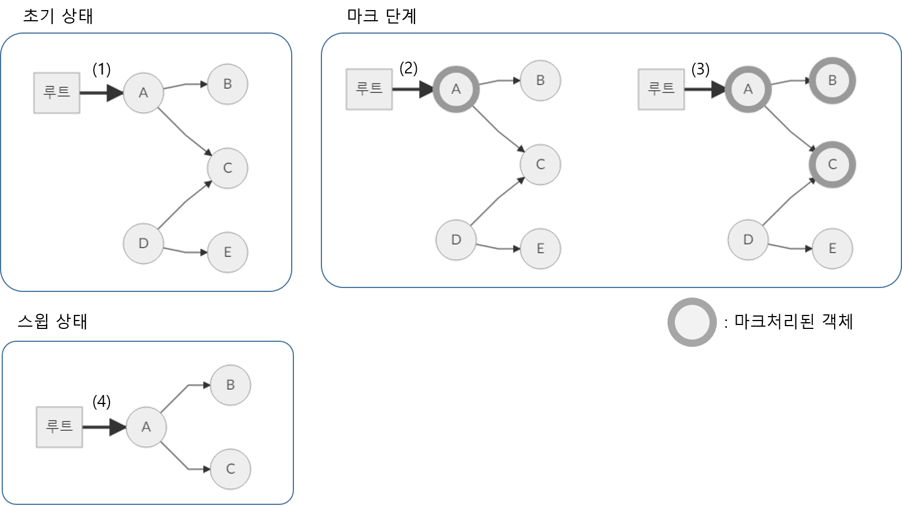

## 4-4 가비지 컬렉션

> 4-3절에서는 Streem의 객체 표현방방식을 개선하여 ‘NaN Boxing’을 채용하였다. 변경에 맞추어, 메모리 관리의 방방식도 새롭게 할 필요가 있다. 이 기회에 메모리 관리, 특히 GC(가비지 컬렉션)의 알고리즘에 대해 설명하고, Streem에서의 구현에 대해 고찰해 보자

Java와 Ruby와 같은 언어에서는, 프로그램 실행중에 객체를 많이 만든다. 컴퓨터 입장에서 보면, 객체는 데이터가 들어있는 메모리 영역에 지나지 않는다. 이것이 프로그램 언어의 시각에서 보면 객체가 되는 것이다.

같은 객체지향언어라도, C++과 같은 언어에서는, 이 객체가 점유하고 있는 메모리 영역을 사람이 수동으로 관리하고 있다. C와 같은 객체지향 이전의 언어에서도 수동으로 관리하고 있는 점과 동일하다.

C에서는 malloc()이라고 하는 함수를 사용해 메모리 영역을 직접 할당하고, C++에서는 new를 써서 객체를 힙 영역에 할당한다. 이 절차들은, OS에 어느정도 덩어리로서 메모리 영역의 분할을 요구하고, 이를 분할하여 돌려준다. 매번 OS로부터 직접 분할 받는것은 효율이 좋지 않기 때문이다. 

 이 절차에 따라 할당된 메모리 영역이 필요가 없게 되면,  free(C)라든가 delete(C++)을 사용하여, 그 영역이 더이상 필요없다는 것을 프로그래머가 시스템에 알려준다. 시스템은 일정 단위로 사용하지 않는 메모리 영역을 OS에 돌려주게 된다. 하지만,  이 ‘사용하지 않게 되었다’는 것이 여러가지 문제들의 원인이 되었다.

#### 메모리 영역을 자동으로 반환

이용중에 있는 메모리 영역을 갑자기 반환해 버리면, 반환된 영역은 다른 목적으로 재이용되어 버린다. 나중에 액세스를 해 보면,  해당 내용이 바뀌어 버릴 가능성이 있는 것이다. 이는 프로그램의 오동작을 일으키고, 비정상 종료까지 이어지기도 한다. 

거꾸로 ‘아직 사용중’ 이라고 생각되는 메모리 영역을 시스템에 반환하지 않는다고 하면, 또는 사용이 끝나도 반환하는 것을 잊어버렸다고 하면, 이것도 문제가 된다. 실제로는 액세스 되지 않는 영역이 계속 남아서, 메모리가 낭비되어 버린다. 그래서 결국에는 성능 저하와 비정상 종료를 일으키키도 한다.  원래 대량으로 할당된 작은 자원들을 사람이 하나하나 관리한다는 것은 상당히 고통스러운 작업이다. 

이 메모리 관리, 특히 메모리영역의 반환을 자동화하려는 것이 가비지 컬렉션(GC) 이다. GC는 실은 오래전부터 있었던 기술로, 1960년대부터 연구되어 논문으로도 많이 채택되었었다. 대학 연구실에서만 오래 사용되어졌지만, 일반 프로그래머가 사용하게 된 것은 1990년대의 Java의 등장으로 봐도 좋을 것이다. 그 이전에는, 아는 사람만 아는기술이었었다.

이 자동화라고 하는것이 범상치 않은 것이었다. 또한 GC라고 하는 기술이 일반화 되기 전, Java가 등장해 막 주목을 받게 될 때에는 부정적인 시각도 많았다. ‘GC를 신뢰할 수 없다’ 라든지 ‘할당된 메모리영역은 사람이 명시적으로 (마음을 담아) 반환해야 할 것이다.’ 라든지 ‘GC는 사람의 수작업 보다 더 느리기 때문에 채용하지 않겠다’ 등의 의견이 많았다.

하지만 시간이 지나고, Java의 보급에 맞추어, 이런 목소리도 점차 사그러들었다. GC의 기술도 발전하여, 사람이 직접 메모리관리를 하는 것보다 오류가 훨씬 적어졌고, 많은 경우에 성능도 나쁘지 않았다는 것을 증명했기 때문이라 생각된다. 

물론 디바이스 임베디드의 하드리얼타임 시스템 등, GC기술의 적용이 어려운 영역은 아직 남아 있다. 하지만, 이런 예외들을 제외하면, GC는 이제 없어서는 안될 기능이 되어 버렸다.

#### 트레이스(trace) 방식과 레퍼런스 카운트 방식

GC에는 2대 방식으로 트레이스 방식과 레퍼런스 카운트 방식이라는 게 있으며, 이 둘은 극과 극의 관계이다. 

트레이스 방식은, 루트(root)라 불리우는 곳부터 시작하여 재귀적으로 참조되어 있는 객체를 따라가는(트레이스 하는)방방식이다. 트레이스방식 중에는, 트레이스를 하면서 ‘살아 있는’ 객체에 마크를 하고, 마지막에 마크되지 않은(죽어있는) 객체를 회수하는 ‘마크 앤 스윕(mark and sweep)’ 방식과, 트레이스에 의해 판별된 ‘살아있는’ 객체를 다른 영역에 복사하고,  남겨진 객체들을 구 영역별로 모아서 삭제하는 ‘카피(Copy)’ 방식 등이 있다. 

트레이스 방식의 좋은 점은 루트부터 간접적으로 참조되고 있는 ‘살아있는’ 객체를 확실히 검출 가능하다는 점이다. 거꾸로 결점은, 객체가 많아지면, GC에 필요한 처리시간이 길어지는 점이다. 

#### 마크 앤 스윕 방식

‘마크 앤 스윕’ 방식은 초창기에 개발된 알고리즘이다. 원리는 상당히 간단하여, 루트부터 참조가능한 객체에 재귀적인 마크를 해 놓고, 나중에 마크가 되어 있지 않는 객체들을 가비지로서 회수한다. 

우선 프로그램의 실행에 맞추어 객체가 할당된다.(그림 1의 (1))  객체는 다른 객체를 참조할 때도 있다. 
GC가 시작되면 루트부터 참조 가능한 객체에 '마크' 처리가 된다. (그림 1의(2)). 마크는 객체 내부의 플래그로서 구현되는 경우가 많다. 여기서는 마크처리된 객체는 회색 테두리를 쳤다. 

마크처리된 객체로부터 참조되는 객체에도 마크 처리를 한다(그림 1의(3)). 이런 과정의 반복에 의해 루트로부터 간접적으로 참조가능한 모든 객체들이 마크처리가 된다. 여기까지를 '마크 단계' 라고 부른다. 마크 단계가 종료되는 시점에서 마크처리된 객체들은 '살아남게' 된다. 

모든 객체들을 순서대로 스캔하여 마크 처리가 되어 있지 않은 객체들은 회수를 한다(그림 1의 (4)). 이를 '스윕 상태' 라고 부른다. 다음번의 GC를 위해, 스캔하면서 살아남은 객체들에 처리되어 있는 마크를 모두 삭제한다. 

마크 앤 스윕 방식의 변형으로 스윕 대신에 '살아 있는' 객체를 채워가는 '마크 앤 컴팩트' 라고 하는 알고리즘도 있다. 

(그림 1)에 마크  앤 스윕 알고리즘의 개략을 나타내었다. 

    (그림 1) 마크 앤 스윕 알고리즘

마크 앤 스윕방식과 그 파생방식들에서는, 처리시간은 ‘살아있는 객체의 수’ 와 ‘모든 객체 수’의 합에 비례한다. 그 결과 대량의 오브젝트 할당되고, 그 중 일부만 살아남는 경우, 스윕이 대량으로 죽은 객체들을 스캔할 필요가 있기 때문에, 필요 이상 시간으 걸리는 결점이 있다. 

#### 카피(Copy) 방식

‘카피’ 방식은, 이런 결점을 보완하는 것을 목표로 만든 알고리즘이다. 

카피 방식은 루트부터 참조되고 있는 객체를 다른 공간에 카피해 놓는다. 그리고, 그 복사된 객체로부터 참조되고 있는 객체를 재귀적으로 카피하고 있다. 

    (그림 2)(1)은 GC개시 전의 메모리 상태이다. 이것은 (그림 1)(1)과 동일하다.

다음으로 현재 공간과는 별도 공간의 메모리 영역(새로운 영역) 을 준비한다. 그리고 루트로부터 참조가능한 객체를 새로운영역으로 복사 한다. (그림 2)(2)

복사된 객체로부터 참조되고 있는 객체도 고구마 뿌리처럼 새로운 영역으로 복사해 간다((그림 2)(3)). 복사가 종료되면, ‘살아있는’ 객체는 모두 새로운 영역으로 이동하고, ‘죽은’ 객체들은 이전 영역에 남아 있다. 

이때 이전 영역을 삭제하면, 죽은 객체가 점유하고 있던 영역이 한번에 정리가 된다((그림 2)(4)). 개별 객체의 스캔 작업은 필요없게 된다. 다음 수행시 GC에서는 이 새로운영역이 이전 영역이 된다. 

(그림 2)를 보면, 카피 방식은 마크앤 스윕의 스윕상태에 해당하는 부분이 없다는 것을 알 수 있다. 마크 앤 스윕 방식에 있어서, 대량으로 객체를 할당하고, 대부분이 바로 ‘죽어버린’ 상태로 되는 케이스 에서는 스윕 상태의 비용을 무시할 수 없게 된다. 카피 방식에서는, 이 비용이 들지 않는다. 하지만 마크를 붙이는 방식 보다, 객체를 카피하는 쪽이 비용이 더 높기 때문에, 거꾸로 ‘살아있는’ 객체의 비율이 많은 쪽에서는 조금 불리하게 된다. 

이 알고리즘의 또하나의 메리트에는 ‘국소성(局所性)’이 있다. 카피 방식에서는 참조되고 있는 객체로부터 순서대로 새로운 공간에 카피하기 때문에, 관계가 가까운 객체가 메모리공간적으로도 가깝게 배치될 가능성이 높아진다. 이를 국소성이라 부른다. 국소성이 높은 경우, 메모리 캐시등이 효과적으로 동작을 하기가 쉬워진다. 프로그램의 실행성능이 향상을 기대할 수 있다. 

카피 방식의 결점은, 메모리 효율이 나쁘다는 것이다. 카피중 일시적이라고는 해도,이전, 신규 두개의 같은 사이즈 영역을 준비해야 할 필요가 있으며, 최대 메모리소비량의 절반박에 활용을 못한다. 이 메모리 공간의 낭비를 줄이기 위해, 영역을 보다 잘게 분할하는 카피 방식의 파생방식도 존재한다. 

#### GC의 성능 지표

트레이스 방식의 기본적인 알고리즘은 크게 나눠 앞서 기술한 마크 앤 스윕, 카피 방식 그리고 그 파생방식이다. 

GC는 프로그램의 처리의 본질과는 무관하기 때문에, 이를 위해 소비된 시간이 짧으면 짧을수록 좋다. 하지만 위에서 기술한 기본적인 알고리즘은 성능이라는 점에서는 과제가 조금 남아 있다. 

GC의 성능에는 2가지 지표로 측정되는데, 하나는 ‘GC실행시간’ 그리고 또 하나는 ‘정지시간’ 이다. 

GC실행시간은, GC처리 그 자체의 성능이다. 결국 애플리케이션의 실행시간 전체 중에, GC에 의해 소비되는 시간을 GC실행시간이라고 정의한다. 

한편 정지시간은 애플리케이션의 처리가 중단되고 GC가 실행될 때, 처리가 중단되는 시간을 말한다. 특히 최악의 상황에서의 정지시간(최대 정지시간)은 중요한 지표가 된다. 

정지시간이 중요한 이유는, 이 시간이 길어지면, 애플리케이션의 응답성에 문제가 발생하기 때문이다. 예를들어, Web서비스에서 1000명이 액세스를 한다고 가정하면, 999명이 접속시에는 100밀리초에 결과가 보여지지만, 운이 나쁜 1명은, GC때문에 결과를 보는데 10분정도 걸리는 상황은 그렇게 바람직 하지 못하다.  만일 로봇을 제어하는 소프트웨어에서, 로봇이 걸어가는 도중에 갑자기 GC작업이 걸려 1초동안 정지가 된다면, 로봇은 가다가 쓰러질 것이다. 

#### 보조적 GC 기법

여기서 GC의 성능을 개선하기 위해, 기본 알고리즘에 조합하여 사용하는 타입의 기법들이 몇가지 알려져 있다. 이번에는,  그 중 대표적인 ‘세대별GC(Generational GC)’와 ‘인크리멘탈 GC’에 대하여 설명하겠다.  

#### 세대별 GC

세대별 GC는 프로그래미 실행중에 GC를 위해 소비되는 시간을 단축하는것을 목표로 하는 기법이다.

세대별 GC의 기본 아이디어는, 일반적인 프로그램에서는 ‘객체의 대부분을 짧은 시간에 가비지화 시키고 어느정도 긴 시간 살아남은 객체는 보다 긴 수명을 유지함’ 이다. 수명이 긴 것이 아무래도 살아남기 쉽고, 짧은 것이 보다 빨리 필요 없게 된다고 가정하면, 할당된 후부터 시간이 얼마 지나지 않은 ‘젋은’ 객체를 중점적으로 스캔을 한다.  

이렇게 하면 모든 객체들을 스캔할 필요 없이 많은 가비지를 회수할 수 있다는 예상이 가능하다.

세대별 GC에서는 막 생성된 젋은 ‘신세대’와, 계속 살아남아 있는 ‘구세대’ 로 객체를 분류한다. 구현에 따라서는 복수의 세대로도 분류하는 경우도 있다.

바로 ‘죽어 버릴’ 가능성이 높은 신세대 객체만을 스캔후 회수하는 것을 마이너 GC라고 부른다. 마이너GC의 구체적인 회수 순서는 아래와 같다. 

먼저, 루트부터 통상 스캔을 시작하여, ‘살아 있는’ 객체를 찾는다. 이 알고리즘은 마크 앤 스윕 방식이든, 카피 방식이던 상관없지만, 많은 세대별 GC의 구현에서는 카피 방식을 채용하고 있다. 주목할 점은, 스캔 도중에 구세대 영역에 속하는 객체가 등장하면,  거기는 스캔을 하지 않는 다는 점이다. 이로 부터, 스캔하는 객체의 수개 대폭 줄어든다. 

살아남은 객체는 구세대에 소속된다. 구체적으로는, 카피 방식의 경우는 카피될 곳을 구세대를 위한 영역으로 만들고, 마크 앤 스윕 방식에서는 객체에 어떤 플래그를 붙이는 형태가 될 것이다. 

#### 구세대로의 참조를 기록

이 때 문제가 되는 것은, 구세대 영역으로 부터 신세대 영역으로의 참조이다. 신세대 영역밖에 스캔을 하지 않는다면, 그대로 구세대로부터 신세대 영역으로의 참조는 체크되지 않는다. 이때문에 구세대 영역으로 밖에 참조하지 않는 젋은 객체는 잘못하여 ‘죽어버리는’ 경우가 발생해 버린다.  여기서 세대별 GC에서는, 객체의 갱신을 감시한다. 구세대 영역으로 부터 신세대 영역으로의 참조가 발생하면, 리멤버드 셋(remembered set)이라고 하는 테이블에 등록한다 마이너GC에서는 이 리멤버드 셋도 루트에 포함한다. 

세대별 GC가 올바로 동작하기 위해서는  리멤버드 셋의 내용을 항상 최신으로 갱신해둘 필요가 있다. 여기서 구세대영역으로부터 신세대 영역으로의 참조가 발생한 순간에, 그 참조를 기록하는 루틴을, 객체를 갱신하는 모든 장소에 채워 넣는다. 이 참조를 기록하는 루틴을 라이트 배리어(write barrier)라고 부른다. 

구세대 영역에 속하는 객체는 일반적으로 수명이 길지만, 반드시 ‘죽지않는’ 것은 아니다. 프로그램의 실행에 따라, 구세대영역에 속해있는 ‘죽어있는’ 객체도 증가하게 된다. 이 죽어있는 구세대 객체가 메모리를 쓸데없이 점유하고 있는 상황을 회피하기 위해, 가끔 구세대영역도 포함하여 모든 영역을 스캔하는 GC를 수행한다. 이 모든 영역을 스캔하는 GC를 풀 GC, 또는 메이저 GC라 부른다. 

세대별 GC는 GC를 위해 스캔하는 객체의 수를 감소시키고, GC실행시간을 단축하는 효과가 있다.  하지만, 메이저GC가 있기 때문에, 최대정지시간은 개선되지 않는다.

#### 인크리멘탈 GC

방금 로봇의 예에서도 알 수 있듯이, 리얼타임 성격이 강한 프로그램에서는 GC의 성능보다 최대정지시간이 짧아지는 것을 더 중시한다. 

이러한 리얼타임의 특성이 강한 프로그램에서는 GC에 의한 중단시간이 예측가능해야 할 필요가 있다. 예를 들어, 최악의 경우에도 10㎳이내에 완료한다 등의 조건이 붙어야 한다는 것이다. 

보통의 GC알고리즘에서는 이러한 내용의 개런티가 불가능하다. GC에 의한 정지시간은 객체의 수와 상태에 의존하기 때문이다. 여기서 리얼타임의 특성을 유지하는데는 GC가 완전히 끝나기를 기다리지 않고, 처리를 세분화하여 조금씩 실행시키도록 한다. 이를 인크리멘탈GC라고 부른다.

인크리멘탈 GC에서는, GC처리가 조금씩 진행되기 때문에, 처리 도중 프로그램 본체의 실행이 진행되며, 참조가 바뀌어 버린다. 이미 스캔이 끝나, 마크가 종료된 객체가 수정되어, 새로운 객체를 참조하게 되어버릴 경우, 이 새로운 객체는 마크의 대상에서 제외되어, 다시 ‘살아있는’ 상태지만 회수가 되어 버린다. 

이런 문제를 피하기 위해 세대별 GC와 동일한 라이트 배리어를 사용한다. 이미 마크된 객체로부터 참조가 바뀐 경우, 라이트배리어에 따라 새롭게 참조되게 된 객체가, 스캔의 시작점이 되도록 등록된다. 

인크리멘탈 GC는, 처리를 세분화하여 실행하기 때문에, 중단시간을 일정시간 이내로 좁히는 동작을 한다. 한편, 처리중단을 위한 비용이 필요하기 때문에, GC에 들어가는 시간의 총합은 커지는 경향이 있다 이는 트레이드오프 관계이다. 

#### 레퍼런스 카운트 방식

트레이스 법에서 GC의 또하나의 분류인 레퍼런스 카운트 법은 각 객체에 자신에 대한 레퍼런스 카운트(피참조수)를 기록해 놓는 것이다. 참조가 증감할 때마다 그 수를 변경한다(그림 3)

(그림 3)레퍼런스 카운트 방식

피참조수를 증감 시키는 타이밍은, 변수로의 대입과, 객체 내용의 갱신, 함수의 종료(로컬변수로부터 참조가 없어지는) 등이다. 그래서, 피참조수가 0이 된 객체는 어디서도 이를 참조 하지 않는 것이 분명하기 떄문에, 그 메모리 영역을 회수한다. 

레퍼런스카운트 방법의 최대 메리트는, 객체의 회수를 국소적으로 판단 가능하다는데 있다. 루트에서 모든 객체들을 따라 가지 않으면, 객체의 생사를 알 수 없는 트레이스 법과는 달라서, 참조가 없어져 버린 순간 객체의 사망을 판단할 수 있다. 또한, 개별 객체 단위로 회수를 하기 때문에, 다른 알고리즘과 비교하여, GC를 위한 정지시간이 짧은(경우가 많다)것도 메리트다.

한편 결점도 있다. 레퍼런스카운트의 최대 결점은, 순환참조를 가지는 객체는 회수가 불가능하다는 점이다. 상호 참조하고 있는 객체는 그 그룹 전체가 다른 외부에서의 참조가 없어져 가비지가 되어 버려도 피참조수가 0이 되지 않는다. 결과적으로 이들 객체는 영원히 회수되지 않는다. 

다른 결점으로, 참조의 증감시에 정확히 레퍼런스 카운트도 맞추어 증감시킬 필요가 있어, 이를 한번 놓쳐버리면, 원인을 찾기 어려운 메모리 트러블이 발생할 수 있다는 것이다.

마지막으로, 레퍼런스카운트의 관리는 병렬처리와 궁합이 좋지 않다. 동시에 복수의 쓰레드가 레퍼런스 카운트를 증감시키면, 레퍼런스카운트의 값의 부정합이 발생하는(결과적으로 메모리 트러블의 원인이 되는) 가능성이 있다. 

이를 회피하기 위한 레퍼런스카운트는 배타 조작이 필요하지만, 빈번히 발생하는 참조의 조작때마다 락을 거는 비용도 무시할 수는 없다.

#### Streem에서의 GC

지금까지 Streem은 Bohem GC라고 하는 C와 C++프로그램에서의 자동 GC를 추가하는 편리한 라이브러리를 이용해 왔다. 이것은 일반적으로 malloc과 new로 할당된 객체(메모리영역)을, 프로그래머가 하나하나 free/delete를 하지 않아도, 사용하지 않게 된 것을 자동적으로 검출하여, 스스로 회수해 주는 훌륭한 것이다. 하지만, Bohem GC에서는,  포인터를 변경하지 않으면 안된다는 제한이 있어, 4-3절에서 도입한 NaN Boxing과는 양립할 수가 없다. 

여기서 Bohem GC를 포기하고 독자적으로 GC를 구현할 필요가 생겼다. 독자적으로 구현한다면, GC의 구현에 큰 영향을 주는 Streem의 특징을 살리고 싶은 부분이 있다.

하나의 특징은 범용언어와는 다른, Streem에서는 이벤트루프 개시후에는 실행이 태스크단위로 독립된다는 점이다. 태스크의 실행중에 생성된 데이터는, 명시적으로 emit된 것(과 거기에서부터 재귀적으로 참조되어 있는 것) 이외는 다른 태스크로부터 참조된 것은 없다. 이로부터, emit로 다른 태스크에 ‘수출’된 데이터조차 마크를 한다면, 태스크 종료시에 이때까지 만들었던 데이터가 한순간에 삭제되어, 태스크단위로 GC가 가능하게 된다. 결국 세대별 GC와 동일하게, 모든 객체를 스캔하지 않아도 되며, GC의 실행시간 단축을 할 수 있게 된다. 

#### 구(舊) 에서 신(新)으로의 참조가 없다.

또 하나의 특징은 Streem의 대부분 데이터 구조가 갱신불가능이라는 점이다. 데이터 구조가 변경 불가능이 되면, GC측면에서는 다행인 부분들이 몇가지 있다.

우선 객체가 갱신불가능하기 때문에 그 객체로부터 참조된 것은 객체가 생성시에 이미 존재하고 있어야 한다. 다시말하면, 옛 객체는 새로운 객체를 참조할 수 없기 때문에, 순환참조가 발생하지 않는다. 이미 설명한 것과 같이 순환참조에 대응할 수 없는 것이 레퍼런스카운트 방식의 결점인데, 갱신 불가능 객체는 이 결점을 극복할 수 있다. 

또한, 옛 객체가 새로운 객체를 참조하지 않게 된다면, 세대별 GC를 구현하는 경우에도 라이트 배리어가 필요 없게 된다. 

더우기, 카피 방식을 구현하는 경우에도 메리트가 있다. 객체가 갱신가능할 때, 객체와 그 카피본은 엄밀히 구별된다. 어떤 객체를 갱신해도, 카피본은 갱신되지 않기 때문이다. 하지만 갱신이 금지되는 경우에는(명시적으로 포인터 값등으로 구별되지 않는 한) 오리지널과 카피본의 구별이 필요없다. 보통 카피 방식의 GC엣는 모든 참조를 카피한 새로운 객체를 가리키고 있기 때문에 갱신을 할 필요가 있다. 하지만, 객체가 갱신 불가인 경우에는, 기존 레퍼런스는 수정되지 않고, 카피본을 만드는 것만으로 카피 방식을 구현 가능하다(카피본 수가 많지 않다는 전제 하에서)

#### GC의 구현

이렇게 말은 해도, 한번에 복잡한 것을 만들려 하면 실패 가능성이 높기 때문에, 이번에는 아래와 같은 전략으로 구현을 한다.

Streem의 실행은 기본적으로 태스크단위로 잘게 잘라 수행된다. 이 하나의 태스크 실행시에 GC를 수행한다.

태스크를 실행중에 태스크로부터 태스크로 데이터가 전달될 때(결국 emit될 때), 전달 받은 데이터는 이 태스크의 바깥으로부터 참조 가능하게 되므로, 이 데이터에 ‘살아 있다’는 마크를 붙인다.  데이터가 배열로 다른 객체를 참조 하고 있다면, 여기에도(재귀적으로) 마크를 붙인다. 그 후 전역변수로부터 참조되는 데이터에도 (재귀적으로) 마크를 붙인다.

Streem에서는 전역변수도 수정불가이기 때문에, 한번 참조된 객체는 프로그램이 종료될 때 까지 ‘계속 살아있는’ 상태가 된다. 

하나의 태스크의 실행이 종료되면, 그 태스크 실행중에 할당된 데이터중 ‘살아있는’ 마크가 붙어있지 않은 것을 한번에 삭제 한다. 다음 태스크를 시작하기 전에 ‘살아있는’ 마크는 클리어 해 둔다. 

#### GC 구현의 미래

자, 이번에 구현한 GC기능은 기본적인 것이어서, 아직 개선의 여지가 있다. 여기서는 이후 개선에 대한 구상에 대해 설명하겠다.

Streem의 각 태스크는 별도 쓰레드로 동작을 하고 있지만, 여러개 쓰레드로부터 하나의 데이터 구조에 액세스하는 경우에는 락이 필요하게 되는 등, 문제가 발생할 여지가 있어, 실행성능적으로도 패널티가 있다. 여기서 쓰레드별로 미리 일정 메모리 영역을 할당 받아두고, 데이터 할당은 이 메모리 영역을 사용하게 한다. 이 영역은 다른 쓰레드로부터 액세스가 될 수 없기 때문에 별도 배타제어는 필요없게 된다. 

또한, emit로 데이터를 전달한 태스크가 별도 쓰레드로 동작하고 있을 때에는, 데이터를 재귀적으로 그 쓰레드의 메모리 영역에 카피 한다. 이미 설명한 바와 같이, Streem과 같은 데이터 갱신 불능이어서 공간이동하는 객체가 한정적인 경우에는, 간단히 카피 방식이 구현 가능하다.

결과적으로, 이 GC의 구현은 마크 앤 스윕 방법을 조합한 것이다. 

또한 태스크 처리 종료 마다 처리중에 생성된 데이터에 대해 GC를 수행하는 것은 세대별 GC의 일종인 것으로도 생각할 수 있겠다. 

또, 구상중이지만, Streem의 언어사양의 특질을 이용하면, 종래 범용언어보다 효율적인 GC가 구현가능할 것 같다. 계속하여 연구를 하고 싶은 부분이다.

#### 마치며

GC의 이론과 구현의 상세에 대해서는 ‘가비지 컬렉션의 알고리즘과 구현(秀和システム(Shuwa System))’ 과 ‘The Garbage Collection Handbook(양서, Chapman & Hall)’ 등의 서적을 참조하기 바란다. 새로운 세계가 여러분에게 열릴 지도 모른다.

Streem의 언어사양이 GC에 주는 영향은 상당히 흥미로운 포인트이다. 원래는 병렬실행만 생각해서, GC에 대한것은 전혀 고려하지 않고 설계를 한 것 언어사양이지만, 생각치도 못한 부분에 영향이 나타난 것이다. 

### 타임머신 칼럼

***가비지 컬렉션은 언어의 특징에 영향을 받는다***

> 2016년 2월 게재분이다. 이번회의 테마는 가비지 컬렉션이다. 전반부는 가비지컬렉션이라고 하는 기술 자체에 대한 해설이어서 페이지 분량에 비해 많은 설명이 되어 있다. 변함없이 자화자찬 일색이다. 
>
> 하지만  참회하지 않으면 안되는 것도 있다.후반부의 ‘Streem에서의 GC’부분에서는, Streem의 언어사양이  가비지 컬렉션에 어떻게 영향을 주는지 고찰하고, 그 메리트를 살리는 가비지 컬렉션의 구현에 대하여 설명을 하고 있다.  고찰자체에는 틀린 부분이 없지만, 이 Streem전용 가비지컬렉션은 실제로는 구현되어 있지 않다. 
>
> 4-3절의 타임머신 칼럼에서도 이야기했지만, 이번회도 의지 부족 및  시간부족이었다.  실제 구현의 해설 보다는, 언어의 특질이 가비지컬렉션과 같은 기능의 구현에 어떻게 영향을 주는가를 고찰했는지 그 사고과정을 참고해 주었으면 좋겠다.
>
> Streem의 가비지 컬렉션은 뭔가 하지 않으면 안되는 상태이지만, 이  칼럼을 집필하고 있는 시점에서도 아직  손을 못대고 있다. 여러분이, 이 책을 읽을때 까지는 구현이 되어 있으면 좋으련만...

