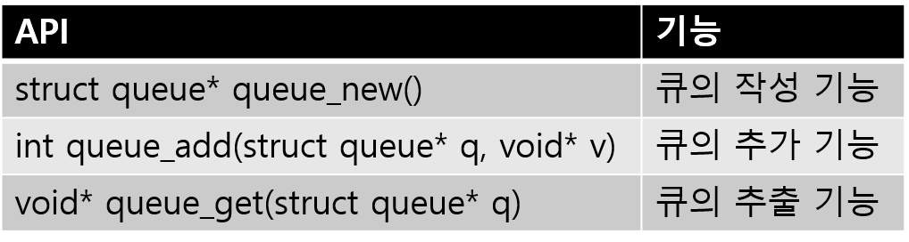

## 4-5 락 프리 알고리즘

> 컨커런트 프로그래밍에  있어서  예상하지 못했던 결과를 내는 것을 막기 위해, 배타처리는 상당히 중요하다. 하지만, 락을 하는 것으로 실행성능은 떨어지는 결점이 있다. 성능에 영향을 주는 락을 하지 않은 데이터 구조와 알고리즘을 ‘락 프리’ 라고 부른다. 이번에는 락프리라는 것은 무엇인지를 시작으로 그 구현까지  설명하도록 하겠다.

우선 컨커런트 실행환경에 있어, 의도대로 동작을 하는 것(쓰레드 세이프)의 중요성에 대해 해설을 하겠다.

예를 들어, (그림 1)과 같은 간단한 큐의 구현을 과제로 하겠다. 구조는 간단하다. struct queue라고 하는 데이터 구조는 head와 tail이라고 하는 2개의 링크를 가지고 데이터의 추가는 tail에서, 추출은 head에서 수행되는,  먼저 들어간 것이 먼저 나오는(FIFO) 큐를 구현하고 있다. 

```
#include <stdio.h>
#include <stdlib.h>
struct queue_node {
  void* v;
  struct queue_node* next;
};

struct queue {
  struct queue_node* head;
  struct queue_node* tail;
  //a
};

struct queue*
queue_new()
{
  struct queue* q;

  q = (struct queue*)malloc(sizeof(struct queue));

  if (q == NULL) {
    return NULL;
  }
  /* Sentinel node */
  q->head = (struct queue_node*)malloc(sizeof(struct queue_node));
  q->tail = q->head;
  q->head->next = NULL;
  //b
  return q;
}

int
queue_add(struct queue* q, void* v)
{
  struct queue_node *n;
  struct queue_node *node = (struct queue_node*)malloc(sizeof(struct queue_node));

  node->v = v; 
  node->next = NULL;
  //c
 q->tail->next = node; ←(1)
 q->tail = node; ←(2)
  //c
  return 1;
}

void*
queue_get(struct queue* q)
{
  struct queue_node *n;
  void *val;

  n = q->head;
  if (n->next == NULL) {
    return NULL;
  }
  //c
  q->head = n->next;
  val = (void*)n->next->v;
  //c
  free(n);
  return val;
}
```

<center>
    (그림 1) 큐의 구현 (버전 1)
</center>


제공하는 API는 (표 1)에 나와있는 3개로서 이는 앞으로 해설할 버전들에서도 바뀌지는 않는다.



<center>
    (표 1)큐의 API
</center>


#### 컨커런트 실행의 함정

 이렇게 구현한 간단한 큐를 복수의 쓰레드를 사용하는 컨커런트 환경에서 실행하면 생각치도 못한 문제가 발생한다.

컨커런트에서 실행이 이루어지면, 동일한 데이터 구조에 동시 참조 및 갱신이 실행될 가능성이 있다.  그렇게 되면 데이터 구조가 깨지거나, 데이터 손실이 발생할 가능성이 있다. 예를 들어, 아래와 같은 시나리오다. (그림 1)의 프로그램을 보면서 생각해 보자. 

1. 쓰레드 A와 쓰레드B가 동시에 큐를 쓴다.
2. 쓰레드 A가 큐 끝의(q->tail) 노드의 next에 새로운 노드를 링크하고, q->tail을 새로운 노드를 가리키도록 수정한다(그림 1의 (1)과 (2)의 부분)
3. 이 타이밍에 쓰레드 B도 동시에 노드를 추가하려고 하면, 운이 나쁘면 쓰레드 A가 수정한 q->tail->next를 쓰레드 B가 위에 덮어 쓴다.
4. 그 후, 쓰레드A, B의 순서로 q->tail의 수정이 일어나면, A가 추가한 노드는 잃어버리게 된다. 쓰레드B, A의 순서라면, 링크의 부정합이 발생하여, head부터 tail로의 링크가 잘려, 그 이후 큐에 추가한 요소는 추출하는것이 불가능해진다. 

이는 하나의 예 이지만, 그 외의 것도 여러가지 문제가 발생할 가능성이 있다. 하지만 미묘한 타이밍에 의존하여 발생하는 문제이기 때문에, 100회 테스트하여 1회 오류가 발생할 정도로 검출하기 어려운 디버깅이 되기가 쉽다. 

이와 같은 버그를 프로그래머들이 양자역학의 불확정성원리의 제창자인 하이젠베르그에 빗대어 ‘하이젠버그[^1]’ 라고 부르고 있다. 메모리버그와 쌍벽을 이루는, 원인을 발견하기 정말 어려운  버그이다. 


#### 배타 제어의 도입

이러한 문제를 회피하기 위한 가장 간단한 방법은 락의 도입이다. POSIX에서 정의되고 있는 pthread라이브러리에는, 배타제어를 위한 락인 

```
pthread_mutext_t
```

라고 하는 데이터 타입이 정의되어 있다. ‘mutex와 상호배타(mutual exclusive)’의 약어이다. 이 mutex를 사용하면, 큐의 조작을 배타제어가 가능하다 수정은 간단하다.

우선 struct queue구조체에 pthread_mutex_t의 멤버 lock을 추가한다.(그림 1 //a의 위치) 큐를 초기화 하는 queue_new()함수에서는 

```
pthread_mutex_init(&lock, NULL);
```

라고 하는 락의 초기화처리를 추가한다(그림 1 //b의 위치)

quue_add()와 queue_get()의 함수 중, 참조와 갱신을 배타적으로 실행할 필요가 있는 부분을

```
pthread_mutex_lock(&lock)
pthread_mutex_unlock(&lock)
```

로 둘러싼다. (그림 1 //c의 위치). 도중에 return등으로 빠져나오는 경우에도 언락(Unlock)을 잊어버리지 않도록 한다. 

그 외의 부분은 (그림 1)의 프로그램과 공통부분이기 때문에 프로그램 전체 게재는 하지 않겠다.

이와 같이 일관성 유지를 위해, 동시에 액세스되는 것을 피해야 하는 영역을 mutex로 보호하는 것으로, 데이터 구조를 쓰레드 세이프화 하는게 가능하다. 일단 락을 걸면, 다른 쓰레드가 같은 영역을 실행하기 위해 락을 걸려 할 시점에서 실행이 정지되고, 언락을 기다리게 된다.  따라서 락과 언락으로 둘러싸인 영역에는 실행 가능한 쓰레드는 한번에 하나뿐이고, 동시실행의 문제는 발생하지 않게 된다. 


#### 락의 문제

mutex락을 사용한 배타제어는 원 프로그램에 대해 큰 변경없이 쓰레드 대응이 가능하다는 이점이 있다.

하지만, 어떤 쓰레드가 락을 거는 사이, 다른 쓰레드는 락을 해제하는 것을 기다릴 수 밖에 없다[^2]  멀티쓰레드 프로그래밍을 사용하는 컨커런트 실행의 목적은, 가능한 병렬로 동작하여 성능을 올리려는 것이기 때문에, 대기에 의한 정지는 그렇게 바람직하지는 않을 것이다. 특히 빈번히 액세스되는 데이터 구조에서는 배타제어의 대기에 의한 손실이 우려된다.

여기서 대기가 없도록(wait free) 락이 없는 컨커런트 실행이 가능한 구조가 락 프리 이다. 


#### 락 프리란

락 프리(lock free)라는 것은, 문자그대로 락을 사용하지 않는 것을 의미한다. 배타제어를 위한 락을 사용하지 않고, 복수의 쓰레드로부터 액세스를 모순 없이 처리 가능할까 라고 의문을 품는 사람도 있을 지도 모르겠다.

락 프리한 데이터 구조는 ‘아토믹(Atomic)’ 조작이라고 하는 마법에 의해 컨커런트 실행을 구현한다. 아토믹은 원자력이라고 하는 의미가 아니다. ‘아톰’에 ‘더 이상 나눌수 없는 것’ 이라는 의미가 있기 때문에, 처리중에 인터럽트 등에 의해 중간에 끊어지는 처리상태가 관측되지 않은 것을 개런티한다는 것을 아토믹(Atomic)이라고 한다. 

아토믹한 처리는, 도중에 끊어지는 일 없이, 처리 전체가 성공인지, 전제조건이 성립되지 못해 실패인지 둘 중 하나이다. 그렇다고 해도, 컨커런트 처리에 익숙하지 않는 사람(나도 이에 익숙하지 못하다)에게는 이런것도 보증되고 있지  못하고 있는 것에 놀라울 따름이다.

컴퓨터에 있어서 분할불가능한 조작이라고 하는 것은 의외로 많지 않다. CPU에서 하나의 명령은 아토믹으로 실행될 것 같지만, 실은 최근 CPU에서는 기계어의 하나의 명령도 내부적으로는 복수의 ‘μ op’ 라고 하는 작은 명령군으로 분할되어, 대부분은 최적화 된 후에 실행된다. 결국 하나의 기계어명령도, 엄밀히 말하면, 아토믹이라 할 수는 없다. 이는, 보통의 방법에서는 어떻게 하더라도 아토믹한 조작은 불가능한 이유이다.


#### CPU가 아토믹 명령을 갖춘다. 

하지만, 아토믹은 컨커런트 환경에 있어 상당히 중요하다. 쓰레드조작 라이브러리 등에서도(예를 들어 mutex구현에) 반드시 아토믹한 조작이 사용되고 있다. 이를 위해 현대의 대부분 CPU는, 아토믹인 것을 개런티하는 명령을 갖추어 놓고 있다. 이와 같은 명령의 대표격이 compare and swap(CAS)라고 하는 것이다. 

CAS는 3개의 인수를 취한다.

```
CAS(a,b,c)
```

a는 주소, b와 c는 정수값이다. 이는 ‘a주소가 b일 경우에는 c로 치환하고 참을 돌려준다. 그렇지 않으면 거짓을 돌려준다’ 라고 하는 동작을 한다. 결국, CAS를 사용하면, 어떤 주소의 데이터를 읽어들인 후, 그 값을 가공하여, 새로운 값으로 돌려줄 때 까지, 그 주소는 다른 쓰레드에 의해 갱신되지 못하는것을 확인 가능하다.

원래는 C언어에는 이와 같은 명령이 없지만, 최근 GCC(ver 4.1이후)에는, 확장명령으로서

```
__sync_bool_compare_and_swap()
```

라고 하는 명령이 추가되어서, CAS를 사용하는게 가능하다.

그리고, 이 CAS명령의 사용으로 락프리데이터 구조를 구축하는게 가능하다.


#### 락 프리 큐

이 CAS명령을 사용한 락 프르 데이터 구조의 구현을 보기위해 (그림 1)의 프로그램과 API호환이 되는 락 프리 큐의 구현을 (그림 2)에서 보여준다.

```
#include <stdio.h>
#include <stdlib.h>

struct queue_node {
  void* v;
  struct queue_node* next;
};

struct queue {
  struct queue_node* head;
  struct queue_node* tail;
};

struct queue*
queue_new()
{
  struct queue* q;

  q = (struct queue*)malloc(sizeof(struct queue));
  if (q == NULL) {
    return NULL;
  }
  /* Sentinel node */
  q->head = (struct queue_node*)malloc(sizeof(struct queue_node));
  q->tail = q->head;
  q->head->next = NULL;
  return q;
}

int
queue_add(struct queue* q, void* v)
{
  struct queue_node *n;
  struct queue_node *node = (struct queue_node*)malloc(sizeof(struct queue_node));

  node->v = v; 
  node->next = NULL;
  while (1) {
    /* tail을 갱신한다 */
    n = q->tail;
    /* tail->next는NULL일 가능성이 있다。그렇다면node를 추가하여 다음으로.. */
    if (__sync_bool_compare_and_swap(&(n->next), NULL, node)) {
      break;
    }
    /* 실패（다른 쓰레드가 갱신해버림)했기 때문에 q->tail의 수정을 테스트해 본다  */
    else {
      __sync_bool_compare_and_swap(&(q->tail), n, n->next);
    }
  }
  /* q->tail을 갱신한다 */
  __sync_bool_compare_and_swap(&(q->tail), n, node);
  return 1;
}

void*
queue_get(struct queue* q)
{
  struct queue_node *n;
  void *val;

  while (1) {
    /* q->head->next를 추출한다 */
    n = q->head;
    /* 큐가 비어있으면 NULL을 돌려준다 */
    if (n->next == NULL) {
      return NULL;
    }
    /* q->head의 갱신 */
    if (__sync_bool_compare_and_swap(&(q->head), n, n->next)) {
      break;
    }
  }
  /* 값을 추출 */
  val = (void *) n->next->v;
  /* 사용하지 않게 된 노드의 반환 */
  free(n);
  return val;
}  
```

<center>
    (그림 2) 큐의 구현(버전 3). 락 프리 구조를 활용한 예.
</center>


(그림 2) 프로그램을 보면 흥미로운 점이 몇가지 있다. 하나는 구조체의 정의가 (그림 1)과 (그림 2)에서 완전히 다르다는 점이다. 락 프리 큐에서는, pthread_mutex와 같은 락을 추가할 필요가 없다. 

또 하나는 구조체 멤버의 갱신에 CAS를 사용하고 있다는 점이다. 이미 설명한 바와 같이 CAS에서는 갱신해야 할 주소의 ‘현재 있어야 할 값’ 과 ‘새로운 값’을 지정한다. 혹시 ‘현재 있어야 할 값’ 과 실제 주소의 내용이 다른 경우가 있다면, 그것은 다른 쓰레드가 값을 바꾸어 버려서이기 때문에, 갱신을 다시 시도하게 된다. 

실제로 queue_add()와 queue_get()의 정의를 비교해 보자. (그림 1)의 프로그램에서는 (도중에 다른 쓰레드에 의한 갱신을 고려하지 않기 때문에), 단순하게 대입에 따라 갱신을 한다. 한편 (그림 2)의 프로그램에서는, CAS에 따라 갱신이 성공할때까지 반복하는 루프 형태로 수행한다.


##### 처리 순서의 보증

5-2절에서는, ‘순서는 그렇게 중요하지 않기 때문에 전체로 하나의 큐를 준비하고, 거기에 데이터를 처리하는 태스크를 집어 넣는다’ 라고 해설을 하였었다.

하지만, 실제로 그와 같은 구조를 만들어 동작을 시켜보니, 상당히 간단한 케이스에서는 정상적으로 동작했지만, 어느정도 복잡하게 되면, 기대결과와 다른 동작이 눈에 띄게 되었다. 

하나는 암묵적인 순서를 기대한 처리가 생각보다 많았다는 점이다. 예를 들어, 한동안 앞에서 설명했던 CSV(comma separated value)의 처리인데, ‘최초행에 문자열 필드만 있는 경우 이 필드는 필드명으로 본다’ 라는 기능을 가지고 있다. 하지만, 여기에서 순서가 보증된다는 의미는, ‘최초행’이 올바르게 주어진 경우에 한한다. 그 이후의 행에서는 순서가 그렇게 문제를 일으키지는 않을 것이다.

또 필드 입출력에 있어서도, 많은 경우, 행의 순서가 변하지 않는다는 암묵적인 기대를 하고 있다. 예를 들어, 읽어들인 문자열을 대문자로 바꾸는 필터를 Streem에 기술한다고 하면, 읽어들인 파일의 행이 전후가 바뀌는 것은 그렇게 바람직하지는 않을 것이다.

여기서 순서를 보증하기 위해, 큐 사용 방법을 변경해 보았다. 구체적으로는 순서가 보존되는 데이터 큐를 스트림별로 할당하고, 태스크의 실행을 예약하는 스트림을 유지하는 큐를 전역으로 준비하였다.

emit를 하면, 데이터와 이를 처리하는 함수를 스트림별로 큐에, 실행대기를 하고 있는 스트림을 전역 큐에 추가한다(그림 3)

정리하면, strm_emit()는, 아래와 같은 순서로 데이터를 다음 스트림에 대해 emit한다.

1. 다음 스트림의 큐에 태스크(함수, 데이터 모음)을 추가한다.
2. 다음 스트림을 전역 큐에 추가하고, 태스크 실행을 예약한다.
3. func이 지정된 경우, 자기 스트림 큐에 태스크를 추가하고, 우선도가 낮은 큐에 스트림 추가하고 태스크 실행을 예약한다. 

```
void
strm_emit(strm_stream* strm, strm_value data, strm_callback func)
{
  /* data가 nil이 아닌 경우 queue에 추가*/
  if (!strm_nil_p(data)) {
    /* dst: 하위 스트림*/
    strm_stream* dst = strm->dst;
    /* 하위 스트림의 큐에 함수와 데이터를 유지하는 strm_task를 추가*/
    strm_queue_add(dst->queue, strm_task_new(dst->start_func, data));
    /* 하위 스트림에서의 태스크 실행을 예약하기 위한 큐에 추가 */
    strm_queue_add(queue, dst);
  }
  /* func이 지정되면 이것도 큐에 추가 */
  if (func) {
    /* data에 의미는 없기 때문에 nil 지정*/
    strm_queue_add(strm->queue, strm_task_new(func, strm_nil_value()));
    /* 우선도가 낮은 큐(prod_queue)에 스트림을 추가 */
    strm_queue_add(prod_queue, strm);
  }
}
```

<center>
    (그림 3) 새로운 큐를 사용하는 emit
</center>


우선도가 낮는 큐가 필요한 이유는 생산자의 실행이 빈번하면 큐가 길어지게 되어, 메모리 공간의 낭비가 발생하기 때문이다.  이렇게 하면 생산자 실행의 우선도는 내려가게 된다.  

앞으로는 조금 다른 방법으로 흐름제어를 하려고 생각하고 있다.


### 배타 제어

또 하나, 실제 해 보니 발생했던 문제는 배타제어였다. 같은 스트림에 속하는 태스크가 여러개로 동시에 실행되면, 데이터의 경합이 일어날 가능성이 있다. 개개의 태스크는 쓰레드세이프가 되어 있지 않기 때문이다.

지금까지의 구현에는 스트림이 실행되는 작업쓰레드를 고정하는 방법으로, 같은 스트림의 태스트가 동시실행되지 않도록 했다. 하지만, CPU코어의 유효활용이라는 관점에서는, 작업쓰레드의 고정은 그렇게 바람직하지 않은 방법이다. 여기서, 작업쓰레드별로의 처리 루프를 구현하는 대대적인 변경을 하게 되었다(그림 4)


```
static void* 
task_loop(void *data) 
{
  strm_stream* strm;
  for (;;) {
    /* 큐로부터 스트림을 추출 */
    strm = strm_queue_get(queue);
    /* 큐가 비어 있으면 우선도가 낮는 큐에서 추출*/
    if (!strm) {
      strm = strm_queue_get(prod_queue); 
    }
    if (strm) {
      /* strm->excl을 플래그로 배타제어 */
      if (strm_atomic_cas(strm->excl, 0, 1)) {
        struct strm_task* t;
        /* 스트림별로의 큐에 있는 태스크를 전부 정리*/
        while ((t = strm_queue_get(strm->queue)) != NULL) {
          /* 태스크 실행 */
          task_exec(strm, t); 
        }
        /* 플래그를 내린다 */
        strm_atomic_cas(strm->excl, 1, 0); 
      }
    }
    /* 스트림이 전부 닫혔으면 루프 종료 */
    if (stream_count == 0) {
      break; 
    }
  }
  return NULL; 

}
```

<center>
    (그림 4) 수정한 작업쓰레드 루프
</center>


루프처리의 순서는 다음과 같이 된다.

1. 큐로부터 스트림을 추출한다
2. 스트림이 태스크 실행중이 아니라면 플래그(strm->excl)을 세워두기 때문에, 현시점에서는 쌓여 있는 모든 태스크를 실행
3. 스트림이 태스크를 실행중이라면(플래그를 세워져 있으면), 그대로 스킵한다

복수의 태스크가 큐에 등록되는 타이밍에는, 플래그를 세워두어 무시되는 스트림이 발생하게 되지만, 어떻게든 태스크의 실행을 스케쥴링을 하는것이 목적이기 때문에 문제는 없다. 플래그가 세워두었다는 것은, 그 스트림에 대한 처리가 실시중이라는 것으로, 실시중이면, 큐에 쌓여 있는 태스크를 모두 실행하기 때문이다.

그래도, 효율이 떨어지는 것은 확실하기 때문에, 좀 더 나은 구현 방법은 없는지 이후에 검토하도록 하자.

(그림 4)의 함수에서

```
strm_atomic_cas()
```

라고 하는 함수를 호출하고 있지만, 이는 GCC의 

```
__sync_bool_compare_and_swap()
```

를 호출하는 매크로이다. 나 자신이 이 확장명령의 이름을 전혀 기억을 못하기 때문에 만든 고육책이다. (그림 4)에서 strm_atomic_cas()를 사용하고 있는 부분은, 쓰레드 세이프한 플래그의 사용방법의 전형적인 예가 된다. 


#### 락 프리 연산

GCC가 버전 4.1 이후에 제공하고 있는 아토믹 연산은 CAS뿐만이 아니다. Streem에서는 이와 같은 연산을 묶어서 atomic.h라고 하는 헤더로 제공했다. (그림 5) 현재는 GCC의 확장명령을 이용한 매크로만 제공하고 있다. 앞으로 다른 컴파일러(예를 들어 Visual C++)를 서포트 할 때에는, 이 헤더를 변경하는 것으로 대응이 가능할 것이다. 

```
#define strm_atomic_cas(a,b,c) __sync_bool_compare_and_swap(&(a),(b),(c)) 
#define strm_atomic_add(a,b) __sync_fetch_and_add(&(a),(b))
#define strm_atomic_sub(a,b) __sync_fetch_and_sub(&(a),(b))
#define strm_atomic_inc(a) __sync_fetch_and_add(&(a),1)
#define strm_atomic_dec(a) __sync_fetch_and_sub(&(a),1) 
#define strm_atomic_or(a,b) __sync_fetch_and_or(&(a),(b)) 
#define strm_atomic_and(a,b) __sync_fetch_and_and(&(a),(b))
```

<center>
    (그림 5) atomic.h
</center>


모처럼 사용하게 된 락프리 연산이기 때문에, Streem처리 시스템의 몇 곳에서도 이를 이용하였다. 

우선은 스트림 처리의 종료검출을 위해 활성중인 스트림의 수를 카운트하는 변수 stream_count의 증감에 strm_atomic_inc()와 strm_atomic_dec()을 사용한다.  보통 인크리멘트 연상자로는 아토믹에 대한 개런티가 없기 때문에, 타이밍에 따라 올바른 카운트가 안될 가능성이 있다. strm_atomic시리즈라면 이런 걱정은 없다.

stream_count가 0이 되었다는 것은, 더이상 처리할 스트림이 존재하지 않는 다는 것이다. 이 때에는 안심하고 이벤트 루프를 종료할 수 있다. 스트림의 생존관리를 위한 피참조수(레퍼런스 카운트)의 유지에도, 동일한 strm_atommic_inc와 dec를 사용하고 있다. ‘혼합’ 등으로 스트림이 여러개 상위 스트림으로부터 참조는 경우에는, 상위의 모든 스트림이 종료되는 경우, 하위 스트림을 ‘닫는’ 것이 가능하다. 이를 위해, 스트림 별로 몇군데에 참조되어 있는지를 카운트하고 있다.  스트림이 결함될 때에 레퍼런스 카운트를 감소시킨다. 0가 되면 ‘닫는’ 처리를 한다. 

나중에는, 스트림 요소 개수를 카운트하는 count()에도 쓸 수 있을 것 같다. 하지만, 현재 태스크 처리는 배타제어가 실행되고 있어, 아토믹의 개런티는 필요 없다고 생각되어 손을 대고 있지는 않고 있다. 


#### 마치며

아토믹 명령과 이에 기초한 데이터 구조는, 멀티코어를 유효하게 활용할 수 있다는 장점이 있다. 이번에는 락프리 데이터 구조의 원리와 구현에 대하여 설명하였다.


<hr>

### 타임머신 칼럼

***락프리 알고리즘에도 문제가 있었다***

> 2016년 5월호 게재분이다. 이번에도 참회다. 물론 락프리 알고리즘의 설명 자체는 문제는 없다. 하지만 이번에 해설한 코드에는 몇가지 문제가 있다. 그래서, 이 코드를 여러분들이 유용(流用)하는 것을 권장하지는 않는다. 최초 문제는 ABA이다. 이번 락 프리 알고리즘은, 조작중 데이터가 변경되지 않은 것을 확인하기 위해 다음 전략을 채용하고 있다. CAS를 사용해 이번 작업 전에 값과 일치 하지 않으면, 다른 쓰레드가 인터럽트하여 조작했다고 판단하여 처리를 다시 한번 더 하는 방법이다. 대략 아래와 같은 순서이다.
>
> 1. 쓰레드 1: 이전 값을 보존하고,  갱신처리를 개시
> 2. 쓰레드2:  인터럽트 및 갱신을 하고, 처리 완료
> 3. 쓰레드1 : 이전 값이 변경되었는지를 체크하고, 변경되었다면 다시 갱신 처리 
>
> 그런데  쓰레드2가 수정한 예전 값이 free()후, malloc()으로 재이용되는 이유로, 갱신되어 새로워져야 할 값이 아직 ‘예전 값’ 일 가능성은 낮지만 0는 아니다. 이러한 케이스에서는, 락 프리 알고리즘은 인터럽트를 검출할 수 없다. 
>
> 이것이 ABA 문제이다. ABA문제가 발생하면 다른 쓰레드에서의 갱신이 검출이 안되고, 데이터의 일관성은 깨지는 경우가 있다. ABA문제는 락 프리 스택에서 빈번히 발생하지만, 큐에서도 발생하지 말라는 법은 없다. 이 문제의 해결을 하기 위한 방법은 몇가지가 있어, 그 중 하나는 해저드 포인터(Hazard Pointer)라고 하는 데이터 구조를 사용하는 것이다. 해저드 포인터는 아직 사용되고 있는 값의 반환을 지연하기 위한 데이터 구조로, 값이 참조되고 있는 사이에는 주소가 재이용 되지 않기 때문에 값이 충돌할 일은 없다. 다른 방법으로서는 가비지 컬렉션을 사용하는 것이다. 가비지 컬렉션에서도 이용중인 포인터는 다시 쓸 수 없기 때문에, ABA문제를 회피할 수 있게 된다. 
>
> 이 ABA 때문인지 현시점에서는 명확히 밝혀지지는 않았지만, 이번에 소개한 코드를 높은 부하에서 돌려보면, 데이터 가 어이없이 깨지는 일이 발생한다. 이것도 이 코드의 유용을 권하지 않는 이유이다. 


[^1]: 2-1절의 ‘하이젠버그’참조(옮긴이)
[^2]: 정확히는 pthread_mutex_trylock()이라고 하는 락이 걸려있는지 체크하는 함수는 존재하지만, 이것만으로 락프리 조작이 가능하진 않기 때문에, 사용하기가 불안하다. 