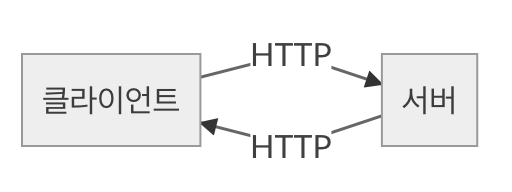
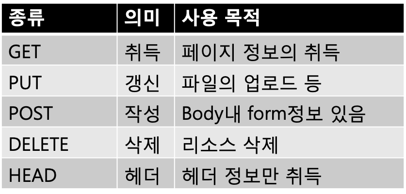
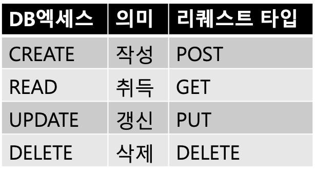
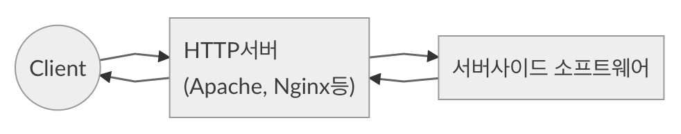
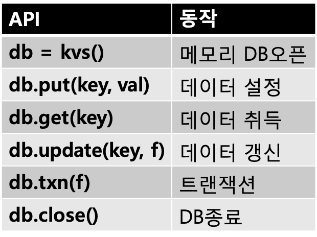
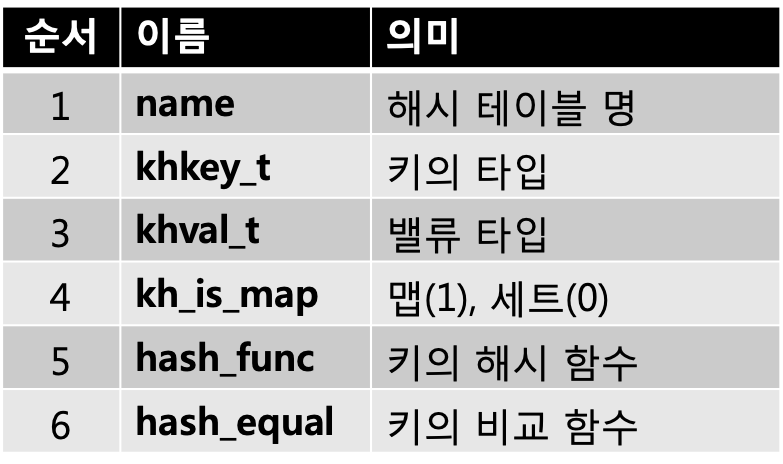

# 5장 스트림 프로그래밍의 강화


## 5-1 파이프라인 프로그래밍 


> 한동안 언어처리 시스템의 구현 이야기를 하였다면, 이번부터는 라이브러리의 강화에 대하여 이야기를 할 까 한다. 이번회는 Streem에서 CSV로 데이터의 처리와 벽돌깨기 게임의 구현을 생각해 본다.  거기에서 필요한 상태를 관리하기 위한  ‘내장 데이터베이스’도 구현한다. 


Streem의 특징인 파이프라인 프로그래밍은, 통상 프로그래밍 스타일과는 상당히 다르다. 파이프라인 프로그래밍의 스타일에 대해, 이전에 간단히 해설하였지만, 이번회에서는 좀 더 구체적으로, 여러가지 타입의 처리를 파이프라인이라면 어떻게 작성해야 할 지 생각해 본다. 파이프라인 프로그래밍이라는 의외의 세계가 보일지도 모르겠다.

이전에 태스크의 파이프라인을 구성할 때 의 대표적인 패턴에 대해 해설하였었다. 소개한 패턴은 아래와 같다.

* 생산자, 소비자 패턴
* 라운드 로빈 패턴
* 브로드캐스트 패턴
* 집약 패턴
* 요구, 응답 패턴

하지만, 각 경우의 구제적인 프로그램에 대해서는 깊게 이야기 하지 않았기 때문에 잘 와 닿지는 않았을 거라 생각한다. 이번에 좀 더 깊게 들어가 보자


#### 데이터 집계

Streem이 가장 잘 하는 처리는, 집계 처리다. 데이터를 읽어들이고, 조건에 맞는 것을 선택하고, 데이터를 가공하고, 데이터를 카운트 하는 처리 모두, 쉽게 파이프 라인에서 조합이 가능하다.
여기에서는 예로 CSV 데이터를 대상으로 몇 가지 간단한 집계 처리를 해 보자.
먼저,(그림 1)에서와 같이 CSV 데이터가 있다고 하자. 이것은 프로그래밍 언어와 출시 년도 저자 이름의 목록이다.

```
year,name,designer 
1995,Ruby,Yukihiro Matsumoto 
1987,Perl,Larry Wall 
1991,Python,Guido van Rossum 
1995,PHP,Rasmus Lerdorf 
1959,LISP,John McCarthy 
1972,Smalltalk,Alan Kay 
1990,Haskell,Simon Peyton Jones 
1995,JavaScript,Brendan Eich 
1995,Java,James Gosling 
1993,Lua,Roberto Ierusalimschy 
1987,Erlang,Joe Armstrong 
2007,Clojure,Rich Hickey 
2003,Scala,Martin Odersky 
2012,Elixir,José Valim
```

<center>
    (그림 1) 프로그래밍 언어 목록
</center>


이 목록에서 21세기에 출시 된 언어를 선택하려고 한다. 2001 년 이후 출시 된 언어를 표시하는 Streem 프로그램은 (그림 2)와 같다.
이 목록에서 21세기에 태어난 Clojure, Scala, Elixir 3개이지만, 마음같아선 Streem도 추가하고 싶다. 하지만 아직 제대로 쓸모가 될 수준에 도달하지 않기 때문에 올리지는 않았다. 

그러면, 20 세기 태생의 언어는 일부있을 것이다. 이 목록은 작기 때문에 사람이 직접 세어도 큰 차이 없지만 더 훨씬 큰 CSV데이터라면 의미가 있을 것이다. 요소의 수를 계산하려면 count () 함수를 사용한다 (그림 3).

```
fread('lang.csv')|csv()|filter{x->x.year>2000}|stdout
```

<center>
    (그림 2) 21세기에 만들어진 언어를 고르는 Streem프로그램
</center>


```
 fread('lang.csv')|csv()|filter{x->x.year<2001}|count()|stdout
```

<center>
    (그림 3) 20세기에 만들어진 언어의 수를 카운트 하는 Streem프로그램
</center>


이 리스트 중에 20세기에 만들어진 언어는 11개이다. 역시 이런건 매우 간단한 처리다.


#### 웹 서비스와 파이프라인

하지만, Streem은 별도로 데이터 집계 전용 언어는 아니다. CSV집계 외에도 다른 용도로 파이프 라인 프로그래밍 적용이 가능하다. 예를 들어 Web기술의 적용에 대해 생각해보자.
현대의 소프트웨어의 많은 Web 기술을 사용하여 구축한다. CD 나 DVD 등에서 PC에 설치하는 소프트웨어는 현저히 줄어들고 브라우저에서 접근하는 방식이 대부분이다. 기업용 소프트웨어조차 Web 기술을 사용하여 개발되고 있다.

한편, 스마트 폰에서 브라우저에서 소프트웨어를 쓰지는 않는다 [^1]
스마트폰은 앱을 설치한다. 하지만 이 앱조차 HTTP를 사용하여 서버 측 API에서 정보를 검색하는 것이 일반적이다
즉, 설치되는 응용 프로그램이던,브라우저에서 액세스되는 서버 측 소프트웨어이던,  현대의 소프트웨어의 대부분은 Web 기술과 항상 연관이 있는 것이다. 


#### HTTP 의 소프트웨어 구성

HTTP(Hyper Test Transfer Protocol)을 중심으로 한 소프트웨어의 구성은 (그림 4)와 같다 



<center>
    (그림 4) HTTP의 소프트웨어 구성
</center>


우선 클라이언트는 서버에 요청(리퀘스트)을 보낸다. 서버는 그 요청에 따라 처리하고 그 결과(응답)를 클라이언트에 보낸다. 정확한 이야기를하면 여러가지 예외적인 패턴도 존재하지만, HTTP의 기본이 요청-응답으로 이루어진 간단한 패턴이다
HTTP 요청은 (표 1)과 같은 종류가 있으며, 요청 유형을 표시 할 수 있다. HTTP를 통한 API 액세스를 생각할 경우에는 서버를 데이터베이스로 간주하여 (표 2)와 같은 대응하는 것이 바람직하다고 한다. 이러한 데이터베이스에 대한 CREATE, READ, UPDATE, DELETE하는 작업을 첫 글자를 따서 CRUD라고 한다.




<center>
    (표 1) HTTP리퀘스트 타입들
</center>




<center>
    (표 2) DB엑세스에서의 HTTP리퀘스트
</center>


#### 서버 사이드 아키텍쳐

(그림 4)의 HTTP를 구성하는 소프트웨어 중, 서버사이드에 주목해 보자. 서버 사이드의 소프트웨어 구성은 (그림 5)와 같이 된다. 클라이언트의 접속관리, HTTP리퀘스트의 구문 해석, 프로세스 관리 등은 주로 HTTP서버가 맡고 있다. 서버사이드 소프트웨어는 그 해석이 끝난 정보를 받아 처리하고, 그 결과를 HTTP서버에 돌려준다. 그러면, HTTP서버쪽에서 HTTP 응답을 만들어 클라이언트로 보내준다. 




<center>
        (그림 5) 서버 사이드 소프트웨어 구성
</center>


즉, 서버 사이드 프로그램 레벨에서 보면 HTTP 요청 정보를 수신하고 처리하여 그 결과를 HTTP 응답으로 반환하는 처리를 한다. 이 처리를 파이프 라인에서 작성할 수 있다.
구체적인 예로서 간단한 ToDo 애플 리케이션을 생각해 보자. 인증 등은 HTTP 서버에서 실행되며, 서버 측 소프트웨어는 ‘출력’ ‘작성’ ‘편집’ ‘삭제’라는 네 가지 처리를 받아들인다.

이 처리는 앞에서 이야기한 CRUD에 따라, 각각 GET, POST, PUT, DELETE 의 요청 타입으로 받아들인다. 코드는 (그림 6)과 같이 된다. (그림 6)은 Streem의 코드이지만, 아직 HTTP를 지원하는 라이브러리 등이 아직 완성이 되지 않았기 때문에 어디까지나 장래 예상도로 생각해 주면 좋겠다.

```
db = kvs()
http_request() | map{req ->
  if (req.type == "GET") {        # 출력
    emit : ok
  }
  else if (req.type == "POST") {  # 작성
    db.put(req.todo_id, [req.title, req.due])
    emit : ok
  }
  else if (req.type == "PUT") {   # 편집
    db.put(req.todo_id, [req.title, req.due])
    emit : ok
  }
  else if (req.type == "DELETE") {# 삭제
    db.put(req.todo_id, nil)
    emit [:ok, req.user]
  }
  else {                          # 기타(에러) 
      emit : error
  }
}  | render() | http_response()
```

<center>
    (그림 6) Streem에서의 서버사이드 소프트웨어
</center>


(그림 6) 은 클라이언트에 보내는 데이터를 만드는 render()의 내용이 표시되지 않았다. 하지만 상태(성공 또는 실패)와 유저ID로부터 보여줘야 할 내용의 HTML(API의 경우는 JSON이 될 지도 모르겠다)을 구축하는 순서를 생각해 주면 좋겠다. 

render()가 만드는 결과(출력용 데이터)가 http_response()에 전달되고, 이는 다시 HTTP 서버로 보내어진다. 

(그림 6)의 프로그램은 어디까지나 가상의 코드지만[^2] 이 예를 통해 일반적인 프로그래밍을 파이프라인으로 표현하는 방법에 대해 이미지화 하는게 가능하지 않을 까 생각한다.


#### 비디오 게임의 예

또 한가지, 파이프라인으로 기술하기 어려울 것 같은 예를 생각해 보자. ‘벽돌 깨기’ 와 같은 심플한 게임을 만든다고 하자.

아쉽지만, 현재의 Streem으로는 비디오 게임을 만들 수준은 아니다. 여기서는, 가상으로 실시간 키 입력과 그래픽 출력 라이브러리가 존재한다고 생각하고 진행하겠다. 

비디오 게임을 파이프라인으로 기술하기 위해서는 어떻게 해야 할 까? 여러가지 방법이 있겠지만, 여기서는 (그림 7)과 같이 3개의 파이프라인을 만들어 적용해 보았다. 

제1 파이프라인은 유저로부터 입력값을 받아, 패들(paddle)의 위치를 갱신하는 역할을 한다.

제2 파이프라인은 정기적으로 호출되며, 각각의 물체(공의 위치 및 블록의 상태)를 갱신한다

제3 파이프라인은 갱신한 결과를 그래픽으로 출력한다.

```
# 갱신빈도(매초 30회)
fps = 30
# 갱신간격
tick = 1/fps*1000
# 플레이 공간을 나타내는 메모리 데이터 베이스
board = kvs() 
kvs.put(:paddle_x, 0) 
kvs.put(:ball_x, 0) 
kvs.put(:ball_y, 0) 
kvs.put(:ball_x_vec, 1) 
kvs.put(:ball_y_vec, 1) 
kvs.put(:num_balls, 5)

key_event() | each{x -> 
  if (x == "LEFT") {
    board.update(:paddle_x, {x -> x-1}) 
  }
  else (if x == "RIGHT") { 
    board.update(:paddle_x, {x -> x+1})
  } 
}

timer_tick(tick) | each{x ->
  # 공의 위치 갱신
  x_vec = board.get(:ball_x_vec)
  y_vec = board.get(:ball_y_vec)
  x = board.update(:ball_x, {x -> x + x_vec})
  y = board.update(:ball_y, {y -> y + y_vec})
  
  # 충돌 판정
  if (x == 0) { # 공이 제일 아래에 왔다
    if (ball_hit_paddle()) { 
      board.update(:ball_x_vec, {x -> -x})
      board.update(:ball_y_vec, {y -> -y})
    }
    else{ # 떨어졌다
      n = board.update(:num_balls, {n -> n-1}) 
      if n == 0 {
        game_over() 
      }
    } 
  }
  else if (ball_hit_block()) { 
    erase_block()
  } 
}

timer_tick(tick) | each{x ->
  # 그래픽스 출력
  display_board()
}

```

<center>
    (그림 7) 벽돌 깨기
</center>


이와같이 파이프라인을 분할하면, 하나하나가 심플함을 유지할 수 있고, 가독성 및 유지보수성이 높아진다. 

이 구현의 키가 되는 것은 처리를 여러개의 파이프라인으로 분할 하는 것과, 플레이공간 상태를 인메모리 데이터베이스에 할당한다는 점이다. 


#### 이뮤터빌리티(Immutability)와 상태

자, Streem의 큰 특징은 데이터 구조가 변하지 않는다(Immutable)는 것이지만, 프로그램을 작성하게 되면 이것은 이것대로 상당히 불편하다.

순수함수형 언어인 Haskell에서는 ‘모나드(monad)’ 라고 하는 구조를 사용해 상태변경과 같은 부작용을 수반하는 처리를 관리하고 있다. 하지만 솔직히, 이는 쓰기가 쉽지는 않다.

같은 데이터 구조가 변경 불가능한 언어라도, Erlang이라고 하는 Actor베이스의 언어에서는, 상태를 2종류의 방법으로 관리하고 있다. 하나는 독립적으로 동작하는 프로세스 상태를 봉쇄함으로써 상태의 변경이나 제거는 그 프로세스와의 메시지 교환으로 수행하는 것이다. 이 방식은 상당히 좋은 아이디어 이지만, Streem 같은 명시적인 프로세스 (또는 스레드)가 없는 언어에서는 사용하기 어렵다.

또 하나의 방법은, ETS와 Mnesia라고 하는 것과 같은, Erlang의 언어처리 시스템에 내장되어 있는 데이터 베이스를 사용하는 것이다. 결국, 일반적은 데이터 구조는 변경 불가능하지만, 데이터 베이스와 같은 상태를 보존하기 위한 전용 데이터 구조는 변경을 허용하는 어프로치 이다. 

이것은 일반적인 프로그래밍만 했던 사람들도 이해하기 어렵지 않는 부분이다. 실제, 여기까지의 예제도 Todo와 벽돌깨기에서는, 데이터베이스를 사용하여 변경가능한 상태를 구현하였다. 


#### 내장DB의 kvs도입

이를 도입하려면 Streem에는 내장 데이터베이스가 필요하다. Clojure라고 하는 언어도 원칙적으로 데이터 구조가 변경 불가능하지만, STM(Software Transactional Memory) 라고 하는 방식을 사용하여, 갱신 가능한 상태를 구현하고 있다. 트랜잭션은 데이터베이스의 일관성을 유지시키는 방법이지만, Clojure는 이를 데이터 구조의 일관성 유지에 사용하고 있다. 

Streem처리 시스템에 내장데이터베이스 구체적인 사양에 대해서는 아직 검토할 여지가 남아있으나, 일단 간단하게 ‘kvs’라고 하는 이름의 데이터 베이스를 만들어 보았다. 

kvs는 간단한 key-value-store이다. 사양은 (표 3)에 나와 있다.  

<center>
     <br> (표 3) kvs사양
</center>

update는 설명이 필요할 것 같다. update는 키와 함수를 인수로 취한다. 함수는 이전 값을 인수로 받아, 반환하는 값이 새로운 값이 된다. 

txn함수는, 트랜잭션을 개시하고, 인수로 받은 함수를 실행 한다. 이 함수는 트랜잭션을 나타내는 객체를 받는다. 트랜잭션은 db와 동일한 동작을 하고, 갱신은 트랜잭션 종료시 데이터베이스에 반영된다. 트랜잭션 개시 이후에 데이터베이스가 갱신되고, 모순이 발생할 경우, 그 시점까지의 갱신 내용은 파기되고, 트랜잭션 함수가 처음부터 다시 실행된다. 트랜잭션 함수 실행중에 에러가 발생한 경우에는, 트랜잭션 중 에러 시점까지의 변경은 파기되고, 예외를 발생시킨다. 


#### kvs의 구현

자, 그럼 실제로 kvs의 구현을 해 보자. 계속 반복해 온 것이지만, 우선 동작하는 구현이 중요하다. 여기에서는 성능 등은 고려하지 않고, 가능한 빨리 사양을 맞추도록 구현을 한다. 물론, 그 구현 결과는 사용중에 성능상의 문제점이나 개선사항들이 발견된 것이다. 이때에는, 제대로 측정하고, 무엇이 문제인가 밝혀가며 개선해야 한다. 설계, 구현, 측정, 개선은 소프트웨어 개발의 철칙이다. 

kvs의 구현에 있어서도 최단 시간을 목표로 한다. 다행히 Streem의 구현은 이미 메모리에 키 밸류 데이터베이스 (라고 하지만 단순한 해시 테이블)인 khash을 채용하고 있다. 당분간은 이것을 이용하여 kvs을 구현해보자.

#### khash

khash은 C 언어에 대한 해시 테이블 라이브러리이며. MIT 라이센스로 제공되고 있다.
khash의 가장 큰 특징은 헤더 파일로만 이루어진 것이다. khash를 사용하려면 헤더 파일 "khash.h"를 포함하여 사용하는 해시 테이블을 매크로를 이용하여 선언한다. 액세스에 대한 함수도 매크로를 통해 정의된다. 예를 들어, kvs에서 사용 Streem 문자열에서 임의의 Streem 데이터의 해시 테이블은 (그림 8)과 같이 정의한다. 매크로 KHASH_INIT이 해시 테이블을 정의하는 매크로다. 여섯개의 인수가 필요한 매크로이며, 각 인수의 의미는 (표 4)과 같다.

     <br> (표 4) KHASH_INIT의 인수


<center>
    (표 4) KHASH_INIT의 인수
</center>


```
#include "strm.h" 
#include "khash.h"
KHASH_INIT(kvs, strm_string, strm_value, 1,
kh_int64_hash_func, kh_int64_hash_equal);
```

<center>
    (그림 8) kvs의 해시테이블 정의
</center>


해시 테이블 이름은 해시 테이블 구조의 이름에 사용한다. 해시 테이블은 ‘khash_t (이름)’의 형태로 액세스한다. (그림 8)에서 정의 된 해시 테이블에 액세스하는 프로그램은 (그림 9)와 같이된다.

```c
int 
main() {
  int ret, is_missing;
  khiter_t k;
  strm_string key = strm_str_intern("foo", 3); 
  strm_string key2 = strm_str_intern("bar", 3); 
  khash_t(kvs) *h = kh_init(kvs);
  /* kh_put으로 보존위치 취득 */
  k = kh_put(kvs, h, key, &ret);
  /* kh_value()으로 대입하여 실제로 보존 */ 
  kh_value(h, k) = strm_int_value(10); 
  /* kh_get로 참조위치 취득 */
  k = kh_get(kvs, h, key2);
  /* 값이 없다면 k는 kh_end(최종위치)에 */
  /* 값이 있다면 kh_value()로 값을 추출한다 */
  is_missing = (k == kh_end(h));
  /* kh_begin()에서kh_end()까지 반복하여 */ 
  /* 모든 요소를 찾는 게 가능하다。비어있는 위치도 있기 때문에 */ 
  /* 요소에 액세스하기 전에 kh_exist()로 체크한다 */
  for (k = kh_begin(h); k != kh_end(h); k++)
    if (kh_exist(h, k))
      kh_value(h, k) = strm_int_value(1);
  /* 해시테이블의 파기는 kh_destroy()로 */ 
  kh_destroy(kvs, h);
  return 0;
}
```

<center>
    (그림 9) 해시 테이블 액세스
</center>


#### khash 에 의한 kvs의 구현

지금까지 잘 따라 왔다면, (가장 심풀한 것이라면) 키 밸류 데이터베이스를 만드는 것은 간단하다. kvs의 초기 구현중에 어떻게 만들었는지 알 수 있는 부분을 (그림 10)에 발췌하였다. 

```c
struct strm_kvs { 
  STRM_PTR_HEADER; 
  khash_t(kvs) *kv;
};

static khash_t(kvs)*
get_kvs(int argc, strm_value* args) {
  struct strm_kvs *k;

  if (argc == 0) return NULL;
  k = (struct strm_kvs*)strm_value_ptr(args[0], STRM_PTR_KVS); 
  return k->kv;
}
static int
kvs_get(strm_task* task, int argc, strm_value* args, strm_value* ret) {
  khash_t(kvs)* kv = get_kvs(argc, args);
  strm_string key = strm_str_intern_str(strm_to_str(args[1])); 
  khiter_t i;
  i = kh_get(kvs, kv, key); 
  if (i == kh_end(kv)) {
    *ret = strm_nil_value(); 
  }
  else {
    *ret = kh_value(kv, i);
  }
  return STRM_OK; 
}
static int
kvs_close(strm_task* task, int argc, strm_value* args, strm_value* ret) {
  khash_t(kvs)* kv = get_kvs(argc, args); kh_destroy(kvs, kv);
  return STRM_OK;
}
static strm_state* kvs_ns;
static int
kvs_new(strm_task* task, int argc, strm_value* args, strm_value* ret) {
  struct strm_kvs *k = malloc(sizeof(struct strm_kvs));
  if (!k) return STRM_NG; 
  k->ns = kvs_ns;
  k->type = STRM_PTR_KVS; 
  k->kv = kh_init(kvs); 
  *ret = strm_ptr_value(k); 
  return STRM_OK;
}

void
strm_kvs_init(strm_state* state) {
  kvs_ns = strm_ns_new(NULL);
  strm_var_def(kvs_ns, "get", strm_cfunc_value(kvs_get));
  strm_var_def(kvs_ns, "put", strm_cfunc_value(kvs_put));
  strm_var_def(kvs_ns, "update", strm_cfunc_value(kvs_update));
  strm_var_def(kvs_ns, "txn", strm_cfunc_value(kvs_txn));
  strm_var_def(kvs_ns, "close", strm_cfunc_value(kvs_close));
  strm_var_def(state, "kvs", strm_cfunc_value(kvs_new));
}
```

<center>
    (그림 10) kvs의 초기 구현(발췌)
</center>


ns멤버에 strm_state구조체로 표현되는 네임스페이스가 할당되어 있어, 객체지향언어에서의 클래스의 역할을 하는 점만 주의하면, 그렇게 어려운 내용은 아닐 것이다. 


#### 배타제어

하지만, 이 심플한 구현은 그렇게 실용적이지 못하다. 멀티쓰레드, 멀티태스크적인 언어인 Streem에서는 필수인 베타제어가 수행되고 있지 않기 때문이다. 

예를들어, 해시테이블의 내용을 바꾸는 도중, 다른 쓰레드가 이를 읽는다면, 있지도 않은 데이터를 읽어들일 가능성이 있다. 내용 작성에 경합이 발생한다면, 데이터 구조가 깨질 위험성도 있다. 

이와같은 사태를 막으려면, 이를 위한 배타제어가 필요하다. 여러 방법 중 이번에 쓸 방법으로 하나는 락(Lock), 또 하나는 트랜잭션이다. 

#### 락(Lock)에 의한 배타제어

락에 의한 배타제어는 비교적 간단하다. 해시 테이블 별로 pthread_mutex라고 하는 락을 준비해 놓고, 공유된 데이터 구조(여기서는 해시태이블)으로의 액세스 전후로 

```
pthread_mutex_lock()
pthread_mutex_unlock()
```

라고 하는 함수를 실행시키기만 하면 된다. 

이것으로 적어도 데이터가 깨져 버리는 사태는 막을 수 있을 것이다. 


#### 트랜젝션의 구현

하지만, 해시테이블과 같은 일종의 데이터 베이스의 경우, 락에 의한 보호도 충분하지 못한 경우가 있다. 

복수의 쓰레드가 동시에 데이터베이스 등에 write를 하려 하면, 데이터베이스 자체는 깨지지 않지만, 데이터의 일관성이 유지되지 못하는 경우가 있기 때문이다. 예를 들어, 은행구좌 A에서 B로 이체를 하는 경우, 도중에 다른 이체가 실행되었다고 해서 원래 이체를 하려는 금액이 사라져 버리면 정말 큰 문제이다. 

이와 같은 문제를 막기 위해, 데이터베이스는 트랜잭션이라는 기법을 채용하고 있다. 트랜잭션은 성공하여 일련의 상태를 변경할 지, 충돌하여 재실행 할 지, 실패해서 상태를 트랜잭션 이전의 상태로 보존할지 등으로 결과값을 보장한다. 

kvs에서는 txn함수를 이용하여 트랜젝션을 구현한다. txn함수는 트랜잭션을 개시하고, 인수로서 전달받은 함수에 트랜잭션 객체를 인수로 전달한다. 트랜잭션 객체는 보통의 kvs데이타베이스와 동일하게 동작하고, 트랜잭션 종료시(조작이 성공한다면) 데이터 베이스에 기록한다. 

트랜잭션의구현은 상당히 복잡하기 때문에 지면관계상 해설은 못할 것 같다. github.com/matz/streem에 있는 소스 코드 src/kvs.c를 참조하길 바란다. 


#### 마치며

이번에는 Streem의 파이프라인 프로그래밍에 대하여 배워보았다. 또한, 상태변화의 구현에 중요한 kvs데이터베이스를 구현했다. 이렇게 해서, 조금씩 Streem을 실용화 레벨로 한발 더 가까워 졌고 이를 연재에 연동하여 개발하는 것은 나에겐 또다른 묘미이다.


<hr>

### 타임머신 칼럼

***당연히 있어야 할 기능들은 역시 필요한 것이다***

> 2016년 3월호 게재분이다. 이번에는 Streem의 특징인 파이프라인 프로그래밍 스타일로, 구체적으로 어떻게 프로그램을 작성할 것인가에 대하여 고찰해 보았다.
>
> Streem이 많은 영향을 받은 함수형 프로그래밍에서도 마찬가지지만, 이 스타일을 사용하여 간결하게 기술가능한 영역은 분명히 있다. 해설서 등에서는 이 영역의 문제를 거론하며 "이렇게 간결하게 해결 가능하다" 라고 소개해 주고 있다. 
>
> 하지만, 우리들이 프로그래머로서 일상적으로 부딪히는 문제들의 대부분은 이와 같이 간결하게 해결이 되지는 않는다. 아니, 해결 자체는 가능하겠지만, 간결하게 해결하는 것은 또다른 문제이다. 익숙해지지 않은 이들에게 많은 문제들은 직접적으로 해결 불가능하다고 느껴질 수도 있다. 하지만, 대상영역마다 다른 언어로 바꾸어 쓰는 것도 (주로 정신적)비용이 많이 들어간다. 
>
> Streem은 범용언어가 아닌, 파이프라인 프로그래밍 전용 언어이므로, 그런 염려는 낮다. 하지만, 이것 하나로 가능한 범위는 넓을 수록 좋다는 것은 당연한 것이다.
>
> 여기서 Streem으로 다양한 프로그램을 개발한다고 상정하고, 여러가지 고찰을 해 보았다. 그 고찰결과가 인메모리 데이터베이스인 kvs이다. 언어 사양에 수정 가능한 변수가 있다면 간단히 구현 가능하도록 데이터베이스를 도입하는 것은 좀 오버라는 느낌도 들었다. 하지만, Clojure를 보면, 이것도 이 나름대로 의미가 있지 않을 까 라는 생각이 들었다. 
>
> 이번 샘플 프로그램에 등장하는 함수군에서는, kvs를 제외하면, http_request()라든가 key_event() 라든가 timer_tick()등, 아직 실제로 제공되지 않은 함수가 많이 있다. Streem에서 실용레벨로 사용되기 위해서는, 이런 지원함수들을 아주 많이 만들어 놓아야 하지 않을까. 이후 남은 연재에서는 이와같은 함수의 검토와 구현에 대하여 이어가게 된다. 


[^1]: 최초의 iPhone에서는 모든 프로그램들이 앱이 아닌 브라우저를 경유하였던 적이 있었다. 앱의 등장으로 PC와는 정 반대의 변화가 일어난 것은 재미있는 현상이다. 
[^2]:  Streem의 주변 라이브러리가 빈약하여 전혀 실용적이지 못한 것은 창피하기 그지없다