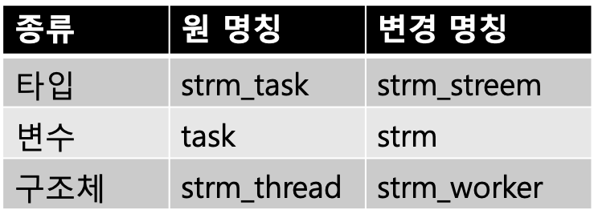
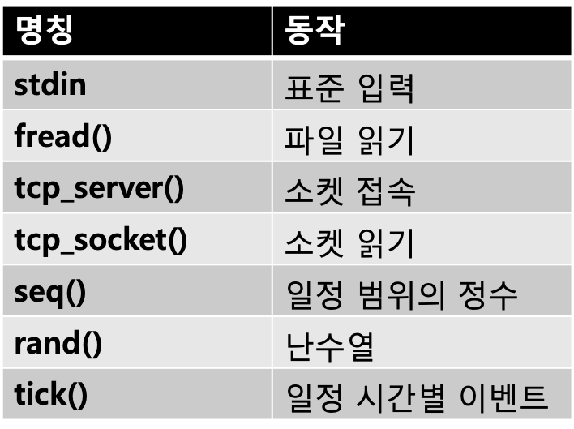
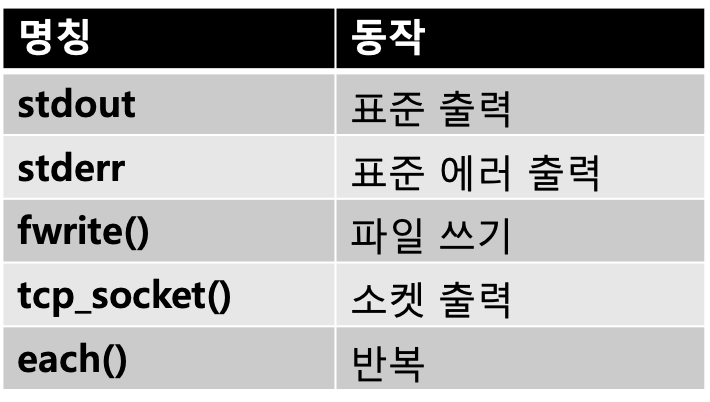
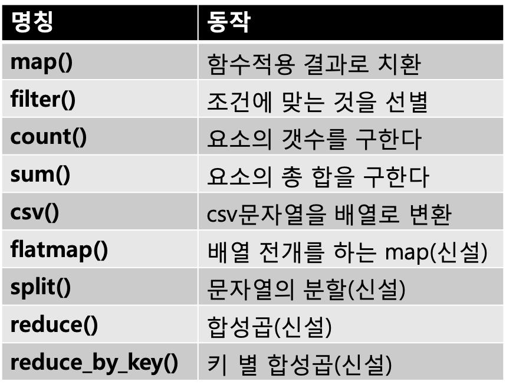
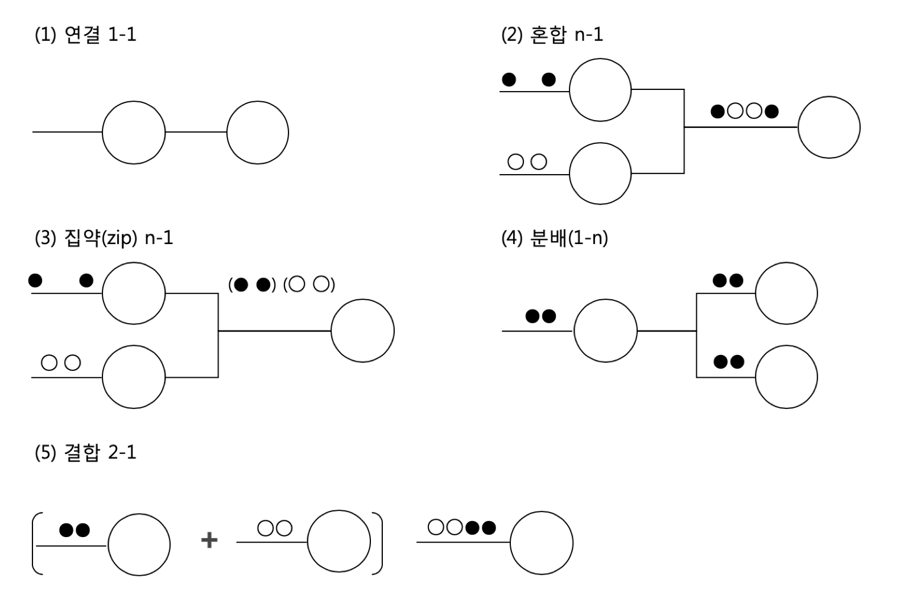
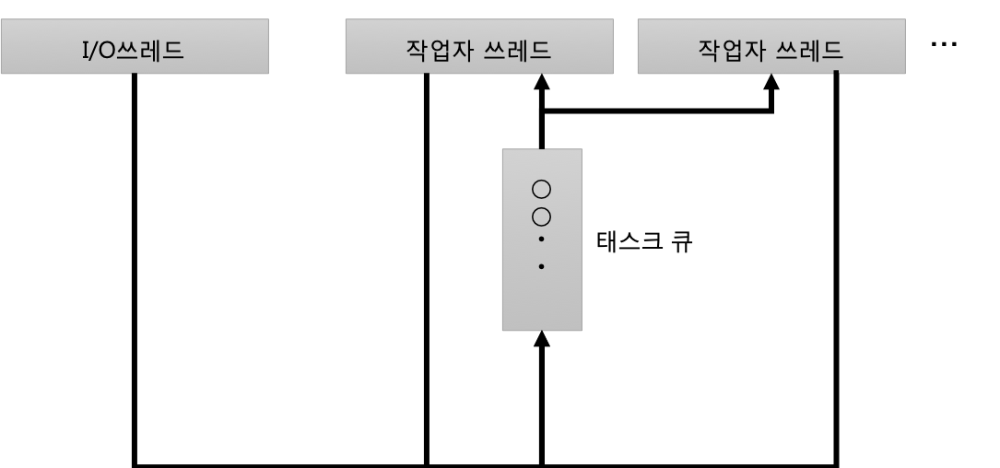

## 5-2 파이프라인 구성 요소

> 5-1절에서는 파이프라인 프로그래밍에 대하여 해설하고, 그 중요 구성요소로서 kvs를 개발하였다. 이번에도 파이프라인 프로그래밍의 실천에 필요한 구성요소에 대하여 더 검토해 보고, 필요한 툴을 갖추려고 한다. 개념을 정리하여 구현을 대폭적으로 고쳐보려 한다

지금까지 Streem개발을 해 오면서, ‘일단’ 붙여왔던 이름들이 상황에 맞지 않는 것들이 많아 신경이 쓰였다. 

예를들어, strm_task라는 중요한 구조체의 이름에서, Streem의 언어 레벨에는 ‘태스크(task)’ 라는 개념이 일단 등장하지 않는다. 이 ‘태스크’ 가 무엇을 나타내는지는, 나 자신도 생각해내지 못했다. 구현과 개념에 해리(解離)가 일어나는 것 같았고, 위화감마저 들었다. 

요 몇개월을 계속 이 위화감에 대하여 고민하였다. 여기에서 파이프라인 프로그래밍을 완주하기 위해, 한번쯤은 개념을 정리해 둘 필요가 있다고 생각되었다. 


#### 파이프라인의 구성 요소

여기서 Streem의 파이프라인에 등장하는 구성요소들을 재구성해 보겠다. 중요한 것들은 아래 4개가 되겠다

* 파이프라인
* 스트림
* 태스크
* 작업자

이 중 가장 중요한 개념은 스트림이다. 스트림은 데이터의 흐름을 구성하는 ‘처리’ 이다 . 스트림에는 데이터를 생성하는 ‘생산자(Producer)’, 입력으로 받은 데이터를 가공하는 ‘필터’, 그리고 데이터를 받아 소비하는 ‘소비자(Consumer)’ 3종류가 있다.  프로그래밍 모델로서는, 스트림을 결함한 것도 스트림이 되지만, 처리 시스템 레벨 에서는, strm_stream이라고 하는 구조체로 하나의 처리를 표현한다. 

생산자로부터 소비자까지 하나로 이어지는 스트림을 파이프라인이라고 부른다. 아직 Streem의 처리 시스템에서 파이프라인을 다루는 부분은 (아직) 존재하지 않기 때문에, 어디까지나 개념상 존재한다고 생각해 주면 좋겠다.

스트림에서 데이터 한개 분의 처리를 담당하는 것이 태스크이다. Streem처리 시스템에서 태스크에 의한 처리는 각각 한개씩의 C함수로 표현되어 있다. 스트림이 데이터를 다음 단계에 emit할 때마다, 태스크 구조체를 실행 큐에 추가하여, 실행 예약을 하게 된다. 

작업자는 태스크를 실행하는 쓰레드를 말한다. Streem처리시스템에서는 탑재되어 있는 CPU의 수 만큼 작업자가 생성된다. 작업자는 큐의 제일 앞부터 하나씩 태스크를 추출하여 실행한다. 


#### global renaming

그럼, 개념을 정리가 되었기 때문에, 여기에 대응하여 소스코드 쪽도 변화를 줘 보자. Streem의 구현의 구조체명, 함수명, 변수명 등에 대해서는 (표 1)과 같이 변경을 한다. 



<center>
     (표 1) 명칭 변경
</center>


실은 core.c와 queue.c에서 구현된 이벤트 처리내에서는, strm_task와 비슷한 이름이 있지만, 실제와는 무관한 strm_queue_task라는 이름의 구조체가 사용되고 있고, 이것이 이번 개념정리 후의 태스크에 해당하는 것이다. 이것은 이것대로 큰 폭으로 수정되었지만, 이점에 대해서는 나중에 설명하겠다.

일반적으로 소스코드에 등장하는 명칭을 큰 폭으로 변경을 하면, 호환성을 잃게 된다. 이때문에,  특히 오픈 소스 소프트웨어인 경우에는 상당한 곤란을 겪게 된다. 

Ruby도 개발 초기에 대대적인 명칭 변경이 있었다. 이는, 다른 라이브러리등과 명칭이 중복되지 않게 하기 위해 ‘rb_’ 라고 하는 프리픽스를 붙였었는데. 벌써 20년전의 일이지만, 당시 유저 수가 많지 않았음에도 불구하고 작동하지 않는 라이브러리들이 속출했던 아찔한 기억이 있다.

Streem의 경우, 아직 실용화 까지는 아직 부족하여 아무도 사용하지 않는 것과, 원래 확장용 API가 제공되지 않고 있기 때문에, 아직은 부담없이 변경이 가능하다. 나중에 보다 구현의 질을 높이기 위해 대담한 변경이 일어나지 않을 까 생각된다. 


#### 디버그용 strm_p() 추가

그리고 또 하나의 기능을 확장시켜 보자

앞서 NaN Boxing을 도입한 이래, Streem의 객체는 모두 64비트 정수로 표현이 가능하게 되었다. NaN Boxing은 실행 효율은 좋지만, 안의 내용을 모르기 때문에 디버그할 때에는 많이 번거롭다. 여기에 디버거로부터 객체의 내부를 표시해 주는 함수 strm_p()를 신설했다. 

stem_p()의 구현은 간단하다(그림 1). strm_str_cstr()함수로 C의 문자열 포인터를 추출하고, fputs() 로 표준 출력을 하기만 하면 된다.

```c
strm_value 
strm_p(strm_value val) {
  char buf[7];
  strm_string str = strm_to_str(val); 
  const char* p = strm_str_cstr(str, buf); 
  fputs(p, stdout);
  fputs("\n", stdout);
  return val;
}
```

<center>
    (그림 1) 객체 내부를 표시하는 함수 strm_p()
</center>

strm_str_cstr()함수의 buf인수에 대해 조금 설명이 필요할 것 같다. Streem의 NaN Boxing에서는 6문자이하의 짧은 문자열을 strm_value에 직접 입력을 하고 있어서, 문자열 포인터를 추출하는 것이 불가능하다. 여기서 이와같은 문자열 내용을 복사하기 위해 buf영역이 필요하다. 입력된 문자열은 최대 6문자(바이트)여서, 끝의 NUL문자를 더해, buf의 사이즈는 최대 7파이트가 필요하게 된다. 

더우기 객체별로 문자표현을 커스터마이징 할 수 있는 구조도 마련했다. namespace가 설정된 객체가 to_str()함수를 가지고 있는 경우, 그 반환값을 문자열표현으로서 사용할 수 있도록 했다. 


#### 파이프라인 구성부품

자, 5-1절에서 파이프라인 프로그래밍 패턴은 아래 3가지 종류가 있었다. 

* 생산자로부터의 데이터를 필터에서 가공하여, 소비자에서 출력
* 생산자로부터의 데이터를 필터에서 가공하여, 데이터베이스(kvs)에 작성한다.
* 일정시간별로 처리를 기동시켜, 데이터베이스로부터 읽어들인 데이터를 출력




<center>
    (표 2)Streem의 생산자
</center>




<center>
    (표 3) Streem의 소비자
</center>




<center>
    (표 4) Streem의 필터
</center>


지금까지 등장했던 생산자는 (표 2), 소비자는 (표 3) 에 정리하였다.

뒤에, 기존 필터와 이번에 신설된 필터를 (표 4)에 나타내었다. 물론 이 필터들로만은 할 수 있는게 제한되기 때문에, 필터는 앞으로 계속 추가 예정이다.

신설 필터 중에, reduce()라는 것이 있다. reduce()는 스트림의 요소를 합성곱을 시키는 함수로서

```
reduce(b){x,y->...}
```

와 같은 형태로 호출한다. 우선 상위 스트림의 요소(e1, e2.... )가 주어지면, 먼저 함수가 b를 첫번째 인수, e1을 두번째 인수로서 호출된다. 그 결과를 r1이라고 하면, 다음 요소(e2)에 대해서는 r1이 첫번째 인수, e2가 두번째 인수로 함수가 호출된다. 이후 같은 패턴으로 반복되고, 마지막에 결과가 출력되어 다음 스트림으로 전달된다. 

reduce()를 사용하면 팩토리얼의 계산은, (그림 2)와 같이 된다. 다른 언어에서 사용되는 재귀호출 방식과는 사뭇 다른 형태를 가지고 있다. 

```
 seq(6)|reduce{x,y->x*y}|stdout
```

<center> (그림 2) reduce에 의한 팩토리얼의 계산</center>

또한, sum()함수도 reduce()를 사용하여, (그림 3)과 같이 정의가 가능하다. 이와 같이 정의된 sum()은 상위에서 받은 데이터의 합계를 하위로 전달하는 필터 스트림을 돌려준다.

```
def sum() {
  reduce(0) {x,y -> x+y}
}
```

<center>(그림 3) reduce를 사용한 sum()의 정의 </center>

#### 합성곱으로 단어 카운트 구현

reduce의 파생으로, 키 값으로 카운트를 찾아 주는 reduce_by_key()도 필요하게 되었다. 이는 파이프라인 프로그래밍에 있어서 ‘Hello World’ 라고 해도 과언이 아닐 단어 카운트에 사용된다. Streem의 단어 카운트를 (그림 4)에 나타내었다.

```
stdin
| flatmap{s->s.split(" ")}
| map{x -> [x, 1]}
| reduce_by_key{k, x, y->x+y}
| stdout
```

<center>
    (그림 4)  Streem에 의한 단어 카운트
</center>

(그림 4)에서는 stdin에서 입력된 각 행을

```
flatmap{s->s.split(" ")}
```

에 의해 단어별로 분할한다. 문자열에 split함수를 적용하면, 인수로서 받은 구분자를 기준으로 문자를 분할하여 배열로 돌려준다. flatmap은 함수로부터 받은 배열을 스트림요소에 전개시킨다. 그 결과, 상위로부터

```
this is my pen
my name is yukihiro
```

와 같이 2행의 문장을 입력받았다면 

```
this
is
my
pen
my
name
is 
yukihiro
```

와 같은 8개의 데이터를 하위로 전달하게 된다.  또한,  (그림 4)에서는 flatmap의 설명을 하려고 했기 때문에, 사용하지는 않았지만, 간편성을 위해

```
split(" ")
```

만으로

```
flatmap{s->s.split(" ")}
```

과 거의 동일한 동작을 하는 split()함수를 정의하고 있다.


다음 단계에서 map은 단어 열을

```
[단어,1]
```

과 같은 배열로 변환한다. 

마지막으로 reduce_by_key()는 2요소 배열의 스트림을 가지고, 첫번째 요소 별로 제 2요소를 reduce한다. 그 결과, 원래 2행의 입력은

```
[this,1] 
[is,2] 
[my,2] 
[pen,1] 
[name,1] 
[yukihiro,1]
```

로 변환되게 된다. 이를 stdout으로 출력하면 단어 카운트가 되는 것이다.


#### 스트림의 분기, 합류

지금까지 소개한 예의 대부분은, 스트림으로 구성된 파이프라인은 생산자로부터 필터를 경유하여 소비자에게까지 가는 단일 패스였다. 

하지만, 스트림의 구성 패턴은 이렇게 단일 패스만 있지는 않다. (그림 5)



<center>
    (그림 5) 스트림의 구성 패턴
</center>


(그림 5)(1) 의 연결은 ‘|’연산자를 사용해 2개의 스트림의 입력과 출력을 연결하는 것이다. 지금까지 등장한 기본형태의 스트림 구성이다. 

혼합은 여러개의 스트림의 내용을 하나로 모으는 것이다. 데이타가 들어온 순서로 ‘섞어서’ 다음 스트림에 전달한다. 구체적으로는 a와 b라고 하는 2개의 스트림이 있다고 하면, 이 내용을 다음 스트림에 전달하는 경우에는 

```
a | stdout
b | stdout
```

이라고만 하면, (그림 5)(2) 의 상태에 결합하는 스트림 구축이 된다.

(그림 5)(3) 의 집약은 여러개의 스트림의 요소를 어떤 점으로 모은다는 점은 혼합과 동일하지만, 동작이 좀 다르다. 각각의 스트림으로 부터 요소들을 그대로 받는것이 아니라, 각각의 원 조합을 유지하여 배열 형태로 받는다. 

집약은 지퍼(zipper)가 물린 결합처럼 보인다고 해서 zip이라는 함수를 사용한다. 

seq()에서 1부터 시작되는 스트림, fread(path)에서 마지막 내용의 스트림을 얻은 경우, 이 두개의 스트림을 집약한 스트림을 얻기 위해는 zip함수를 사용해서

```
zip(seq(), fread(path))
```

라고 한다. 그러면 각 행에

```
[수식, 행]
```

형태로 데이터가 주어져 행번호와 행의 조합이 얻어진다. ‘cat -n’ 명령어와 비슷하다. 

seq()함수가 정수를 순서대로 생성하는 것과, 파일을 읽는 것과는 실행되는 페이스에 차이가 있을 것이다. 여기서도 각 스트림 요소가 순서대로 조합된다. 

(그림 5)(4)의 분배는, 상위에서 들어온 데이터를 여러개의 스트림에 전달하는 것이다. a라도 하는 스트림으로부터 들어온 데이터를 b와 c라고 하는 스트림에 전달하는 경우

```
a | b
a | c
```

라고 한다. 이 경우, b와 c에는 동일한 데이터가 전달된다. 

마지막으로 (그림 5)(5)의 결합은, 두개의 스트림을 순서대로 연결하는 것이다. a와b 두개의 스트림을 결합하면,   a의 스트림의 모든 데이터가 하위로 전달된 후, b라는 스트림으로부터 전달된 데이터를 하위로 전달한다. 스트림을 결합하는 경우 ‘+’ 연산자를 사용한다. 예를 들어

```
(a + b) | stdout
```

이라고 하면, a의 내용에 이어서 b의 내용이 출력된다. UNIX의 cat명령어가, 복수개의 파일의 내용을 이어서 출력해 주는 것과 동일한 것이라 생각해도 될 것이다.


#### 흐름 제어가 필요

자, 여기에서 어려운 점이 하나 있다. 예를 들어 zip의 경우, 입력 스트림이 여러 개가 있어, 각각 데이터를 생성하는 페이스가 다르다. seq() 와 rand() 와 같이 가벼운 계산만 하는 생산자가 상위에 있을 경우에는 다음 단계로 데이터가 원활하게 전달될 것이다. 한편 , 소켓과 같이 언제 데이터를 보내주는지에 따르는 생산자도 있다. 

하지만, zip자신은 상위로부터 모든 데이터가 갖춰지지 않으면, 처리가 시작되지 않는다. 이때문에, 상위에서 페이스가 다른 조합이 있으면, 페이스가 빠른 상위로부터의 데이터는 축적이 된다( ≒ 메모리를 소비한다). 이와 같은 사태를 피하기 위해서는, 데이터의 흐름제어가 필요하게 된다. 


#### 생산자를 비우선(非優先)으로

흐름제어의 구현 방법은 여러 개가 있지만, 이번에도 지금까지와 마찬가지로 생산자 스트림의 우선순위를 낮추는 방법으로 구현하고자 한다. 

파이프라인을 흐르는 데이터가 너무 많기 때문에 하위의 처리가 따라가지 못해, 흐름 제어가 필요하다. 때문에, 하위처리의 우선순위를 생산자보다 위에 둠으로서, 흐름제어를 해보려 한다. 단, 비동기적 프로그램의 거동을 예상하는 것은 곤란하다. zip과 같은 합류를 수반하는 스트림에 대해서는, 이 우선 순위 방식이 정말 잘 동작하는 지에 대해서는 약간의 불안감이 있다. 여기서 우선 실제 동작을 해 보고,  결과를 측정하고 나서 문제가 있다면 확인해 보려 한다. 

5-1절 까지의 Streem의 구현에서는 실행 큐에는 우선도가 있어서, 생산자의 우선 순위를 낮추었다. 이번에는 생산자 전용 큐를 설정했다. 큐로부터 추출하는 순서를 보통 큐 → 생산자 큐로 하는 방법으로, 생산자의 우선도를 낮추었다. 


#### 분배시의 체류(滯留)는 고려하지 않는다

실은 동일한 문제가 하위에서도 발생한다 .분배에 따라 여러개의 하위에 데이터를 전달할 때, 각각 하위 스트림의 데이터 처리속도가 다르면, 느린 스트림 앞에 데이터가 적체되어 버린다. 하지만, 분배가 상위 스트림이 필터이고, 생산자가 아닐 경우에는, 위에서 설명한 우선순위 조정의 효과는 없어진다. 

여러가지를 검토한 결과, 하위측의 문제는 그렇게 심각하지는 않다고 생각되어, 이번에는 대응을 하지 않는 것으로 하였다. 

20년간 Ruby의 개발에서 배운 지혜중 하나는, 언어처리시스템의 경우, 이용되는 국면을 한정하는 것은 곤란함을 유발시켜 왔다. 발생할 가능성이 있는 문제는 반드시 발생하며, 더군다나 상정한 것 보다 더 심각한 사태가 되는 경우가 많았다. Streem에서도 몇가지 이 문제에 대처해야할 날이 올 것이다. 그때까지 현명한 해결책을 생각해 둘 필요가 있겠다. 


#### 기존의 큐는 메모리를 배려했다

흐름제어을 구현하기 위해, Streem의 이벤트 처리 코어 부분인 이벤트 루프 부분을 대대적으로 수정하도록 하겠다.

지금까지 구성도를 (그림 6)에 나타내고 있다. 


<center>
    (그림 6) 지금까지 이벤트 처리 아키텍쳐
</center>


이 구성의 특징은 작업자 쓰레드 별로 태스크 큐를 가지고 있는 것으로, 같은 파이프라인의 처리는 같은 작업자 쓰레드에서 실행하는 것을 목적으로 하고 있다. 여기에는 몇가지 장점이 있는데, 첫번째는 스트림에 속하는 태스크가 여러개의 쓰레드를 실행할 우려가 없기 때문에 배타제어를 신경쓸 필요가 없다. 더우기, 태스크가 순차적으로 처리되기 때문에 처리속도의 문제로 인해 데이터의 전후가 바뀔 우려가 없다는 것이 큰 장점이다. 마지막으로, 일련의 태스크가 같은 쓰레드에서 실행되는 것으로, 캐쉬가 공유 되어, 메모리 액세스 효율이 높아진다는 점도 있다. 

하지만 한편으론, 파이프라인의 수가 적은 경우에는, 멀티코어 환경에서는 결국 다중 코어의 활용을 할 수 없고, 성능이 제대로 나오지 못할 위험성도 있다. 

결국, 캐쉬의 활용에 따른 성능상의 장점과, 멀티코어를 100% 활용할 수 없는 성능상의 단점이 공존하는 형태이다. 이를 종합적으로 생각해보면, 단점이 좀 더 위에 있는 것 같다.  또한 순서의 보증에 대해서도, 스트림 처리에 있어서 순서는 문제가 되는 경우는 별로 없기 때문에 장점은 그렇게는 없을 것 같다. 


#### 코어 활용을 우선시 하는 변경

여기서 (그림 7)과 같이 새로운 구성을 생각해 보았다. 



<center>
    (그림 7) 새로운 이벤트 처리 아키텍쳐
</center>


큐를 공유하고 있어, 비어있는 작업자 쓰레드가 태스크를 받아오게 되어, 코아 활용율을 높일 수 있다. 같은 파이프라인에 속하는 태스크가 다른 쓰레드에 실행되면, 1차 캐시의 공유가 불가능할 가능성이 있다. 하지만, 2차 캐시와 3차 캐시에 올려질 가능성이 상당히 높기 때문에, 이는 신경쓰지 않아도 된다. 다시 (그림 7)에서는 흐름제어를 위한 생산자 큐가 생략되어 있다.

하지만 (그림 7) 의 구성 그대로는 약간의 문제가 있다. 우선, 동일 스트림에 속한 태스크들 사이에서 배타제어가 필요한 경우가 상당히 자주 발생한다. 지금까지 소개한 필터 중에도, 스트림 상태가 존재하는 count(), sum(), reduce()등은 배타제어가 필요하다. 

이와 같은 케이스를 위해, 각 작업자 쓰레드에도 개별 큐를 준비해 두고 있다. 큐부터 추출한 태스크에 속하는 스트림이 배타제어가 필요한 경우라면, 동시실행에서 일관성을 잃지 않기 위해, 현재 실행중인 태스크를 종료 후, 이어서 태스크를 실행 가능하도록 한다. 결국 태스크를 실행중인 작업자 개별 큐에, 이어서 태스크를 추가한다. 


#### 태스크 큐 구현 개선

이벤트 처리의 효율을 높이기 위해, 큐의 구현을 조금 바꾸겠다. 지금까지의 구현은 락(Lock)과 조건변수의 조합이었다. 이것은 바르게 동작하는 것은 보증하지만, 성능에 대해서는 상당히 문제가 있다. 

멀티쓰레드 환경의 데이터 구조는, 제대로 처리를 하지 않으면 정확한 결과가 나오지 않는다. 예를 들어, 어떤 쓰레드가 데이터를 수정하는 도중 다른 쓰레드가 데이터를 읽어들이는 경우, 실제로 읽어들이게 되는 것은

* 운이 좋으면 정확한 데이터
* 수정 도중 일관성이 없는 데이터
* 수정한 데이터와 관계없는 가비지 데이터

중 하나일 것이다. 하지만 상황에 따라, 타이밍에 따라 발생의 예측이 불가능하다. 대부분의 경우 잘 동작하다가 가끔 실패하는 경우는 버그로서 악성으로 분류가 된다.

이와 같은 사태를 피하기 위해서 보통, 멀티 쓰레드 환경에서 공유된 데이터의 구조는 배타제어를 할 필요가 있다. 구체적으로는, 쓰레드간에서 공유된 데이터를 액세스하는 경우에는, 그 직전에 락을 걸고, 액세스가 끝나면 락을 해제한다. 다른 쓰레드가 데이터를 액세스할 때에도 락을 걸도록 하고 있으나, 다른 쓰레드가 액세스 중에서 락을 걸어버리는 경우에는, 락이 해제될 때 까지 실행이 정지된다. 

실행이 정지된다는 것은, 처리가 밀린다는 것이다. Streem과 같이 코어 수만큼 작업자 쓰레드가 생성되는 아키텍쳐에서는, 멀티 코어를 십분 활용하지 못하는 경우도 발생한다. 이는 정말 아깝지 않은가? 

이와 같은 사태를 피하기 위해 락에 의한 보호를 쓰지 않은 락프리(Lock Free) 데이터 구조가 고안되고 있다. 락프리는 복수의 쓰레드가 어떤 타이밍에서 액세스 하여도 파괴되지않는 알고리즘을 채용한 데이터 구조이다. 

내 자신이 생각해도 구현 가능할 것 같지 않기 떄문에, 기존의 것을 이용하도록 하겠다. GitHub에서 검색한 결과

```
github:supermartian/lockfree-queue
```

를 찾아내었다. 이 락프리 큐(를 대대적으로 수정하여)를 사용하도록 하겠다. 


#### Compare and Swap

쓰레드를 고려하지 않은 ‘보통’의 프로그래밍에서는, 데이터를 갱신할 때, 우선 읽어들이고, 그것을 가공하여, 결과를 돌려주는 순서를 밟는다. 하지만, 읽어들인후 가공할 때 까지 다른 쓰레드가 그 데이터에 액세스하거나, 수정하거나 하면, 부정합이 일어날 가능성이 있다. 이런 것이 일어나는 것을 막기 위해 데이터의 참조와 갱신을 같이 실행하는 것이 락프리 알고리즘의 기본이 되겠다.

이와 같은 갱신 조건을 ‘Compare and Swap’(약어로 CAS)라고 부른다. CAS는 메모리 위치, 값1, 값2 3개의 인수를 취한다. 이 메모리 위치의 내용을 값1과 비교하고, 같으면 그 메모리 위치에 값2를 할당한다. CAS는 CPU의 1명령으로 실현되어, 그 조작중에 다른 쓰레드가 실행되는 일이 없다는 것이 보증된다. 이와 같은 조작을 ‘아토믹’ 이라고 부른다.  

원래 C언어에는,  CAS를 실현하는 명령은 존재하지 않기 때문에, 이 명령을 호출하는 어셈블러가 필요하다. 하지만 다행히 GCC4.1부터는 CAS를 구현하는 확장기능

```
__sync_bool_compare_and_swap()
```

이 제공되고 있다. 


#### 마치며

이번에는 파이프라인 처리의 개념정리 및 구현의 개선 작업을 하였다. 멀티 쓰레드환경에서의 프로그래밍은 고려할 점이 많고,  상당히 고민스러운 작업이다. 다음회(이 책에서는 4-5절, 아래 타임머신 칼럼 참조)는, 이 구현 개선에 대해서도 설명을 하려고 한다.


<hr>

### 타임머신 칼럼

***타이밍에 의존하는 버그는 정말 골치아프다***

> 2016년 4월호 게재분이다. 파이프라인의 구성요소로서, reduce, reduce_by_key, zip등의 함수를 새로 만들었다. 또한, 락프리 큐에 대해서도 조금 다루고 있다.
>
> 잡지에는, 4-5절 전에 이번 회를 게제하였기 때문에, 이 책을 읽는 이들 중에 이번 내용에 위화감을 느끼는 사람도 있을 것 같다. 하지만, 4-5절의 타임머신 칼럼에서 말한 것과 같이, 이 락프리 큐는 고부하시에 발생하는 버그를 해결하지 못하여, 결국에는 채용하지 않았다(코드는 남아 있지만, 컴파일시에 플래그(flag)로 락을 이용하는 큐를 사용하도록 하고 있다).
>
> 타이밍에 의존하는 비결정적 버그는 정말 디버그시에 골치아프다. 정말 열심히 도전했지만, 시간과 노력의 한계가 와서 포기하고 말았다. 언젠가 다시 도전하겠다


