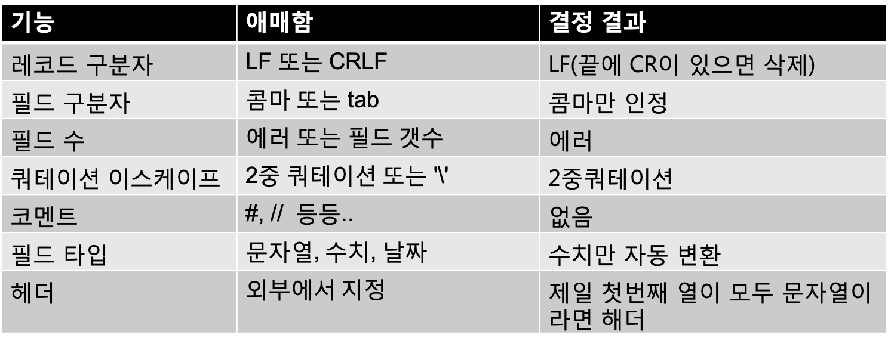

## 5-3 CSV처리 기능

> Streem과 같은 파이프라인 처리를 하는 경우에, 입력원이 되는 데이터 형식으로 가장 많이 사용되는 것은, 아마 CSV가 아닐까 싶다. 여기서 CSV에 의한 데이터 입력 기능에 대한 개발의 순서를 따라가며 해설하도록 한다. ‘표준’ 이 없는 CSV의 처리는 상당히 귀찮다. 

CSV(Comma-Separate Values)는 표형식의 데이터를 표현하기 위해 널리 사용되는 형식이다. 특히 Excel등의 프로그램에서의 데이터를 다른 소프트웨어에서도 쓸 수 있도록 하기 위해서는 CSV와 같은 심플한 텍스트 포멧이 가장 확실하다. 

하지만, 한편으로 CSV에는 각 프로그램이 제각각 대응하고 있어 정해진 표준이 없다. 일단, IEFT(Internet Engineering Task Force)가 RFC4180으로 문서화는 하고 있으나 어디까지나 ‘Informational(참조용)’ 의 위치이고, 엄밀히 규격이라고 말할 수는 없다. 더우기 RFC4180에 따르지 않는 CSV 데이터가 워낙 많아, 표준을 따르지 않는다고 무시를 할 수는 없는 것이 현실이다. 

이번에는 이 CSV에 의한 데이터 입력을 Streem에 추가한다. 


#### RFC4180

RFC4180에 정의되어 있는 CSV데이터 포멧은 대체로 아래와 같은 룰을 따른다. 

첫번쨰로 파일은 하나 이상의 레코드로 구성된다. 레코드는 CRLF(Carrage Return / Line Feed)로 구분되는 ‘행’ 이다. CRLF를 C언어적으로 표기한다면 ‘\r\n’ 이 된다. 

레코드는 하나이상의 필드로 구성된다. 필드는 컴마(,)로 구분된다. 마지막 필드의 뒤에는 컴마가 붙지 않는다. RFC4180에는 각 레코드는 같은 수의 필드를 포함한다고 정의되어 있다.

필드는 더블쿼테이션(")에 싸여있다. 단, 필드가 컴마, 더블쿼테이션, 개행문자를 포함하는 경우에는 반드시 더블쿼테이션 처리를 해줘야 한다. 더블쿼테이션으로 싸인 필드 중에는 더블쿼테이션을 두번 연속 표기("")하는 것으로, 더블쿼테이션 자신을 표현한다. 

CSV는 옵션으로 헤더를 가질 수 있다. 헤더의 유무는 외부에서 지정하고, 존재하는 경우에는 앞의 레코드를 구성하는 각 필드의 문자열이 해당하는 필드의 이름이 된다. 


#### CSV 바리에이션

이미 기술한 바와 같이, 어디까지나 Informational한 RFC4180은 ‘CSV규격’ 이 아닌 ‘최소한의 CSV로서의 기준’ 의 완만한 합의와 같은 것이다. 

또한, RFC4180책정 전부터 CSV를 해석하는 소프트웨어는 여럿 개발되어 있었기 떄문에, CSV의 해석에도 많은 수의 바리에이션이 있다. 예를 들어 아래와 같은 것들이다.

* 레코드 구분은, CRLF뿐만 아니라 LF도 허용하는 것도 있다.
* 필드의 구분은, 컴마뿐만 아니라 스페이스에 의한 구분도 허용하는 것도 있다.
* 더블쿼테이션의 이스케이프 처리는 2중으로 겹쳐 입력하는 것으로 하지만, 백슬래시(∖)를 앞에 붙이는 스타일의 이스케이프 처리도 허용하는 것도 있다.
* 필드 수는 RFC4180에서는 모든 레코드에서 동일하지만, 다른 경우의 대응은 처리 시스템별로 다르다. 에러를 발생시키는 것이 있고, 많으면 무시하고, 부족하면 끝에 빈 문자 필드를 붙여 처리하는 시스템도 있다.
* 빈 줄이 CSV파일내에 들어있는 경우, 그 행을 무시하는 처리시스템이 있고, 필드 수 0인 레코드로 처리하는 시스템도 있다.
* CSV데이터 중에 코멘트를 허용하는 시스템도 있다.
* RFC4180에 필드 데이터 타입에 관련 기재는 없지만(모두 문자열로 취급), 처리 시스템에 따라 모두 숫자로 구성된 필드를 수치로 자동변환한다. 

CSV포맷의 데이터가 대량으로 존재하기 때문에, 이들의 바리에이션도 무시할 수 없고, 많은 CSV함수는 대량 옵션을 가지고 있는 경우도 많다. 

단, 이번에는 옵션에 그렇게 매달리지는 않을 것이며, ‘대부분의 경우 문제없이 잘 돌아간다’ 정도를 목표로 한다. 이후, 필요에 따라 기능강화를 할 예정이다.

#### GitHub연구

스스로 처음부터 CSV를 해석하는 함수를 작성해도 좋지만, 오픈 소스 소프트웨어를 개발하고 있기 때문에, 타인의 결과물을 좀 빌리기로 하자.

인터넷에 공개되어 있는 CSV해석 루틴을 검색하고, 조건에 맞는 것을 찾아 보았다. 못찾으면 포기하고 자기 제작을 할 참이었다. 

CSV루틴의 검색을 위한 조건은 아래와 같다

* Streem에 내장시키기 쉬울 것 같은 코드가 C로 기술되어 있을 것.
* 나중에 손을 대기 쉬울 것 같은, 가독성이 좋을 것.
* 전역변수를 쓰지않는 등 쓰레드 세이프의 특성을 가질 것
* Streem과 조합하여 쓰는데 문제가 없는 라이선스. 가능하면  MIT

이 조건들을 만족하는 라이브러리가 있을까? 우선 GitHub에서 검색을 해 보았다. 최근에는 소스코드가 GitHub에 집약되어 있어 더 좋아진 것 같다.

GitHub의 검색창에 아래와 같이 입력한다

```
csv language : C
```

‘language:C’ 는 구현 언어의 지정부분이다. 이 부분은 유저가 지정하는게 아니라, GitHub가 소스의 정보로부터 추측한 것이어서, 가끔은 잘못된 결과가 나올 때가 있다. 하지만, 잘못된 결과가 나오는 경우는 복수의 언어로 작성된 프로젝트로, 이번 검색 처럼 단일 기능의 경우에는 거의 없을 것 같다.

이 조건으로 검색해 보니 174개의 리포지터리가 검색되었다(2015년 7월 초 시점). 상당한 수이다. 이 중에는 라이선스가 명시되지 않은 것도 있어서, 우선 여기에서는 제외시킨다. 다른 조건에 맞는 것이 없다면, 저작자에 메시지를 보내 교섭을 하게 되지만, 처음부터 라이선스가 명시되어 있는 것이 여러가지로 편하다.

이것들을 위 조건에 맞을까를 기준으로 좁혀 들어간다. 가장 많인 것이 GPL로 제공되고 있는 libcvs의 래퍼이다. 이번에는 libcvs정도의 기능이 필요치는 않기 때문에 이는 제외한다. 다음으로 전역 변수가 많이 쓰이고 있어, 쓰레드실행이 기본인 Streem과 궁합이 좋지 않은 것들도 지나간다. 

그렇게 해서 남은 것 중에, 가장 궁합이 잘 맞는 것이 ‘semitrivial/csv_parse’ 라고 하는 리포지토리였다. 전역변수를 사용하지 않고, 상당히 심플하여 쓸데없는 기능을 가지고 있지 않다. 그리고 가독성이 좋아 개조 작업도 어렵지 않을 것 같다. 더우기 라이선스가 Streem과 동일한 MIT라이선스여서 고맙기 그지없다. 이를 베이스로 개발을 진행해 보도록 하자.


#### 라이선스

GitHub에는 라이선스가 명시되지 않은 리포지토리가 많이 있다. 이번에는, MIT라이선스의 소스코드를 찾을 수 있었지만, 라이선스가 명시되지 않은 경우는 어떻게 하면 될 까?

내가 권하는 방법은, 직접 만든이에게 문의를 해 보는 것이다. GitHub의 리포지토리의 이슈로 질문을 해도 괜찮고, 대부분의 경우, 만든이의 메일 주소가 등록되어 있다. 

‘제 소프트웨어에 당신의 코드를 사용하고 싶습니다만, 라이선스가 명시되지 않아 어떻게 해야 할 지 모르겠습니다 . 어떤 라이선스로 하실지 정해 주실 수 있겠습니까? 저로서는 MIT라이선스면 좋을 것 같습니다, 그럴 경우 당신에게 크레디트(공헌의 표시)는 어떻게 해 드리면 좋겠습니까?’ 등의 내용으로 메일을 보내자. 아마도 특별한 경우가 아니라면, 긍정적인 반응을 보일 가능성이 높다.

GitHub에 소스를 공개하려 하는 사람치고, 자기 코드에 흥미를 가지는 사람으로부터의 연락을 싫어하는 사람은 거의 없다. 하지만 사용자가 이미있는 소프트웨어의 라이선스를 자신의 사정으로 변경하라는 등의 요구는 통하지 않을 것이다. 그럴 때는 상대방의 입장이 되어 생각해 볼 필요가 있다. 그런 의미에서는 섣불리 라이선스가 명시되어 있는 것 보다, 명시되지 않은 것에 라이선스를 새롭게 붙이는 쪽이(답변을 못받을 리스크가 있어도) 더 전망이 있을 지도 모르겠다. 

실은 이번에 채용한 ‘semitrivial/csv_parse’ 은, 이 원고 집필중에 리포지토리가 삭제되어 버렸다. 이미 코드는 로컬로 복사해 놓아 작업에는 문제가 없으나, 원 코드 출처 명기 등이 어려워저 나중에 문제가 될 가능성이 조금 있다. 

그래서 원작자에게 메일을 보내 보았는데, 바로 답장이 왔다. ‘그렇게 중요한 코드라 생각하지 못하고 삭제를 해 버렸습니다. 쓰실거라면 복구하겠습니다. 흥미를 가져주셔서 감사합니다’ 였다. 바로 복구한 리포지토리에 감사의 마음을 담아 포크한 후에 별하나를 눌러 주었다. 

이런 교류가 오픈 소스를 개발하는 맛이 아닐까 한다.


#### csv_parser

오리지널 csv_parser는 (그림 1) 에서와 같이 단 2개의 함수로 되어 있다. parse_csv함수에서 문자열의 CSV코드를 해석하고, 필드로 분할한 문자열의 배열을 돌려준다. 이 배열의 사용이 끝나면, free_csv_line함수로 메모리를 풀어준다. 

```c
char **parse_csv(const char *line);
void free_csv_line(char **parsed);
```

<center>
    (그림 1) csv_parser가 제공하는 함수
</center>


구현은 약 145라인으로 되어 있다. 코드의 가독성도 나쁘지 않아 개조하기는 좋을 것 같다. 하지만, Streem에 내장하기에는 몇가지 변경해야 할 점들이 있다. 첫번째는 문자열의 표현이다. csv_parser는 끝에 NUL(\0)을 두는 C의 문자열 방식을 취해, C문자열의 배열을 돌려준다. 하지만 Streem은 독자적인 객체를 가지고 있어, Streem문자열(strm_string)을 취해, Streem문자열을 포함한 Streem배열(strm_array)를 돌려 줘야 한다. 

우선 여기부터 바꾸어 보자. NUL문자가 도중에 포함되어 있어도 동작을 해야 한다. NUL로 끝나는 문자열인 C문자열(char* )에서 데이터를 받고 있는 부분을 모두 Streem문자열(strm_string*)으로 치환한다. 또한, ‘문자열이 NUL이 아닌 동안’ 이라는 조건의 루프를 ‘문자열의 길이만’ 이라는 조건으로 바꿔준다.

데이터를 돌려주는 부분에서도, malloc으로 메모리 공간을 할당 하고 있는 부분을 Streem의 객체 할당(배열은 strm_ary_new와 문자열은 strm_str_value)로 바꿔준다. 

마지막으로 오리지널은 마지막 개행에 대해서 처리는 해 주지 않고 있어, 마지막 개행(CR 또는 LF)문자가 있는 경우에는, 이를 삭제하도록 하자.

메모리 관리에 대해서는 Streem이 가지고 있는 가비지 컬렉션 기능에 맡기겠다. (그림 1) 의 free_csv_line함수는 삭제한다. 


#### Streem배열

이것으로 Streem에(일단은) CSV기능이 추가되어, (그림 2)와 같은 코드가 동작하게 되었다. 

```
fread("sample.csv")|csv()|stdout
```

<center>
    (그림 2) CSV를 읽어들이는 Streem샘플
</center>


하지만 현 시점에서는 배열의 내용을 출력하는 기능이 없기 때문에, CSV를 읽어들여 stdout으로 출력해도, 배열로 변환된 레코드가

```
[...]
```

로밖에 표시되지 않는다. 이것으로는 배열이 주어졌다는 것은 알 수 있지만, 배열의 내용이 전혀 없기 때문에, 정상 동작을 한 것인지 확인이 불가능하다. 뭐 지금까지 부실하게 개발해온 잘못이겠지만...

이러면 안되기 때문에, 이번을 계기로 배열을 표시하는 기능을 구현하겠다. 

배열의 표시는 상당히 귀찮은 작업이다. 배열이 재귀적 데이터 구조로서, 배열 자신을 포함한 다른 데이터를 요소로 가지는 경우도 그렇고, 문자열의 경우, 배열의 요소인지 아닌지에 따라 표현하는 방법이 바뀐다. 

어떤 이야기인가 하면, ‘abc\n’이라고 하는 문자열이 있다고 하고, 이를 출력하면, a,b,c 그리고 개행문자 순으로 출력되게 된다. 이것이  배열요소가 되는 경우 출력은

```
["abc\n"]
```

처럼 되야 한다. 결국 배열요소로서의 문자열은 큰 따옴표에 싸여 표시되며, 이 때 특수문자를 이스케이프 표기 변환 작업 등이 필요하게 된다. 

코드에 대해서는 value.c에 있는, strm_inspect함수를 참조하였지만, 처리는 대체로 아래와 같은 순서로 되어 있다, 

* 기존의 문자열 변환 함수(strm_to_str함수)와는 별도로, 사람이 읽기 쉽게 가궁하는 문자열 변환 함수(strm_inspect함수)를 준비한다.
* 배열의 문자열 변환은, strm_inspect함수를 사용한다. strm_inspect함수는 각 데이터 타입에 대해, 다음과 같은 문자열 변환 처리를 실행한다. 
* 정수, 부동소수점수에 대해서는, 그대로 문자열 변환을 한다. 문자열은 큰 따옴표로 싸여 표시되며, 특수문자(\t, \r, \n, \e)는 이스케이프 표기, 컨트롤문자는  수치표기를 한다. 
* 배열에 대해서는 “[” 의 뒤에 각 요소를 strm_inspect로 문자열 변환한 것을 “,” 을 구분자로 하여 나열하고, 마지막에 “]”를 붙인다.

그 결과, 사람이 읽을 수 있는 형식으로 배열을 출력하게 되었다. 예를 들어 

```
마츠모토, 남성, 50 \r\n
```

과 같은 행을 읽어들인다고 하면

```
["마츠모토","남성", "50"]
```

과 같이 출력이 얻어지게 되었다. 


#### CSV사양

이것으로 일단 CSV데이터를 읽어들일 수 있게 되었지만, 아직 완벽하지는 못하다. 

앞에서 기술한 것과 같은 CSV의 애매한 사양에 대해, Streem의 CSV해석기능이 어떻게 동작을 해야 하는지 검토하고, 결정할 필요가 있다. 

다시 한번 CSV의 사양에 대해 정리해 보자. 

* 레코드의 구분
* 필드의 구분
* 필드 수
* 쿼테이션 이스케이프
* 코멘트
* 필드 타입
* 해더

이에 대해 옵션 없이 (표 1)과 같이 정하도록 하겠다. 옵션에 따라, 여러가지 상황에 대응하는(상황에 따라 코드가 복잡해 지는)것보다도, 심플함과 명쾌함을 우선으로 선택한 것이다. 



<center>
    (표 1) Streem의 CSV기능대응
</center>


앞으로는 이들 중의 일부는 옵션화하여 대응할 필요가 발생할 지도 모르겠지만, 일단은 이렇게 결정하려고 한다.


#### CSV의 태스크화

자, 이쯤에서 오리지널 csv_parser로부터 대대적인 수정을 시작하겠다. 

우선 사전준비로서, csv()함수가 전용 태스크를 돌려주도록 하겠다. 방식은 4-1절의 소켓에서 설명했던 서버 소켓과 동일한 구현이 될것이다. 

먼저, 태스크 사이에 공유될 데이터를 유지하기 위한 구조체를 만든다. 이를 csv_data구조체로 명명하겠다.(그림 3) 구조체의 멤버의 의미는 나중에 설명하겠다. 

```
struct csv_data { 
  strm_array *headers; 
  enum csv_type *types; 
  strm_string *prev; 
  int n;
};
```

<center>
    (그림 3) csv_data구조체
</center>


그리고 csv함수는 (그림 4) 와 같이 된다. csv_data구조체를 초기화하고, 태스크를 만들기만 한다. 

여기서 파이프라인의 상위로부터 데이터가 흘러들어올 때, csv_accept함수가 실행되게 된다. 그 부분도 4-1절의 tcp_server함수와 동일하다. csv_accept함수 정의의 일부가 (그림 5)와 같이 된다. 상위로부터 주어지는 데이터가 제2 인수가 된다. 또한, 방금 초기화했던 csv_data구조체는 ‘task->data’라고 하는 타입으로 얻어진다. 단, 이것은 ‘void*’ 라고 하는 타입으로 대입되고 있기 때문에, 캐스트로 원래의 구조체로의 포인터로 되돌릴 필요가 있다.


```
static int
csv(strm_state* state, int argc, strm_value* args, strm_value* ret) {
    strm_task *task;
    struct csv_data *cd = malloc(sizeo f(struct csv_data));
    if (!cd) return STRM_NG; 
    cd->headers = NULL; 
    cd->types = NULL; 
    cd->prev = NULL;
    cd->n = 0;
    task = strm_task_new(strm_filter, csv_accept, NULL, (void*)cd);
    *ret = strm_task_value(task);
    return STRM_OK; 
}
```
<center>
    (그림 4) csv함수
</center>


```
static void
csv_accept(strm_task* task, strm_value data) {
  strm_string *line = strm_value_str(data); 
  struct csv_data *cd = task->data;
  ...
}
```
<center>
    (그림 5) csv_accept함수의 일부
</center>


#### 필드 수의 체크

자,여기까지 왔다면 다음으로는 (표 1)에 있는 것과 같은 사양을 순서대로 추가해 주기만 하면 된다. 

우선은, 필드 수 체크부터 시작하자. CSV의 각 레코드가 가지는 필드의 수가 다른 경우, 에러를 발생시킨다. 이전에 설명한 바와 같이, Streem의 파이프라인 처리에 있어서 에러라는 것은 그 데이터를 무시하는 것으로 하게 되어 있어, 조건을 만족하지 못하는 경우에는, 거기서 그냥 return해 버린다. 예를 들어 필드 수 체크 시에는 (그림 6)과 같은 코드를 추가 한다.

```c
if (cd->n > 0 && fieldcnt != cd->n) 
  return;
cd->n = fieldcnt;
```

<center>
    (그림 6) csv_accept함수 필드 수 체크
</center>


‘cd->n’ 은 0으로 초기화 되어 있기 때문에, csv_accpet의 첫번째 실행시에는 0이 된다. 이 첫번째 실행시에 cd->n을 이번 필드수로 초기화 하여, 다음 번 체크에 준비하게 된다. 이것으로, 처음 레코드와 다른 필드 수의 레코드는 전부 무시할 수 있게 된다. 

잘 생각해보면, ‘이것은 편리할 것 같아’ 라고 생각하여 결정한,  ‘단순한 무시’ 라고 하는 정책이지만, 실용상에는 문제가 없다. 하지만, 프로그램 개발 중에 버그가 있을 경우, 어디에 문제가 있는지 찾는 것은 예상보다 훨씬 괴로운 작업이 된다. 이를 위해 적어도 개발모드에서는 에러 메시지를 뿌릴 수 있도록 하는게 좋다. 머지않아 또 에러 처리에 대해 변경을 할 가능성이 있을 거라 생각된다. 


#### 행잇기

CSV의 사양에서는 문자열 중에 특별한 의미를 가지는 문자를 포함해도 상관은 없도록 되어 있다. 예를 들어 콤마와 (이스케이프된) 더블 쿼테이션과 개행문자이다. 

하지만 현재 Streem의 CSV처리에서는, 파일을 읽어들여오는 시점에서 이미 행으로 분할된 데이터가 상위로부터 전달된다. 이 때문에, 문자열에 개행문자가 포함되는 경우, 하나의 레코드일 것 같은 데이터가 여러 개로 분할되어 전달되어 버린다. 

여기에서, 문자열이 쿼테이션 중에 끝나 버린다면(결국, 입력이 쿼테이션 안에 개행문자가 와버린 문자열 이라면), 이를 csv_data구조체의 안에 보존해 두고, 다음에 실행시 전달된 다음 데이터와 결합하여 하나의 레코드로 만든 다음 해석하는 방식의 코드를 추가할 수 있다(그림 7). 여기서는 문자열이 쿼테이션 안에서 종료되면, 필드 수를 세어주는 count_field함수가 -1를 돌려주는 것을 활용한다.

```
if (cd->prev) {
  strm_string *str = strm_str_new(NULL, cd->prev->len+line->len+1);
  tmp = (char*)str->ptr;
  memcpy(tmp, cd->prev->ptr, cd->prev->len); *(tmp+cd->prev->len) = ‘\n‘; 
  memcpy(tmp+cd->prev->len+1, line->ptr, line->len); line = str;
  cd->prev = NULL;
}

fieldcnt = count_fields(line); 
if (fieldcnt == -1) {
  cd->prev = line;
  return; 
}
```

(그림 7) 행잇기 처리


앞의 행(cd->prev)가 존재하지 않은 경우, 우선 앞의 행과 현재의 행과 결합한다. 이 결합처리의 부분이 매끄럽지는 않아, 이 부분은 앞으로 어떻게 해야 할 것 같다.


#### 필드 타입

현재 필드는 모두 문자열로 취급하고 있으나, 수치로 표현할 필요가 있을 경우 자동으로 수치로 변환하는 쪽이 편리하다. 여기서 필드를 구성하는 문자열이, 모두 숫자인 경우에는 정수, “.”를 사이에 낀 두개의 문자열인 경우에는 부동소수점으로 자동변환하도록 했다. 이는 골라낸 필드를 문자열화 하는 부분을 csv_value함수로 다시 골라내어, 내용에 맞는 정수 또는 부동소수점수로 변환하는 처리를 추가하도록 구현했다. 또한, 타입 정보를 csv_data의 types멤버로 기억해 놓고, 필드의 타입에 맞지 않는 경우는 에러로 처리하며 이 때에는 해당 레코드를 건너 뛰게 하였다. 


#### 헤더 처리

이 세상의 많은 CSV데이터는 첫 행에는 헤더가 존재한다. 이 헤더를 적절히 처리하는 기능을 추가해 보자.

R이라고 하는 언어의 data.table라이브러리에는 fread라고 하는 CSV데이터를 읽어들이는 함수가 있지만, 이는 파일 첫 행의 각 필드가 모두 문자열일 경우에, 이는 해더로 보도록 하고 있다. 이를 본떠, 같은 조건이 성립할 때에는 첫 행은 헤더로 인식하고 건너뛰게 한다.

하지만, 그냥 건너뛰는 것만으로는 헤더 정보를 유실하는 것이 되므로 좀 아깝다는 생각이 들지 않는가? 

그래서, 헤더에 주어진 CSV데이터를 해석한 결과, 헤더에 지정된 필드 명을 가지는 맵을 돌려주도록 한다.

원래 Streem의 문법에는 Ruby등의 해시와 비슷한 맵이라는 데이터 타입이 내장되어 있다. 하지만, 데이터가 변경불가(immutable)이기 때문에, 해시에는 큰 의미는 없어서, 문법적으로는 명시되었지만, 구현은 하지 않고 있었다.

하지만, 이번을 계기로 맵을 ‘배열요소에 이름이 붙어있는 배열’ 으로서 재정의하려고 생각했다.  이것은 그렇게 독특한 데이터 타입은 아니며, Python에도 ‘네임드튜플(Named Tuple)’ 로서 도입되고 있다. R에서도 비슷한 기능이 있다. 

여기서 배열을 나타내는 구조체(strm_array*) 에 headers라고 하는 멤버를 추가하여, 이 구조체의 이름 정보가 잇는 경우에 이를 strm_inspect함수로 요소별로 표시하도록 하였다. 액세스도 이름으로 하려고 하였지만, 이는 시간 관계상 나중으로 미루겠다.

그 결과, 헤더가 있는 CSV파일은 (그림 8)과 같이 해석이 된다.

```
■입력
이름,출신 
matz,돗토리 
junko,야마구치

■출력
[이름:"matz" ,출신:"돗토리"]
[이름:"junko" ,출신:"야먀구치"]
```

<center>
    (그림 8) CSV헤더의 정리
</center>


#### 오동작

타입과 헤더를 지원하는 기능을 넣고, csv해석을 이제 좀 똑똑하게 하게 되었지만, 실제로 CSV데이터를 읽게 해 보니 썩 맘에 들지 않는 케이스가 몇 개 발견되었다.

하나는 타입의 부정합에 의한 데이터의 스킵이다. 특히 CSV의 기능을 확인하기 위한 테스트 데이터에서는 각 필드의 타입들이 정리되어 있지 않는 것들이 꽤 있어서, 타입에 맞지 않는 레코드는 자동적으로 스킵해 버린다. 사양 대로라고 해도, 사양을 생각하지 않는다면 결과에 상당히 놀라게 된다. 좀 더 실용적인 CSV데이터는 대부분의 타입이 정리되어 있을 것이기 때문에, 그렇게 문제는 되지 않을 것이라 생각된다.

또 하나는 헤더이다. CSV데이터에는 헤더가 없고, 이미 모든 필드가 문자열인 경우가 그 나름대로 있다는 것을 알았다.  현재의 구현에서는 이 정당한 레코드를 헤더로 인식해 첫줄을 스킵해 버린다. 이는 상당히 심각한 문제여서, 옵션으로 헤더의 유무를 지정하는 것을 둔다든지,  헤더의 판정 조건을 좀 더 강화를 하던지 하여 실용성을 강화해야 할 것 같다.

이번 구현에서 처음으로 깨달은 것이지만, CSV의 해석은 상당히 심오한 분야여서 이번 한번으로 완성을 했다고 말할 수는 없다. 특히 위의 문제는 상당히 심각한 것이어서, 좀 더 손을 봐야 할 필요가 있을 것 같다. 


#### 마치며

이번에는 소스 코드를 보면서 보지 않으면 이해가 어려울지도 모르겠다. ‘https://github.com/matz/streem.git’ 에 있는 소스코드를 옆에 놓고, src/csv.c를 보면서 읽으면, 이해에 도움이 될 것이다. 이번에 해설하고 있는 시점의 소스코드는 ‘201509’ 태그를 붙여 놓았다.


<hr>

### 타임머신 칼럼

***CSV처리는 이전에 만들어 놓았던 것이다***

> 2015년 9월호 게재분이다. Streem의 언어로서 기본적인 부분은 대부분 완성되었고, 이후는 기능의 추가(와 완성도와 성능의 개선)에 주안점을 두었다. 처음 손댄 부분은 데이터 처리언어로서는 기본이 되는 CSV를 읽어들이는 기능의 구현이었다. 눈치챘을지 모르겠지만, 이번 회는 다른 회에 비해 게재시기가 오래된 것이지만, 서적 구성상 문제로 이 위치에 둔 것이다. 원래는 훨씬 앞에 등장했다. 이번 회에서 설명한 배열과 맵을 동일시 한 것은, (시간상에는 뒤가 되는) 3-2절에서 해설하고 있는 Streem의 객체지향기능의 베이스가 되고 있다. 혹시 이 책을 다시 읽게 된다면, 시간순으로 다시 읽어보면 또다른 재미가 있을 것이다.


<hr>

