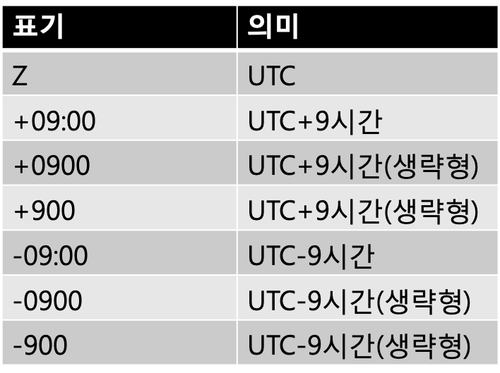

## 5-4 시간 표현

>이번에는 시간 표현과 그 조작의 구현에 대해 설명한다. 국제 규격에 기초하여 시각을 표현하도록 하자. 타임 존도 대응하여, 시각의 더하기 및 빼기도 가능하게 만들도록 하였다.
>
>UNIX표준 API가 이에 충실하지는 않기 때문에, 설계와 구현에 어려움이 많았다.


이번에는, 시간 표현과 그 조작의 구현에 대하여 생각해 보자. 스트림 타입 데이터 처리에 있어서도, 시간의 조작은 나름대로 자주 발생한다. 

예를 들어, 도쿄의 강수량 데이터로부터 그래프를 그리는 태스크를 생각해 보자. 몇 년, 몇 월, 몇 일에 몇 밀리미터의 비가 내렸다는 CSV데이터를 읽어 들여, 이를 그래프화 하는 것이다.

좀 더 나아가서는 월별, 년별의 평균을 계산하는 등의 처리도 필요하게 될 것이다. 이렇게 되면 ‘시간’이라고 하는 것을 데이터로서 취급하는 것이 필요하게 된다.

시간(또는 시각)은 대부분의 경우

```
2016-06-01
```

와 같이 문자열 표현이 사용된다. 하지만, 문자열대로라면, 크기 비교 정도 이외에는, 경과일 수 계산 등의 작업은 쉽지가 없다. 프로그래밍에 있어서도, 시간을 시간으로 취급하고 싶은 것은 자연적 욕구이다. 


#### 시간과 시각

그런데,  ‘시간’ 이라고 하는 단어는 여러가지 의미로 사용되고 있다. 시간의 길이(예 : 이 원고를 작성하는데 걸린 시간은 2주였다)로도 사용되며, 어떤 순간의 시간적 위치를 나타내는 경우에도 사용된다(예: 지금 시간은 2016년 5월 1일 오전 10시이다). 이렇게 애매한 표현은, 때때로 곤란함을 초래한다. 여기에서는 앞으로 어떤 특정 시간적인 위치를 ‘시각(時刻)’ 이라고 부르도록 하겠다. 영어로 표현한다면 ‘time stamp’가 되겠다. 

한편, 시간의 길이는 ‘duration’이라고 한다. 적절한 일본어가 생각이 나지 않지만, 억지로 적는다면 ‘시간 간격’ 이라든가 ‘지속시간’ 이 되겠다. 그런데 이 의미를 한정시켜 ‘시간’이라는 말을 쓰는 사람도 있는 것 같다. ‘시(時)’ 와 ‘간(間)’ 이어서,  용어로서는 적절할지 모르겠지만, 경우에 따라서는 이것도 혼란을 초래할 수 있겠다는 생각이 든다. 


#### 시각의 문자열 표현

사람은 시각의 표현하는데 있어서 다양한 방법을 사용한다. 특히 날짜의 표현은 문화에 상당히 의존적이다. 예를 들어 일본에서는

```
2016년 5월 1일
```

형태로 표현하지만, 미국에서는

```
May 1 2016
```

형태로 쓰는 경우가 많다. 하지만 유럽에서는

```
1 May 2016
```

순서로 쓴다. 

이런 상황은 혼란의 원인이 되기 때문에 시각의 표현방법을 규정하는 국제규격이 있다. 이것이 ISO8601이다.

ISO8601에서는

```
20160501(기본형식)
```

또는

```
2016-05-01(확장형식)
```

의 형태로 날짜를 표현한다. 경과시간(duration)도 포함하는 경우, 

```
20160501T100000+0900
```

또는

```
2016-05-01T10:00:00+09:00
```

처럼 표현하게 된다. 기본 형식은 수치와 구별이 구별되지 않기 때문에, 실제 시각표현에는 확장 형식 쪽이 많이 사용되는 것 같다. 


#### 시각의 표현 방법

 ISO8601을 사용하면, 시각을 문자열로 표현가능하게 되지만, 문자열표현 그대로는 프로그램으로 쓰기는 어렵다. 여기서, 시각 데이터 타입을 도입하는 것을 생각할 수 있지만, 시각을 어떻게 표현하는게 적절할까?

시간이라고 하는 것은 과거부터 미래로의 1차원적인 흐름이기 때문에, 수치로 표현하는 것이 적절할 것 같다.  많은 시스템에서는 시각은, 원점이 되는 어떤 특정의 시각(에폭(epoch)이라고 부른다)으로 부터 경과 시간에 따라 시각을 표현한다. 

Linux를 포함한 많은 UNIX시스템에서는, 1970년1월1일00:00(UTC)를 에폭으로 한다. 경과시간은 초에 따라 표현한다. 결국 2016-05-01T10:00Z는, 에폭인 1970-01-01T00:00Z 부터 경과된 시간을 초로 표현한 1462096800로 표현된다. 예를 들어 현제 시각을 추출하는 시스템 콜 time(2)는, 아래와 같은 API이다. 

```
time_t t = time(NULL);
```

t에는 에폭으로부터 경과된 초가 정수로서 주어진다. 하지만, 항상 초단위로 커뮤니케이션을 하는 법은 없으며, 1초 이하의 정보를 추출할 필요가 있는 경우도 있다. 

UNIX에서도 이를 생각했던 것일까? 새로운 시스템 콜인 gettimeofday(2)가 추가 되었으며, 단위는 초 이하의 시각이 마이크로 초 단위로 주어진다. 

```
struct timeval tv; 
gettimeofday(&tv, NULL); 
tv.tv_sec; // =>  초수 
tv.tv_usec; // => 마이크로 초
```

마이크로 초인데 usec가 좀 이상하게 보일지도 모르겠다. 이는 마이크로(100만분의 1)를 의미하는 그리스 문자 μ(뮤)와 알파벳 u가 비슷하게 보여 이렇게 이름을 붙인것이라고 한다.

그 후, 더욱 더 세밀한 시각 단위가 필요하다고 생각했던 것일까?, POSIX.1-2008에서는 보다 새로운 시스템 콜인 clock_gettime(2)가 추가되어 있다. 

```
struct timespec tp; 
clock_gettime(CLOCK_REALTIME,&tp) tp.tv_sec; // => 초수
tp.tv_nsec; // => 나노 초
```

clock_gettime(2)의 1초 미만의 부분은 마이크로 초가 아닌 나노초 단위이다. 

UNIX에서는 1970년 1월1일부터의의 초단위 시각을 표현하고 있지만, 모든 시스템에서 같은 표현을 쓰고 있지는 않다. 예를 들어 Windows NT에서는, 에폭을 1601년 1월1일로, 경과시간을 초단위가 아니는 100나노초 단위로 표현한다.


#### 시각 타입 구조체

그러면, 바로 시각을 표현하는 데이터 타입을 Streem에 추가해보자. 이전에,  kvs의 구현등에서 수행하였던 것과 기본적으로 구조는 동일하다.

우선은, 시각을 표현하는 구조체의 정의를 (그림 1)과 같이 한다. 메소드를 가지는 구조체의 첫 부분에는 

```
STRM_AUX_HEADER;
```

라고 하는 매크로를 배치한다. 실제로 시각을 표현하는 타입으로서 ‘struct timeval’을, 시차를 표현하는 정수로서 ‘utc_offset’을 준비하고 있다. struct timeval은 (그림 2) 와 같은 정의의 구조체로서, 마이크로 초의 시각이 표현 가능하다.

```
struct timeval {
  time_t      tv_sec;  /* seconds */ 
  suseconds_t tv_usec; /* microseconds */
};
```

(그림 2)struct timeval의 정의

struct_timeval의 채용에 관련하여, man 페이지에서는 (그림 3)과 같은 신경이 쓰이는 내용이 있었다. 

‘비추천’ 이라는 것은 말 그대로 안쓰는게 좋다는 의미이다. obsolete는 ‘오래 되다’는 의미로 ‘폐지 예정’ 에 가까운 뉘앙스가 있다. 

```
POSIX.1-2008 marks gettimeofday() as obsolete, recommending the use of clock_ gettime(2) instead.
역:POSIX.1-2008에 의하면, gettimeofday()는 비추천으로 대신에 clock_gettime(2)의 이용을 추천한다.
```

<center>
    (그림 3) gettimeofday의 man 페이지
</center>


그래서 clock_gettime()의 채택을 신중하게 해야겠다고 생각하여 조사를 해 보았는데, MacOS에서는 아직 clock_gettime()이 미구현되어 있다고 한다. POSIX.1-2008이라고 하는 몇년 전의 규격에서 정의 되어 있는 것을 미구현했다는 것을 어떻게 봐야 할까, 라고 생각했지만, 이식성을 생각한다면 없는 것은 어쩔 수 없는 것 이다. gettimeofday()을 그대로 쓰기로 하자.

시각의 UTC로부터 시차를 초단위로 표현하는것이 utc_offcet이다. 예를 들어 일본은 UTC보다 9시간 앞서고 있어, 일본 시간을 나타내는 시간의 utc_offset은

```
9×60×60 = 32400
```

이 된다.

원리주의적인 입장에서 보면, 시각 타입에 시차정보는 필요치 않다. 어느 순간을 표현하는 시각에서 시차는 의미가 없다. 일본에서의 오후9시는, UTC의 정오가 되며, 이는 표현은 다르지만, 같은 시각을 의미한다. 시각 정보는 이를 문자열표현으로 변환할 때 필요한 것이다. 만일 어떤 시각이 9시라고 하는 정보는, 그 타임 존의 정보가 없이는 의미가 없다. 하지만 시각에는 출신 정보가 있어, 예를 들어

```
2016-05-01T10:00:00+09:00
```

라고 하는 표현으로부터 만들어지는 시각에  디폴트로 타임 존에 표시되면 좋겠다는 생각 드는 것은 당연한 것이다. 이에,  타임존을 지정해서 생성된 시각 데이터에는 시차정보를 집어 넣어 표시의 디폴트로 하도록 했다. 


#### UTC

지금까지 UTC라고 하는 말을 설명 없이 써 왔지만, 한번 여기서 제대로 설명을 해 두도록 하겠다. UTC(Coordinated Universal Time)은 시각의 원점이다. 첫글자를 따서 CUT라고 하지 않는 것에는 심오한 이유가 있다고 한다. 규격 제정시 이 용어의 정식 명칭에 대해, 영어의 Coordinated Universal Time과 프랑스어의 Temps Universel Coordonne 사이에 심한 줄다리기가 있었고, 결국 어느 쪽도 아닌 UTC가 채용되었다고 하는 이야기를 들은 적이 있다 .

예전에는 시각의 원점이 영국의 그리니치 천문대의 이름을 따서 GMT(Greenwich Mean Time)이라고 불렀다. 천문계측에 사용되는 GMT 대신에 보다 정확함을 추구하는 UTC는 세슘133이 91억9263만1770회 진동하는 시간을 1초 단위로 원자시계로 계측해서 구한 것이다. 지구의 자전속도의 흔들림에 의해 GMT와 UTC간에 미묘한 차이가 발생한다. 이를 보정하기 위해 드물게 ‘윤초’ 가 삽입된다. 

윤초는 상당히 귀찮은 문제로, 예를 들어 2012년7월1일에는 윤초삽입 문제로 광범위한 장애가  발생했었다.


#### 시간 타입 데이터의 생성

그러면 시간 타입 데이터 생성을 생각해 보자. (그림 4)는 현재시각을 생성하는 now()함수의 구현이다. now()는 생략 가능한 인수가 하나 있으며, 지정되면 타임 존을 의미 한다.(표 1)



<center>
    (표 1) 타임존 지정표기
</center>


```
static int
time_now(strm_stream* strm, int argc, strm_value* args, strm_value* ret) {
  struct timeval tv; int utc_offset;
  switch (argc) { 
  case 0:
    utc_offset = time_localoffset();
    break;
  case 1: /* timezone */
    {
      strm_string str = strm_value_str(args[0]);
      utc_offset = parse_tz(strm_str_ptr(str),strm_str_len(str)); 
      if (utc_offset == TZ_FAIL) {
        strm_raise(strm, "wrong timezeone");
        return STRM_NG; 
      }
    }
    break; 
  default:
    strm_raise(strm, "wrong # of arguments");
    return STRM_NG; 
  }
  gettimeofday(&tv, NULL);
  return time_alloc(&tv, utc_offset, ret); 
}
```

<center>
    (그림 4) now의 구현
</center>


타임 존의 지정 방법에는, 예를 들어 일본표준시로 ‘JST’와 같은 생략형을 쓰는 것과, ‘Asia/Tokyo’와 같은 도시명을 사용하는 것도 있다. 하지만 Japan Standard Time과 Jamaica Standard Time(이 있다고 한다면)의 혼동이 발생할 수 있으며, 세계각지의 도시명의 테이블이 필요로 한다. 이를 위해 이번에는 이의 대응은 하지 않도록 하겠다. 

time_now()가 하는 일은 단순히 인수를 처리하여, gettimeofday(2)로 현재시각을 취득하여 time_alloc()을 호출하는 것 뿐이다. 

(그림 5)에서 보여주는 것과 같이, time_alloc()의 구현도 전혀 어렵지 않다. 통상의 Streem객체의 초기화(type과 ns의 설정)을 한 후, 주어진 struct timeval의 tv_usec을 정규화 하고 음수와 1초를 넘기는 값은 버리도록 조정하는 것 뿐이다.

```
static int
time_alloc(struct timeval* tv, int utc_offset, strm_value* ret) {
  struct strm_time* t = malloc(sizeof(struct strm_time));
  if (!t) return STRM_NG; 
  t->type = STRM_PTR_AUX; 
  t->ns = time_ns;
  while (tv->tv_usec < 0) {
    tv->tv_sec--;
    tv->tv_usec += 1000000; 
  }
  while (tv->tv_usec >= 1000000) { 
    tv->tv_sec++;
    tv->tv_usec -= 1000000;
  }
  memcpy(&t->tv, tv, sizeof(struct timeval)); 
  t->utc_offset = utc_offset;
  *ret = strm_ptr_value(t);
  return STRM_OK;
}
```
<center>
    (그림 5)time_alloc()의 구현
</center>


#### 시차 구하는 방법

실제로, 구현 시에 어려웠던 부분은 위에서 언급한 부분이 아닌, 로컬 타임과 UTC의 시차를 구하는 함수인 time_localoffset() 의 구현시였다.

처음에는 로컬 타입으로 ‘1970-01-01T00:00:00’에 대응하는 시각을 구하면 시차가 구해질 수 있지 않을까 하는 아이디어가 있었다. 하지만, Twitter에서 ‘1970년과 현재의 시차가 다른 경우가 있다’ 는 지적을 받았다[^1].

일본에서는 통상 타임존의 변화가 없기 때문에 잊기쉽지만, 섬머타임을 도입한 국가가 많고, 최근에는 북한이 자국의 타임존을 +9:00에서 +8:30로 바꾼 사례가 있다. 실은 일본에서도 1948년부터 1952년까지 섬머타임이 도입된 적이 있다고 한다. 

1970년 1월시점의 시차에는 대응이 불가능한 케이스가 많이 있었다. 그러면 이를 어떻게 해야 되는지 고민을 하였는데, 다시 트위터를 통해 gmtime(3) 과 mkrime(3)을 사용하면 간단히 해결되는 것을 배울 수 있었다[^2] . 140문자 이내의 코드로 작성되는 것을 보고 놀랐었다.

트위터를 통해 배운 코드를 베이스로 약간의 수정을 한 것이 (그림 6)이 되겠다. 엄밀히 말하면 (그림 6)의 코드에서는 프로그램 실시중에 타임존이 변화한 경우의 대응은 불가능하다. 하지만, 여기에서는 신경쓰지 않기로 하자. 앞으로 세계를 무대로 활약하는 어떤이의 디바이스에 Streem을 동작시키고 싶은 니즈가 발생하면 생각해 보도록 하겠다... 고 생각했지만, 국가에 따라서는 윈터타임과 서머타임의 교체는 연 2회 발생하기 때문에, 이 타이밍으로 프로그램이 실행한다는 것이 충분히 있을 수 있기 때문에, 대응하지 않으면 안되겠다. 


```
static int time_localoffset() {
  static int localoffset = 1;
  if (localoffset == 1) { 
    time_t now;
    struct tm gm;
    double d;
    now = time(NULL); 
    gmtime_r(&now, &gm);
    d = difftime(now, mktime(&gm)); 
    localoffset = d;
  }
  return localoffset; 
}
```

<Center>
    (그림 6)로컬타임의 시차를 구하는 방법
</center>


이 코드의 핵심은, gmtime(3)의 사용 방식에 있다. gmtime(3)은 time_t로 표현되는 초단위의 현재시각을, UTC 날짜와 시간표현으로 분할한 struct tm으로 변환하는 함수이다. 로컬타임에서 struct tm으로 변환하는 함수는 localtime(3)이다. (_r이 붙어있는 것은 쓰레드 세이프 버전). 그리고 mktime(3)은 struct tm에서 time_t로 변환하는 localtime(3)을 거꾸로 수행하는 함수이다.

그럼 gmtime(3)을 사용하여 UTC로 표현한 날짜를 mktime(3)을 사용해 로컬 타임 time_t로 변환하면, 시차가 반영된 시각이 구해진다. 이후에는 difftime(3)을 써서 차이를 구하면 초단위의 시차가 구해질 수 있다. 

UNIX의 시간함수는 초단위, 마이크로초단위, 나노초단위 등이 혼재되어 있어, 플랫폼에 따라 사용할 수 있기도 하고 할수 없기도 하여, 시차의 취급이 그렇게 충실하게 되어 있지 않다. 이때문에 솔직히 그렇게 사용하기 쉽지는 않지만, 이렇게 지혜를 짜내어 기능을 조합해보면, 의외로 뭔가가 나오게 된다.


#### 시각 조작의 구현

다음에는, 시각 타입의 메소드를 정의하겠다. 우선 정의할 메소드는 (표 2)의 4가지 이다.


<center>
    (그림 2) 시각 타입의 메소드
</center>


주의할 것은 빼기 메소드의 타입이다. 시각에서 시각을 빼면 경과시간(duration)이 구해진다. 이를 어떤 타입으로 표현할지는 고민되는 문제이다. 방법으로는, duration을 표현하는 데이터 타입을 도입하는 방식과, 경과한 초시간을 수치(부동소수점수)로 표현하는 방식이 있다.

부동소수점수를 채용한 경우 염려되는 것은 시각정보를 표현할수 없을지도 모른다는 것이다. 

struct timeval의 사이즈는 64비트, 부동소수점수도 사이즈는 64비트이지만, 부동소수점수에 실질적인 수치표현에 사용하는 것은 가수부 52비트 뿐이다. 원래 마이크로 초시간은 최대 100만미만이며, 20비트로 표현이 가능하다. 이때문에 초시간부가 32비트로 표현가능한 2038년까지는 이것으로 어떻게든 버틸 수 있을 것이다.

심플함을 중시하기 때문에, 이번은 시각끼리의 빼기연산은 결과를 부동소수점수로 표현하도록 하였다.

이후 주의해야 할 점은 빼기는 시각끼리 뿐만 아니라, 시각과 수치의 빼기도 가능하게 할 것과,  문자열 변환함수 string()은 생략가능한 인수로서 포맷을 취해, 시각을 임의의 타임존으로 표현가능하게 할  것이 아닐까?


#### 임의의 타임존의 시각 표시

임의의 타임존에서의 시각표시에도 조금 연구가 더 필요해 소개를 해 두겠다. 어느 시각으로부터 임의의 타임존을 반영한 시간표현(struct tm)을 얻는 방법은 명확하지는 않다. UNIX의 시간함수는, UTC과 로컬 타임 중 어느 것을 다룰까와 같은 것 밖에 설계되어 있지 않기 때문이다. 

하지만, 보기에는 어렵게 보이는 처리도, 조금만 연구하면 실현가능하다. 수초단위인 시각을 나타내는 time_t와, UTC에서의(초단위의)시차 utc_offcet로부터, 그 타임존에서의 struct tm을 얻는 함수 get_tm의 구현을 (그림 7)에 나타내었다.

```
static void
get_tm(time_t t, int utc_offset, struct tm* tm)
{
    t += utc_offset;
    gmtime_r(&t, tm);
}
```

<center>
    (그림 7) 임의의 타임 존의 tm을 얻는 함수
</center>


구현이 상당히 심플하기 때문에 맥이 빠질지도 모르겠다. 임의의 타임존의 UTC와의 시차만큼의 시각에 대해 gmtime_r(3)을 적용하는 것으로, 그 타임존에의 struct tm이 얻어지질 수 있다.  생각해 보면 당연한 것이지만, 나조차도 너무 간단해서 좀 놀랐었다.


#### 시각의 리터럴

그럼 이와 같이 Streem에 시각 타입을 도입하였지만, 이번 기회에 시각 리터럴(수치와 문자열을 직접 기술한 정수)도 도입하도록 하자. 시각 리터럴을 가지는 프로그래밍언어는 그렇게 많지 않지만, 데이터 처리에 있어서 시각 처리의 중요성을 생각하면, 리터럴이 있다고 해도 그렇게 이상하지는 않을 것이다.

여기서 시각 리터럴을 어떻게 표기할지 문제가 있지만, 가능하면 ISO8601을 사용하려고 한다. 하지만, 


```
2016-05-01
```

와 같은 표현은, 정수의 빼기 계산식처럼 보여져 이대로 사용할 수는 없다. 여기서 JIS X 0301을 참고하여 날짜의 구분자를 ‘.’ 로 해 보자. 결국 Streem의 시각표현은 아래와 같이 될 것이다.

```
2016.05.01 
2016.05.01T00:00:00Z 
2016.05.01T00:00:00.342Z 
2016.05.01T00:00:00+09:00
```

이렇게 하면 편리할 것이라 생각했으나, 시각표기중에 타임 존을 나타내는 플러스나 마이너스를 포함하고 있어, 조금 혼란을 초래할 것 같다. Ruby등은 시각리터럴을 가지고 있지 않고, 아래와 같은 형식 메소드 호출로 시각 객체를 생성하고 있다.

```
Time.new(2016,5,1,0,0,0)
```

이것으로 과연 충분할지에 대한 고민이 된다. 뭐 시각 리터럴은 간신히 구현하였기 때문에 이대로 남겨놓지만, 한동한 써 보고 쓸 수 없다고 생각되면 나중에 삭제할 지도 모르겠다.  아직 유저가 없는 언어라서 얼마나 다행인지 모른다.


#### 시각 리터럴의 구현

시각 리터럴의 구현은 그렇게 어렵지는 않다.  구문 해석기인 lex.l에 시각 리터럴을 해석하는 정규표현을 추가한 후에, 시각 리터럴을 표현하는 노드를 추가만 하면 끝난다. 실제 lex.l의 변경 포인트는 (그림 8)과 같이 된다. 그 다음에는 srtptime(3)등을 사용하여 문자열표현을 struct timeval로 변환하기만 하면 된다. 지금까지 준비되어온 루틴을 활용한다면 큰 어려움은 없을 것이다.

```
DATE [0-9]+\.[0-9]+\.[0-9]+
TIME [0-9]+":"[0-9]+(":"[0-9]+)?(\.[0-9]+)? 
TZONE "Z"|[+-][0-9]+(":"[0-9]+)?
%%

{DATE}("T"{TIME}{TZONE}?)? {
  lval->nd = node_time_new(yytext, yyleng);   LEX_RETURN(lit_time);
};
```

<center>
    (그림 8) lex.l의 변경 포인트
</center>


#### CSV의 시각 대응

시각 리터럴 보다 중요한 것이 있다. 바로 CSV의 시각대응이다. 예상되는 Streem의 유즈케이스에서 날짜와 시각 데이터를 입력원으로 가장 유력한 것은 CSV파일이다. 

현재는 CSV파일명 필드에서 문자열인지 수치인지를 자동으로 판별하도록 하고 있으나, 여기에 시각데이터로의 대응을 추가한다. 필드의 값이 ISO8601형식 또는 Streem시각리터럴 형식이면, 이는 시각 데이터로 보고, 시각 객체로 변환한다. 

간단하다고 생각하여 손을 대었지만, 지금까지의 부동소수점수의 대응에 큰 버그가 있어서, 오히려 이를 원상복구 하는데 수고가 더 많이 들어갔다. 

이번 일련의 개발에서도 발견하지못한 중대한 버그가 여기저기 보여서, 슬슬 언어사양의 테스트를 도입할 필요가 있을 것 같다. 


#### 마치며

이번회에서는 Streem에 시각 데이터대응을 추가하였다. 오랫동안 UNIX 프로그래머로서, 보통은 UNIX가 제공하는 기능과 API에는 만족하고 있지만, 시간 관련 API에 대해서는 불완전함이 눈에 띄고 있다. 특히 이번과 같이 UTC가 로컬타임이 아닌 타임존을 취급하려고 하면, 갑자기 어려움이 빠지게 된다. 

시간과 날짜의 취급은, 원래 상당히 복잡하여, 어디라도 API의 설계에는 수고가 따르게 된다. 

Ruby도 예외는 아니어서, Ruby의 시각을 다루는 Time클래스와 날짜를 다루는 Date클래스의 설계도, 여러가지 사정을 반영하다 보니 상당히 복잡해지고 있다.


<hr>

### 타임머신 칼럼

***복수개의 타임존에 훌륭하게 대응***

> 2016년 6월호 게재분이다. 우리들이 시간이라는 것을 생각하면, 과거부터 미래로 흐르는 상당히 심플한 것을 떠올린다.  또한 물리의 기본적으로 자주 등장하는 값이어서 수학적인 의미로의 값으로 인식하기 쉽다.
>
> 하지만, 프로그래밍에서 시각과 시간을 다루려고 하면 의외로 문화와 정치에 관련된 요소가 많이 포함되어 있다는 것을 발견한다. 예를 들어 시각을 어떻게 표현할까는 문화에 의존한다. 타임 존과 시차는, 국가와 지역별로 정치에 의해 결정된다. 윤초가 언제 적용되는지도 관측에 의한 차이에 기초하여 회의에서 결정되고 있다.
>
> 원래 UNIX와 이를 표준규격화한 POSIX는 시각과 시간의 처리에 관련해 그렇게 관심을 가지지 못했던 것 같다. API가 그렇게 충실하지 못하다. 이번에는 POSIX의 함수만을 사용하여 복수의 타임존을 취급하는 어려움에 정면으로 도전을 해 보았다. 많은 고민이 있었지만, 기대 이상으로 성과가 잘 나와 상당히 만족스럽다.


[^1]: https://twitter.com/nalsh/status/717021969758040064
[^2]:https://twitter.com/unak/status/717026294337122304