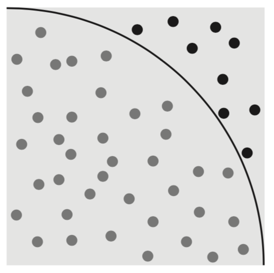
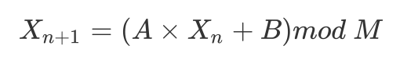
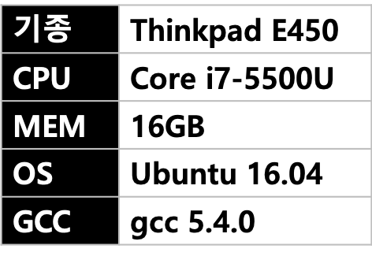
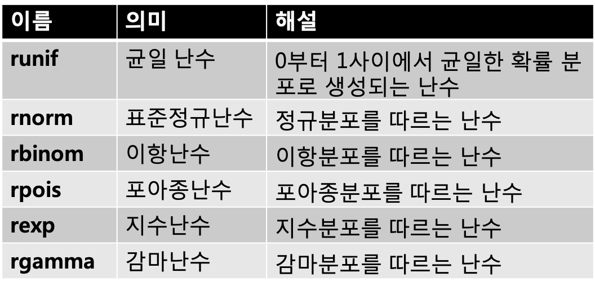

## 5-6 난수(亂數)

> 주사위로 얻을 수 있는 난수는, 게임 등에서 자주 쓰이고 있고, Streem에서의 데이터 처리에서도 많은 활약을 한다. 이번에는 난수의 구현과 응용에 대해 기초적인 부분을 학습하겠다. 

난수는 규칙성 없이, 어떤 수가 얻어지는지 모르는(랜덤으로)수를 일컫는다. 예를 들어, 주사위를 굴리면 1부터 6까지의 수가 얻어지지만, 무엇이 나올지는 모른다. 실제 주사위에서는 어떤 면도 똑같이 위가 나오도록, 각 면 및 패인 구멍의 깊이가 신중히 만들어진다고 한다. 따라서, 주사위를 충분히 많이 굴리면, 모든 면에 대해 위가 되는 확률이 동일하게 된다.

컴퓨터에서는 난수는 여러가지 상황에서 사용된다. 예를 들어, 대부분 게임에서는 다양한 형태로 난수가 사용되고 있다. 게임 이외에도, 예를 들어 ssh와 https의 통신에서 암호화에도 사용된다. 

데이터 처리의 영역에서 난수를 이용하는 대표적인 예로서 ‘몬테카를로 방법’이 있다. 몬테카를로 방법은 난수를 이용하여, 계산 하는 기법으로, 일례로 난수에 의한 원주율을 구할 수 있다 (그림 1)


 

<center>
    (그림 1) 몬테카를로 방법의 예
</center>


정사각형 안에 난수로 좌표를 정해 많은 점을 찍으면, 그 중에 1/4원내에 포함된 점과 바깥에 위치한 점이 생기게 된다. 여기서 원의 안쪽에 포함된 점의 개수를 전체의 수로 나누면, 그 값은 대략 π/4가 되며, 점의 개수가 많으면 많을수록 더 정확해진다.  이것이 몬테카를로 방법에 의한 원주율을 구하는 방법이다.

몬테카를로 방법 외에도, 5-5절에서 소개된 ‘레저보어 샘플링’에서는 난수를 이용한 다수의 데이터로부터 편중됨 없이 샘플링을 하고 있다. 

또한, 난수를 이용하여 효율을 높이는 ‘무작위 알고리즘(Randomized algorithm)’과 같은 것도 있다. 무작위 알고리즘에는, 오차 허용에 따라 속도가 붙는 ‘블룸 필터’ 와 같은 것이 있다. 


#### 진성난수와 의사난수

컴퓨터에서는 주사위를 굴려 얻는 난수(진성난수)는 없다. 하지만, 진성난수가 아니라도, 뭔가 계산에 의해 ‘난수 같은 수’를 얻는 것은 가능하다.

가장 간단한 방법으로서는, 시각 정보를 사용하는 것이 있다. 현재의 초 값과, 이용 가능한 시각정보에 따라서는 마이크로 초나 나노초 단위의 시각 정보를 이용하여, 랜덤한 수치를 얻는 것이다. 옛날 마이콘 Z80에서는, 메모리를 리프레시하는 타이밍 정보를 유지하고 있는 R(리프레시) 레지스터의 값(1 ~ 127)을 난수로서 이용했었다고 들었다. 

의사난수는 계산에 의해서도 얻어진다. 의사난수를 얻는 알고리즘은 몇가지가 알려져 있는데, 대표적인 것에는 아래와 같은 것이다 있다. 

* 선형 합동법
* 메르센 트위스터(Mersenne Twister)
* Xorshift

계산에 따라 구하는 의사난수의 특징은, 재현이 가능하다는 것이다. 결국, 같은 초기값으로부터 계산을 시작하면 전부 동일한 난수열이 얻어지는 것이다.

재현이 가능하다는 것은, 난수의 ‘규칙성이 없는, 어떤 수가 얻어지는지 모르는 수’ 라고 하는 성질과는 모순이 되는 것이다.  하지만, 이것도 이것대로 편리한 경우가 있다. 예를 들어, 난수를 사용해서 어떤 시뮬레이션을 한다고 하자. 의사난수를 이용하여, 같은 초기값으로부터 같은 난수열을 얻을 수 있다는 것은, 모두 같은 시뮬레이션 결과를 재현 가능하다는 것도 된다. 시뮬레이션 결과를 추가로 시험하는 경우 등에서는, 이 재현성이 아주 ‘고마운’ 것일 수 있다.


#### 의사 난수의 평가

의사난수열을 생성하는 알고리즘이 여러 개 있다는 것은 앞에서 기술하였다. 이들 알고리즘이 어떻게 다를까? 어떻게 평가를 해야 좋을까? 

의사 암호 알고리즘의 평가기준에는 아래와 같은 것이 있다.

* 편향
* 주기
* 속도(계산량)
* 암호론적 안전성


‘편향’은, 그 알고리즘이 어느정도 ‘진성난수’로부터 떨어져 있는지를 보여준다. 알고리즘에 따라 생성되는 난수에 편향이 발생하며, 예를 들어 어느 특정 수치의 배수가 등장하기 쉬운 경우 등이 편향이다.

계산에 의해 구해지는 의사난수열은, 어떤 것이라도 같은 패턴을 반복하기 쉽다. 그런 경우, 같은 패턴이 발생할 때까지의 길이가 ‘주기’이다. 주기가 짧은 의사난수 알고리즘은, 다음 값이 예상하기 쉬우며, 편향이 크다고 말할 수 있다.

편향과 주기는 이 암호 알고리즘의 고유한 성질이다. 개별 암호 알고리즘이 왜 그런 성질을 가지는지는 수학적으로 정해진 것이지만, 거기까지 설명하는 것은 솔직히 내게는 버거울 것 같다.

여기에서는 ‘그런 것이 있다’ 정도로 이해해 주길 바란다.

‘속도’는, 다음 난수를 계산하는데 필요한 계산량을 의미한다. 통계와 시뮬레이션 등의 분야에서는 대량의 난수를 필요로 한다. 이 경우, 너무 계산량이 많은 의사난수 알고리즘에서는, 암호를 구하는 시간이 처리전체에 대한 병목이 되어 버린다. 

‘암호학적 안전성’은 그 알고리즘을 암호의 분야에 이용하여도 안전한지를 보여주는 것이다

암호의 분야에서는 키 생성과 OTP(One Time Pad)등 난수를 필요로 하는 경우가 많이 있다. 여기에 어설픈 의사난수를 이용하면, 거기가 구멍이 되어 암호가 깨져 버릴 위험성이 있다. 

암호론적 안전성을 구현하기 위해서는, 생성된 난수가 편향이 없어야 하는 것 뿐만 아니라, 도중에 상태가 어느 정도 드러나도, 암호가 깨지지 않는 성질을 가질 필요가 있다. 이것은 상당히 어려운 조건이지만, 그래도, 예를 들어 ‘Blum-Blum-Shub’과 같은 암호론적으로 안전한 의사난수 알고리즘은 존재한다.  또한, 통상 의사난수 알고리즘으로 생성된 난수에 암호로 사용되는 ‘일방향함수[^1]’를 적용하는 것으로, 암호론적인 안전성 보장은 가능하다. 하지만, 어떤 것도 안전성의 구현을 위해서 그 나름의 비용이 들기 때문에, 보통의(예를 들어 통계와 같은) 경우에는 오버스팩이 된다.

이번에 소개하는 의사난수 알고리즘은, 어느 것도(그대로는)암호론적으로는 안전하지 않다. 여기에서는, 암호목적에 난수를 사용하는 경우에는, 어설픈 보통 의사난수 알고리즘을 사용하는 것은 위험하다는 것을 기억해 주기 바란다. 


#### 선형합동법

그럼, (암호론적으로 안전하지 않은)의사난수 알고리즘 중, 대표적인 것을 설명을 하겠다.

첫번째는 널리 실용적으로 쓰였던 의사난수 알고리즘으로 가장 오래된 것은 ‘선형합동법’ 이다. 선형합동법에서의 난수열은, (그림 2)의 점화식에 의해 정의된다. 



<center>
    (그림 2)선형합동법의 점화식
</center>


여기서 A, B, M은 정수로서, M>A, M>B, A>0, B?0이 된다. 이 정수와 초기치 X0의 선택방법에 따라, 난수열의 성질이 결정된다. 

선형합동법의 주기는 최대치도 M이 된다. 하지만, 그 성질은 정수의 선택 방법에 따라 좌우되기 때문에, 부적절한 정수를 선택하면 M보다도 상당히 짧은 주기가 되기도 하고, 편향이 커지기도 한다. 

수식에 그렇게 뛰어나지 못한 나같은 사람을 위해, C에 의한 선형합동법을 사용한 난수열발생 프로그램을 (그림 3)에서 보여준다. 이 프로그램에서는 정수로서

```
A=1566083941
B=1 
M=2^32
```

를 선택하고 있다. 이는 비교적 적당한 정수의 조합으로 알려져 있다.


```
uint32_t rand(void) {
    static uint32_t seed = 1;
    seed = seed * 1566083941UL + 1; 
    return seed;
}
```

(그림 3) C에서의 선형합동법을 사용한 난수발생 프로그램


선형합동법은 그렇게 계산량이 많은 알고리즘이 아니지만, 난수발생 프로그램으로서 그렇게 뛰어난 편은 아니다. 특히 주의해야 할 점은, 하위 비트의 무작위성이 낮다는 점이다. 예를 들어, 선형합동법으로 얻어지는 32비트 난수로 0부터 7까지의 난수를 만들었다고 하면, 32비트 난수가 r일때, ‘r>>29’와 같이 상위 비트를 추출해야 한다. ‘r%8’ 이라든가 ‘r&0xf’와 같은 조작으로, 하위 4비트를 취하면 안된다. 

또한, 선형합동법은 주기가 비교적 짧은 것과, 점화식의 정의에서 알 수 있듯이 어떤 난수가 얻어지면, 그 다음 난수가 고유하게 결정되는 성질이 있다. 따라서 예를 들어 몬테카를로 등에 이용하면 포인트가 균일하지 않고 격자 모양으로 찍히는 현상이 발생할 수 있다. 게임 등이라면 몰라도, 통계 및 시뮬레이션 분야에서 이 알고리즘을 사용하는 것은 주의해야 한다. 지금은 선형 합동 법보다 더 좋은 의사 난수 알고리즘이 몇가지가 알려져 있기 때문에, 그 쪽을 이용하는 것이 바람직하다. 

C 표준 라이브러리는 난수를 얻기위한 함수 rand ()을 제공하지만, 많은 경우 선형 합동 법을 이용하고 있다 (C ISO 표준에서는 rand () 난수 계산에 선형 합동법 의 이용을 규정하고 있지는 않다. 단지 참고 자료로 게재되는 알고리즘은 선형 합동 법이다). 즉, 위의 선형 합동 법의 주의점은 그대로 rand ()에도 적용 가능성이 높다. 경우에 따라서는 시스템이 제공하는 rand ()에 의존하지 않고 독자적으로 의사 난수 알고리즘을 준비 할 필요가 있을 수 있다.


#### 메르센 트위스터

선형 합동법 보다 비교적 새로운 의사 암호 알고리즘이 ‘메르센 트위스터’(Mersenne Twister)다. 메르센 트위스터는 1996 년 히로시마 대학 (당시)의 마쓰모토 마코토(松本眞)와 니시무라 타쿠지(西村拓士)가 발표했다.

메르센 트위스터의 가장 큰 특징은 긴 주기성이다. 선형합동법의 해설에서도 조금 다뤘지만, 거기서는 주기가 짧고 대량의 난수를 이용한 시뮬레이션 등으로 편향이 발생했다. 메르센 트위스터의 주기는 2<sup>19937</sup>-1로 매우 길다. 이것은 10 진수로 표기하면 6000 자리를 넘는 매우 큰 숫자다. 이 2<sup>19937</sup>-1 는 메르센 소수라는 유형의 소수이며, 이 알고리즘의 이름의 유래가 되고 있다.

긴 주기 뿐만 아니라 연속 된 난수 사이의 상관 관계가 작은 것( ‘고차원에 고르게 분포한다 ’는 표현을 쓴다고 한다),  이전의 의사 난수 알고리즘보다 빠르다는 점 등에서 매우 뛰어난 알고리즘이다.
실제로 이 뛰어난 점 때문에, Ruby와 Python을 비롯한 많은 프로그래밍 언어 처리 시스템에서 표준 난수 생성 알고리즘으로 채용되고 있다.

이처럼 우수한 메르센 트위스터도 단점이 없는 것은 아니다. 하나는 내부적인 상태 벡터가 크다는 것이다. 선형합동법에서는 정수 하나 밖에 내부 상태를 가지지 못했지만, 메르센 트위스터는 623개 32 비트 정수를 내부 상태로 유지한다. 이것은 중간 상태를 저장하고 난수열을 재현시킬 경우 약간 처리가 복잡하게 만든다. 이 때문에, 무엇보다 이 623 개의 상태 벡터를 초기화 할 때, 충분한 주의를 기울이지 않으면 난수의 질이 저하되어 버린다. 이러한 점을 개선 한 SFMT (SIMD-oriented Fast Mersenne Twister)라는 알고리즘도 존재한다. 원래 메르센 트위스터보다 2배 빠르다고 선전하고 있는데, 등장한 것이 2006 년으로 나온 지 얼마 안되서 그런지(라고 해도 벌써 10년 전이지만)별로 사용되고 있는 것을 볼 수 없다. 나도 이번 원고를 위해 조사하고 처음 알게 된 정도다. 앞으로는 이것을 이용해 볼 까 생각하고 있다.


#### Xorshift

메르 센 트위스터보다 더 새로운 의사 난수 알고리즘이 Xorshift이다. Xorshift는 George Marsaglia 가 2003년에 발표했다.
Xorshift는 그 이름 그대로 xor (배타적 논리합) 연산과 비트 시프트 연산만을 사용하여 빠른 의사 난수를 얻는 알고리즘이며, 고속으로 난수를 계산 할 수 있다. Xorshift는 주기의 크기가 메르센 트위스터보다 짧지만 (상태 벡터의 크기에 따라 2<sup>32</sup>-1에서 2<sup>128</sup>-1까지 변화하는) 선형합동법에 비해 훨씬 더 큰 임의성을 보여준다. 그러면서도 구현은 매우 간단하다.
Xorshift의 가장 간단한 구현 (상태 벡터가 64 비트)을 (그림 4)에 나타내었다. (그림 4)의 코드에 의한 난수의 주기는 2<sup>64</sup> -1 이다.

```
uint32_t xorshift(void) {
    static uint64_t x = 88172645463325252ULL; 
    x = x ^ (x << 13); 
    x = x ^ (x >> 7);
    return x = x ^ (x << 17);
}
```

(그림 4)Xorshift의 구현


이렇게 간단한 계산으로 뛰어난 난수를 생성 할 수 있으며, 그 방법이 21 세기가 될 때까지 발견되지 않았다는 것은 놀라운 일이다. Xorshift에는 더 랜덤 성을 높인 파생버전인 Xorshift*와 Xorshift+가 있다


#### 의사난수의 초기값

여기까지 설명한 것은, 의사 난수 알고리즘 계산에 의해 랜덤 성이 높은 (것처럼 보이는) 수열을 생성하는 것이다. 그러나 어디 까지나 계산 결과에 따르는 것이므로 진정한 난수가 아니다.
컴퓨터는 기본적으로 결정적으로 작동하는, 즉 동일한 상태에서 시작하면 동일한 결과를 얻을 수있는 것이기 때문에, 진성난수를 취급하는 것은 어렵다.
의사 난수 알고리즘의 초기 값으로, 가능한 예측하기 어려운 값을 도입하여 의사 난수를 더 난수 답게 처리 할 수 있다. 전형적인 초기 값은 시간이 사용된다. OS에서 취득한 현재 시간의 작은 부분 (마이크로 초와 나노초 단위)을 이용하여 실행마다 다른 임의의 초기 값을 얻을 수 있다.

단, 주의해야 할 것은 하드웨어가 실제로 가지고있는 시간 기능은 OS가 제공하는 마이크로 초와 나노 초의 계산 능력을 가지고 있지 않은 것이다. 마이크로 초 단위의 시간을 반환 시스템 호출이 있어도 그 시간이 정말 정확한 마이크로 초 단위는 아니라는 점에 유의해야 한다.
이처럼 믿을 수 없는 시간보다, OS가 더 랜덤한 수치를 얻는 방법을 제공하는 경우도 있다. 


#### /dev/random

외부에서 주어지는 사용자 입력 등은 기본적으로 예측 불가능하기 때문에 난수의 기본이 되는 ‘엔트로피 (혼란) ’를 제공한다.
예를 들어, Linux에서 드라이버 등이 외부 정보를 바탕으로 엔트로피를 모으고 있다. 그리고 ‘/dev/random’이라는 장치 파일을 읽고 출력하여, 모은 엔트로피를 소비해 ‘진성난수’를 얻을 수 있다.
그러나 장치 등에서 모은 엔트로피는 한계가 있다. 너무 많은 난수를 /dev/random에서 읽고 출력하면,  엔트로피를 다 써버리게 된다. /dev/random은 그런 경우 읽고 출력하기를 차단하여 엔트로피가 쌓일때까지 기다린다.
단지 난수 정보를 원하는 것 뿐인데 차단해 버려 곤란한 경우도 발생할 것이다. 이를 위해 다른 장치 파일인  ‘/dev/urandom’ 이라는 것도 있다. /dev/urandom은 엔트로피가 소진 된 경우, 과거의 엔트로피를 초기값으로 암호화론적으로 안전한 의사 난수 알고리즘을 사용하여 난수를 반환한다.(차단하지 않는다)

다른 OS에서도 비슷한 기능을 제공한다. 예를 들어 FreeBSD도 ‘/dev/random’ 를 제공하고 있다. 난수를 반환하는 동작은 동일하지만, 여기서는 처음부터 (암호화론적으로 안전한) 의사 난수 알고리즘을 사용하며, 차단하지 않는다. 그런 의미에서 FreeBSD의 /dev/random은 Linux의 /dev/urandom 에 해당한다고 볼 수 있다. /dev/random에서 얻은 난수는 시간보다 예상하기 어렵고, 좋은 초기 값이다. 실제로 Ruby에서 (이용 가능한 경우) /dev/urandom을 사용하여 수열을 초기화하고 있다. 한편, mruby과 Streem는 임의의 초기화에 시간 정보를 사용하고 있다. /dev/urandom은 Linux 등 일부 OS에서밖에 사용할 수 없기 때문에 이식성을 위해 이렇게 결정했다. 하지만, 너무 이식성을 고려할 필요가 없는 Streem은 시간보다 /dev/urandom을 사용하는 것이 좋을지도 모르겠다.
그러면, 난수 생성에 항상 장치 파일에서 읽어들이면 좋겠다고 생각하는 사람도 있을지 모르겠다. 하지만 이것은 성능이라는 관점에서 보면 의사 난수 알고리즘의 대안이 될 수는 없다.


#### 의사난수의 벤치마크

프로그래머로서 실제로 코드를 작성하고 비교하고 싶을 지도 모르겠다. 그래서 이번에는 소개 한 의사난수 알고리즘을 각각 평가 해 보자. 편향과 주기 등 (구현에 실수 만 없으면)은 이론적으로 정해 지므로, 이번은 우선 성능에 대해 측정한다.  우선, 이번 소개 한 선형합동법, 메르센 트위스터, Xorshift의 3 종류의 알고리즘을 사용하여 1 억 개의 난수를 생성하고 그 실행 시간을 비교하겠다.
실제 벤치 마크 프로그램을 (그림 5)에, 그 출력 결과는 (그림 6)에 나타내었다. 측정에 사용한 컴퓨터의 사양은 (표 1)과 같다.

```
#include <stdio.h> 
#include <inttypes.h> 
#include <sys/time.h>
/* linear congruential method */ 
uint32_t
lcm_rand(void)
{
    static uint32_t seed = 1;
    seed = seed * 1566083941UL + 1; return seed;
}
/* merseene twister */ 
#define N 624
#define M 397
#define M 397
#define MATRIX_A 0x9908b0dfUL /* constant vector a */
#define UPPER_MASK 0x80000000UL /* most significant w-r bits */ 
#define LOWER_MASK 0x7fffffffUL /* least significant r bits */

static uint32_t mt[N]; /* the array for the state vector */ 
static int mti=N+1; /* mti==N+1 means mt[N] is not initialized */
void 
mtw_init(uint32_t s) 
{
    mt[0]= s & 0xffffffffUL; 
    for (mti=1; mti<N; mti++) {
        mt[mti] = (1812433253UL*(mt[mti-1]^(mt[mti-1]>>30))+mti);
        mt[mti] &=0xffffffffUL;
    } 
}

uint32_t
mtw_rand(void)
{
    uint32_t y;
    static const uint32_t mag01[2]={0x0UL, MATRIX_A};

    if (mti >= N) { /* generate N words at one time */ 
        int kk; 
        if (mti == N+1) /* if mtw_init() has not been called, */ 
            mtw_init(5489UL); /* a default initial seed is used */

        for (kk=0;kk<N-M;kk++) {
            y = (mt[kk]&UPPER_MASK)|(mt[kk+1]&LOWER_MASK); 
            mt[kk] = mt[kk+M] ^ (y >> 1) ^ mag01[y & 0x1UL];
        }
        for (;kk<N-1;kk++) {
            y = (mt[kk]&UPPER_MASK)|(mt[kk+1]&LOWER_MASK);
            mt[kk] = mt[kk+(M-N)] ^ (y >> 1) ^ mag01[y & 0x1UL]; 
        }
        y = (mt[N-1]&UPPER_MASK)|(mt[0]&LOWER_MASK); 
        mt[N-1] = mt[M-1] ^ (y >> 1) ^ mag01[y & 0x1UL]; 
        mti = 0;
    }
    y = mt[mti++];

    /* Tempering */
    y ^= (y >> 11);
    y ^= (y << 7) & 0x9d2c5680UL; 
    y ^= (y << 15) & 0xefc60000UL; 
    y ^= (y >> 18);
    return y; 
}

uint32_t 
xor_rand(void) {
    static uint64_t x = 8817264546332525ULL;
    x = x ^ (x << 13); x = x ^ (x >> 7); 
    return x = x ^ (x << 17);
}

#define TIMES 100000000 
#define BENCH(name) do {\
    struct timeval tv, tv2, tv3;\ int i;\
    char *f;\
    name ## _rand();    /* rehearsal */\
    f = #name;\
    gettimeofday(&tv, NULL);\ 
    for (i=0; i<TIMES; i++) {\
        name ## _rand();\ 
    }\
    gettimeofday(&tv2, NULL);\
    timersub(&tv2, &tv, &tv3);\
    printf("func %s: %ld.%06ldsec\n", f, tv3.tv_sec, tv3.tv_usec);\
} while (0)

int 
main() {
    printf("benchmark repeats %d times\n", TIMES); 
    BENCH(lcm);
    BENCH(mtw);
    BENCH(xor);
}

```

<center>
    (그림 5) 의사난수 생성기 벤치마크 프로그램
</center>


```
benchmark repeats 100000000 times
func lcm: 0.305532sec ← 선형합동법
func mtw: 0.963983sec ← 메르센 트위스터
func xor: 0.733444sec ← Xorshift
```

<center>
    (그림 6) 의사난수 생성기 벤치마크 결과
</center>




<center>
    (표 1) 벤치마크 머신 스팩
</center>


이 벤치 마크에서만 보면, 가장 빠른 것이 선형합동법으로 1억회 난수를 생성하는 데 약 0.3 초, 그 다음으로 빠른 것이 Xorshift으로 약 0.73 초, 가장 시간이 걸린 것이 메르센 트위스터로 약 0.96 초였다.

그러나 선형합동법은 난수의 품질에서 논외임을 감안할 때, 주기의 길이와 성능 트레이드오프에서 메르센 트위스터와 Xorshift를 구분하여 사용하는 것이 좋을 지도 모르겠다.  또는 2 배 빠르다고 선전하고 있는 SFMT의 채용을 검토할 수도 있다. 실제로 SFMT도 벤치 마크를 하려고 생각했지만, SSE2 등의 SIMD 명령을 써야 되는 것도 있어서, 소스 코드가 의외로 복잡했다. 따라서 마감 시간에 벤치 마크 프로그램에 추가 할 수 있을만큼 간결한 형태로 정리 할 수가 없었다. 몹시 유감이다.
Xorshift는 메르센 트위스터 보다 2배까지는 빠르지 않기 때문에,  SFMT가 성능이 액면대로라면 주기와 성능을 양립시킬 수 있는 것은 최강이 아닐까 한다. 현재는 나도 이해가 잘 안되고,  잘 쓰지도 못했기 때문에,  앞으로도 연구를 계속하고 싶다.


#### Streem의 난수 기능

현재의 Streem 난수 관련 기능은, 난수 스트림을 생성하는 rand () 함수와, 난수를 이용하여 스트림의 샘플링을하는 sample()함수 2개다.
 rand () 함수는 난수를 하나씩 전달하는 스트림이다. 예를 들어,

```
rand()|stdout
```

를 실행하면 (인터럽트를 걸어 중단될 때까지) 계속 난수를 표시하고 있다. sample() 함수는 상위 스트림의 요소를 인수로 지정한 수만큼 샘플링한다.

```
fread("data.csv")|sample(100)|stdout
```

라고 하면, data.csv에 포함되어있는 행에서 100행만 샘플링하여 표준 출력에 표시한다. data.csv가 비록 수 만 줄이 있어도 균등하게 샘플링 해주는 것이 sample() 함수, 즉 sample()함수가 사용하는  ‘레저보어 샘플링’ 의 매력이다.

이 함수는 난수 알고리즘으로 Xorshift 수정 버전 Xorshift64 <sup>*</sup> (주기 2<sup>64</sup>-1)를 채용하고 있다. 원래 Xorshift의 차이는 난수 생성의 마지막 과정에 곱셈을 사용한다. 따라서 약간 계산 속도는 떨어지지만, 랜덤 성이 향상되고,  DieHard 테스트라고 하는 의사 난수 알고리즘 테스트를 모두 통과하게 된다.

다만, 현재의 Xorshift64<sup>*</sup>은 어쩔 수 없이 주기가 짧기 때문에 실제 통계 처리 등에 사용하기에 품질이 부족할 수도 있다. 앞으로 메르센 트위스터와 SFMT로 대체하는 것도 검토 할 필요가 있을 것이다.


#### 난수의 여러가지 종류

지금까지 설명해온 난수는 일정한 범위의 숫자가 균등 한 확률로 등장하는 ‘균일 난수’ 였다. 그러나 통계 및 시뮬레이션에 필요한 난수는 균일 난수 뿐만이 아니다.
통계 분석을 주요 대상으로하는 언어인 R에는 난수 생성 함수가 많이 준비되어 있다 (표 2)[^2].



<center>
    (표 2) R에서의 난수 생성 함수
</center>


명령 규칙은 ‘r’+ 분포의 이름 (대부분 약어형태)으로 되어 있다. 예를 들면 균일 난수는 균일 분포 (Uniform Distribution) 난수이기 때문에 runif이며, 정규 분포 (Normal Distribution) 난수는 rnorm이 된다.
Streem는 rand()가 runif에 해당한다. 다른 난수 생성 함수는 필요시에 구현하면 된다고 생각하지만, 용도가 명확한 시뮬레이션 등에 즉시 사용할 것 같은 표준 정규 난수 만은 미리 만들려고 생각하고 있다. 이름 짓기가 골치아프지만 Normal Distribution에서 취한 nrand () 또는 rand_normal () 정도는 어떨까? 전자가 컴팩트하지만 앞으로 다양한 분포를 가지고 난수 생성 함수를 제공할 것을 생각하면 어느정도 생략을 하지 않은 것이 좋을지도 모르겠다 (결국 rand_norm ()로 했다)


#### 마치며

이번에는 난수를 생성하는 난수 알고리즘과 그 응용에 대해 설명했다. 특히 Streem이 대상으로 하는 데이터 처리에서 난수는 중요한 역할을 한다. 이 글이 실제로 독자들이 볼 때 까지는 Streem 난수 기능의 구현도 진행해 둘 생각이다.


<hr>

### 타임머신 칼럼

***새로운 알고리즘에 도전했다***

> 2016 년 10 월호 게재 분이다. 난수 생성에 대한 설명이지만, 5-5절의 통계 기초에 이어 수학 적인 주제여서 울고 싶을 정도다. 일단 각종 알고리즘과 그 평가 방법에 대해 나름 열심히 설명을 했다.
> 전통적인 난수 생성 알고리즘으로서는 선형합동법, 비교적 새로운 알고리즘으로는 메르센 트위스터가 유명하지만, 새로운 것을 시도해보고 싶다는 마음에서 이번에는 Xorshift를 채용하여 보았다. 비교적 간단하고 빠르며, 난수의 품질도 좋다는 Xorshift이지만, 파생버전이 많기도 하고, 인터넷에 정보가 다소 꼬여 있어 것이 어려움이 많았다. 수학적 능력이 낮아, 자력으로 정확성을 확인할 수 없었기 때문에, 어떤 정보를 믿어야 할지도 어려움이었다. 우선, 자신이 옳다고 믿는 구현을 준비했는데, 이것이 정말 옳은지 사실 확실치는 않다. 


[^1]: 계산하기는 쉽지만, 역을 구하는 것은 어려운 함수를 의미한다. 다시 말해서, 결과값이 주어졌을 때 입력값을 구하는 것이 어려운 함수이다. (https://ko.wikipedia.org/wiki/일방향함수) (옮긴이)
[^2]:  원서에는 runif를  ‘그냥 난수(いわゆる乱数)’ 라고 설명하였다(옮긴이).