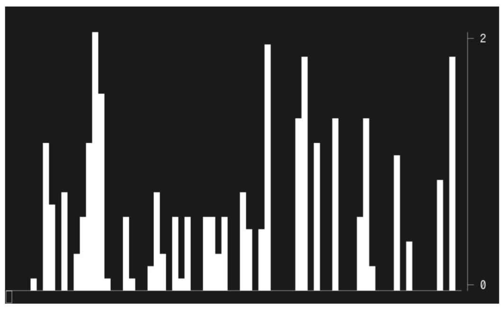

## 5-7 스트림 그래프

> 이번에는 스트림 처리를하는 언어인 Streem에 어울리는, 스트림 입력에서 그래프를 출력하는 절차에 대해 설명한다. GUI 라이브러리는 유행주기가 심하므로 확실하게 오랫동안 사용할 CUI 기반으로 그래프를 출력 해 보자. 그리고 외형을 개선해 나가는 방법도 소개한다.

엔지니어의 대부분은 그렇지 않다고 생각하지만, 난 뭐든지 측정하는것을 좋아한다. 매일 밤 체중계를 오르고, 질병에서 열이 날 때는 15 분 정도마다 체온을 측정하고 변화의 경향을 알아보고저 한다. 또한 PC의 화면에 메모리 사용량, CPU 사용량, 네트워크 전송량 등의 그래프를 표시한다. ‘우주 전함 야마토[^1]’의 함 내에 수많은 측정기가 있었던 것도 비슷한 심리가 아닐까 싶다.
그래서 Streem에 입력 된 데이터를 그래프 화 할 수있는 기능이 있으면 좋겠다고 생각했다. 그러나 그래픽은 좀처럼 다루기가 쉽지 않다. GUI는 플랫폼마다 API가 다르기 때문에, 어떤 GUI 라이브러리를 사용는지에 대한 설명만으로 지면을 다 써버리게 된다.
게다가 GUI 라이브러리의 수명은 일반적으로 프로그래밍 언어보다 훨씬 짧다. Ruby의 초기에 매우 인기있는 GUI 라이브러리 인 Tk가 이제 거의 보이지 않게 된 것을 봐도 분명하지 않은가.
그래서 GUI와 같은 모양에 관한 부분은 제쳐두고 그래프를 표시하는 본질에 대해서만 설명하기로 하겠다.


#### GUI와CUI(와 CLI)

CUI는 GUI (Graphical User Interface)과 대립되는 용어로,  Character User Interface의 약자다. 무엇보다 해외에서 CUI라는 말을 듣는 것은 이제 거의 없기 때문에, 일본에서만 쓰는 용어가 되어버린 것 같다. 해외에서는 CLI (Command Line Interface)라는 말을 더 많이 쓰는 것 같다.
CUI는 캐릭터로 화면 표시를 하기 때문에 수십 년 동안 사용되어왔으며 터미널에서 작동 할 수 있다. 앞으로도 터미널이 없어지는 것은 걱정하지 않아도 좋을 듯 하다. 이번에는 이 CUI를 사용하여 그래프를 표시하는 기능을 만든다.


#### stag

그래서 참고가 될 만한 도구를 찾아보았는데, stag[^2] 라는 도구를 발견했다. stag은 표준 입력에서 수치 데이터를 읽고 그에 대한 막대 그래프를 출력하는 도구다. 예를 들어, (그림 1)과 같이 Streem에서 생성 된 수열에서 그래프를 출력 할 수 있다. 출력 결과는 (그림 2)와 같이된다.

```
streem -e 'rand_norm()|take(100)|stdout' | stag
```

<center>
    (그림 1)stag를 사용한 난수 그래프 출력
</center>


<center>
    (그림 2)stag를 사용한 난수 그래프의 출력 결과
</center>


이것은 나름대로 편리한 도구이지만, Streem에서 데이터를 다른 프로세스에 보내지 않고  직접 그래프를 그릴 수 있다면 더 편리할 것 같다. 그래서 이번에는 stag와 같은 기능을하는 함수를 Streem에 추가해 보자.


#### 화면 구성

먼저 stag의 표시 화면을 (그림 3)과 같이 분할하고, 이를 캐릭터로 출력하면 되는 것이다. 다행히 대부분의 터미널에서는 이스케이프 시퀀스를 사용하여 출력 하려는 문자에 색상을 지정하거나 커서를 이동 할 수 있다. 그 기능을 사용하면 화면의 부분 수정이 가능하다. stag는 CUI를위한 라이브러리 ncurses를 사용하고 있지만, 이번 개발에서는 그다지 많은 기능을 필요로하지 않기 때문에 이스케이프 시퀀스를 직접 이용하여 렌더링 하는 것으로 하겠다.


<center>
    (그림 3)stag의 화면 분할
</center>


#### 이스케이프 시퀀스

최근에는 터미널이라는 말을 들을 때  ‘쉘 명령을 입력하는 창이네’정도의 인상 밖에 없다. 그러나 옛날에는 터미널 (단말)이라고하면, 컴퓨터의 입출력을 위한 기계였다. 현재 우리가 사용하고있는 ‘터미널’은 그 터미널이라는 기계의 기능을 소프트웨어로 실현하는 것이며, 정확하게는 터미널 에뮬레이터라고 불러야 한다.
기계로 터미널이 현역 시절 큰 (라고해도 현재의 관점에서 매우 빈약 한) 컴퓨터에 여러 개의 터미널을 연결하여 작업하는 것이 당연했다. 개인 컴퓨터가 등장하기 이전 시대의 일이었다. 

이 시대의 터미널은, 텍스트를 표시하는 화면과 입력을 위한 키보드가 붙어 있어,  컴퓨터로서의 처리 능력은 없었다.  입력 된 정보를 컴퓨터 (당시는 호스트라고 했다)에 보내고 돌아온 정보를 화면에 표시하는 정도의 기능이 전부였다.
하지만 그러면 너무 표시가 단순했기 때문에 점차 터미널에 이스케이프 문자에 이어 일부 문자를 전송하여 화면을 조작하는 다양한 기능을 호출 할 수 있도록 진화했다. 이러한 문자열을 이스케이프 시퀀스라고 한다. 예를 들어,

```
ESC [ 2 J
```

로 화면을 지울 수 있다. 이러한 이스케이프 시퀀스는 당초 단말기 제조 업체 및 기종마다 달랐다. 그러나 당시 매우 대중적인 DEC의 VT100라는 기종의 이스케이프 시퀀스가 사실상 표준이 되었다. 이번 그래프 기능의 구현으로 사용한 이스케이프 시퀀스를 (표 1)에 나타내었다.


<center>
    (표 1) 대표적인 이스케이프 시퀀스
</center>


#### 윈도우 사이즈 취득

처음에는, 현재의 터미널 창 크기를 가져온다. 창 크기를 얻을 수 있는 방법은 여러 가지 있지만, 여기에서는 ioctl을 사용한다. ioctl은 파일 디스크립터를 대상으로 입출력을 제어하기 위한 시스템 콜이다.

```
ioctl(fd, request, ...);
```

와 같은 형식으로 호출하고,  request에 따른 제어를 커널이 실시한다. 같은 request에 대해서도 디스크립터가  가리키고 있는 장치에 의해 처리가 다를 수 있지만, 거기에 신경 쓸 필요는 없다. 일종의 객체 지향이라고 생각할 수도 있을 것이다. 이 파일 디스크립터를 통해 다양한 객체를 객체 지향으로 관리할 수 있다는 것이, UNIX의 좋은 점이며,  등장시에는 매우 참신했던 부분이었다.

ioctl로 커널에 창 크기를 요청하는 리퀘스트는 TIOCSWINSZ 이다. 인수로 창 크기를 유지하는 구조체 structwinsize의 포인터를 전달한다 (그림 4).

```c
#include <stdio.h> 
#include <stdlib.h> 
#include <sys/ioctl.h> 
#include <termios.h>
static int
get_winsize(int* row, int* col) 
{
    struct winsize w; 
    int n;
    n = ioctl(1, TIOCGWINSZ, &w); 
    if (n < 0 || w.ws_col == 0) {
        return -1; 
    }
    *row = w.ws_row;
    *col = w.ws_col; 
    return 0;
}
int main() {
    int row, col; 
    int n;
    n = get_winsize(&row, &col); 
    if (n < 0 || col == 0) {
        printf("WINSZ failed\n");
        exit(1); 
    }
    printf("WINSZ (%d, %d)\n", w.ws_col, w.ws_row); 
}
```

<center>
    (그림 4)ioctl에 의한 윈도우사이즈 취득
</center>


#### 커서의 이동

커서의 이동은 이스케이프 시퀀스를 사용한다. 대상 파일 디스크립터가 터미널을 가리키면, 이스케이프 시퀀스를 전송하여 커서를 자유롭게 이동할 수 있다. 좌표 (x, y)의 위치에 커서를 이동시키기 위해서는,

```
ESC [ x; y H
```

라는 이스케이프 시퀀스를 보낸다. 이동은 왼쪽 위 모서리가 원점이고, 원점을 (0,0) 대신 (1,1) 인 점에 유의해야 한다. (그림 5)의 프로그램은 화면 소거 후 커서를 이동시키면서 HelloWorld를 출력하는 프로그램 이다. 실행하면 (그림 6)과 같이 출력된다. 화면 크기를 알았고,  화면 소거와 커서 이동이 가능하다면, 이들의 조합으로 그래프를 출력 할 수 있다.


```c
#include <stdio.h> 
#include <stdlib.h> 
#include <unistd.h>
static void clear()
{
    printf("\x1b[2J"); 
}
static void
move_cursor(int row, int col) 
{
    printf("\x1b[%d;%dH", row, col); 
}
int main() 
{
    int i;
    clear();
    for (i=1; i<10; i++) {
        move_cursor(i, i*2);
        printf("%d:Hello World\n", i); 
    }
}
```

<center>
    (그림 5) 커서 이동 샘플
</center>


```
1:Hello World 
  2:Hello World
    3:Hello World 
      4:Hello World
        5:Hello World 
          6:Hello World
            7:Hello World 
              8:Hello World
                9:Hello World
```

<center>
    (그림 6) 커서 이동 샘플 출력
</center>


#### 그래프 그리기

그래프 그리기는 비교적 간단하다. 그래프 데이터, 최대 값, 창 크기에서 각 행의 선두부터 한 글자 씩 그 위치 (열)에 그래프가 표시되는지 여부를 판정하고, 그래프가 나타날 경우에는 색상을 지정한다. 각 행의 오른쪽에는 y 좌표를 표시한다.


```c
int
main(int argc, char **argv) 
{
    int i, row, col; 
    char* title;
    int tlen;
    int start;
    if (argc != 2) exit(1); 
    title = argv[1];
    tlen = strlen(title); // 화면 사이즈 취득
    if (getwinsize(&row, &col) < 0) exit(1); 
    start = (col - tlen) / 2;
    clear();              // 화면 소거
    move_cursor(start, 1);  //커서이동
    write(1, title, tlen);  //타이틀 표시
    move_corsor(row-1, 1);  //최종행으로 이동
    return 0;
}
```

<center>
    (그림 7)타이틀 표시
</center>


#### graph_bar()함수

지금까지 설명해온 것을 조합한  graph_bar () 함수는 (그림 8)과 같다. (그림 8)에서 이용하고 있는 get_winsize(),  move_cursor(), clear() 등의 함수는 (그림 4)와 (그림 5)에서 정의 된 것과 동일하다.
처리 순서로서, 먼저 초기화로

* 화면 사이즈 취득
* 화면 소거
* 타이틀 그리기

를 한다. 그리고 상위에서부터 수치 데이타를 받을 때에

* 데이터 저장
* 최대치 계산
* 그래프 그리기

를 한다. 그래프 그리기에서는

* y축 그리기
* 좌측부터 막대 그래프 표시

를 한다. 이스케이프 시퀀스를 정확히 사용할 수 있다면 어려운 것은 아니다.


```c
struct bar_data { 
    const char *title; 
    strm_int tlen; 
    strm_int col, row; 
    strm_int dlen, llen; 
    trm_int offset; 
    strm_int max; 
    double* data;
};

static void
show_title(struct bar_data* d) 
{
    int start;
    clear();
    if (d->tlen == 0) return;
    start = (d->col - d->tlen) / 2; 
    move_cursor(1, start); 
    fwrite(d->title, d->tlen, 1, stdout);
}
static void
show_yaxis(struct bar_data* d) 
{
    move_cursor(1,2); 
    printf("\x1b[0m"); /* 색을 복원 */ 
    for (int i=0; i<d->llen; i++) {
        move_cursor(i+3, d->dlen+1); 
        if (i == 0) {
            printf("├ %d ", d->max); 
        }
        else if (i == d->llen-1) { 
            printf("├ 0");
        }
        else {
            printf("│"); }
    } 
}

static void
show_bar(struct bar_data* d, int i, int n) 
{
    double f = d->data[i] / d->max * d->llen;
    for (int line=0; line<d->llen; line++) { 
        move_cursor(d->llen+2-line, n);
        if (line < f) {
            printf("\x1b[7m "); /* 색 반전 */ 
        }
        else if (line == 0) {
            printf("\x1b[0m_"); /* 색을 복원, 베이스라인 그리기 */
        }
        else {
            printf("\x1b[0m "); /* 색을 복원, 공백 그리기 */ 
        }
    } 
}

static void
show_graph(struct bar_data* d) 
{
    int n = 1;
    show_yaxis(d);
    for (int i=d->offset; i<d->dlen; i++) {
        show_bar(d, i, n++); 
    }
    for (int i=0; i<d->offset; i++) { 
        show_bar(d, i, n++);
    } 
}

static int
init_bar(struct bar_data* d) 
{
    if (getwinsize(&d->row, &d->col)) return STRM_NG;
    d->max = 1;
    d->offset = 0;
    d->dlen = d->col-6;
    d->llen = d->row-5;
    d->data = malloc((d->dlen)*sizeof(double)); 
    for (int i=0;i<d->dlen;i++) {
        d->data[i] = 0; 
    }
    show_title(d);
    return STRM_OK; 
}

static int
iter_bar(strm_stream* strm, strm_value data) 
{
    struct bar_data* d = strm->data; 
    double f, max = 1.0;
    if (!strm_number_p(data)) { 
        strm_raise(strm, "invalid data"); 
        return STRM_NG;
    }
    f = strm_value_float(data); 
    if (f < 0) f = 0; 
    d->data[d->offset++] = f; 
    max = 1.0;
    for (int i=0; i<d->dlen; i++) { 
        f = d->data[i];
        if (f > max) max = f;
    }
    d->max = max; 
    if (d->offset == d->dlen) {
        d->offset = 0;
    }
    show_graph(d); 
    return STRM_OK;
}

static int
fin_bar(strm_stream* strm, strm_value data) 
{
    struct bar_data* d = strm->data;
    
    move_cursor(d->row-2, 1);
    if (d->title) free((void*)d->title);
    free(d->data); 
    free(d);
    return STRM_OK;
}

static int
exec_bar(strm_stream* strm, int argc, strm_value* args,strm_value* ret) 
{ 
    struct bar_data* d; 
    char* title = NULL; 
    strm_int tlen = 0;
    strm_get_args(strm, argc, args, "|s", &title, &tlen); 
    d = malloc(sizeof(struct bar_data));
    if (!d) return STRM_NG;
    d->title = malloc(tlen);
    memcpy((void*)d->title, title, tlen);
    d->tlen = tlen;
    if (init_bar(d) == STRM_NG) return STRM_NG;
    *ret = strm_stream_value(strm_stream_new(strm_consumer, iter_bar, fin_bar, (void*)d)); 
    return STRM_OK;
}
```

<center>
    (그림 8) graph_bar()함수의 구현
</center>


그래프 그리기에서 고안점은, 그래프 표시용 버퍼의 사용 방식이다. bar_data구조체에서는  표시가 가능한 그래프의 수만큼 데이터를 유지하는 data라는 배열이 있어, offset으로 지정되는 위치에 입력된 데이터를 쓴다. offset은 배열의 길이 dlen를 초과하면 0으로 되돌아가기 때문에 이것은 일종의 링 버퍼이다. 
표시할때는 offset으로부터 시작하여 버퍼의 끝까지 데이터를 표시하고, 그 후에는 처음부터 offset 직전까지의 데이터를 표시한다. 이에 의해, 입력 된 시계열 순으로 왼쪽부터 그래프로 표시 할 수 있다.
그래프 그리기는 커서를 이동하면서 값이 있는 높이까지의 영역을 반전 색으로 표시하고 나머지는 보통 색으로 공간을 채운다.

그래프를 그릴 수 있게 되었다면

```
seq(100)|graph_bar()
```

라든지(그림 9)

```
rand_norm()|take(100)|graph_bar()
```

를 그려 보도록 하자(그림 10).


<center>
    (그림 9) seq(100)|graph_bar()의 표시결과
</center>




<center>
    (그림 10)rand_norm()|take(100)|graph_bar()의 표시결과
</center>


#### 윈도우 사이즈의 조정

옛날 기계 장치라면 화면 크기는 변화하지 않을 것이지만, 현대의 터미널 에뮬레이터에서는 창 크기에 따라 화면 크기가 변화시켜야 할 것이다.
CUI에서도 창 크기 변경을 수용 할 수 있다. 이번에는 소스 코드를 간결하게 유지하기 위해 실제로는 창 크기 변경은 지원하지 않지만 방법은 다루어 둔다. 출력 터미널의 크기가 변경되면 프로세스에 SIGWINCH라고하는 시그널이 전송된다.  시그널이 전송되면 그래프의 초기화를 하고 다시 그리기를 하는 것이다. 시그널을 받아들일때에는 singal 함수를 사용한다.

```
signal(시그널 번호, 핸들러 함수)
```

로 지정하면 시그널이 도착할때 핸들러 함수에 지정된 인터럽트 핸들러가 호출된다. 예를 들어

```
signal(SIGWINCH, winch_handler);
```

정도의 느낌이다. 인터럽트는 언제 어떤 타이밍에 일어날 지 모르기 때문에 인터럽트 핸들러 내에서 수행 할 수 없는 작업도 있다. 그래서 핸들러 내에서 변수 할당만 해 놓고 메인 루틴내 인터럽트의 유무를 확인하는 것이 정석이다.

그러나 Streem에 내장 함수로서 생각하면 곤란한 경우가 발생한다. 하나의 프로세스에서 하나의 시그널에 대해 하나의 핸들러 함수 밖에 등록 할 수 없다. 따라서 프로그램의 다른 곳에서 시그널을 사용하고자 하는 경우, 핸들러함수가 호출되지 않게 되어 버린다. 달리 생각하면, 어차피 대단한 비용이 드는 게 아니기 때문에 매번 창 크기를 취득하고, 지금까지의 크기와 다르면 초기화를 다시 하는  방법도 생각할 수 있다. 이 방법에서는 시그널에 의존하지 않고 처리되는 만큼, 처리 시스템의 다른 부분에서의 시그널 처리를 걱정할 필요가 없다.


#### 커서의 후처리

시그널에 대해 또 생각해야 할 것이 있다. 현재 graph_bar의 구현에서는 그래프 그리기 때 커서가 깜빡이는 것을 방지하기 위해 그리는 동안은 커서를 감추고 있었다.
문제는 [Ctrl + C] 키로 키보드 인터럽트를 걸어 프로그램이 중단 될 때, 커서가 사라진 채로 남아버리는 것이다. 이를 해결하기 위해 키보드 인터럽트에 의해 보내지는 SIGINT 시그널에 대한 처리기를 설정해야 한다.
그러나 SIGWINCH 부분에서도 설명했듯이, 시그널 처리기의 설정은 프로그램의 다른 부분에서 동일한 시그널에 대해 별도의 핸들러를 지정할 수 없다는 문제가 있다. 일반적으로 전체를 공동으로 개발하는 응용 프로그램 소프트웨어에서는 그다지 문제가되지 않지만, 프로그램밍 언어 처리 시스템과 같은 기능이 독립하는 경우에는 이 점이 문제가 된다.

큰일이다.

그러나 생각해 보면 하나의 시그널에 하나 밖에 핸들러를 설정할 수 없는 것이 문제의 근원이다.  그래서 Streem 처리 시스템에서 시그널 처리기 설정용 함수를 마련하기로 했다. 새 함수

```
strm_signal(sig, func, arg)
```

에서 sig에서 지정한 번호의 시그널에 대해 핸들러 함수 func를 지정한다. 여러개의 핸들러를 지정해도 덮어쓰지 않고 모든 핸들러가 호출된다. arg는 void * 형식 인수로 핸들러 함수에 인수로 전달된다.
이것을 사용하면 Streem처리 시스템의 다른 위치에서 같은 시그널을 처리하고 싶은 상황에서도 핸들러의 충돌을 염려 할 필요가 없다.


#### 이후의 문제

자, 여기까지 일단 수치 스트림에서 막대 그래프를 출력 할 수있게 되었다. 그러나 캐릭터 도트를 표현하는 것은 21 세기의 관점에서 그야말로 빈약하다. 좀 괜찮은 출력을 할 수 없을까 생각하는 것은 당연한 것이다. 


#### Sixel그래픽스

하지만 앞에서 쓴 이유 때문에 GUI 라이브러리를 사용하는 것도 가능하면 피하고 싶다. 그럴 때 딱 맞는 기술이 Sixel 그래픽스다. Sixel는 ‘SixPixels’의 약자로, 터미널에서 하나의 캐릭터를 여섯 개의 ‘픽셀’로 분해 한 다음, 픽셀 당 256 색을 이스케이프 시퀀스로 지정하는 기술이다. 1980 년대 DEC의 VT200 시리즈에 도입 된 이 기술은 비교적 오래된 기술이지만, 이를 해석하는 터미널 에뮬레이터에서는 확장 기능을 이용하여 최대 1600 만 색상까지 볼 수 있다. 또한, 이스케이프 시퀀스를 이용한 비효율적인 그래픽 표시 방법이지만, 현대 기계에서 GIF 애니메이션을 원활하게 볼 수 있다. Sixel 그래픽스의 단점은 모든 터미널이 Sixel 그래픽스를 지원하지 않는 점이다. 예를 들어, 내가 가지고 있는 xterm과 mlterm 대응하지만, gnome-terminal과 roxterm 대응하지 않았다.


#### 마치며

이번에는 수치 스트림을 입력으로하여,  캐릭터 그래픽으로 막대 그래프를 출력하는 함수를 만들었다. 솔직히 허접한 그래프이지만, Sixel을 사용한 픽셀 단위의 표시 등 향후 개선을 기대하겠다.


<hr>

### 타임머신 칼럼

***Streem의 개발은 지금도 계속된다***

> 2016 년 11 월호 게재분이다. 이번에는 캐릭터 기반의 간단한 그래프 기능의 구현이다. 데이터를 처리하고 그래프를 표시 할 때가 종종 있지만, 그러기 위해서는 데이터를 Excel로 가져와 그래프 기능을 사용하는 것이 귀찮은, 나 같은 사람을위한 기능이다. 하지만 이번에 구현할 수 있었던 것은 눈에 거친 막대 그래프를 표시하는 것이 고작이었다. ‘그래프 기능이 생겼습니다’ 라고 말할 수준은 아닌데 글쎄, 불가능하지 않음을 나타낸 정도가 아닐까.
> 지금까지 몇 차례에 걸쳐 Streem에 기능을 추가하여 왔지만, 여기서 일단락짓겠다. 물론 Streem는 완성까지는 먼 거리가 남았기 때문에 개발을 그만두는 것은 아니지만, 무한 연재를 계속 할 수도 없는 노릇이다. 책도 여기서 일단락짓고, 앞으로는 커뮤니티 기반의 OSS로 개발을 계속하기로 하자.


[^1]:  우주전함 야마토 :  1974년 일본 요미우리 TV 방송에서 방영된 SF 애니메이션 시리즈.( https://ko.wikipedia.org/wiki/우주전함_야마토) 참조.(옮긴이)
[^2]: https://github.com/seenaburns/stag


